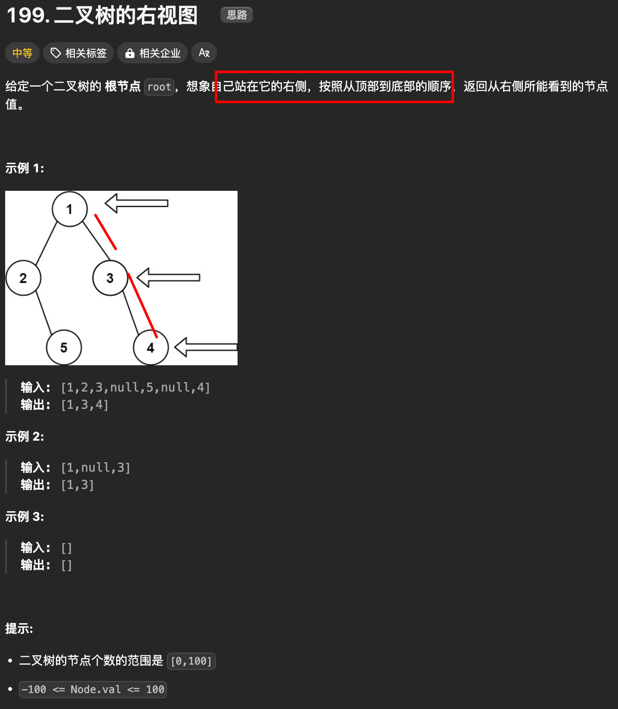

# 二叉树的右视图


`#leetcode`   `#2024/09/08`  `#算法`  `#算法/二叉树`   `#BFS` `#DFS` 


## 目录
<!-- toc -->
 ## 题目及理解 



## 思路一：DFS

- 要点一：使用 DFS，我们可以先访问右子树，然后左子树。这样可以确保每一层最右边的节点首先被访问
- 要点二：前序位置 push(root.val)

### 代码实现

```javascript
/**
 * Definition for a binary tree node.
 * function TreeNode(val, left, right) {
 *     this.val = (val===undefined ? 0 : val)
 *     this.left = (left===undefined ? null : left)
 *     this.right = (right===undefined ? null : right)
 * }
 */
/**
 * @param {TreeNode} root
 * @return {number[]}
 */
var rightSideView = function (root) {
  const res = [];
  if (root == null) {
    return [];
  }
  traverse(root, 0, res);
  return res;
};

/**
 * @description 定义：从二叉树的根节点开始，按照「根节点、右子树、左子树」的顺序遍历二叉树
 * @param {TreeNode} root
 * @param {number} depth
 * @param {number[]} res
 */
var traverse = function (root, depth, res) {
  // 递归的终止条件，root 为空
  if (root == null) {
    return;
  }
  //要点①：前序遍历位置, 先访问当前节点，再递归地访问右子树和左子树
  if (res.length == depth) {
    res.push(root.val);
  }
  // 要点②：一定要先递归访问右子树，再递归访问左子树
  traverse(root.right, depth + 1, res);
  traverse(root.left, depth + 1, res);
};

```

## 思路二：BFS

使用 BFS，我们可以**逐层遍历树**，并在**每一层中取最右边的节点**

### 代码实现

```javascript hl:22
/**
 * @param {TreeNode} root
 * @return {number[]}
 */
var rightSideView = function (root) {
  const res = [];

  // 使用 BFS 层序遍历，每层最后一个节点就是右视图的节点
  // 1. 定义一个队列，用于存储每一层的节点
  const queue = [];
  // 2. 将根节点放入队列中
  queue.push(root);

  // 3. 开始 BFS 遍历
  while (queue.length) {
    // 3.1. 获取当前层的节点个数
    const levelSize = queue.length;
    // 3.2. 遍历当前层的节点
    for (let i = 0; i < levelSize; i++) {
      // 3.2.1. 取出队头元素
      const node = queue.shift();
      // 3.2.2. 如果当前节点为空，直接跳过
      if (node == null) {
        continue;
      }
      // 3.2.3. 如果当前节点是当前层的最后一个节点，将当前节点的值放入结果数组中
      if (i == levelSize - 1) {
        res.push(node.val);
      }
      // 3.2.4. 最后，将当前节点的左右子节点放入队列中
      if (node?.left) {
        queue.push(node.left);
      }
      if (node?.right) {
        queue.push(node.right);
      }
    }
  }

  return res;
};

```

### 注意点

- 取队列头：`queue.shift()`
- 每次 `push` 时，需要判断有值再 `push`

## 原题地址

https://leetcode.cn/problems/binary-tree-right-side-view/description