# 调研：低代码引擎技术白皮书


`#lowcode` 

>  电子版地址：[https://developer.aliyun.com/ebook/7507](https://developer.aliyun.com/ebook/7507?source=5176.11533457&userCode=b3pdrgck)


## 目录
<!-- toc -->
 ## 1. 软件开发演变 

需求语言 → 业务语言 → 代码语言

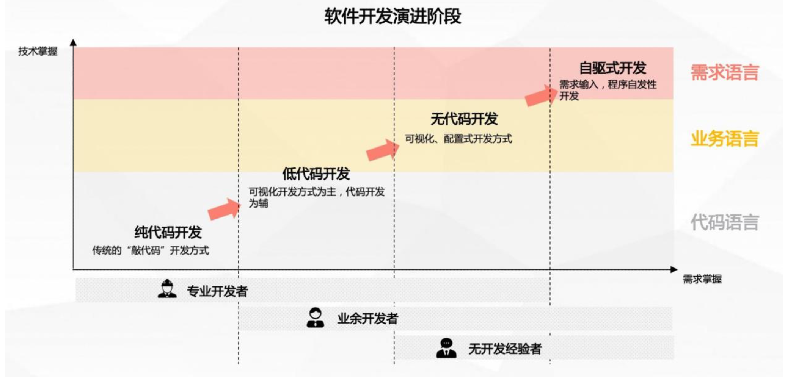

## 2. 开发范式演变：for 前端开发者

- 组件体系建设
	- 原子化封装
- 可视化搭建设计器
	- 布局可视化、配置可视化、样式可视化
- 弱工程化
	- 将打包、发布等等各种环节进行弱化，用户只需要所见即所得的关注页面产出

## 3. 低代码产品竞品分析

- 阿里巴巴:钉钉宜搭 
- 百度:爱速搭  
- 腾讯:微搭  
- 华为:应用魔方
- 字节跳动:飞书多维表格
- 简道云、明道云等

## 4. 低代码引擎

- 是一款为**低代码平台开发者**提供的，具备强大定制扩展能力的低代码设计器研发框架
- 是前端 SDK
- 是一款**面向前端研发人员**的技术产品

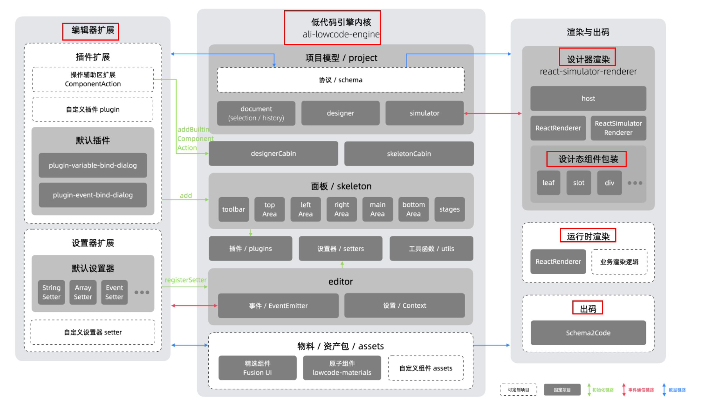

## 5. 协议基础

- 当前协议版本号
- 组件的版本号
- 资产包协议
	- 某个包，某个组件
	- 最终的产物会变成 remote 打包到 CDN
		- 有对应的 CSS、JS ，类似于 `unpkg`
			- https://unpkg.com/@alilc/lowcode-materials@1.0.0/dist/AliAliLowcodeMaterials
			- https://unpkg.com/@alilc/lowcode-materials@1.0.0/dist/AliAliLowcodeMaterials
- 源码组件：
	- 一套面向开发者的目录规范
- 低代码组件：
	- 一套面向开发者的 Schema 规范

组件基础信息

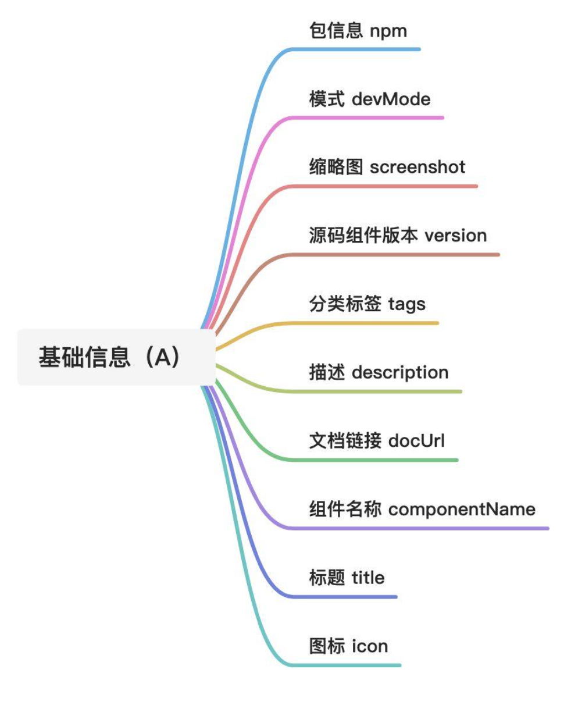

## 6. 入料


## 7. 编排

所谓编排，即将设计器中的所有物料，进行布局设置、组件设置、交互设置(JS 编写/逻辑编排)后， 形成符合业务诉求的 schema 描述

### 7.1. 项目模型、文档模型、节点模型 → 操作 Schema 

类似于 DOM，操作 DOM，等价与操作编排 JSON Schema 了

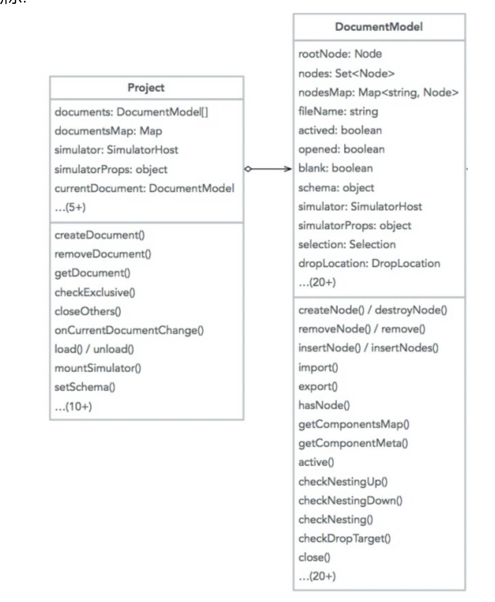

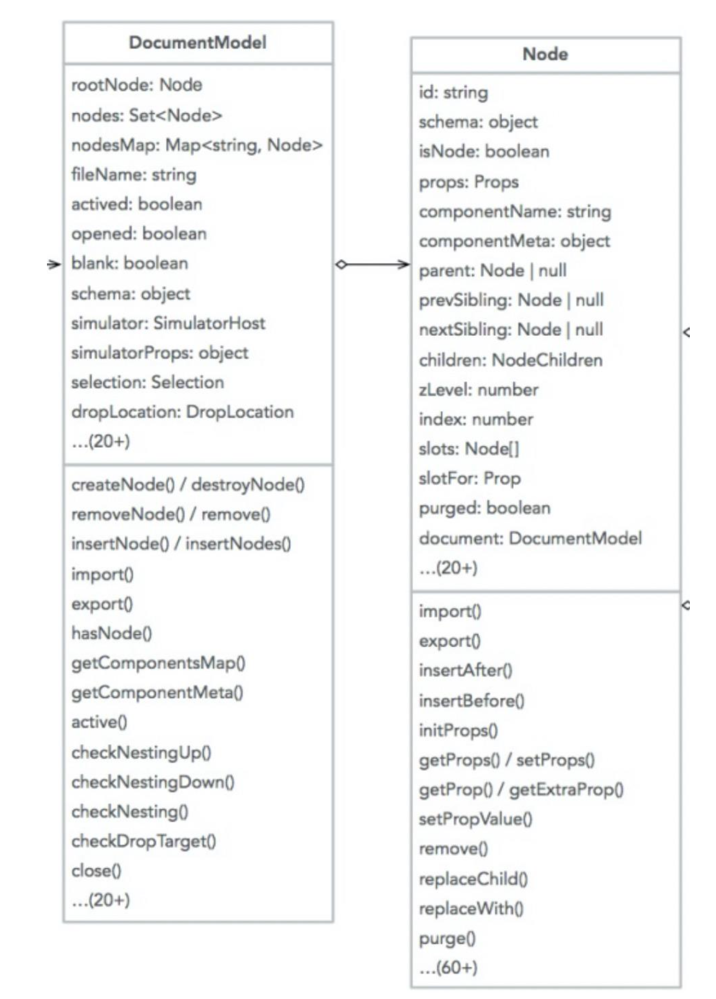


## 8. 渲染

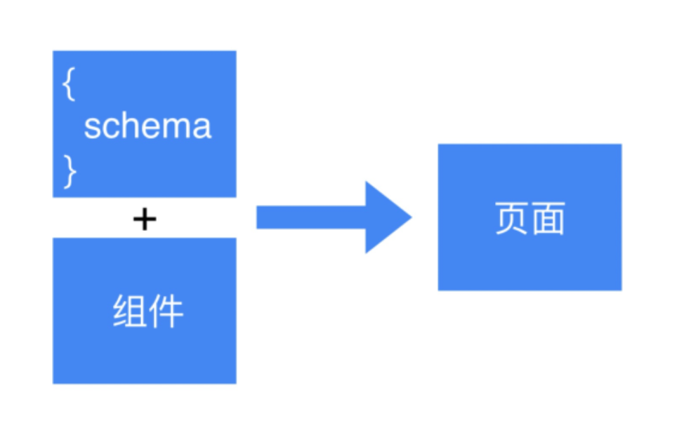

### 8.1. 运行时方案

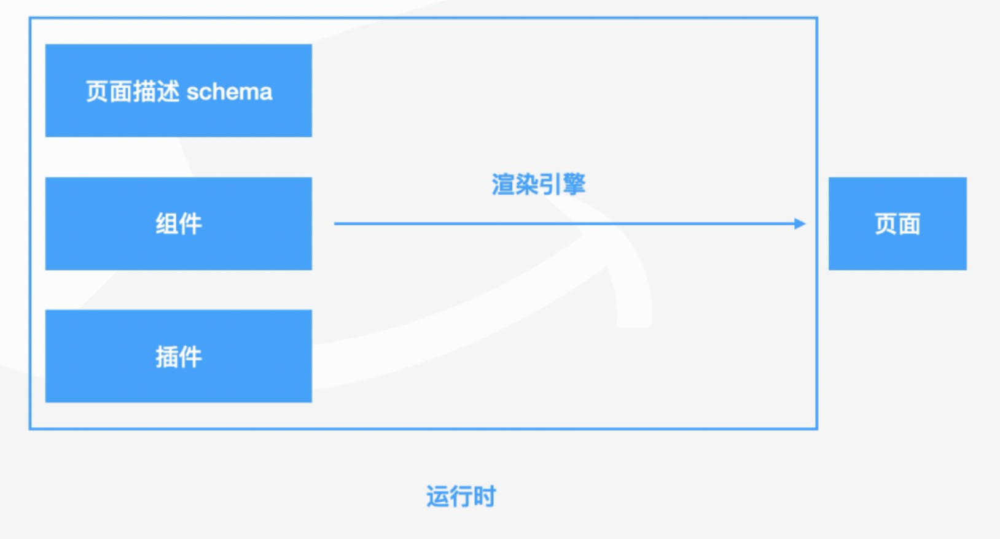

### 8.2. 预编译方案

- icejs 出码:基于 `React + Ice.js` 框架的方案，适用于 PC 端中后台场景。
- rax 出码:基于 Rax 框架的方案，适用于移动端和小程序场景。
- 或者基于 `create-vue` 的方法

```bash
npx @alilc/lowcode-code-generator -i example-schema.json -o generated -s rax
```

可生成标准的**目录结构** ，而不是一个大文件

>  **本质是是 DSL 生成 代码的方式，即编译**


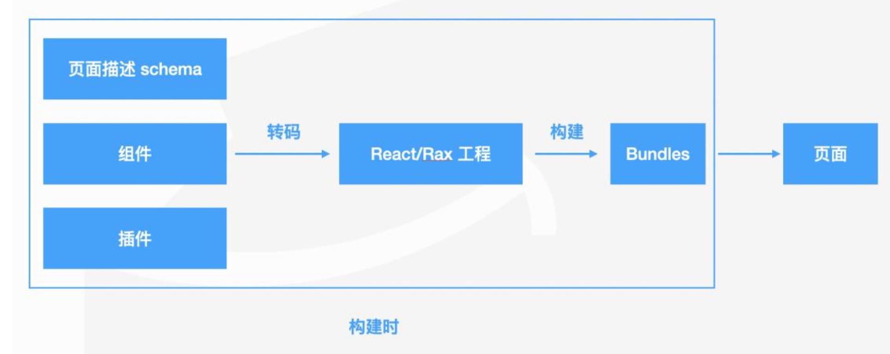

## 9. 出码

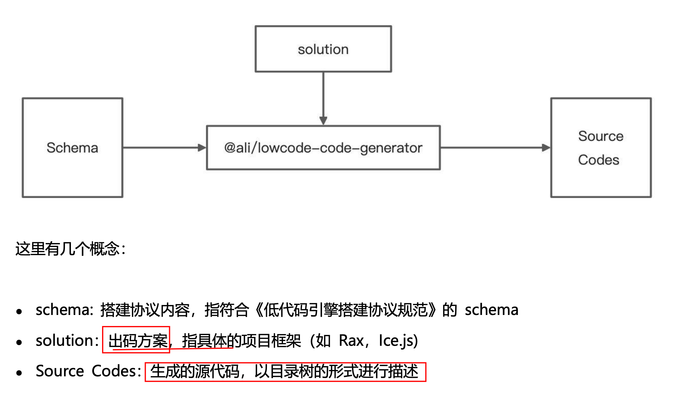


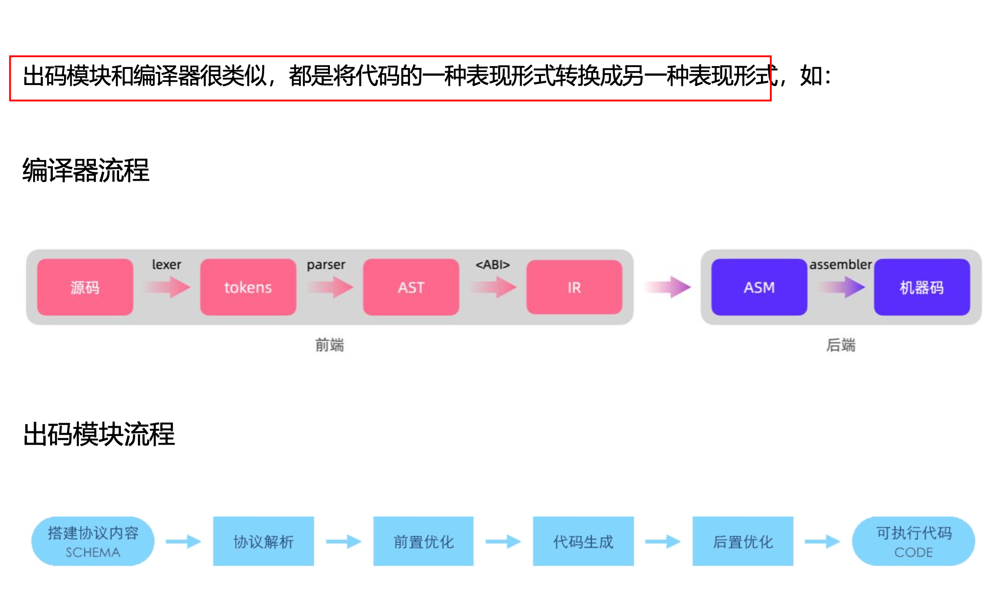

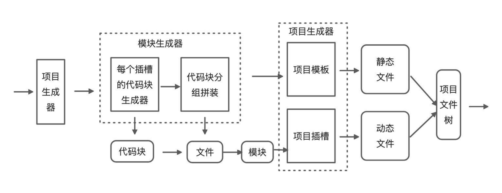


