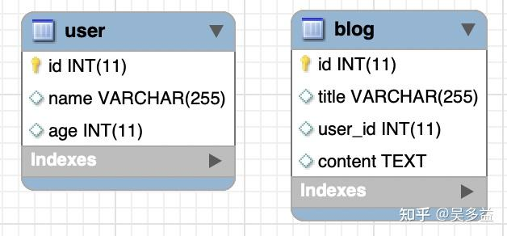
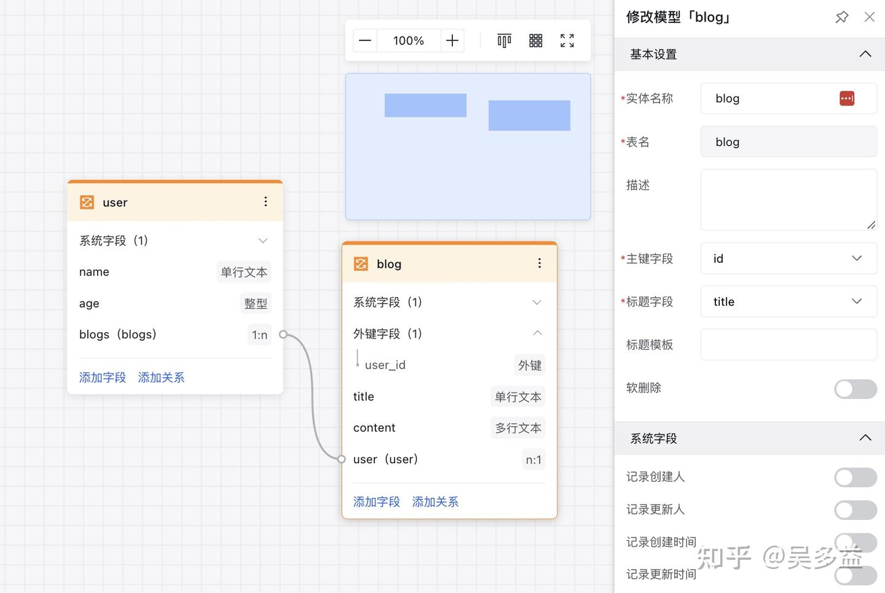
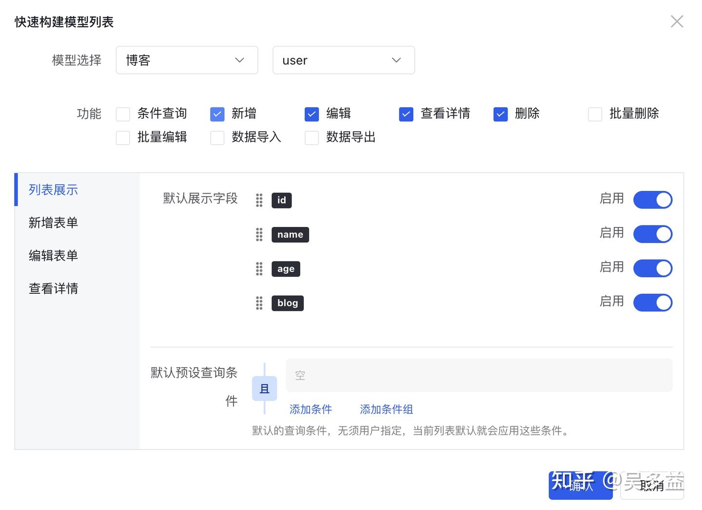
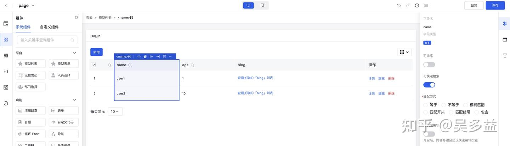
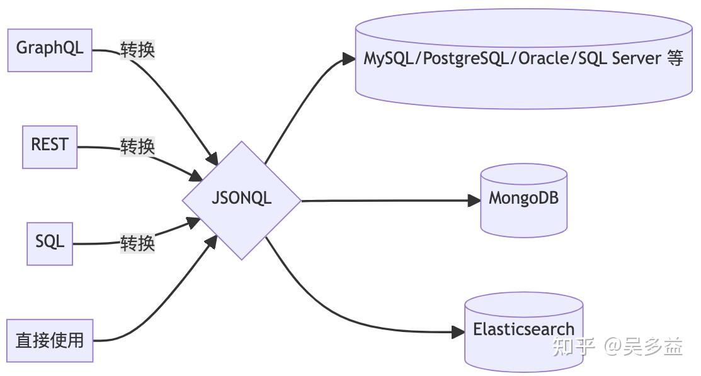
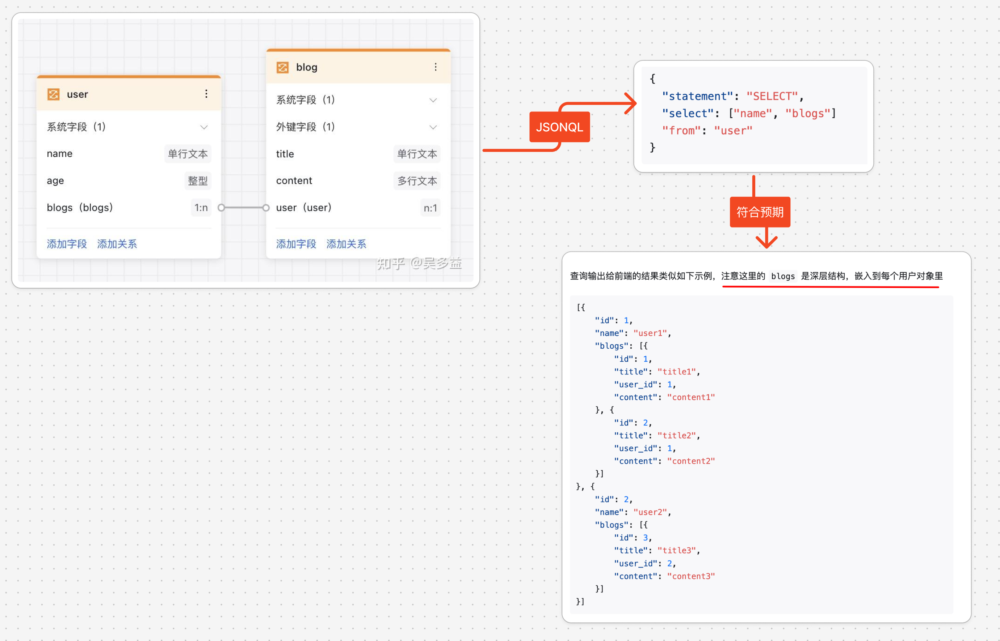
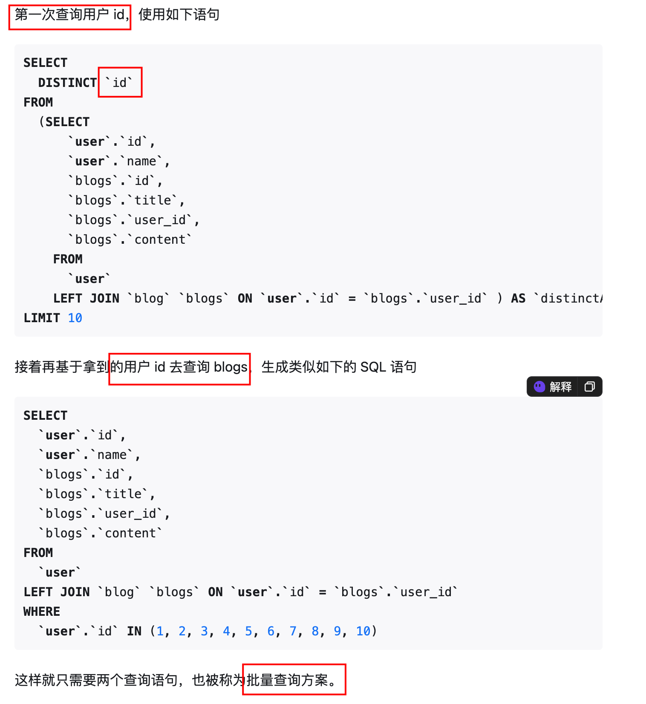

# 低代码篇：数据模型设计


> 本文源于精读：https://zhuanlan.zhihu.com/p/597981519


## 目录
<!-- toc -->
 ## 1. 本文总结 

### 1.1. 摘要

本文介绍了低代码平台爱速搭中的数据模型引擎 JSONQL 的设计与实现。JSONQL 以 JSON格式表达SQL的灵活性，支持多种数据库，并提供了性能优化和安全保障。文章还比较了JSONQL 与 GraphQL、APIJSON 的区别。

### 1.2. 关键点

- JSONQL是爱速搭数据模型的前后端交互语言，具有强大的灵活性和易用性。
- JSONQL 支持多种数据库，包括关系型和非关系型数据库。
- JSONQL 提供了性能优化方案，如大offset优化和高级缓存机制。
- JSONQL 具有安全性保障，通过数据模型控制、细粒度权限控制等方式确保安全。
- JSONQL与 GraphQL 的主要区别在于灵活性和实现方式。
- JSONQL 与 APIJSON的区别在于语法设计和功能支持。
- JSONQL 支持复杂的业务逻辑处理，但对于复杂事务推荐写代码。
- JSONQL 在开发时没有强类型保护，但适合低代码平台的实时查询。

## 2. 前言

- 在低代码产品中，后端最重要的功能是数据模型，它的能力决定了低代码平台可以开发应用的上限，
- 之前在介绍[低代码实现原理](https://zhuanlan.zhihu.com/p/451340998)时列举过几种实现方式，其中只有第一个**动态 ORM 方案**支持对接已有数据库，这个方案比其它方案的灵活性和性能都更好，能制作的应用上限最高，因此[爱速搭](https://link.zhihu.com/?target=https%3A//aisuda.baidu.com/)里首先实现的就是这个方案。

本文将介绍爱速搭中**数据模型的实现细节**，以及其中最重要的 JSONQL 语言。

在介绍 JSONQL 前，先回顾一下在专业开发中如何进行数据查询，目前常见有三种方案：

- 裸写 SQL 方案，包括 MyBatis 这种映射方案
	- 这个方案灵活性强，可以使用所有 SQL 功能，
	- 缺点是无法适配多种数据库，对于复杂的关联查询需要自己 JOIN 表，由于上手门槛低，是目前国内开发者主要使用的方案。
- Query Builder 方案
	- 它将 SQL 做了一层封装，开发者可以通过代码来构造 SQL，比裸写 SQL 多了类型检查，开发时不容易写错，同时这个方案很适合既想支持多种数据库，又想接近 SQL 开发体验的开发者。
- ORM 方案
	- 比如 JPA/Hibernate/ActiveRecord，主要特点是几乎屏蔽了 SQL，这也导致了上手成本高，初次接触需要学习大量概念，优点是上手后开发效率很高，关联查询写起来也简单，还能适配多种数据库，
	- 但这个方案的灵活性比 SQL 弱，有些特殊的数据库方言无法实现，而且屏蔽了 SQL 导致开发者不会怎么关注最终生成 SQL，很容易生成低效查询，比如查询所有列及 N+1 次查询问题。

有没有一种方案，可以同时有这些方案的优点，既能做到和 SQL 一样的灵活性，又能跨数据库，又能支持简易关联查询，又能解决查询无用字段及 N+1 问题呢？

这就是本文将介绍的新方案 **JSONQL**，它是爱速搭数据模型的前后端交互语言。

## 3. 爱速搭中的数据模型

### 3.1. 连接数据源

连接数据源，这个比较简单就是填入数据库地址和账号密码。

### 3.2. 导入表结构，建立关联关系



导入之后还能添加关联关系，这里添加了两个关系，
- 一个是 user 下有多个 blog 的一对多关系，关系名是 `blogs`，
- 另一个是 blog 属于某个用户的多对一关系，关系名是 `user`，最终效果如下图所示，也叫 **ER 关系图**



### 3.3. 设计前端界面 

爱速搭提供了一个脚手架来快速生成 **CRUD 界面**，如下图所示



勾选需要的功能和展示字段后，一个带增删改查的列表页面就生成出来了



实现这个功能除了前端 UI 组件、后端 SQL 查询外，还有个重要部分是前后端如何交互？

爱速搭**之前的做法**是后端提供 RESTful 协议的接口，比如默认包含这些 HTTP api

```javascript
// 创建数据
POST /datamodel

// 查询数据列表
GET /datamodel

// 查询加上过滤条件，下面的示例相当于 name = 'aisuda' AND age < 10
GET /datamodel?name=aisuda&age[lt]=10

// 查询某个数据详情，其中 1 是主键值
GET /datamodel/1

// 修改某个数据，修改内容在提交 payload 里
PUT /datamodel/1

// 删除某个数据
DELETE /datamodel/1
```

这些接口可以用来实现简单应用，许多低代码平台也就是做到这个程度，但它有很多缺点：

1. 无法控制返回字段，比如文章列表可能只想查询标题而无需返回内容，需要定制特殊参数。
2. 无法进行复杂组合查询，前面的过滤条件都是且（AND），如果要做负责的嵌套条件，比如 `name = aisuda OR age < 10) AND deleted IS NOT NULL` 就无能为力了，需要定制特殊参数。
3. 无法支持聚合查询，要实现图表类的查询需要再定义新接口。

最开始提到过，**数据模型决定了低代码平台能制作应用的上限**，如果只有**简单的 REST 接口，就只能做简单应用**，比起专业开发在灵活性上有很大差距，因此为了让爱速搭能构建更为复杂的应用，我们开发了**全新的前后端交互语言 JSONQL**。

## JSONQL 介绍

JSONQL 其实就是 **JSON 格式的自定义 DSL**，先来看一个 JSONQL 最简单实例

```javascript
{
  "statement": "select",
  "select": ["name"]
  "from": "user"
}
```

它的作用相当于下面这段 SQL

```sql
SELECT name FROM user
```

从整个系统层面看，JSONQL 是爱速搭**前后端交互的中心节点**，前端可以通过 REST 接口、SQL、GraphQL 等方式连接后端，这些接口都会先转成 JSONQL，然后再通过 JSONQL 引擎连接各种后端数据。




### 灵活性强

#### 支持直接写 SQL

JSONQL 能表达绝大部分 SQL 语句，也可以支持直接写 SQL，类似下面的写法

```json
{
  "sql": "select name from user"
}
```

它的原理是先进行 `SQL 解析`，再遍历解析后的 `AST 树`转成`等价的 JSONQL`

#### 支持非常复杂的嵌套表达式及子查询

比如下面这段 SQL

```sql
SELECT sales_year,
  womens_sales - mens_sales as womens_minus_mens,
  mens_sales - womens_sales as mens_minus_womens
FROM (
    SELECT date_part('year', sales_month) as sales_year,
      sum(
        case
          when kind_of_business = 'Women''s clothing stores' then sales
        end
      ) as womens_sales,
      sum(
        case
          when kind_of_business = 'Men''s clothing stores' then sales
        end
      ) as mens_sales
    FROM retail_sales
    WHERE kind_of_business in (
        'Men''s clothing stores',
        'Women''s clothing stores'
      )
      and sales_month <= '2019-12-01'
    GROUP BY 1
  ) a
ORDER BY 1;
```

#### 支持更新和删除

比如类似下面的 SQL 写法

```sql
UPDATE table1 SET column1 = column1 + 1
```

JSONQL 中可以表示为

```json
{
  "statement": "update",
  "table": "table1",
  "setExp": {
    "column1": {
      "binary": "+",
      "left": "column1",
      "right": 1
    }
  }
}
```

#### 为什么不直接用 SQL 呢

因为 SQL 是字符串，程序化生成时容易拼接出错，且用 JSON 可以方便前端编辑器生成

#### 将 SQL 暴露给前端岂不是太危险了？

后面会详细介绍如何保证安全。

### 易用性好

#### 支持关联查询及 N+1 问题


第一个是支持关联查询，这使得 JSONQL 既能做到 SQL 的灵活性又能做到 ORM 的易用性。



如果不用 JSONQL 如何做到呢？有两种

#### ORM 里常见的 N+1 查询

首先查询 user，然后再根据 user id 去查询 blog，类似如下伪代码

```js
const users = find(User);
for (const user of users) {
  const blogs = find(Blog).byUserId(user.id);
}
```

查到了 10 个用户，就要发起很 10 次 blog 查询，因此也叫 N+1 次查询
- 一次查用户
- N 次查 blog 

这样可以基于 JOIN 来一次查出

如果要优化 N+1 查询，可以使用就是基于 JOIN 来一次查出，比如下面 SQL 语句

```sql
SELECT
  `user`.`id`,
  `user`.`name`,
  `blogs`.`id`,
  `blogs`.`title`,
  `blogs`.`user_id`,
  `blogs`.`content`
FROM
  `user`
LEFT JOIN `blog` `blogs` ON `user`.`id` = `blogs`.`user_id`

```


解释：
- 从名为“`user`”的表中选择id和name列
- 以及名为“`blogs`”的表中的id、title、user_id和content列。
- 然后使用`LEFT JOIN`将这两个表连接起来，
	- 连接条件是 user 表中的id列与blogs表中的user_id列相匹配。
- 这意味着即使在“blogs”表中没有与“user”表中的id匹配的行时，查询仍将返回“user”表中的所有行。


如果要获取所有数据，这个语句是能满足需求的，但大多数时候还有**分页需求**，比如`只想一次性查询 10 个 user 的数据`，这时就没法简单地加上 `limit`

```sql hl:11
SELECT
  `user`.`id`,
  `user`.`name`,
  `blogs`.`id`,
  `blogs`.`title`,
  `blogs`.`user_id`,
  `blogs`.`content`
FROM
  `user`
LEFT JOIN `blog` `blogs` ON `user`.`id` = `blogs`.`user_id` 
LIMIT 10 # 这是错的
```

为什么这是错的？因为一个用户对应多个博客，合并到一张表里用户就会重复，比如变成如下数据输出

|user.id|user.name|blogs.id|blogs.title|
|---|---|---|---|
|1|用户 1|1|博客 1|
|1|用户 1|2|博客 2|
|1|用户 1|3|博客 3|

因此假设第一个用户 1 有 10 篇文章，加上 LIMIT 后就只能查出有这一个用户的文章列表了，而我们希望的**是查 10 个用户的文章列表**。

怎么办呢？有个高级办法是使用 `LATERAL` 语法，上面的语句可以改成

```sql
SELECT "u"."id", "u"."name"
FROM (
    SELECT *
    FROM "user"
    LIMIT 10
  ) u
  LEFT JOIN LATERAL (
    SELECT "blog"."id", "blog"."title", "blog"."content"
    FROM "blog"
    WHERE "u"."id" = "blog"."user_id"
  ) blogs on true
```

>  它从数据库中选择用户表中的id和name字段。在内部查询中，它选择了用户表中的所有字段，并限制为前10条记录。然后使用LEFT JOIN LATERAL子句，将内部查询的结果与博客表中的id、title和content字段进行连接，连接条件是用户表中的id与博客表中的user_id相匹配。最后使用on true条件来指示连接的执行。

实际执行类似下面的伪代码：

```python
for user in users:
   for blog in blogs:
     blog.user_id = user.id
```

但它的缺点是只有少数几种数据库支持，Postgres 9.3、Oracle 12c 版本以上支持，SQL Server 需要改查 [APPLY](https://link.zhihu.com/?target=https%3A//learn.microsoft.com/en-us/previous-versions/sql/sql-server-2008-r2/ms175156v%3Dsql.105) 语法，支持最差的是 MySQL，要等到 [8.0.14](https://link.zhihu.com/?target=https%3A//dev.mysql.com/doc/refman/8.0/en/lateral-derived-tables.html) 版本才支持

JSONQL 默认没有使用上面说的方法，而是使用了`两次查询`来解决




然而这个方案并不完美，这里的第二次查询还是没法 LIMIT，如果 blogs 表的数据量很大，比如有的用户有几千篇文章，而只想显示最新一篇，也会导致大量 IO 及带宽浪费，这时使用 `N+1 查询`反而是个更好的方案。

因此在 JSONQL 中我们增加了一种名为二次查询的语法，使用下面的写法

```json hl:9,17,10
{
  "statement": "SELECT",
  "select": [
    {
      "column": "name"
    }
  ],
  "from": "user",
  "limit": 10,
  "secondQuery": [
    {
      "select": [
        {
          "column": "title"
        }
      ],
      "limit": 2,
      "where": {
        "tag": "tag1"
      }
      "from": "blogs"
    }
  ]
}
```


JSONQL 还支持多对多、一对多、一对一关系、反向一对一关系，并且支持无限层级嵌套，比如下面的写法：

```json
{
  "statement": "SELECT",
  "select": ["books.author.address"]
  "from": "bookshop"
}
```

这其实是四层关系，bookshop 和 books 是多对多，books 和 author 是多对一，author 和 adress 是一对一，生成 SQL 有四个 JOIN，输出结果也是个**深层对象**，类似

```json
[{
    "id": 1,
    "name": "书店 1",
    "books": [{
        "title": "书籍 1",
        "id": 1,
        "author": {
            "name": "作者 1",
            "id": 1,
            "address": {
                "id": 1,
                "location": "地址 1"
            }
        }
    }]
}]
```

同时除了 select，在 where 里也能使用关系字段，比如根据书籍标题查找作者列表，查找同名的书都有谁写过

关联除了查询，还有增删改操作，比如新增一个用户的时候，还可以同时提供他的文章信息，类似下面的请求

```json hl:2
{
  "statement": "INSERT",
  "table": "user",
  "values": {
    "name": "user1",
    "books": [
      {
        "title": "book1"
      }
    ]
  }
}
```

#### 避免接口数量不断增长

由于 JSONQL 的灵活性，它还可以避免前后端接口数量不断增长。

而在 JSONQL 方案下，数据查询的后端开发被彻底节省了，要查询什么信息前端自己构建 JSONQL 就行，不需要前后端接口约定，**也不需要 API 接口文档及管理，前后端只需要一个接口**。

这点和 GraphQL 要解决的问题是类似的

#### 简化分页查询

常见的列表页除了查询数据，还需要返回页面总数，需要使用两个查询来实现

```sql
SELECT * FROM table1 WHERE A = 1 ORDER BY name LIMIT 10 OFFSET 10
SELECT COUNT(*) FROM table1 WHERE A = 1
```

JSONQL 简化了这个功能，只需要加上一个 `count`配置就能实现类似功能

```json
{
  "statement": "SELECT",
  "select": ["name"],
  "from": "user",
  "count": true,
  "limit": 10
}
```

系统会自动去掉 `LIMIT/OFFSET` 及 `ORDER BY` 进行 COUNT 查询。

另外除了 `LIMIT/OFFSET` 及 `ORDER BY`，如果有 `LEFT JOIN` 语句且对应的表是对一关系，这个 `LEFT JOIN` 对 COUNT结果不会有影响，也可以直接去掉。


#### 避免常见问题及更友好的错误提示

比起每个数据库千奇百怪的报错信息，JSONQL 给出的报错更易懂。

#### 同时支持 CRUD 及 BI 场景

在绝大部分低代码平台中，CRUD 和 BI 往往是分开处理的，因为它们的前后端使用不同接口，毕竟 **BI 查询的 SQL 往往特别复杂，很难使用 REST 形式表示**。

但 JSONQL 可以完整支持大部分 SQL，因此在爱速搭里，CRUD 和 BI 的支持全都是用 JSONQL，避免了两次后端开发，简化了开发成本。

#### 支持多种数据库

- 虽然 SQL 有标准，但每个数据库的实现都不太一样，而且反而是国内最流行的 MySQL 其实最不符合标准，JSONQL 要支持大量数据库就得抹平这些方言差异
- 目前 JSONQL 底层引擎基于 **JDBC** 实现，可以连接市面上绝大部分数据库，目前已经支持 40+ 数据库，覆盖几乎所有国内开发者可能会使用的数据库，还包括大数据库相关的 Hive、Impala、Doris 等。
- JSONQL 引擎还实现了对非关系型数据库的支持，使得 JSONQL 还可以对 **MongoDB、Elasticsearch、Redis、HBase** 及 OData 协议的数据库进行增删改查操作


### 性能优

略

### 安全性

略

## 和 GraphQL 的区别是什么？

总结一下主要区别是：

- GraphQL 的抽象程度更高，它设计理念就是从业务出发，不关心具体实现，JSONQL 相对来说更底层，使用者对 SQL 越了解用得越好，需要关注具体实现，比如针对 N+1 问题提供了两种语法来让用户选择。
- GraphQL 不自带实现，需要自己实现或使用第三方引擎，这些引擎的实现参差不齐，对数据库的支持不全，JSONQL 还包括了底层引擎实现，支持大量常见数据库。
- JSONQL 灵活性更强，很多地方可以使用复杂表达式，覆盖绝大部分 SQL 语句。
- GraphQL 依赖自定义的 DSL 语言，前后端都需要使用 SDK 才能方便生成，JSONQL 本身就是 JSON，无需 SDK。
- GraphQL 难以表示树形结构，JSONQL 原生支持。
- GraphQL 对底层数据存储没有要求，JSONQL 只能对接关系型数据库或 MongoDB 等底层引擎支持的数据存储，如果是自定义存储需要使用 OData 协议对接。

## 和 APIJSON 的区别是什么？

APIJSON 和 JSONQL 解决了类似问题，同样也是基于 JSON 格式，但在细节思路上有许多不同：

1. APIJSON 是自定义的 DSL 语法，有大量自定义语法，比如 `key{}@` 代表 EXISTS 子查询，而 JSONQL 尽可能参考 SQL，这时设计上最大的不同，我猜测 APIJSON 最开始只是为了解决简单的 CRUD 问题，语法上没考虑复杂场景，导致后面发现不能满足时就只好不断在语法上打补丁，而 JSONQL 从一开始支持完整 SQL 语法，因此在灵活性方面更强，上手门槛更低。
2. APIJSON 只适合 CRUD 查询，JSONQL 还能支持任意复杂的 BI 查询，比如字段和查询条件上使用表达式，APIJSON 许多地方只支持字符串，比如字段、group by 等，无法实现类似按年 group by 的功能。
3. APIJSON 的关联查询默认实现是 N+1 查询，而 JSONQL 使用批量查询。
4. JSONQL 不仅支持关系数据库，还支持 MongoDB、Redis 等非关系数据库。
5. APIJSON 支持原始 SQL，而 JSONQL 由于完整支持 SQL 所以无需这个功能，这个重要设计区别使得 APIJSON 不能直接暴露给前端，后续也难以支持行列级别细粒度权限控制。