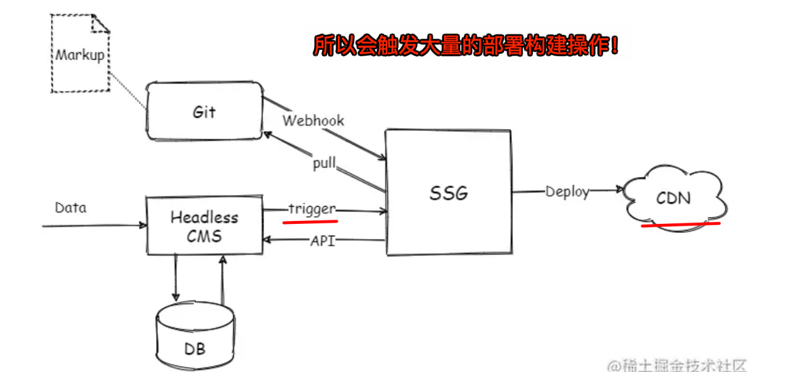

# JAMstack 架构

`#前端` 

## 目录
<!-- toc -->
 ## 1. 总结 

-  JAMstack
	- JavaScript
	- API 
	- Markup（标记）
- 会触发大量的部署构建操作
	- 
- 使用场景：业务场景非常狭小，只能用于内容更新不大频繁的 CMS 站点
	- 高性能
	- 偏静态
- 优势
	- 高安全性： 减少了服务器端代码的执行，降低了攻击面。
	- 高性能

## 2. 定义

JAMstack 是一种现代 Web 开发架构，强调使用 JavaScript、API 和 Markup（标记）来构建高性能和高安全性的 Web 应用。

## 3. 产生背景

> **传统的网站架构 ： 无论如何都需要一个实时的在线服务，它在处理这些不怎么变动的内容时，很鸡肋：计算量很小，但是依旧需要大量后端和运维人员维护网站的安全性、稳定性、可伸缩性……**

## 4. JAMstack 的核心概念

### 4.1. JavaScript

- 用于处理前端逻辑和交互。可以使用各种 JavaScript 框架和库，如 React、Vue.js、Angular 等。
- JavaScript 代码通常在客户端执行，减少了服务器负担。

### 4.2. API

- 通过 API 调用来获取动态数据和执行服务器端操作。
- 可以使用第三方服务（如 Auth0、Stripe、Firebase等）或 自建的 API（如 RESTful API、GraphQL）。
- API 通常是无状态的，提供了良好的可扩展性和灵活性。

### 4.3. Markup（标记）

- 使用静态站点生成器（如 Gatsby、Next.js、Hugo、vitepress 等）预生成 HTML 页面。
- 这些页面在构建时生成，可以直接部署到 CDN，提高加载速度和性能。

## 5. JAMstack 的优势

### 5.1. 高性能

   - 预生成的静态页面可以通过 CDN 快速分发，减少了服务器响应时间。
   - 静态资源通常比动态内容加载更快，提高了用户体验。

### 5.2. 高安全性

   - 减少了服务器端代码的执行，降低了攻击面。
   - 静态文件不容易受到传统的服务器攻击（如 SQL 注入）。

### 5.3. 可扩展性

   - 静态站点可以轻松扩展，通过增加新的静态文件和 API 调用来实现更多功能。
   - API 调用可以根据需要进行扩展和修改，而不影响前端代码。

### 5.4. 开发效率

   - 开发者可以专注于前端代码和用户体验，而不需要处理复杂的服务器端逻辑。
   - 使用现代前端框架和工具链，提高了开发效率和代码质量。

## 6. JAMstack 的劣势

**业务场景非常狭小，只能用于内容更新不大频繁的 CMS 站点**。国外也有无头电商（Headless Commerce）的商业实践，但是前景并不明朗。

## 7. 常见的 JAMstack 工具和框架

### 7.1. 静态站点生成器

- **Gatsby**：基于 React 的静态站点生成器，支持 GraphQL 数据查询。
- **Next.js**：提供静态生成和服务器端渲染（SSR）的混合模式，适用于复杂的 Web 应用。
- **Hugo**：一个快速、灵活的静态站点生成器，使用 `Go 语言`编写。
- Jekyll
- Nuxt.js
   - 基于Vue.js的框架，支持静态生成和服务器端渲染（SSR）。
   - 适用于构建复杂的Vue.js应用。

### 7.2. API 服务

- **Headless CMS**：如 Contentful、Sanity、Strapi，提供内容管理和 API 接口。
- **服务器端功能**：如 AWS Lambda、Netlify Functions，用于实现无服务器计算。
   - **正常云服务厂商都有提供，比如用过腾讯云提供serverless服务**
- **第三方 API**：如 Auth0（身份验证）、Stripe（支付）、Algolia（搜索）。

### 7.3. 部署和托管

- **Netlify**：提供静态站点托管、无服务器函数和持续集成（CI/CD）服务。
- **Vercel**：支持` Next.js` 和其他静态站点的托管，提供无服务器函数和自动部署。
- **GitHub Pages**：适用于简单的静态站点托管，集成了 GitHub 仓库。
- **正常云服务产商都有提供这个能力，比如 Amazon、阿里云、腾讯云等**

## 8. JAMstack 的工作流程

> 其实很类似 [https://elog.1874.cool/notion/vy55q9xwlqlsfrvk](https://elog.1874.cool/notion/vy55q9xwlqlsfrvk) 的思路

### 8.1. 开发阶段

- 使用静态站点生成器（如 Gatsby、Next.js）编写前端代码和模板。
- **通过 API 获取动态数据，并将其嵌入到静态页面中**。
- 使用 JavaScript 实现前端交互和动态功能。

### 8.2. 构建阶段

- 运行构建工具，生成静态 HTML、CSS 和 JavaScript 文件。
- 预生成的页面文件可以直接部署到 CDN 或静态托管服务。

### 8.3. 部署阶段

- 将静态文件上传到托管平台（如 Netlify、Vercel）。
- 配置 CDN 分发，确保全球用户都能快速访问。

### 8.4. 运行时

- 用户访问网站时，CDN 会提供预生成的静态页面，确保快速加载。
- 前端 JavaScript 代码在浏览器中执行，调用 API 获取和更新数据。
- 无服务器函数处理特定的服务器端任务，如表单提交、身份验证等。

## 9. 使用 JAMstack 的场景

### 9.1. 博客和内容网站

   - 使用 Headless CMS 管理内容，通过静态站点生成器生成 HTML 页面。
   - 预生成的页面通过 CDN 分发，提供快速的阅读体验。

### 9.2. 电商网站

   - 产品信息和库存通过 API 获取，前端使用 JavaScript 实现购物车和结账功能。
   - 静态页面展示产品列表和详情，提高页面加载速度。

### 9.3. 企业官网

   - 静态页面展示公司信息、服务和案例，减少服务器负担。
   - 表单提交和用户交互通过无服务器函数处理。

## 10. 总结

JAMstack 通过将 JavaScript、API 和 Markup 结合起来，提供了一种高效、安全和可扩展的 Web 开发架构。它适用于各种类型的 Web 应用，从简单的博客到复杂的电商网站。通过使用现代工具和框架，开发者可以快速构建和部署高性能的 Web 应用，提供卓越的用户体验。
