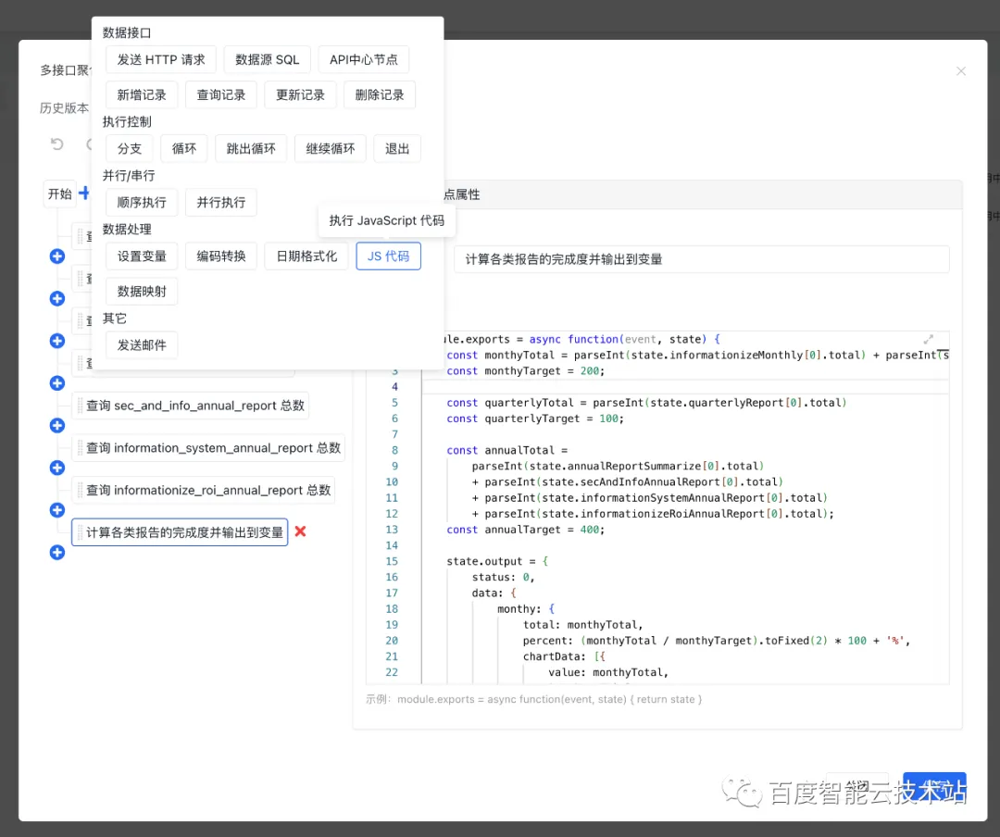

# 低代码篇：低代码平台中的数据连接方式

`#低代码`

## 目录
<!-- toc -->
 ## 1. 前言 

- 在早几年，“拖拽式 H5 营销页制作工具” 曾经是前端界的一大热门方向，这是第一代低代码产品
- 现在更多是 “能够对接动态数据” 为特征的第二代低代码产品

## 2. 传统手工模式下动态数据的获取和渲染

- 手工模式：论是早期 jQuery 还是现今已经成为互联网页面基础设施的 MVVM 框架，“动态数据连接” 的方式大抵是 “**向某个后端接口发送请求然后等待数据返回,，然后再渲染**”。
- 手工模式 → 配置配置模式： 而在进行前端业务组件的 “低代码” 形式封装时，低代码框架和平台的建设者们第一步做的通常也是将组件需要的 API 请求抽`取成配置项`。

## 3. 后端有现成 API，如何快速接入？

为了让业务方能以更低成本接入低代码平台，可通过数据映射、适配器、 API 代理等手段快速接入？下面解释

但是在实际落地场景中接入现成 API 时，往往会遇到**两个问题**：

- 数据不匹配：前端需要的数据格式和后端返回的数据格式不匹配的问题。
- 跨域问题：二是前端最经典的问题 —— 跨域问题。

### 3.1. 前后端数据格式不匹配问题的解决方案

1、amis 浏览器端的数据映射机制  

2、自定义 浏览器端请求 / 接收适配器，即可以写 JavaScript 函数

3、后端数据映射及后端请求 / 接收适配器

下图：在应用设置 - 接口 - 全局接口适配器中可以为 API 代理配置全局适配器

下图为单个接口配置设置参数转换和适配器

### 3.2. 跨域问题如何解决呢

统一API 代理方案

## 4. 后端没有现成 API ：可使用 API 编排、FaaS 以及数据库直连方案 

### 4.1. API 编排

API 编排**本质上是用可视化的方式来编写后端代码**，它可以用于不复杂的接口聚合及增删改查场景。在没有 “现成单个接口” 但是可以借助现有接口组合实现某项能力的情况下，API 编排可以帮助平台用户在无需传统后端开发介入的情况下利用现有的 API 资源组合出业务需要的单个接口。

- 在 “ API 中心” 的列表页面创建一个 “多接口聚合” API ，即 API 编排
	- API 中心
		- API 分组
- 在可视化编辑器中进行 API 节点编排，这个可视化编辑器除了提供基本的 HTTP 请求外，它还提供了数据源 SQL 、JS 代码执行等 **“原子” 级别的能力**，用户可以自由组合这些能力来 “编排” 出新的供前端使用的接口，如下图：
	- 
	- 需要关注接口鉴权能力

### 4.2. FaaS

FaaS（ Function as a Service ）通常的产品形态是提供一个入口，让使用者可以粘贴 / 上传按平台要求的格式编写好的源代码，并暴露一些触发器（其中以 HTTP 触发最为常见，当然还有任务）。
- 要求写 node.js 、koa 等等，FaaS 会提供基本的脚手架
- 腾讯云、各类云商会提供这个能力

### 4.3. 数据库直连方案

数据库直连方案包括
- 数据源接入能力
	- 可对接外部数据源，输入账号密码等
- 建模能力
	- 可视化模型编辑器
- 在低代码平台搭建的业务页面中进行数据访问
	- 通过专用的“模型组件”来连接数据模型
	- 通过 API 编排节点访问数据模型
		- 也不一定非是 HTTP 接口
		- 数据访问能力还是得 ORM，所以 FaaS 就挺合适，使用 node 代码
			- 比如在 “ JS 代码” 节点中以 FaaS 方式编写 node 代码也可以进行数据库访问。  

## 5. 参考

- 来自: [低代码平台中的数据连接方式（下）](https://mp.weixin.qq.com/s?__biz=MzkxOTM4MTM3Ng==&mid=2247483765&idx=1&sn=8cf2e710b6646cc9cff09b5b5aaad2f7&chksm=c1a3b59af6d43c8cf0cace2b668a47a7fcaece5354b16ef63f324aab4c6f03f875e40fd40777&cur_album_id=2471499490672328707&scene=189#wechat_redirect)
- 来自: [低代码平台中的数据连接方式（上）](https://mp.weixin.qq.com/s/NiGai9XAEKLtNjlJj5j79Q)