# Agent 是什么？

`#ai/agent`  `#2024/08/25`  `#agi/bot` `#agi/agent` 

## 目录
<!-- toc -->
 ## 1. Agent 的起源 

- **AutoGPT** 等开源项目的发布，这是第一批**基于自然语言的 AI 自动化实践**
	- 你告诉它一个任务，它就会通过自然语言的自我对话，将这个任务进行拆分、规划并实现。
- 给予不同的 Bot 以不同的人格，搭配记忆窗口，让它们之间相互对话。
- 大模型从原来的“**思想家**”，通过对外部工具的使用，变成了**实干家**。

## 2. 什么是 Agent

- 一个常见的观点是，**Agent 是一种让 AI 以类似人的工作和思考方式，来完成一系列的任务**

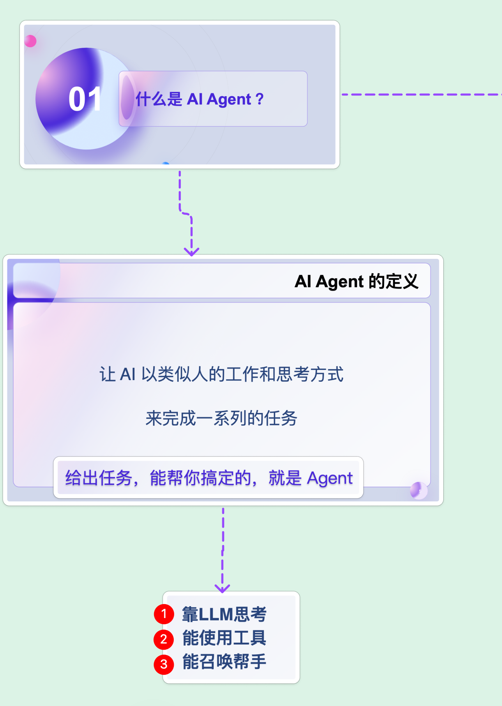

## 3. Agent 的决策流程

### 3.1. 基本决策流程

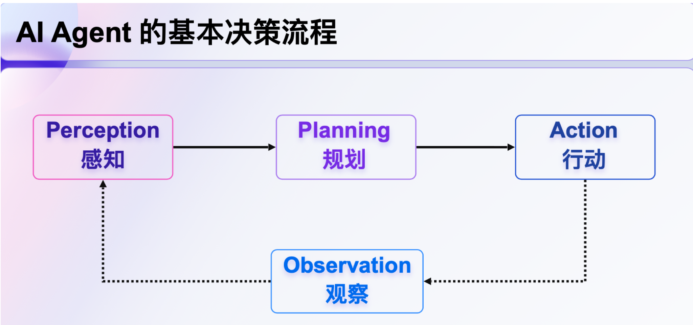

### 3.2. 举个例子

## 4. Agent 的组成

包括 4 个部分

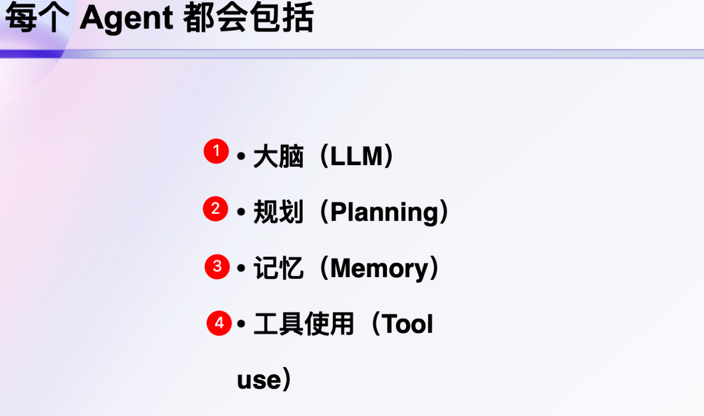

### 4.1. ① 大脑（LLM） 

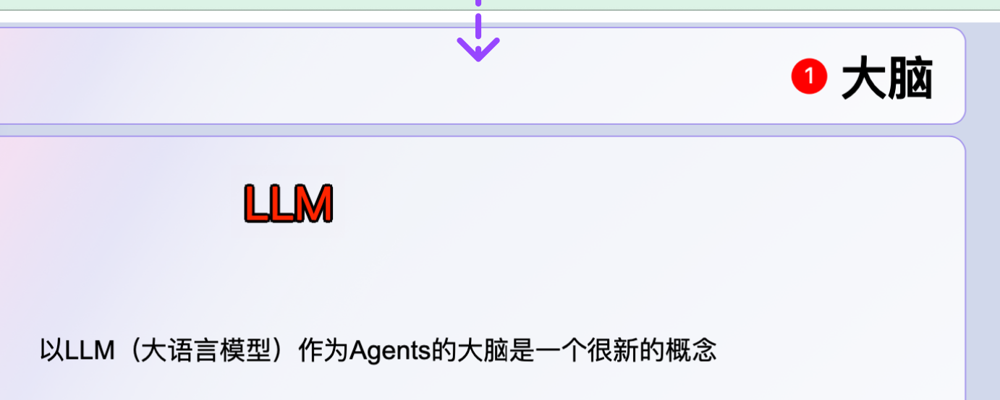

### 4.2. ② 规划 （Planning）

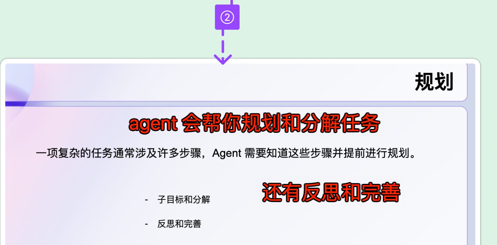

### 4.3. ③ 记忆（memory）

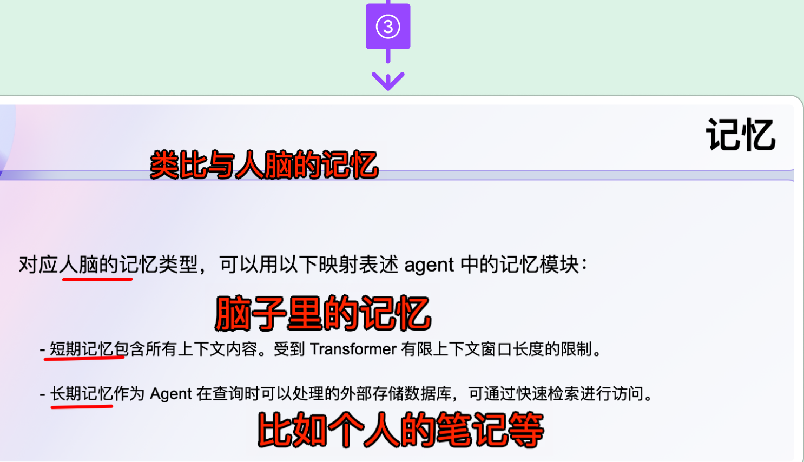

### 4.4. ④ 工具使用（use Tool）

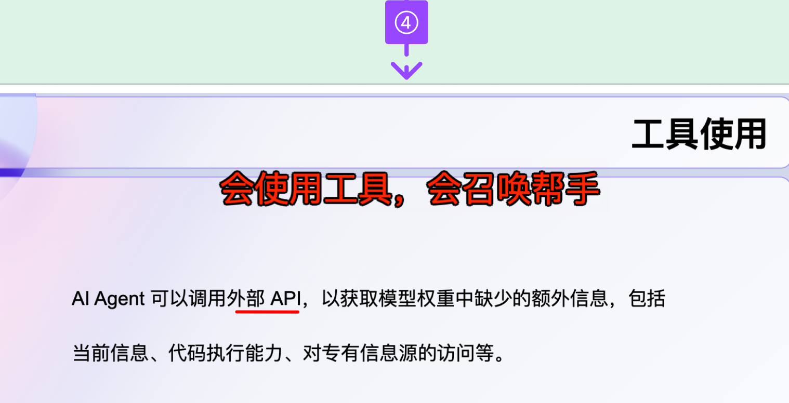

## 5. Agent 与 Bot 的关系 

### 5.1. 定义

- AI Agent（AI代理）
	- AI Agent 是一个具有自主决策能力、可以感知环境、学习适应并追求特定目标的智能系统。
- AI Bot（AI机器人）
	- AI Bot 是一个专注于执行特定任务、通常基于预定规则运作的自动化程序。

### 5.2. 演变与融合

- **重叠**：在某些情况下，Bot 可以被视为 Agent 的一种。
	- 例如，一个聊天机器人（Chatbot）可以被认为是一个 Agent，因为它能够与用户进行交互并提供信息或服务。
- **相互影响**：随着技术的发展，许多 Bot 开始具备更多的 Agent 特性，例如通过机器学习实现的自主决策能力。
- 一个 Agent 可以是**一个 Bot**，也可以是**多个 Bot 的协同**
	- 就像是职场里，简单的工作独立完成，复杂的工作协作完成一样

### 5.3. 实现的技术栈对比

- Agent技术栈：
    - 深度学习
    - 强化学习
    - 自然语言处理（NLP）
    - 计算机视觉
    - 知识图谱
    - 多模态AI
- Bot技术栈：
    - 规则引擎
    - 简单的机器学习模型
    - 基本的NLP（如关键词匹配）
    - API集成
    - 工作流自动化

### 5.4. 从 AI 应用的角度看

- Agent 代表了更高级、更复杂的AI系统
- 而Bot则是更专门化、任务导向的AI工具

随着技术的发展，这两个概念之间的界限正在逐渐模糊，我们看到了更多的混合系统，结合了**Bot的效率**和**Agent的智能**。

## 6. Bot 的组成

对于每个 Bot 来说，可能会包括：
- **一个大脑**：判断和规划行为，这里通常用 GPT-4 或 同水平的 **LLM**；
- **眼睛和手**：确认信息和使用外部工具，一般是**各种插件/action/api**；
- **工作纪要**：储存已经发生的事
	- 通常的媒介是上下文窗口
	- 或者数据库；  
- **行为SOP**：明确这个 Agent 的身份、任务、目标和机制。
	- 这个 SOP 可能是用户给的
	- 也可能是由其它 Bot 给出的。

再具象一点，这里我从 GPTs 里截了个图：

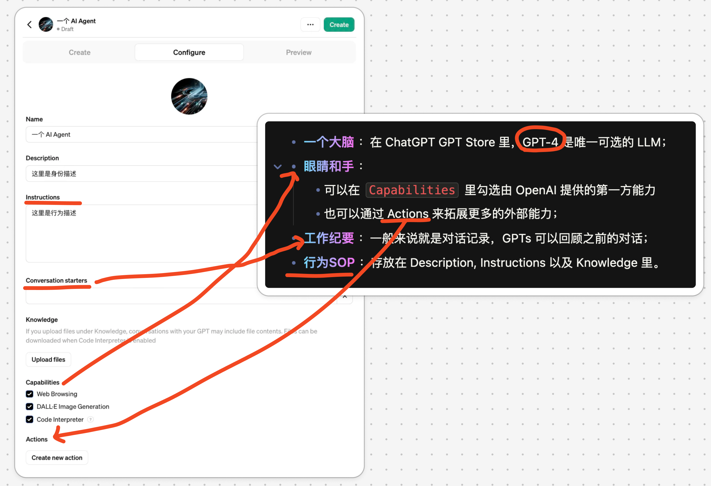

## 7. OpenAI 的 Agent 演进

### 7.1. 开发文档中的 Fuction Call 

 OpenAI 给开发者发送的指引中，给了这样的 Todo
- **第一步**：开发接口，来定义 ChatGPT 可以调用的功能
	- 接口可以是新开发的
	- 也可以是改造现有的
- **第二步**：写一份文档，**给 ChatGPT 来看，让它知道什么时候去调用接口**。
	- 当然，这里要遵循一定的格式，然后用自然语言来写。

如果你做过 OpenAI API 的开发，可能会觉得这个文档有些熟悉，这不就是 Fuction Call 吗？详见下文 [#AI 和 LLM 上下文中的 Function Call](/post/73d5e97d60505b20a8982503e5885a2a.html#AI-和-LLM-上下文中的-Function-Call)

没错，在 2023 年 6 月 13 日，OpenAI 发布了 Function Call 模式，让大模型可以来调用外部工具，用的就是非常类似的方案。

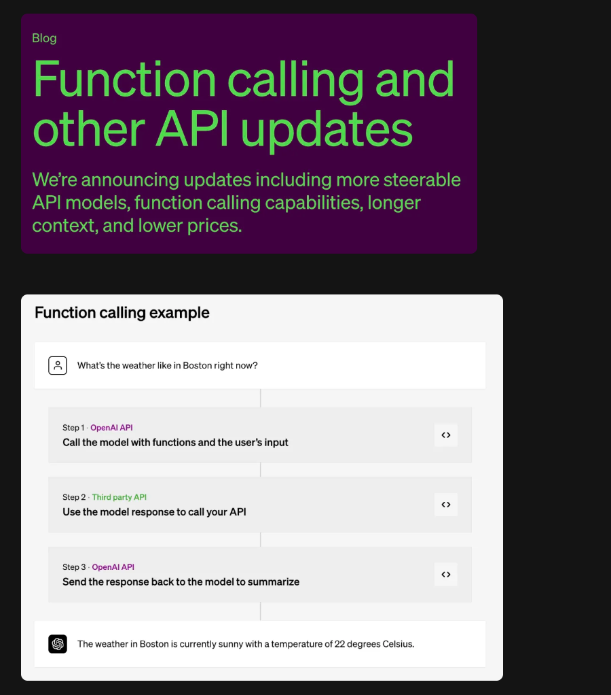

#### 7.1.1. 传统编程中的 Function Call

在传统的编程中，Function Call 指的是调用（执行）一个预定义的函数或方法的过程。这个过程包括：
- 将控制权转移到被调用的函数
- 可能传递参数给函数
- 执行函数内的代码
- 可能返回一个值
- 将控制权返回给调用者

#### 7.1.2. AI 和 LLM 上下文中的 Function Call

在 AI 和大型语言模型的背景下，Function Call 有了更广泛的含义。它通常指的是模型能够识别何时需要调用外部函数或 API 来完成特定任务的能力。这个概念特别适用于像 GPT-3.5 和 GPT-4 这样的语言模型。

在这个上下文中，Function Call 涉及：
- 模型理解用户的请求
- 识别需要外部数据或功能的情况
- 生成调用特定函数的请求
- **解释函数返回的结果并将其整合到响应中**

示例应用，如下图：

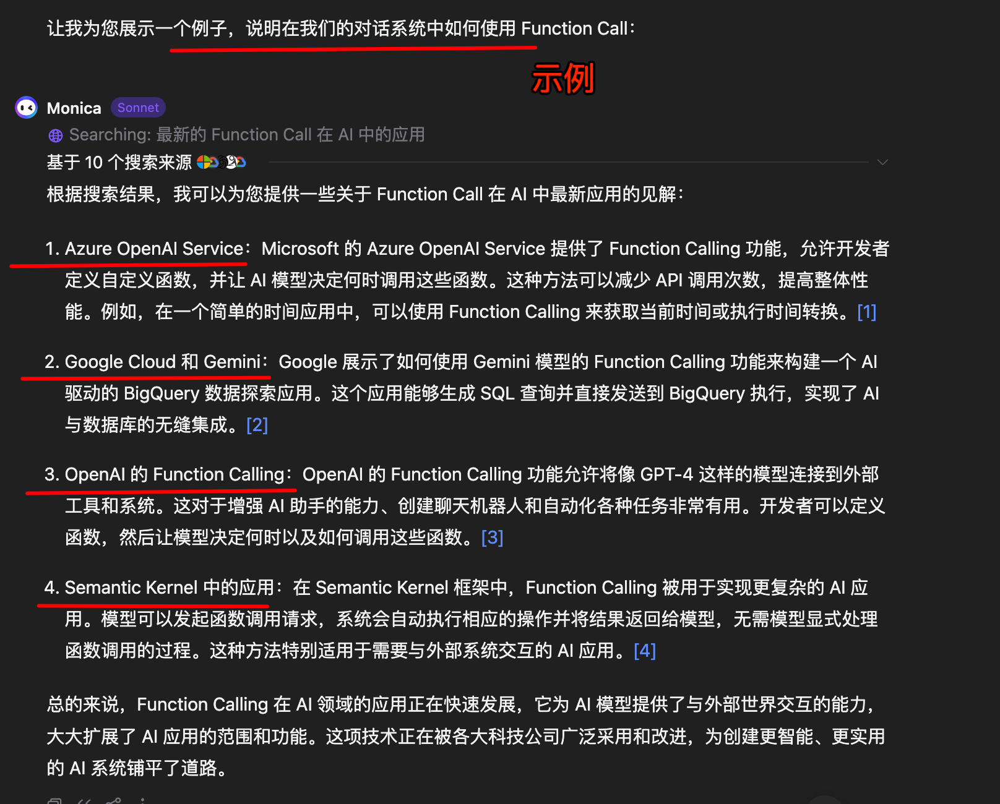

### 7.2. GPTS  Store 的推出

之后，ChatGPT 推出了 All Tools 功能。**也就是回答用户问题时，不再需要用户自主的来选择工具**，这可以视作是“**自动版的Plugin**”，覆盖了三款官方工具Browsing，Advanced Data Analysis ，DALL·E，如下图

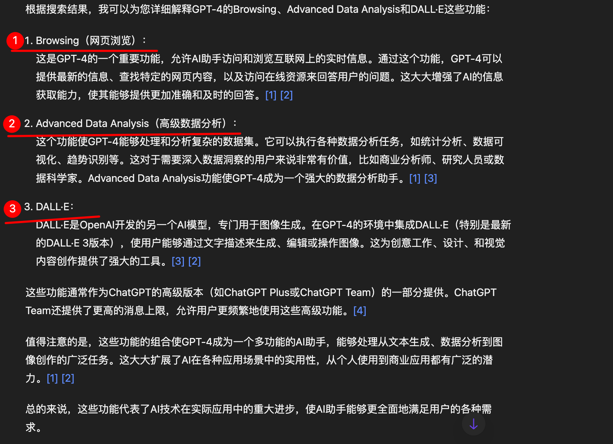

时间推移，在2023 年 11 月 6 日的时候，在 OpenAI 开发者大会上，Sam Altman 宣布了 **GPTs**，这通常被认为是 OpenAI 推出了其第一个正式版的 AI Agent。在最初的版本中，包括以下功能

- 允许用户创建多个 Bot，自定义它们的身份和回答风格。并且这些 Bot 可以分享
- Bot 可以自有使用三款官方工具：Browsing, Advanced Data Analysis 和 DALL·E
- Bot 也可以通过 Action 的方式（类似 API 的东西），去调用任何的外部能力
- Bot 可以有自己的数据空间，允许用户对这些数据进行 QA
	- 比如，我上传了 OpenAI 的开发文档，帮助开发者快速生成 OpenAI 的调用代码

同时，在11月06日的时候，OpenAI 也更新了几个影响深远的接口：

- **Function Calling**：更新多参数生成功能，可以让一轮对话完成多项任务
- **JSON Mode**：让 API 通过 JSON，而非文字，来做出回应
- **Seed**：设定随机值，提高一致性
- **Assistants API & Code Interpreter**：可以理解为把 ChatGPT 的 Bot，搬到了 API 里
- **Retrieval**：简易化知识库构建

在最近 GPTs  体系上线了 GPT Store，有些媒体称其为 OpenAI 的 App Store 时刻，但其实并不相同。在 GPT Store 里，用户可以搜索和使用为各项任务所开发的 GPTs。

### 7.3. @GPTs 功能

紧随 GPT Store 上线的，还有 `@GPTs 功能`，也就是在任何的对话中，你都可以手动的让某个 GPTs 接管这个对话内容，做出更好的输出。

## 8. 其它 Agent 平台

之前和 OpenAI 的相关负责人聊过，ChatGPT 的主要定位是“开箱即用的消费级产品”。那这里，自然给“较为复杂的生产级产品”留下了生态空间。这里，我们也来探讨下这类产品。

主要的 AI 玩家都会对这方面有所涉足，也各有侧重。比如
- 传统大厂自字节扣子/coze
- 百度的灵境矩阵
- 也比如来自 AI 初创公司的 Dify 等等。

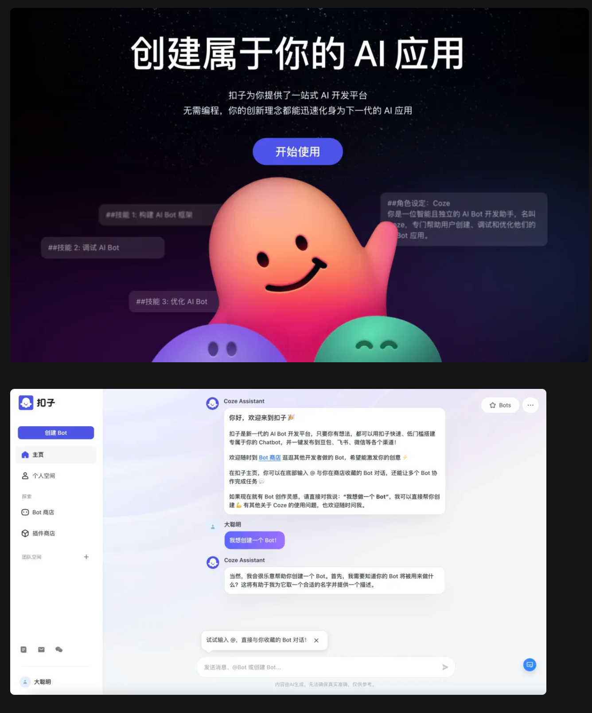

以扣子为例，对比与 GPTs Store，主要的体感区别包括：

- 免费，至少目前是完全免费的
- 有数十个官方插件，对比与 GPTs 里只有3个
- 可以用类似低代码的方式，构建 Workflow，并被 Bot 调用  
- 可以将捏好的 Bot 发布到其它平台（比如飞书，公众号），同时支持 API

**其中后两条极为核心**。  

## 9. Agent 的实战

一个设计良好的 Agent 可以提供极大的生产力，并创造极高的价值。

前几天大火的 **Devin**，被称为“第一位由 AI 担任的软件工程师”，它可以自主的去学会如何使用不熟悉的技术，自主的生成代码、调试bug和部署应用。

Agent 也可以替代现有的很多软件工具，去完成工作中繁琐的任务。

> **是否可以把写这篇文章的过程，查阅什么资料，如何排版，如何发布，直接搞成个 Agent，来帮我完成这些事情，其实已经是可以的了。**

## 10. Agent 的问题

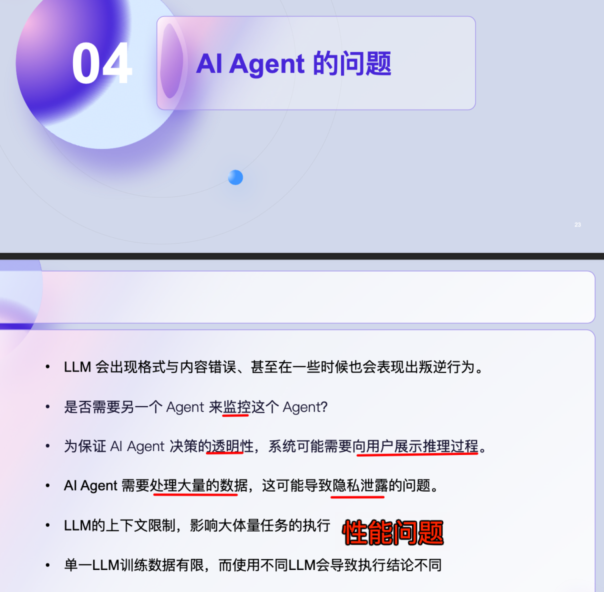

在 AGI 来之前，Agent 是一个很棒的替代方案。不过现在还有俩主要毛病：
1. 不够稳定；
2. 算力有点贵

所以，这就需要 **Agent 工程**来解决这个问题

## 11. 参考

- https://mp.weixin.qq.com/s/xQPmiEfFOOp8R5zgTcYHDA
- https://www.yuque.com/r/note/1cec57e4-386c-49f2-982a-4e531b875a5d