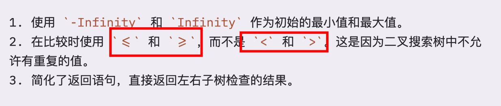
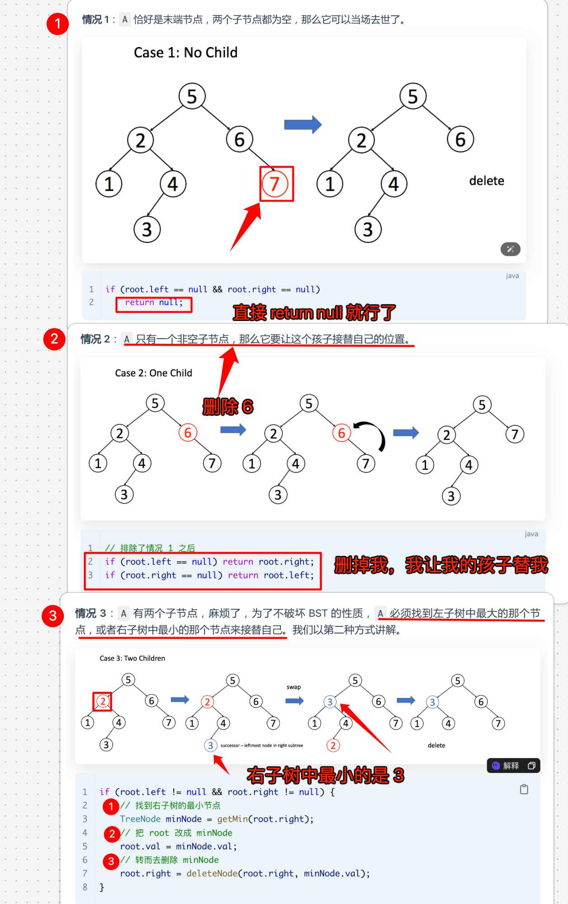

# 二叉搜索树（篇二：BST 的增删改查）


`#BST` `#leetcode`  `#二叉树/二叉搜索树`   `#2024/09/08` 


## 目录
<!-- toc -->
 ## 1. 代码模板 

```javascript
var BST = function (root, target) {
  if (root.val === target) {
    // 找到目标，做点什么
  }
  if (root.val < target) {
    BST(root.right, target);
  }
  if (root.val > target) {
    BST(root.left, target);
  }
};

```

## 2. 判断 BST 的合法性

- 对于每一个节点 `root`，代码值检查了它的左右孩子节点是否符合左小右大的原则
- 最重要的是，还需要检查 **`root` 的整个左子树都要小于 `root.val`，整个右子树都要大于 `root.val`**

否则规避下面的情况：


所以，需要需要在递归函数中**传值** ，具体代码如下：

```javascript hl:18
var isValidBST = function (root) {
  return _isValidBST(root, Number.MIN_SAFE_INTEGER, Number.MAX_SAFE_INTEGER);
};

/**
 * @description 判断一棵树是否是二叉搜索树
 * @param {TreeNode} root 二叉树根节点
 * @param {number} min 代表 root.val 的下界
 * @param {number} max 代表 root.val 的上界
 * @return {boolean} 是否是二叉搜索树
 */
var _isValidBST = function (root, min, max) {
  // base case: root 为 null 时，是二叉搜索树
  if (root === null) {
    return true;
  }
  // 若 root.val 不符合 min < root.val < max，说明不是二叉搜索树
  if (root.val <= min || root.val >= max) {
    return false;
  }

  // 递归判断左右子树是否是二叉搜索树
  // 左子树的最大值为 root.val, 最小值为 min
  let left = _isValidBST(root.left, min, root.val);
  // 右子树的最小值为 root.val, 最大值为 max
  let right = _isValidBST(root.right, root.val, max);

  return left && right;
};

```

### 2.1. 注意点

上面代码的 18 行中，需要注意使用 `>=`，还有一些注意点如下图：



## 3. 在 BST 中搜索一个节点 

### 3.1. 遍历一遍找到目标节点

```javascript
var searchBST = function (root, target) {
  if (root === null) {
    return null;
  }
  // base case: root 为 null 时，返回 null
  if (root.val === target) {
    return root;
  }
  // 左子树中搜索
  let left = searchBST(root.left, target);
  if (left) {
    return left;
  }
  // 右子树中搜索
  let right = searchBST(root.right, target);
  if (right) {
    return right;
  }
  // 没有找到目标值
  return null;
};

```

### 3.2. 利用 BST 的左小右大的特性

```javascript
var searchBST = function (root, target) {
  if (root === null) {
    return null;
  }

  // base case: root 为 null 时，返回 null
  if (root.val === target) {
    return root;
  }

  // 如果目标值小于当前节点值，搜索左子树
  if (target < root.val) {
    return searchBST(root.left, target);
  }
  // 如果目标值大于当前节点值，搜索右子树
  if (target > root.val) {
    return searchBST(root.right, target);
  }

  return null;
};

```

## 4. 在 BST 中插入一个节点 

> 我们假定 **默认不会向 BST 中插入已存在的值**

```javascript
function insertIntoBST(root, val) {
  //如果根节点为空，直接返回一个新节点，值为 val
  if (!root) {
    return new TreeNode(val);
  }
  //如果 val 大于当前节点的值，递归插入到右子树
  if (root.val < val) {
    root.right = insertIntoBST(root.right, val);
  }
  //如果 val 小于当前节点的值，递归插入到左子树
  if (root.val > val) {
    root.left = insertIntoBST(root.left, val);
  }
  // 最后，返回根节点
  return root;
}

```

### 4.1. 注意点

- 一旦涉及**改**，就**类似二叉树的构造问题**，函数要返回 `TreeNode` 类型
- 并且要对递归调用的**返回值**进行**接收**

## 5. 在 BST 中删除一个节点 

- 先「找」该节点
- 再「改」该节点

### 5.1. 先写出代码模板

```javascript hl:3
var deleteNode = function(root, key) {
    if (root.val === key) {
        // 找到啦， 进行删除
    } else if (root.val > key) {
        // 去左子树找
        root.left = deleteNode(root.left, key);
    } else if (root.val < key) {
        // 去右子树找
        root.right = deleteNode(root.right, key);
    }
    return root;
}
```

### 5.2. 找到了，有三种情况



### 5.3. 代码实现

```javascript
var deleteNode = function (root, key) {
  // base case
  if (!root) {
    return null;
  }
  if (root.val === key) {
    // 情况 1：没有子节点, 直接删除
    //  删除的方式是：直接返回 null
    if (!root.left && !root.right) {
      return null;
    }

    // 情况 2：只有一个子节点
    // 删除的方式是：返回非空的子节点
    // 如果右子节点存在，返回右子节点
    // 删除的方式是：返回右子节点
    if (!root.left && root.right) {
      return root.right;
    }
    // 如果左子节点存在，返回左子节点
    // 删除的方式是：返回左子节点
    if (!root.right && root.left) {
      return root.left;
    }

    // 情况 3：有两个子节点
    // 删除的方式是：① 找到右子树中的最小节点，替换当前节点 或者 ② 找到左子树中的最大节点，替换当前节点
    // 我们这里选择 ①
    // 找到右子树中的最小节点, 替换当前节点, 然后删除右子树中的最小节点
    // ① - 1:找到右子树中的最小节点
    let minNode = getMin(root.right);
    // ① - 2:替换当前节点
    root.val = minNode.val;
    // ① - 3:然后删除右子树中的最小节点,返回值必须使用 root.right 接住
    root.right = deleteNode(root.right, minNode.val);
  } else if (root.val > key) {
    // 去左子树找
    root.left = deleteNode(root.left, key);
  } else if (root.val < key) {
    // 去右子树找
    root.right = deleteNode(root.right, key);
  }
  return root;
};

// 获得 BST 中最小的节点。
var getMin = function (node) {
  // BST 最左边的就是最小的
  while (node.left != null) {
    node = node.left;
  }
  return node;
};

```

## 6. 最后注意 📢

仅对于这道算法题来说是可以的，但这样操作并不完美，我们一般不会通过修改节点内部的值来交换节点。因为在实际应用中，BST 节点内部的数据域是用户自定义的，可以非常复杂，而 BST 作为数据结构（一个工具人），其操作应该和内部存储的数据域解耦，所以我们更倾向于使用指针操作来交换节点，根本没必要关心内部数据。

1. 如果当前节点会对下面的子节点有整体影响，可以通过借助**函数传参**
2. 递归**修改**数据结构时
	- **一定要对递归调用的返回值进行接收**
	- 并**返回**修改后的节点
3.  BST 作为数据结构（一个工具人），同递归，没必要关心里面，只需要在每个节点做直接应该做的事情即可，递归会帮你完成

## 7. 参考

https://labuladong.online/algo/data-structure/bst-part2/

## 8. 相关题目

|LeetCode|力扣|难度|
|---|---|---|
|[450. Delete Node in a BST](https://leetcode.com/problems/delete-node-in-a-bst/)|[450. 删除二叉搜索树中的节点](https://leetcode.cn/problems/delete-node-in-a-bst/)|🟠|
|[700. Search in a Binary Search Tree](https://leetcode.com/problems/search-in-a-binary-search-tree/)|[700. 二叉搜索树中的搜索](https://leetcode.cn/problems/search-in-a-binary-search-tree/)|🟢|
|[701. Insert into a Binary Search Tree](https://leetcode.com/problems/insert-into-a-binary-search-tree/)|[701. 二叉搜索树中的插入操作](https://leetcode.cn/problems/insert-into-a-binary-search-tree/)|🟠|
|[98. Validate Binary Search Tree](https://leetcode.com/problems/validate-binary-search-tree/)|[98. 验证二叉搜索树](https://leetcode.cn/problems/validate-binary-search-tree/)|🟠|
