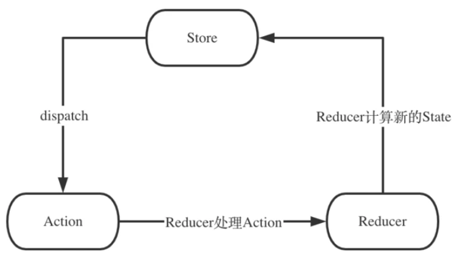
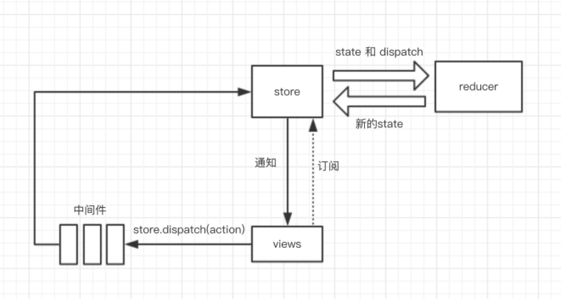
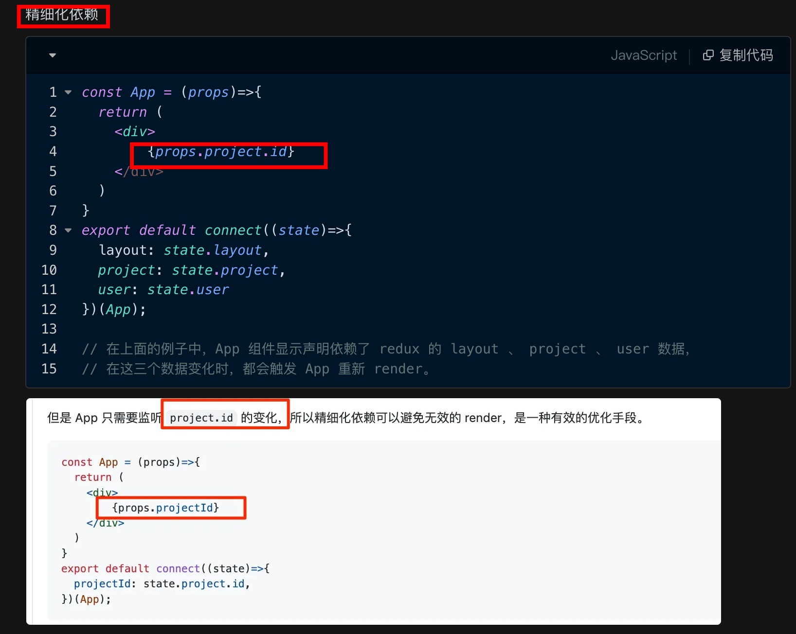

# 聊聊 Redux @ing


## 目录
<!-- toc -->
 ## 1. 与 Flux 的关系 

Flux:
- 单向数据流
- 多个 Store
- Dispatcher 是核心
- Store 之间可能存在依赖关系
Redux:
- 单向数据流
- 单一 Store：单一的 Store 存储所有状态
- Reducer 是核心
- 使用纯函数更新状态

Redux 是 Flux 架构的一个演进和改进版本。它通过引入`单一数据源`、`纯函数更新`和不可变性等概念，使得状态管理更加可预测和易于维护

## 2. Redux 的核心原则



1. **单一数据源（Single Source of Truth）**
    - 整个应用的状态存储在单个 store 的对象树中
    - 使状态可预测且易于调试
    - 支持服务器端渲染
2. **状态是只读的（State is Read-only）**
    - `唯一`改变状态的方式是触发 action
    - 所有的状态更新都是集中化和顺序化的
    - 确保视图和网络请求不能直接修改状态
3. **使用纯函数进行修改（Changes are made with Pure Functions）**
    - Reducers 必须是纯函数
    - 给定相同的输入，总是返回相同的输出
    - 不产生副作用

## 3. Redux 核心概念

### 3.1. 先总结

- createStore
    - 创建 store 对象，包含 getState、dispatch、subscribe、replaceReducer
- reducer
    - 纯函数，接受旧的 state、action，生成新的 state
- action
    - 动作，是一个对象，必须包括 type 字段，表示 view 发出通知告诉 store 要改变
- dispatch
    - 派发，触发 action ，生成新的 state。是 view 发出 action 的唯一方法
- subscribe
    - 订阅，只有订阅了，当派发时，会执行订阅函数
- combineReducers
    - 合并 reducer 成一个 reducer
- replaceReudcer
    - 代替 reducer 的函数
- middleware
    - 中间件，扩展 dispatch 函数


### 3.2. Store

- 整个应用的状态树
- 是只读的
- 只能通过触发 action 来修改

```javascript
import { createStore } from 'redux'
const store = createStore(reducer)

```

- 保存状态的容器
- 提供 `getState()` 方法访问状态
- 提供 `dispatch(action)` 方法更新状态
- 提供 `subscribe(listener)` 方法注册监听器

### 3.3. Action

- 描述发生了什么的`普通对象`
- 必须包含 type 属性
- 可以携带额外数据

   ```javascript
   // 普通 action
   const addTodo = {
     type: 'ADD_TODO',
     payload: { text: '学习 Redux' }
   }
   
   // action creator
   const addTodo = (text) => ({
     type: 'ADD_TODO',
     payload: { text }
   })
   ```

### 3.4. Reducer

- 指定状态如何变化的纯函数
- 接收旧状态和 action，返回新状态
- 不应直接修改旧状态

   ```javascript
   const todoReducer = (state = [], action) => {
     switch (action.type) {
       case 'ADD_TODO':
         return [...state, action.payload];
       case 'REMOVE_TODO':
         return state.filter(todo => todo.id !== action.payload.id);
       default:
         return state;
     }
   }
   ```

## 4. 二、基本使用流程

### 4.1. 创建 Store

   ```javascript
   import { createStore } from 'redux';
   
   const store = createStore(reducer);
   ```

### 4.2. 订阅更新

   ```javascript
   store.subscribe(() => {
     console.log('Store updated:', store.getState());
   });
   ```

### 4.3. 触发 Action

   ```javascript
   store.dispatch(addTodo('学习 Redux'));
   ```

## 5. 三、Redux 工具链

### 5.1. Redux Toolkit（推荐使用）

- 简化样板代码
- 内置 Immer
- 更好的开发体验

   ```javascript
   import { createSlice, configureStore } from '@reduxjs/toolkit';

   const todoSlice = createSlice({
     name: 'todos',
     initialState: [],
     reducers: {
       addTodo: (state, action) => {
         state.push(action.payload);
       },
       removeTodo: (state, action) => {
         return state.filter(todo => todo.id !== action.payload.id);
       }
     }
   });

   const store = configureStore({
     reducer: {
       todos: todoSlice.reducer
     }
   });
   ```

### 5.2. Redux Middleware

- 处理异步操作
- 日志记录
- 错误处理

```javascript
import { createStore, applyMiddleware } from 'redux'
import thunk from 'redux-thunk'

const store = createStore(
  reducer,
  applyMiddleware(thunk)
)

```

#### 5.2.1. 比如日志中间件

   ```javascript
   // 日志中间件示例
   const logger = store => next => action => {
     console.log('dispatching', action);
     let result = next(action);
     console.log('next state', store.getState());
     return result;
   };
   ```

## 6. 最佳实践

2. Action 使用注意点：

3. Reducer 注意点：

### 6.1. State 结构设计

- 将状态扁平化
- 避免冗余数据
- 规范化复杂数据结构
- 避免冗余数据
- 合理划分 state 树
- 使用范式化数据结构
- 避免深层嵌套

   ```javascript
   const state = {
     entities: {
       todos: {
         byId: {
           1: { id: 1, text: '学习 Redux' },
           2: { id: 2, text: '学习 React' }
         },
         allIds: [1, 2]
       },
       users: {
         // ...
       }
     },
     ui: {
       loading: false,
       error: null
     }
   };
   ```

### 6.2. Action 设计原则

```javascript
// 使用 action creator
const createUser = (user) => ({
  type: 'CREATE_USER',
  payload: user
})

// 使用常量定义 action types
const ActionTypes = {
  CREATE_USER: 'CREATE_USER',
  UPDATE_USER: 'UPDATE_USER'
}

```

   - 使用动词+名词的命名方式
   - 携带最小必要信息
   - 使用标准化的结构
   - 避免在一个 action 中包含多个操作
   - 保持 action 的原子性
   - 使用 action creator 统一创建
   - 考虑使用 action 类型常量

### 6.3. Reducer 设计原则

- 保持纯函数特性
- 避免副作用
- 使用 combineReducers 拆分
- 使用 immer 简化不可变更新
- 保持纯函数特性
- 避免修改 state 参数
- 处理好未知的 action type
- 合理拆分 reducer

## 7. Redux 原理

### 7.1. 数据流向

- 单向数据流
- 可预测的状态变化
- 便于调试和测试

```javascript
Action -> Dispatcher -> Store -> View
```

### 7.2. 发布订阅模式

- 通过发布订阅模式实现
- 状态更新触发监听器
- 确保状态同步更新

   ```javascript
   function createStore(reducer) {
     let state;
     let listeners = [];
     
     const getState = () => state;
     
     const dispatch = (action) => {
       state = reducer(state, action);
       listeners.forEach(listener => listener());
     };
     
     const subscribe = (listener) => {
       listeners.push(listener);
       return () => {
         listeners = listeners.filter(l => l !== listener);
       };
     };
     
     dispatch({}); // 初始化 state
     
     return { getState, dispatch, subscribe };
   }
   ```

### 7.3. 中间件实现原理

   ```javascript
   function applyMiddleware(...middlewares) {
     return (createStore) => (reducer, preloadedState) => {
       const store = createStore(reducer, preloadedState);
       let dispatch = store.dispatch;
       
       const middlewareAPI = {
         getState: store.getState,
         dispatch: (action) => dispatch(action)
       };
       
       const chain = middlewares.map(middleware => middleware(middlewareAPI));
       dispatch = compose(...chain)(store.dispatch);
       
       return {
         ...store,
         dispatch
       };
     };
   }
   ```

## 8. 性能优化

### 8.1. Reselect 使用

   ```javascript
   import { createSelector } from 'reselect';

   const getTodos = state => state.todos;
   const getFilter = state => state.filter;

   const getVisibleTodos = createSelector(
     [getTodos, getFilter],
     (todos, filter) => {
       switch (filter) {
         case 'SHOW_COMPLETED':
           return todos.filter(todo => todo.completed);
         case 'SHOW_ACTIVE':
           return todos.filter(todo => !todo.completed);
         default:
           return todos;
       }
     }
   );
   ```

### 8.2. 避免不必要的渲染

   ```javascript
   // 使用 React.memo 或 shouldComponentUpdate
   const TodoItem = React.memo(({ todo, onToggle }) => {
     return (
       <li onClick={() => onToggle(todo.id)}>
         {todo.text}
       </li>
     );
   });
   ```

### 8.3. 其他

- 避免频繁的 `dispatch`
- 使用 `reselect` 缓存计算结果
- 避免不必要的组件渲染
- 合理使用 connect 或 hooks
- 精细化依赖
	- 

## 9. Redux Hooks

### 9.1. useSelector

   ```javascript
   import { useSelector } from 'react-redux';

   function TodoList() {
     const todos = useSelector(state => state.todos);
     return (
       <ul>
         {todos.map(todo => (
           <TodoItem key={todo.id} {...todo} />
         ))}
       </ul>
     );
   }
   ```

### 9.2. useDispatch

   ```javascript
   import { useDispatch } from 'react-redux';

   function AddTodo() {
     const dispatch = useDispatch();
     return (
       <button onClick={() => dispatch(addTodo('新任务'))}>
         添加任务
       </button>
     );
   }
   ```

## 10. 调试工具

### 10.1. Redux DevTools

   ```javascript
   const store = createStore(
     reducer,
     window.__REDUX_DEVTOOLS_EXTENSION__ && 
     window.__REDUX_DEVTOOLS_EXTENSION__()
   );
   ```

### 10.2. 日志中间件

   ```javascript
   import { createLogger } from 'redux-logger';

   const store = createStore(
     reducer,
     applyMiddleware(createLogger())
   );
   ```

## 11. 选择建议

对于小型项目，可能使用 React 的 Context API 或其他更轻量级的状态管理方案会更合适。


## 12. 总结

1. Redux 是状态管理库，也是一个架构
2. Redux 与 React 无关，但它是为了解决 React 组件中状态无法共享而出的一种解决方案
3. 单纯的 Redux 只是一个状态机， store 中存放了所有的状态 state，要想改变里面的状态 state，只能 dispatch 一个动作
4. 发出去的 action 需要用 reducer 来处理，传入 state 和 action，返回新的 state
5. subscribe 方法可以注册回调方法，当 dispatch action 的时候会执行里面的回调
6. Redux 其实是一个`发布订阅模式`
7. Redux 支持 enhancer，enhancer 其实就是一个装饰器函数，传入当前的 createStore，返回一个增强的 createStore
8. Redux 使用 `applyMiddleware` 函数支持中间件，它的返回值其实就是一个 enhancer
9. Redux 的中间件也是一个装饰器模式，传入当前的 dispatch，返回一个增强了的 dispatch
10. 单纯的 Redux 是没有 View 层的

