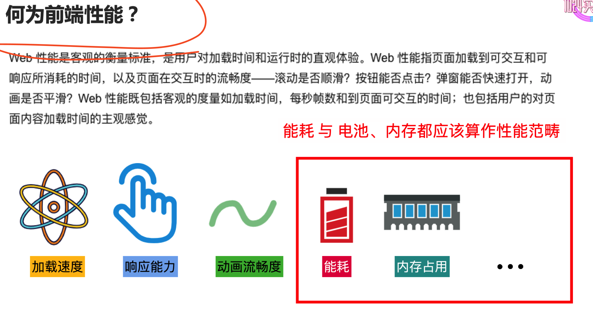
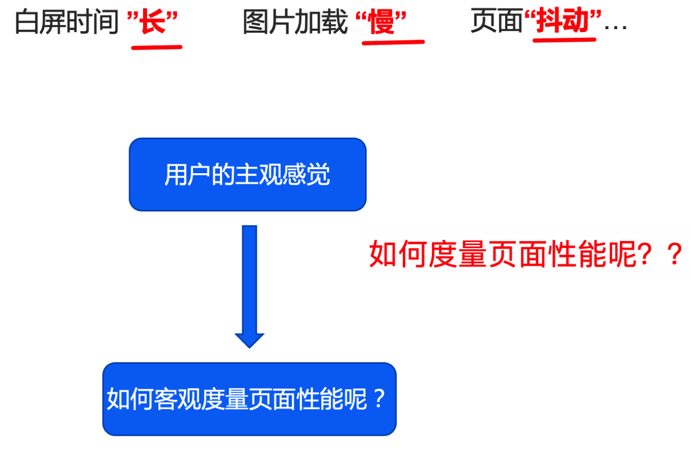
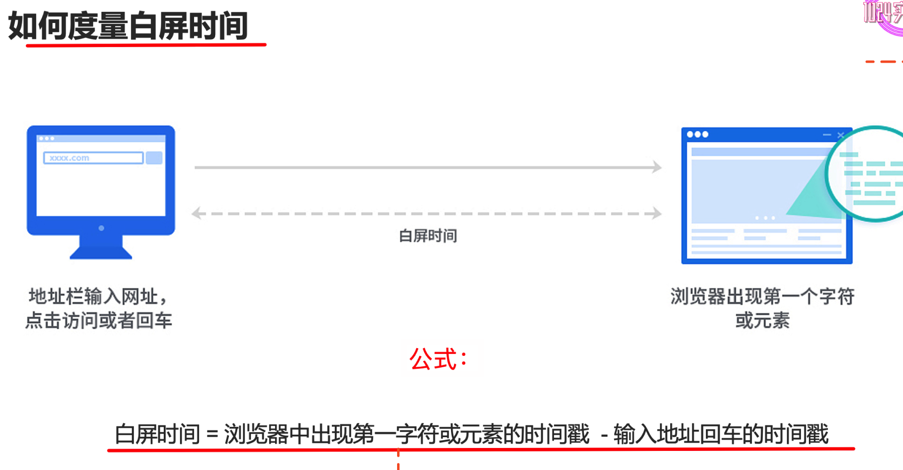
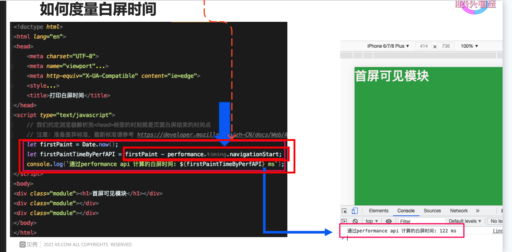
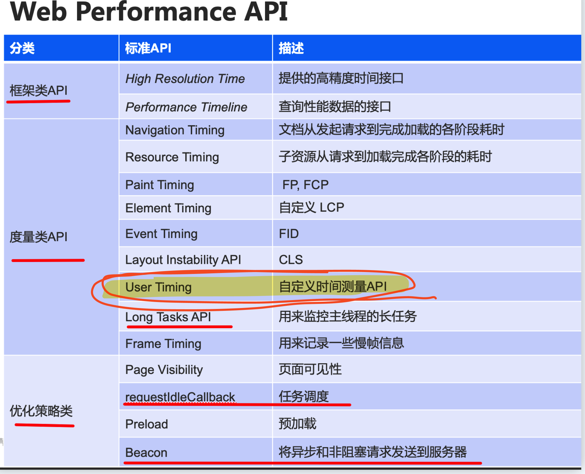
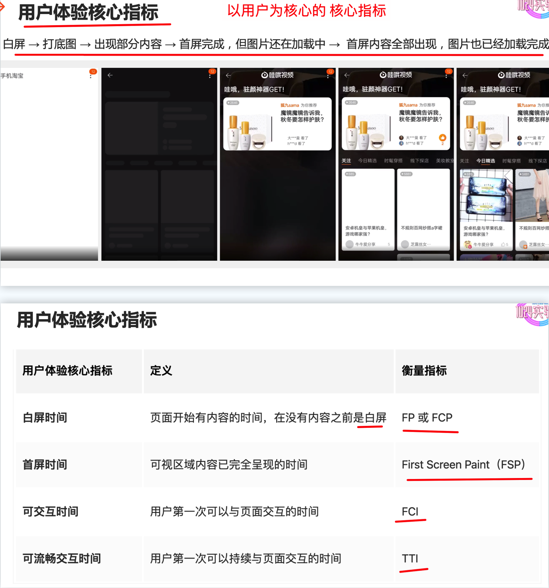
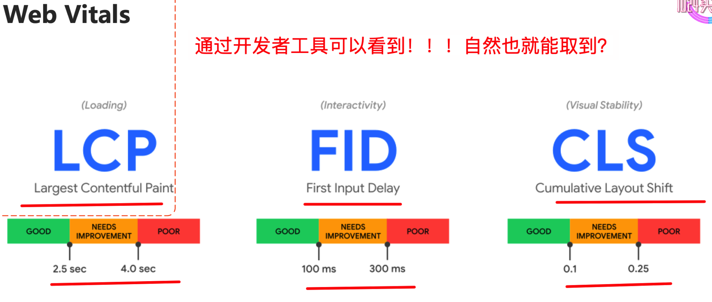

# 如何度量前端性能

`#前端性能` 

> 源于个人某次分享

## 目录
<!-- toc -->
 ## 1. 何为前端性能 

## 2. 如何度量性能

### 2.1. 主观感受

### 2.2. 客观度量：（比如，如何度量白屏时间）

使用`性能 API`

## 3. web performance api

## 4. 以用户为中心的性能指标

、

## 5. 用户体验核心指标

## 6. Web Vitals

## 7. 性能指标总结

