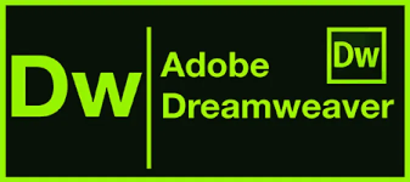
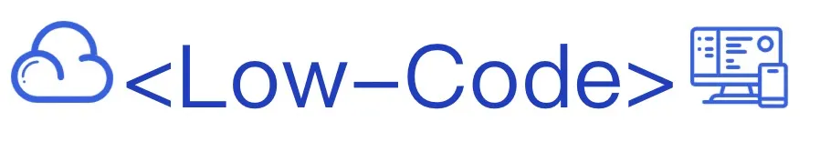
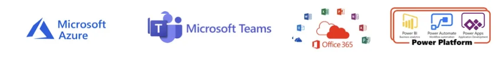
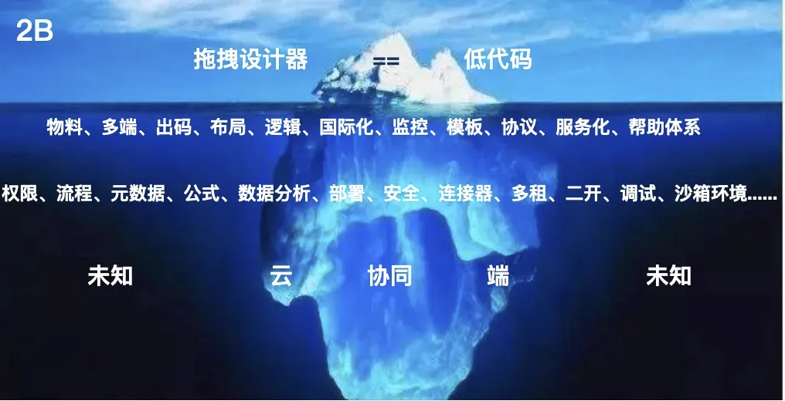

# 好文：低代码探索之路

`#lowcode` 

> 参考: [2B 领域下的低代码探索之路](https://mp.weixin.qq.com/s/HAxrMHLT43dPH488RiEIdw)

## 目录
<!-- toc -->
 ## 1. 定义 

通过`模型/建模`、图形界面拖放组件可以加快应用开发，达到**降本增效**的目的

- 通过**建模**和**图形界面**来**可视化应用程序开发**
	- 开发人员可以跳过手工编码
	- 从而**加快**了将应用程序投入生产的过程
- 低代码开发是一种**可视化应用开发方法**
	- 使用**拖放式组件**和**模型驱动**逻辑来创建 Web 和移动应用

## 2. 前端从业人员认为的低代码鼻祖

## 3. 当下低代码应该是

## 4. 低代码市场分类：表单驱动 + 模型驱动

- 一种是基于**表单驱动**
	- 核心能力是**表单、流程、报表**
	- 在一定的场景下，可以快速的做业务交付，上手成本也比较低。
		- 比如：宜搭、简道云、明道云、氚云等
- 另一种是基于**模型驱动** 
	- 核心是**领域模型、业务沉淀、完整性**
	- 有一定的技术壁垒，上手成本相对比较高
		- 比如：Outsystems / Mendix / PowerApps / 奥哲云枢 / 金蝶云苍穹等

## 5. 更高格局：云 + 端 + 协同 + 低代码 → 微软

所以，低代码平台只是其中的一部分而已

## 6. 探索过程：

> 1. **始于表单终于表单**；2.**从技术到产品。**

### 6.1. 中后台搭建

- 给前端用，技术同学是来写代码的，就排斥**这种高不成低不就的搭建平台产品**，而且功能又不全，被骂的很惨。
- 给后端用，当然排斥，**让我一个写 Java 的做前端的页面？**

>  之前贝壳的时候，强推服务端使用

> 个人相信，给时间持续迭代，多点耐心，**能满足大部分企业内部中后台搭建场景**

### 6.2. 服务化

服务化就是我可以让其他团队也快速拥有低代码搭建的能力，并且可以做定制

### 6.3. 代码互转/WebIDE

需求逐渐变得复杂时，发现搭建满足不了，然后我们开始**做出码**，将搭建产物转成代码，在 WebIDE 或者 IDE 上继续开发

## 7. 再之后：价值？商业化？

### 7.1. 灵魂三问

1. 如何能把价值再做大？
2. 低代码 or 零代码？
3. 用户是谁？

### 7.2. 再问

- 能否商业化呢？
- 要不要商业化呢？
- 如何商业化？

### 7.3. 竞品中找答案？

- Salesforce / Power Platform / 金蝶云苍穹
	- 他们的 PaaS 都是有**明确支撑的业务领域**，CRM / ERP。
	- **PaaS 是基于自身的 SaaS 长出来的**
- 工具类的竞品，像 Outsystems/ Mendix
	- 他们提供是**软件工具、方法和架构**，可以快速建模、测试、部署、管理等
	- **是一套完整应用开发的闭环（测试、部署、调试、稳定性等）**
	- 单纯做工具, 最后被收购？像 Mendix 
	- **蛋糕还有吗？**
		- 要考虑多租、二开等，技术复杂度极高
- 国内，看背景出身
	- 简道云，背后是帆软-数据出身，氚云-流程出身。两个产品都偏零代码，产品体验做的都很不错

## 8. 冰山理论

### 8.1. 拖拽设计器 == 低代码？

远远不是，看冰山下面的东西，更高的高山（微软）

## 9. 现实是什么？

### 9.1. 场景需求与业务壁垒

- **场景需求驱动**：疫情下，各种扫码，登记
- 能科做低代码平台
	- 工业软件实施背景

### 9.2. 平台锁定完整性

**平台锁定**要求用户**在一个平台上能把所有研发相关的事情全部做完**。所以要求
- 可维护性
- 可控的开发质量
- 维护性和升级成本
- 二次需求开发

### 9.3. 工业软件开发生态建设

- 实施后能够**沉淀**下来什么？
- 通过更多的客户开发者生产更多的**物料、服务**
- 同时平台可以连接更多的物料、服务

### 9.4. 连接存量的产品、存量的数据

- 一个是**产品之前的连接**
	- 存量的 ERP/CRM 大而复杂的软件系统。
	- 越来越多小而灵活的应用产生
	- 企业的创新需求变化越来越快
- 一个是**数据的连接**
	- 存量数据
	- 不能做成烟囱

所以，**需要考虑之前的产品如何集成，数据如何迁移？**

### 9.5. 灵活性和易用性的平台

- 灵活性和易用性的平衡如果做不好，那**把平台做屎也很容易**
- 太多先验经验，为了做成零代码，把平台搞成了**屎**
	- 复杂得没法维护
	- 产品体验差得不好意思说是我做的

