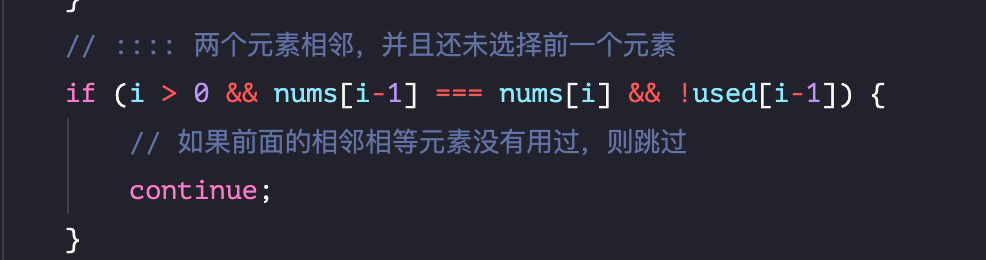

# 全排列 II：元素可重复，不可复选


> [47. 全排列 II](https://leetcode.cn/problems/permutations-ii/)


## 目录
<!-- toc -->
 ## 1. 总结 

- 思路一：去重
	- 先排序
	- 因为重复，所以不能使用 `includes`来判断，一定有使用 `used 数组` 
	- 按照 [46. 全排列：元素不可重复，不可复选](/post/ucLFYOhD.html) 的方式，可得结果，但结果里有重复的元素
		- 然后再去重即可  
			- 转成字符串 → new Set() → 再转成数组即可
				- `res = [...new Set([...res])];`
			- 注意：**不能使用双指针去重**，因为得到的结果的每个元素是数组，不是有序数组
- 思路二：剪枝逻辑
	- ① 先排序
	- ② 两个相等元素相邻，且**前一个元素还没选中时**，跳过
	- 

## 2. 题目


改题的可选数组可能`有重复`，我们来看看前面提到的 `没有重复元素的场景` 

先看能否通过 `includes` 代码如下：

```javascript
var permute = function (nums) {
    const len = nums.length;
    const res = []; // 结果集
    const options = []; // 选择列表
    function backtrack(options) {
        // 递归终止条件
        if (options.length === len) {
            return res.push(options)
        }
        for (let i = 0; i < len; i++) {
            // 已经选择过的数字不能再做选择
            if (!options.includes(nums[i])) {
                // 做选择
                options.push(nums[i]);
                backtrack([...options]);
                // 撤销选择
                options.pop()
            }
        }
    }
    backtrack(options)
    return res
};
```
能否通过上面的 `includes` 方法来判断，剪枝呢，答案是很麻烦，因为 `includes` 只是标识数组是否包含某个元素，元素重复时就会比较麻烦，所以还是使用 `used 数组`变量来标识是否被选中了，即参考 实现：代码如下

```javascript
var permute = function (nums) {
    const len = nums.length;
    const res = []; // 结果集
    const used = new Array(nums.length).fill(false); // 选择列表

    /**
     * @param {Array} track 已经选择的列表
     * */
    function backtrack(track) {
        // 递归终止条件
        if (track.length === len) {
            return res.push(track)
        }
        for (let i = 0; i < len; i++) {
            // 已经选择过的数字不能再做选择
            if(used[i]) continue;
            // 做选择
            track.push(nums[i]);
            used[i] = true;
            backtrack([...track]);
            // 撤销选择
            track.pop();
            used[i] = false;
        }
    }
    backtrack([]);
    return res
};

console.log(permute([1, 2, 3]));
console.log(permute([1, 2, 3, 4]));
```

这里需要`剪枝` , 代码如下：

```javascript
/**
 * @param {number[]} nums
 * @return {number[][]}
 */
var permuteUnique = function (nums) {
    const len = nums.length;
    const res = []; // 结果集
    const track = []; // 选择列表
    const used = new Array(len).fill(false); // 记录元素是否使用过
    // ::::排序，让相同的元素靠在一起,以便于剪枝算法的实现
    nums.sort((a, b) => a - b);
    
    function backtrack(track) {
        // 递归终止条件
        if (track.length === len) {
            return res.push([...track]);
        }
        for (let i = 0; i < len; i++) {
            // :::: 已经选择过的数字不能再做选择
            if (used[i]) {
                continue;
            }
            // :::: 两个元素相邻，并且还未选择前一个元素
            if (i > 0 && nums[i-1] === nums[i] && !used[i-1]) {
                // 如果前面的相邻相等元素没有用过，则跳过
                continue;
            }
            // 做选择
            track.push(nums[i]);
            used[i] = true;
            backtrack([...track]);
            // 撤销选择
            track.pop();
            used[i] = false;
        }
    }
    // 传入空数组，代表选择列表
    backtrack(track)
    return res
};

console.log(permuteUnique([1, 1, 2]));
console.log(permuteUnique([1, 3, 2]));

```

**分析：**

当出现重复元素时，比如输入 `nums = [1,2,2',2'']`，`2'` 只有在 `2` 已经被使用的情况下才会被选择，同理，`2''` 只有在 `2'` 已经被使用的情况下才会被选择，这就 `保证了相同元素在排列中的相对位置保证固定`。

## 3. 提示

> [!tip]
**只要涉及到重复**，就得`对可选列表排序`


