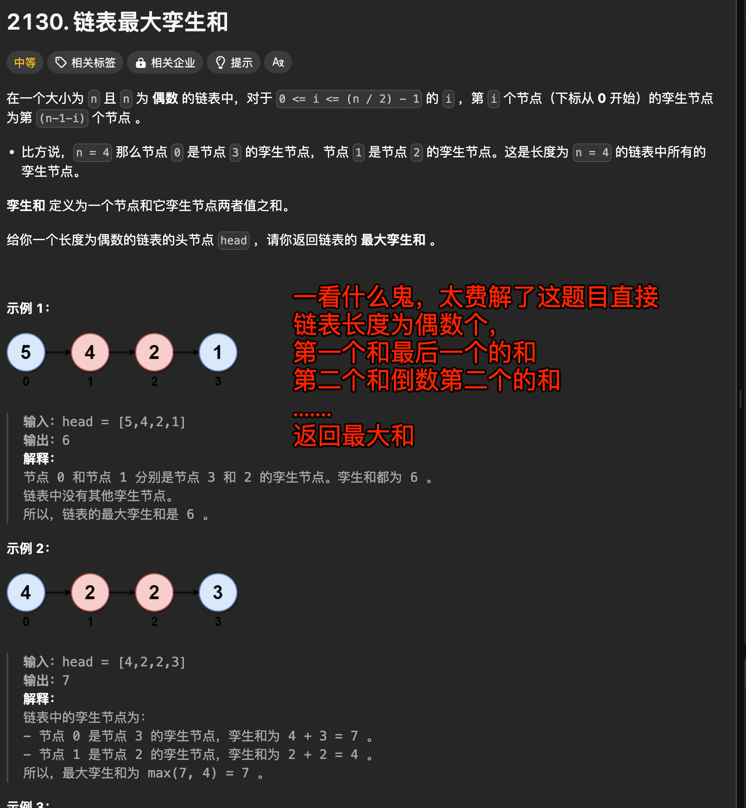

# 链表最大孪生和


#leetcode   #2024/08/10  #算法/链表  

## 题目及理解



- 理解
	- 你先选第一个节点和最后一个节点，计算它们的和。
	- 然后选第二个节点和倒数第二个节点，计算和。
	- 依此类推，直到你到达链表的中间。
- 举个例子：假设链表是：`[5,4,2,1]`
    - 第一对孪生节点：5 和 1，和是 6
    - 第二对孪生节点：4 和 2，和是 6
    - 所有孪生和中最大的是 6，所以答案是 6

## 解题思路

1. **找到链表的中点**：
    - 我们可以使用**快慢指针**的方法。快指针每次走两步，慢指针每次走一步
    - 当快指针到达链表末尾时，慢指针会到达链表的**中点位置**
        - 因此，**慢指针可以用来分割链表**。
2. **反转链表的后半部分**：可参考 【31.  反转链表】
    - 通过`慢指针`，我们可以获取到链表的后半部分
    - 反转完后，一定要**断开**前后两部分，让 `slow.next = null` 即可
3. **计算孪生和并找出最大值**：
    - 定义两个指针：`second` 和 `first`
        - 一个从链表头开始（指向前半部分）
        - 一个从反转后的链表头开始（指向新的后半部分）。
    - 同时移动两个指针，计算两个对应节点的和并持续更新最大孪生和。
4. **恢复链表结构（可选）**：
    - 如果不需要保存链表的原始状态，这步可以省略。
    - 否则，我们可以再反转一次后半部分的链表，将其恢复为原始状态。

### 代码实现

```javascript
/**
 * Definition for singly-linked list.
 * function ListNode(val, next) {
 *     this.val = (val===undefined ? 0 : val)
 *     this.next = (next===undefined ? null : next)
 * }
 */
/**
 * @param {ListNode} head
 * @return {number}
 */
var pairSum = function (head) {
  // ① 先使用快慢指针找到链表的中间节点
  let slow = head;
  let fast = head;
  while (fast !== null && fast.next !== null) {
    slow = slow.next;
    fast = fast.next.next;
  }

  // ② 反转后半部分链表
  let secondHalf = reverseList(slow);

  // 断开前半部分链表和后半部分链表的连接
  slow.next = null;

  // ③ 遍历，找到最大值
  let sum = 0;
  let first = head;
  let second = secondHalf;

  while (first !== null && second !== null) {
    sum = Math.max(sum, first.val + second.val);
    first = first.next;
    second = second.next;
  }

  return sum;
};

var reverseList = function (head) {
  // base case: 如果 head 为空，返回 null
  if (head === null) {
    return null;
  }
  // base case: 如果 head.next 为空，返回 head
  // 递归到最后一个节点，返回最后一个节点
  if (head.next === null) {
    return head;
  }

  let last = reverseList(head.next);
  head.next.next = head;
  head.next = null;

  return last;
};

```

> 完全反转链表可参考 【31.  反转链表】
### 复杂度分析

- 时间复杂度：`O(n)`
	- 其中 n 是链表的长度
	- 我们遍历链表找中点，反转后半部分，然后再次遍历计算最大和，每步操作都是 `O(n)`。
- 空间复杂度：`O(1)`，只使用了常数额外空间

