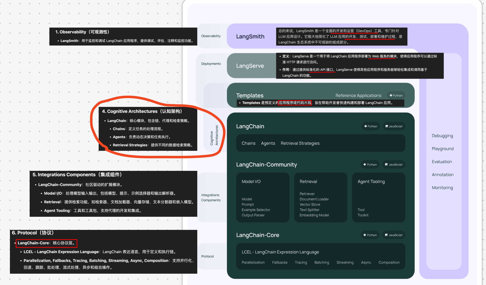

# LangChain（篇一：基础入门篇）

`#langchain` `#ai/agent`  `#2024/09/08` 

## 目录
<!-- toc -->
 ## 1. 简介 

**LangChain** 是一个基于大型语言模型（LLM）开发应用程序的框架。
- 提供了从开发到部署的完整生命周期支持，包括模型 I/O、聊天、函数回调、消息类型、输出解析等核心模块。
- 它通过**开源库和第三方集成**简化了应用程序的构建和生产化过程。
- LangChain 还提供了强大的**工具和组件**，如 LangSmith、LangGraph 和 LangServe，用于调试、测试、评估和部署应用程序

## 2. LangChain 的整体架构图

## 3. 核心模块和工具简介

1. 模型 I/O（Model I/O）：
   - 功能：处理与语言模型的输入和输出。
   - 组件：
     - 提示模板（Prompt templates）：用于结构化输入到语言模型。
     - 语言模型（Language models）：包括对各种 **LLM 提供商**的集成。
     - 输出解析器（Output parsers）：将模型输出转换为结构化格式。
2. 数据连接（Data Connection）：
   - 功能：管理和操作应用程序使用的数据
   - 组件：
     - 文档加载器（Document loaders）：从各种源加载文档。
     - 文档转换器（Document transformers）：处理和转换文档。
     - 文本嵌入模型（Text embedding models）：将文本转换为向量表示。
     - 向量存储（Vector stores）：存储和检索向量化文本。
3. 记忆（Memory）：
   - 功能：管理对话历史和上下文。
   - 类型：
     - 对话缓冲记忆（Conversation buffer memory）
     - 摘要记忆（Summary memory）
     - 长期记忆（Long-term memory）
4. 链（Chains）：
   - 功能：组合多个组件以完成复杂任务。
   - 示例：
     - LLM链（LLM Chain）：将提示模板与语言模型结合。
     - 检索QA链（Retrieval QA Chain）：结合检索和问答功能。
5. 代理（Agents）：
   - 功能：实现动态决策和工具使用。
   - 类型：
     - ReAct 代理：结合推理和行动。
     - 自我提问代理（Self-ask agent）：能够提出和回答自己的问题。
     - 计划和执行代理（Plan and execute agent）：制定计划并执行任务。
6. 回调（Callbacks）：
   - 功能：提供钩子以在链和代理执行期间运行自定义代码。
   - 用途：日志记录、监控、调试等。
7. 索引（Indexes）：
   - 功能：组织和检索大量文本数据。
   - 类型：
     - 向量索引（Vector index）
     - 树索引（Tree index）
8. 检索器（Retrievers）：
   - 功能：从各种数据源检索相关信息。
   - 示例：向量存储检索器、网络检索器。
9. LangChain 表达式语言（LCEL）：
   - 功能：提供声明式方法来组合 LangChain 组件。
   - 优势：简化复杂应用的构建，提高可读性和可维护性。
10. 工具和集成：
    - 功能：提供与各种外部服务和 API 的集成。
    - 示例：搜索引擎、计算器、天气 API 等。
11. LangSmith：
    - 功能：用于调试、测试、评估和监控 LLM 应用。
    - 特点：提供可视化界面、性能分析、版本控制等。
12. LangServe：
    - 功能：将 LangChain 应用部署为 **REST API**。
    - 优势：简化部署过程，提供标准化的接口。
13. LangGraph：
    - 功能：用于构建和管理复杂的**多代理系统**。
    - 用途：创建更复杂、交互式的 AI 应用。

这些核心模块和工具共同构成了 LangChain 的强大生态系统，使开发者能够快速构建、测试和部署复杂的 LLM 应用。它们提供了从数据处理、模型交互到应用部署的全面解决方案，大大简化了 AI 应用开发的复杂性。

通过这些模块和工具，开发者可以：
- 轻松管理与 LLM 的交互
- 高效处理和检索大量数据
- 构建具有记忆和上下文理解能力的应用
- 创建能动态决策和使用工具的智能代理
- 部署和监控生产级 AI 应用

LangChain 的模块化设计允许开发者根据具体需求选择和组合不同的组件，从而构建出灵活且强大的 AI 应用。

## 4. 开发时的语言选择建议

- 如果你的项目主要涉及数据处理、复杂的 AI 模型集成或后端服务，选择 Python 版本可能更合适。
- 如果你正在构建 Web 应用、需要前端集成或希望在浏览器中运行 LLM 应用，JavaScript 版本可能是更好的选择。
- 对于全栈应用，你甚至可以考虑在后端使用 Python 版本，前端使用 JavaScript 版本，以充分利用两者的优势

