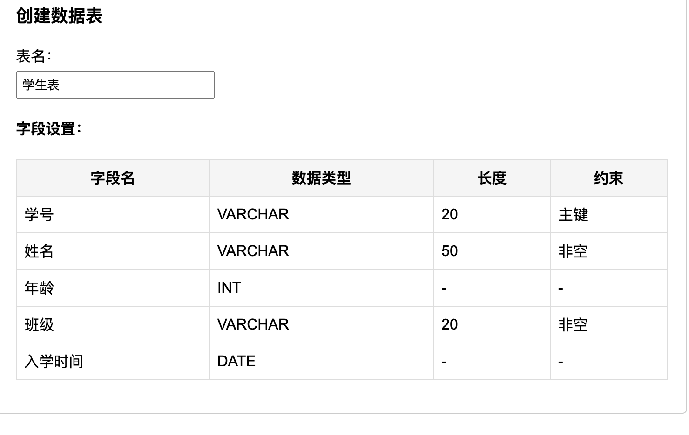
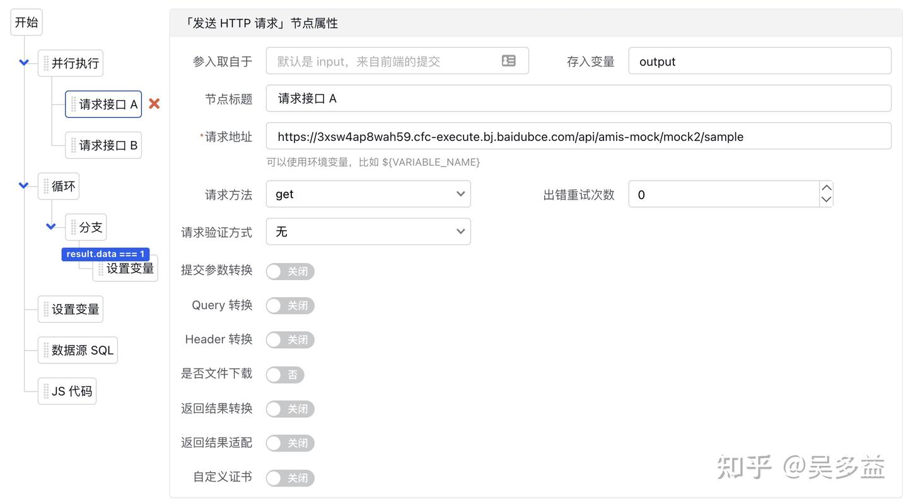
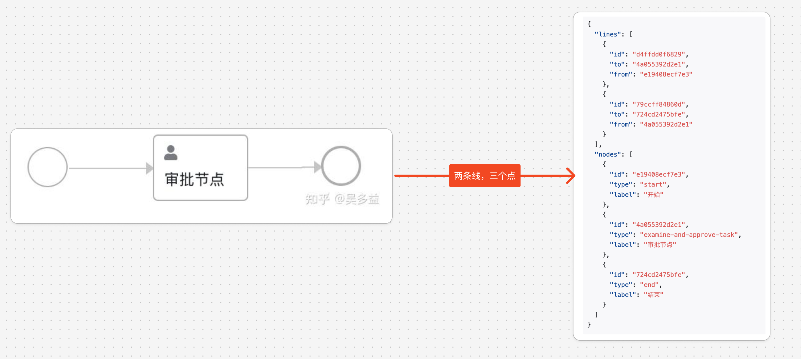

# 低代码篇：原理

`#lowcode`


## 目录
<!-- toc -->
 ## 1. 总结 

本文深入探讨了低代码平台的实现原理，分析了低代码的定义、前端和后端的实现方案，以及低代码的优缺点。文章指出低代码是一种声明式编程，强调其可视化编辑的必要性，并讨论了各种存储和业务逻辑实现方案。

## 2. 低代码的核心

- 低代码的`核心` 是`可视化编辑`，`可视化编辑`是低代码的必要条件
- 需要`声明式代码` 来支持

### 2.1. 为什么不是命令式

- 「声明式」可以直接从展现结果反向推导回源码
- 「命令式」无法做到反向推导

`反向推导`是编辑器必备功能，比如编辑器里的常见操作是点选这个红色区块，然后修改它的颜色，这在 DSL 中很容易实现，但声明式呢，如下，你如何实现呢？

```javascript hl:5
const ctx = canvas.getContext('2d');
ctx.beginPath();
ctx.moveTo(0, 0);
ctx.lineTo(50, 0);
ctx.strokeStyle = '#ff0000';
ctx.lineWidth = 100;
ctx.stroke();
```

换言之，「命令式」代码无法实现`可视化编辑` ，所以只能是 `声明式`

## 3. 常见的声明式

- HTML+CSS 是一种页面展现的 DSL
- SQL 是一种数据查询及处理的 DSL
- K8S 的 yaml 是一种服务部署的 DSL
- NGINX conf 是一种反向代理的 DSL

## 4. 声明式编程的优缺点

### 4.1. 优点

- **容易上手**，因为描述的是结果，语法可以做得简单，非研发也能快速上手 HTML 及 SQL。
- **支持可视化编辑**，微软的 HTML 可视化编辑 FrontPage 在 1995 年就有了，现在各种 BI 软件可以认为是 SQL 的可视化编辑。
- **容易优化性能**，无论是浏览器还是数据库都在不断优化，比如可以自动改成并行执行，这是命令式语言无法自动实现的。
- **容易移植**，容易向下兼容，现在的浏览器能轻松渲染 30 年前的 [HTML](https://link.zhihu.com/?target=http%3A//info.cern.ch/hypertext/WWW/MarkUp/Tags.html)，而现在的编译器没法编译 30 年前的浏览器引擎代码。

### 4.2. 缺点

- **只适合特定领域**
	- 命令式的语言比如 JavaScript 可以用在各种领域
	- 但 HTML+CSS 只适合渲染文档及界面，SQL 只适合做查询
- **灵活性差**
	- 比如 SQL 虽然内置了很多函数，但想只靠它实现业务是远远不够的，有些数据库还提供了用户自定义函数功能（UDF），通过代码来扩展。
- **调试困难**
	- 遇到问题时如缺乏工具会难以排查，如果你在Firefox出现前开发过页面就会知道，由于IE6没有开发工具，编写复杂页面体验很差，遇到问题要看很久代码才发现是某个标签没闭合或者 CSS 类名写错了。
- **强依赖运行环境**，因为声明式只描述结果而不关注实现，因此强依赖运行环境，但这也带来了以下问题：
	- **功能取决于运行环境**，比如浏览器对 CSS 的支持程度决定某个属性是否有人用，虽然出现了CSS Houdini 提案，但 Firefox 和 Safari 都不支持，而且上手成本太高，预计以后也不会流行。
	- **性能取决于运行环境**，比如同一个 SQL 在不同数据库下性能有很大区别。
	- **对使用者是黑盒**，使用者难以知道最终实现，就像很少人知道数据库及浏览器的实现细节，完全当成黑盒来使用，一旦遇到性能问题就不知所措。
	- **技术锁定**，因为即便是最开放的 HTML 也无法解决，很多年前许多网站只支持 IE，现在又变成了只支持 Chrome，微软和 Opera 在挣扎了很多年后也干脆直接转向用 Chromium。同样的即便有 SQL 标准，现在用的 Oracle/SQL Server 应用也没法轻松迁移到 Postgres/MySQL 上。**低代码行业未来也一样，即便出了标准也解决不了锁定问题，更有可能是像[小程序标准](https://link.zhihu.com/?target=https%3A//github.com/w3c/miniapp)那样发展缓慢，功能远落后于微信**。

## 5. 低代码的优缺点

- 低代码的各种优点是「声明式」所带来的。
- 低代码被质疑的各种缺点也是「声明式」所导致的

所以，低代码的优缺点源自声明式编程，易上手但灵活性差。 

## 6. 生成代码的方案算不算低代码？

在讨论各种方案前，有一种方案比较特别，它虽然也有配置规范或 DSL，甚至有可视化编辑，但最终应用运行是通过生成代码的方式实现的，不依赖依赖运行环境。

这个方案最大的优点是可以和专业开发整合，因此灵活性强、可以使用原有的开发流程，本质上和专业开发一样。

但也有如下缺点：

- **强依赖研发**，无法做到给非研发使用，因为后续代码需要编译上线。
- **无法持续可视化编辑**，因为代码无法可视化编辑，生成代码后只要有修改就没法再反向还原成低代码的形式，后续只能代码编辑。
- **难以实现完全用低代码开发应用**
	- 因为不能生成太复杂的代码，使得这种方案一般不包括交互行为，通常是只有前端界面支持可视化编辑。
- **无法做到向下兼容**
	- 因为`生成的那一瞬间`代码依赖的框架版本就固定了，目前还没见过哪款前后前端框架做过到完全向下兼容。

因此我认为生成代码的方案**不算**真正的低代码
- 本质上它还是**一种开发辅助方式**，一种高级点的脚手架工具，和**大部分IDE的生成样板代码能力一样**，使用这种方案无法做到持续可视化开发
- 我还没见过有人将 HTML+CSS 编译成 C++ 代码后二次开发。

## 7. 前端代码实现原理 - 界面渲染

以 amis 为例，**amis 核心原理**是 `将 JSON 转成自研的 React 组件库，然后使用 React 进行渲染`

```json
{
  "type": "page",
  "title": "页面标题",
  "subTitle": "副标题",
  "body": {
    "type": "form",
    "title": "用户登录",
    "body": [
      {
        "type": "input-text",
        "name": "username",
        "label": "用户名"
      }
    ]
  }
}
```

**amis 原理**就是转成了下面这样的 `React 组件树`，最终由各个 React 组件库渲染 HTML 

```jsx
<Page title="页面标题" subTitle="副标题">
  <Form title="用户登录">
    <InputText name="username" label="用户名" />
  </Form>
</Page>
```

### 7.1. 为什么大家几乎全都使用 JSON 

1. 低代码平台编辑器几乎都是基于 Web 实现，JavaScript 可以方便操作 JSON。
2. JSON 可以支持**双向编辑**，它的**读取和写入是一一对应**的。

### 7.2. 为什么不是 YAML

它有引用功能，导致了不好实现双向编辑，还有循环引用等等

### 7.3. JSON 的缺点

- 不支持注释
- 不支持多行字符串
- 语法过于严格，比如不支持单引号，不能在最后多写一个逗号
- 复杂 JSON 不好维护，不好拆解等

## 8. 交互及逻辑处理

目前常见有三种方案

### 8.1. 使用图形化编程

先说结论，局限性很大，本质的原因是「**代码无法可视化**」

可视化的前提条件是什么？

答案是需要具备空间形体特征，可视化只能用来展现二维及三维的物体，因为一维没什么意义，四维及以上大部人无法理解，所以如果一个事物没有形体特征，它就没法被可视化

下面这段代码，虽然只有 10 行代码，却包含了循环、调用函数、类型检测、分支判断、或操作符、递归调用、参数是函数这些抽象概念，这些概念在现实中都找不到形体的，你可以尝试一下用图形来表示这段代码，然后给周围人看看，我相信任何图形化的尝试都会比原本这段代码更难懂，因为你需要先通过不同图形来区分上面的各种概念，其他人`得先熟悉这些图形符号`才能看懂，理解成本反而更高了。

```javascript
function JSONTraverse(json, mapper) {
  Object.keys(json).forEach(key => {
    const value = json[key];
    if (isPlainObject(value) || Array.isArray(value)) {
      JSONTraverse(value, mapper);
    } else {
      mapper(value, key, json);
    }
  });
}

```

哪怕是真能可视化处理，大概率是这样子的 


### 8.2. 固化交互行为

amis 将常用的交互行为固化并做成了配置，比如弹框是下面的配置：

```json hl:4
{
  "label": "弹框",
  "type": "button",
  "actionType": "dialog",
  "dialog": {
    "title": "弹框",
    "body": "这是个简单的弹框。"
  }
}
```

除了弹框之外还有发起请求、打开链接、刷新其它组件等，使用固化交互行为有下面两个优点：
- 可以可视化编辑
- 整合度高，比如弹框里可以继续使用 amis 配置，通过嵌套实现复杂的交互逻辑

但这个方案最大的缺点是灵活性受限，**只能使用 amis 内置的行为**

### 8.3. 使用 JavaScript

一旦写 JavaScript，最大缺点就是无法可视化编辑，因此不算是低代码，需要给专业前端来写了

## 9. 后端低代码的方案

后端低代码需要解决以下三个问题：
- 如何实现`自定义数据存储`？
	- 见下文
- 如何实现`业务逻辑`？
	- 见下文
- 如何实现`流程流转`？
	- 见下文

## 10. 后端低代码的方案：如何自定义数据存储？

低代码平台需要支持用户存储**自定义数据**，因为**每个应用所需的字段是不一样的**。

### 10.1. 方案 1：直接使用关系型数据库

这个方案的原理是将**数据模型的可视化操作转成数据库 DDL**

#### 10.1.1. 这个方案的优点是

- 所有方案里唯一支持`直连外部数据库`，可以对接已有系统。
- 性能高和灵活性强，因为可以使用高级 SQL。
- 开发人员容易理解，因为和专业开发是一样的。

#### 10.1.2. 但它的缺点是

- 需要账号有创建用户及 DDL权限，如果有安全漏洞会造成严重后果，有些公司内部线上帐号没有这个权限，导致无法实现自动化变更。
- DDL 有很多问题无解，比如在有数据的情况下，就不能再添加一个没有默认值的非 NULL 字段。
- DDL 执行时会影响线上性能
	- 比如 MySQL 5.6 之前的版本在一个大数据量的表中添加索引字段会[锁整个表的写入](https://link.zhihu.com/?target=http%3A//download.nust.na/pub6/mysql/doc/refman/5.5/en/create-index.html)
	- 但也有数据库不受影响，比如 TiDB、OceanBase 支持[在](https://link.zhihu.com/?target=https%3A//pingcap.com/zh/blog/tidb-source-code-reading-17)线表结构变更，不会阻塞读写
- 部分数据库不**支持 DDL 事务**，比如 MySQL 8 之前的版本，导致一旦在执行过程中出错将无法恢复。
- 实现成本较高，需要实现「动态实体」功能，如果要支持不同数据库还得支持各种方言

#### 10.1.3. 附：可视化操作如何转换成 数据库 DDL（数据定义语言）的例子

想象你在设计一个学生信息管理系统，我们一步步来看这个过程：

##### 10.1.3.1. 可视化界面设计

假设你在低代码平台上看到的是这样的一个界面：

````mermaid

  classDiagram
    class 学生表 {
        +学号 (主键)
        +姓名
        +年龄
        +班级
        +入学时间
    }
````

##### 10.1.3.2. 表单式操作

在图形界面上，你可能会看到类似这样的表单：



##### 10.1.3.3. 转换过程

当你点击"生成"按钮后，低代码平台会将你的可视化配置转换为数据库DDL语句：

```sql
-- 这是自动生成的建表语句
CREATE TABLE `student` (
  `student_id` VARCHAR(20) PRIMARY KEY,    -- 学号作为主键
  `name` VARCHAR(50) NOT NULL,             -- 姓名，不允许为空
  `age` INT,                               -- 年龄
  `class` VARCHAR(20) NOT NULL,            -- 班级，不允许为空
  `enrollment_date` DATE                   -- 入学时间
) ENGINE=InnoDB DEFAULT CHARSET=utf8mb4;
```

##### 10.1.3.4. 让我解释这个转换过程

1. **就像填表格一样**
   - 你不需要记住复杂的SQL语法
   - 只需要在表格中填写：
     * 想要什么字段（例如：学号、姓名）
     * 字段类型（例如：文本、数字、日期）
     * 是否必填
     * 是否是主键
2. **自动翻译**
   - 低代码平台就像一个翻译器
   - 把你填写的表格信息自动转换成数据库能理解的语言（SQL）
   - 例如：
     * 当你选择"主键"时，系统会添加 `PRIMARY KEY`
     * 当你选择"必填"时，系统会添加 `NOT NULL`
3. **智能处理**
   - 自动添加合适的数据类型
   - 自动处理字符编码
   - 自动添加必要的数据库设置
4. **就像使用模板**
   - 你在填表时不需要考虑技术细节
   - 系统会根据预设的模板生成标准的数据库代码
这种方式的优点是：
1. 不需要记忆复杂的SQL语法
2. 减少人为错误
3. 保证生成的代码符合标准
4. 可以快速修改和调整
5. 适合非技术人员使用

通过这种可视化的方式，即使不懂SQL的人也能轻松创建数据库表，大大降低了数据库设计的门槛。

### 10.2. 方案 2：使用文档型数据库

比如 MongoDB，缺点是
- 无法支持外部数据库，数据是孤岛，外部数据接入只能通过导入的方式。
- MongoDB 在国内发展缓慢，接受度依然很低，目前还没听说有哪家大公司里最重要的数据存在 MongoDB 里，一方面有历史原因，另一方面不少数据库都开始支持 JSON 字段，已经能取代大部分必须用 MongoDB 的场景了。
- 不支持高级 SQL 查询

它的**最大特点**是界面编辑和数据存储是统一的，当你拖入文本框到页面后就会自动创建对应的字段，**不需要先创建数据模型再创建界面**，因此用起来更简单

现在 MySQL、Postgres 等数据库都支持 JSON 字段类型了，是否可以用这个字段来实现低代码？
- 答案是不太行，因为
	- 只适合数据量不大的场景
	- 不能创建索引：虽然 JSON 字段可以用来存用户自定义数据，但无法创建字段索引，比如在 MySQL 要想给 JSON 创建索引

### 10.3. 方案 3： 使用行代替列

这是很多可扩展平台里使用的技术，比较典型的是 `WordPress`，它的扩展性很强，装个扩展就能变成电商网站

```sql
CREATE TABLE wp_postmeta (
  meta_id bigint(20) unsigned NOT NULL auto_increment,
  post_id bigint(20) unsigned NOT NULL default '0',
  meta_key varchar(255) default NULL,
  meta_value longtext,
  PRIMARY KEY  (meta_id),
  KEY post_id (post_id),
  KEY meta_key (meta_key)
) DEFAULT CHARACTER SET utf8 COLLATE utf8_general_ci;
```

其中的关键就是 `meta_key` 和 `meta_value` 这两个字段，相当于将数据库当 KV 存储用了，因此可以任意扩展字段名及值。

这个方案主要用于成熟项目的扩展，比如在 CRM 产品中允许用户扩展字段，但因为**性能较低**，并不适合通用低代码平台。

### 10.4. 方案 4：元信息+宽表

早期数据库不支持 JSON 字段的时候，有些开发者会预留几个列来给用户扩展自定义属性，比如在表里加上 ext1、ext2、ext3 字段，让用户可以存 3 个定制数据，基于这个原理我们可以进一步扩展，通过预留大量列来实现应用自定义存储。

实现它有两个关键点：**元数据、预留列**，这里简单说明一下原理，首先系统预先创建一个 500 列的表，比如就叫 data：

|tenant_id|table_id|uuid|value0|value1|...|value 4000|
|---|---|---|---|---|---|---|
|||||||

要完全实现这个方案还有很多细节问题得解决，不展开了

这个方案比前面几个方案的优点是：
- 比起第一种原生数据库表方案，它不需要 DDL 操作，不容易出问题，跟适合 SaaS 产品。
- 比起第二种文档型数据库方案，它的存储使用更为成熟的关系型数据库，相关的运维工具多。
- 比起第三种行代替列方案，它的查询性能好，因为是读取一行数据。

缺点也比较多
- 数据泄露风险高，因为所有租户的数据都存在一张表里，而数据库都不支持行级别权限的账号
- **整体实现成本高**，其中很多细节需要处理好，比如保证数据一致性，因为为了实现唯一性、索引等功能需要拷贝数据，更新的时候要同时更新。

我认为这个方案虽然很适合 **SaaS 类的低代码产品** ，但国内的 SaaS 环境，还是放弃吧

### 10.5. 方案 5：使用单文件

这个方案目前只在「仿 Excel」的零代码平台中见过，它和 Excel 类似，数据全都放一个文件里，查询过滤完全靠前端，优点是：

- 实现简单，部署成本低，因为表的存储就是单文件。
- 容错性强，数据类型都是靠前端处理的，不会出现存数据库导致。

缺点是：
- 如果要支持行列级别权限校验，还得在后端实现一遍过滤，而每次都加载一个巨大的 JSON 文件对服务器内存有较高要求。
- 难以支持事务操作，尤其是支持行级别的操作。
- 目前看十万级别数据处理可以只靠前端，但再大量的数据就不合适了，一次性加载太多对带宽和浏览器内存要求比较高。
- 只能当成 Excel 的替代品，数据是孤岛，不能直连外部数据库

## 11. 后端低代码的方案：如何实现后端业务逻辑

大概有这几种方案：
- 逻辑图形化，这个目前看各个产品效果都不太理想，看上去还不如代码易读
	- 前面提过代码难以图形化，这在后端也是一样的
- 固定行为，主要是对数据存储提供`增删改查`操作
- 支持 JavaScript 自定义
- 简化 DSL 语言，类似 Excel 中的公式
- 执行树

### 11.1. 后端支持使用 JavaScript

主要原因是 JavaScript 引擎容易被嵌入，而且启动速度快，了解的人多，比如市值超过 1200 亿美元的 ServiceNow 后端自定义业务逻辑就是基于 `Rhino 引擎`实现的。

### 11.2. 简化 DSL 语言，类似 Excel 中的公式

`简化 DSL 语言`的主要是使用场景是做`表达式计算` ，

其实用公式会比 JavaScript 会更简单，因为系统可以自动转换数据类型，并自动处理异步函数的调用

### 11.3. 执行树



左侧是树形结构，右侧是点中某个节点时的参数配置，左侧的树形结构其实是直接参考代码的树形结构：
- 默认从上往下执行，但有个特殊的「并行执行」节点可以并行执行。
- 对于循环和分支会创建子节点，并且子节点可以无限嵌套，相当于代码里的花括号。
- 节点可以折叠，这样就能先将复杂的逻辑折叠起来方便看主流程，这是使用图模式难以实现的，在图里收起后无法修改其它节点的位置，导致空出一块。

为了方便实现简单逻辑处理，我们还增加了 `JavaScript 节点`和 `SQL 节点`。

但执行树这个方案目前的定位是**聚合多接口**，将多个后端接口数据合并后给前端

## 12. 后端低代码的方案：如何实现流程流转？



BPMN 不能解决平台锁定问题，在一个平台开发的流程无法直接迁移到另一个平台。

虽然目前业界有开源的流程引擎，但这些引擎大多是`面向代码开发`，不太好改造成`平台模式`，因此在爱速搭里自己实现了流程引擎，这样才能更好定制功能。

## 13. 低代码的未来

- 低代码唯一不可缺少的功能是`可视化编辑`，这是低代码的`最大优势`，
- 但低代码的**最大缺陷**，是`可视化`难以表达复杂的抽象逻辑
- 因此长远看低代码并不会在所有领域取代专业开发，更多是**和专业开发配合来提升效率**。

从技术方案上看低代码平台主要有两个方向：

- 偏向零代码的方案，它的特点是
	- 易用性强
	- 灵活性差
	- 适合小公司，客单价低，但客户数多
	- 标准化程度高，导致功能都很类似，将面临同质化竞争
	- 产品使用简单，客户支持成本低
- 偏向专业开发的方案，它的特点是
	- 易用性弱
	- 灵活性强
	- 适合中大型公司，客户数少，但客单价高
	- 标准化程度低，每家都有各自的特点
	- 产品使用复杂，客户支持成本高

零代码产品有好几种形态，和去年一样，我更看好「**在线 Excel**」，因为既然是面向非开发者，类 Excel 是上手成本最低的方案，而且这一年来许多「在线 Excel」的产品**都加上了低代码功能**
- 比如 Airtable 的 [Interface](https://link.zhihu.com/?target=https%3A//blog.airtable.com/interfacebuilder/)，在功能上和表单驱动的零代码越来越接近了。
- 又比如 **飞书的多维表格** 

## 14. 参考

- https://zhuanlan.zhihu.com/p/451340998