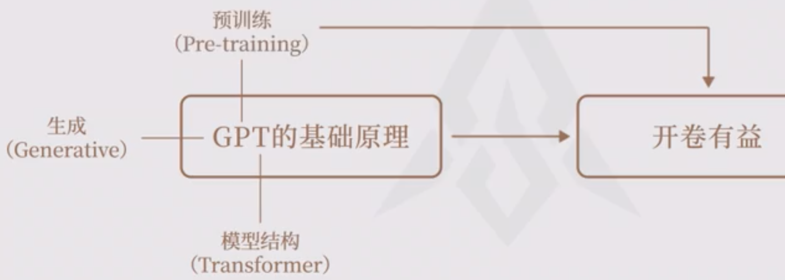

# chatGPT 是什么（篇一）

`#AI`  `#chatGPT`  `#agi`  

## 目录
<!-- toc -->
 ## 1. chatGPT是如何回答问题的？   

### 1.1. 自回归生成

举个例子：输入`我`，最终返回 `我是一字小小鸟` ，看看大模型的生成过程：

- 第一次
	- 输入：我
	- 输出：我是
- 第二次
	- 输入：我是
	- 输出：我是一
- 第三次
	- 输入：我是一
	- 输出：我是一只

### 1.2. 不同的模型影响

### 1.3. 两个鹦鹉🦜模型

### 1.4. 学习材料的影响

### 1.5. GPT 的学习能力（泛化能力）

### 1.6. 大模型与数据库的对比

## 2. GPT 的三个训练阶段

### 2.1. 无监督学习：开卷有益

### 2.2. 监督学习：模板规范

### 2.3. 意外收获（涌现）

有了理解能力，比如，知道**事后诸葛亮**了

### 2.4. 强化学习：创意引导

## 3. 总结：GPT 的基础原理

