# chatGPT 是什么（篇一）

`#AI`  `#chatGPT`  `#agi`  

## 目录
<!-- toc -->
 ## chatGPT是如何回答问题的？ 

### 自回归生成

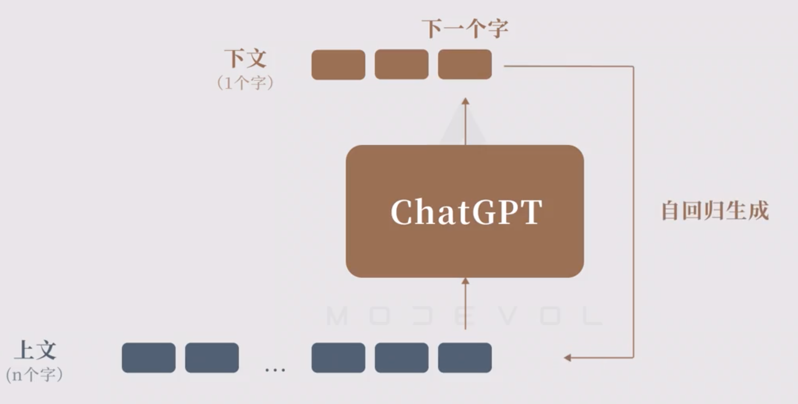

举个例子：输入`我`，最终返回 `我是一字小小鸟` ，看看大模型的生成过程：

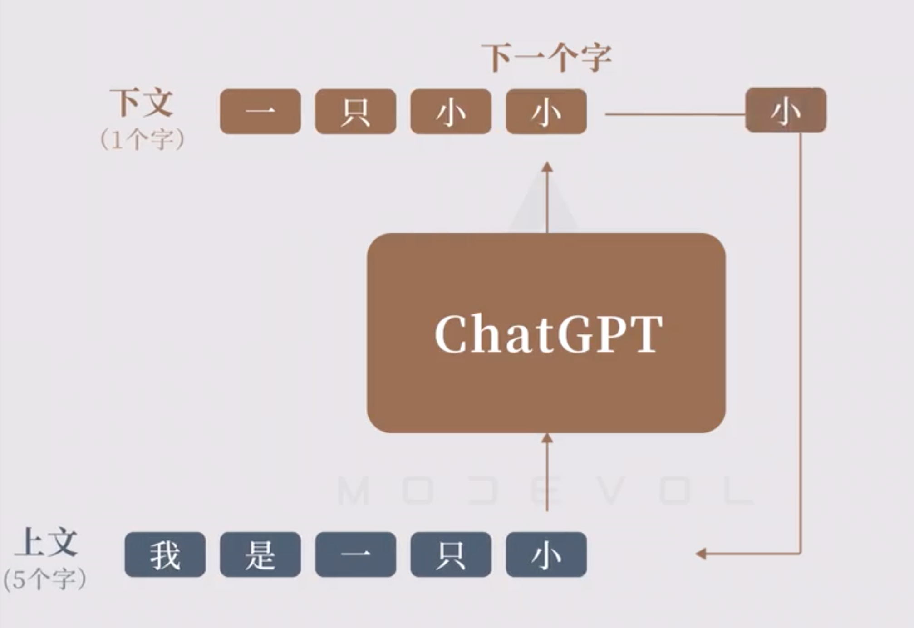

- 第一次
	- 输入：我
	- 输出：我是
- 第二次
	- 输入：我是
	- 输出：我是一
- 第三次
	- 输入：我是一
	- 输出：我是一只

### 不同的模型影响

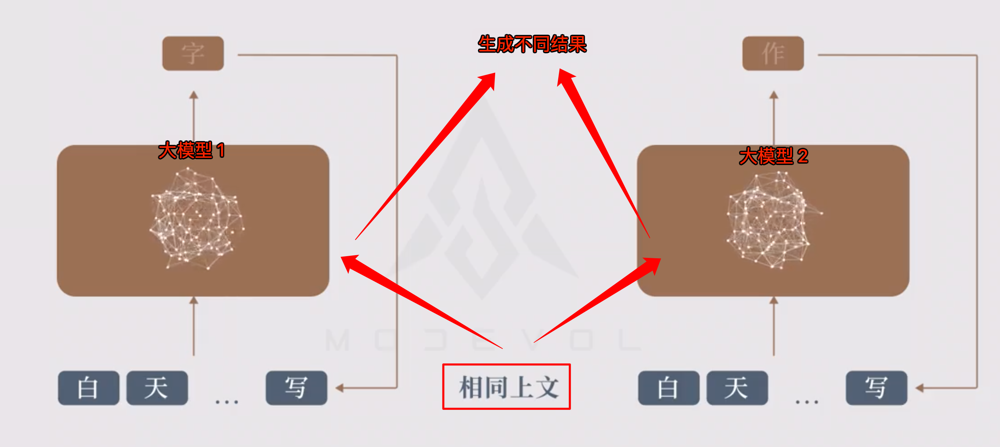

### 两个鹦鹉🦜模型

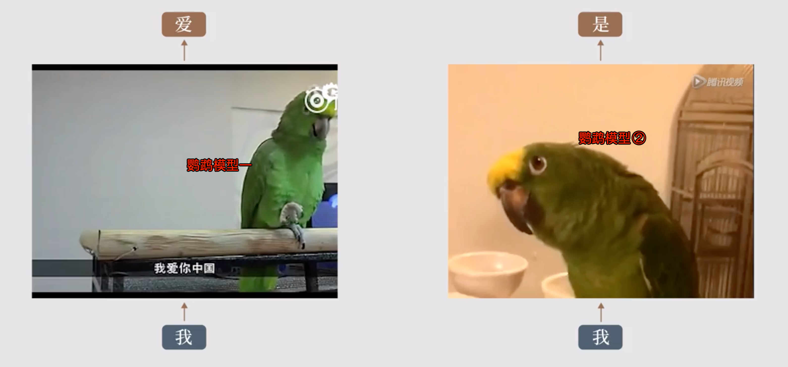

### 学习材料的影响

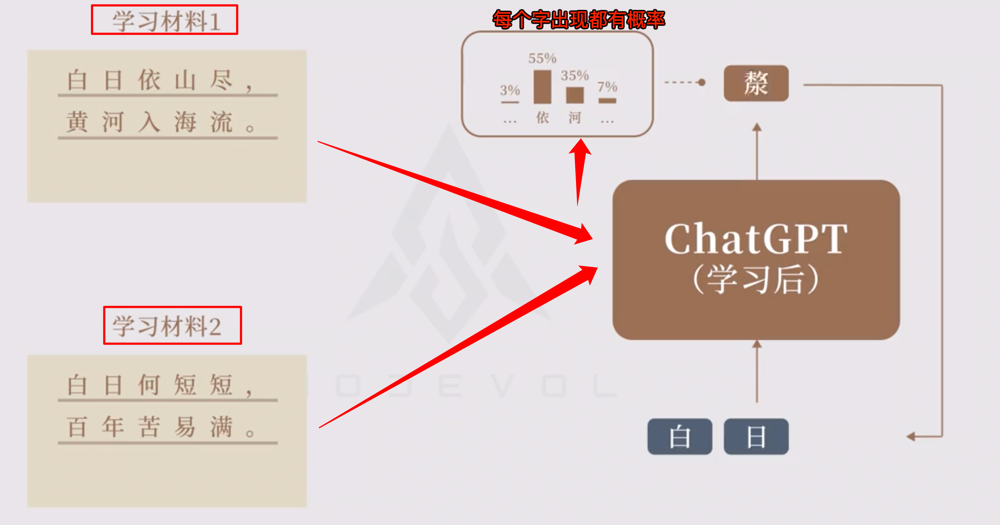

### GPT 的学习能力（泛化能力）

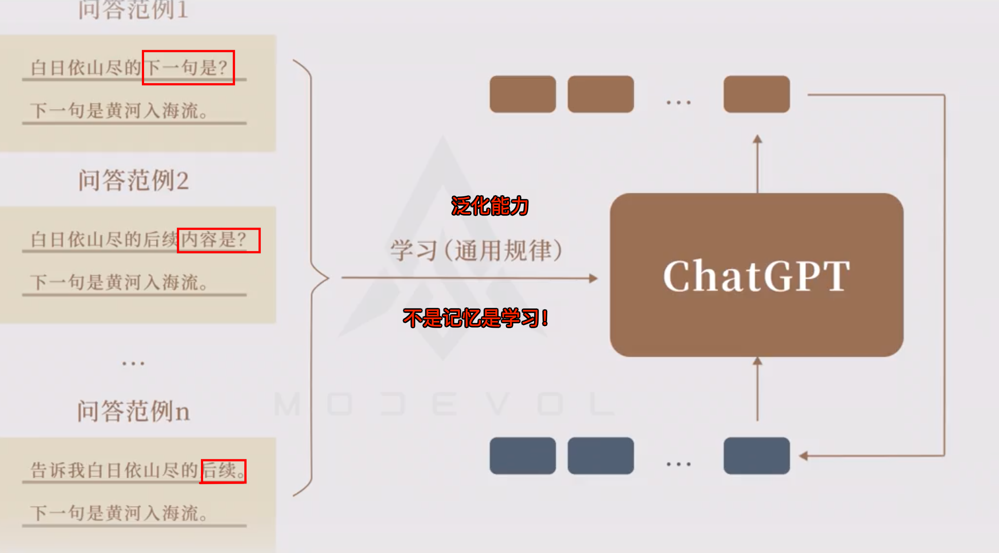

### 大模型与数据库的对比

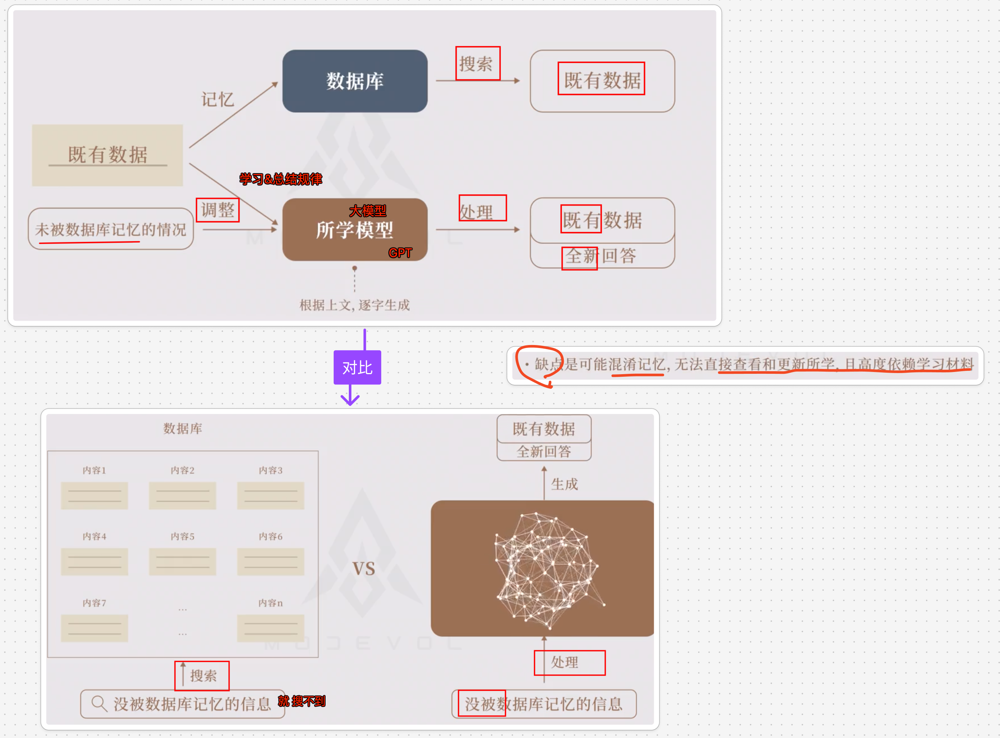

## GPT 的三个训练阶段

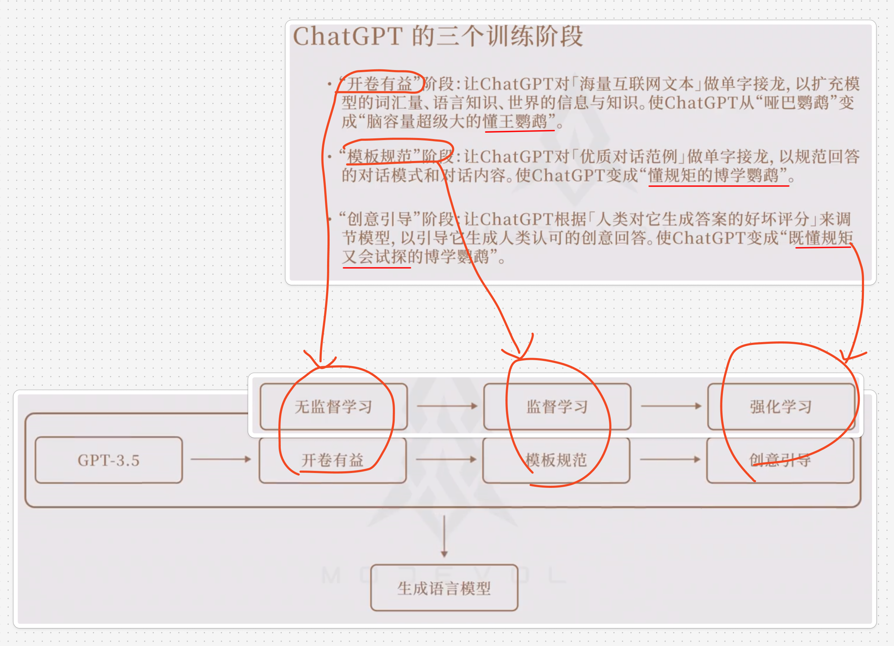

### 无监督学习：开卷有益

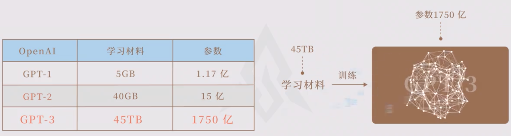

### 监督学习：模板规范

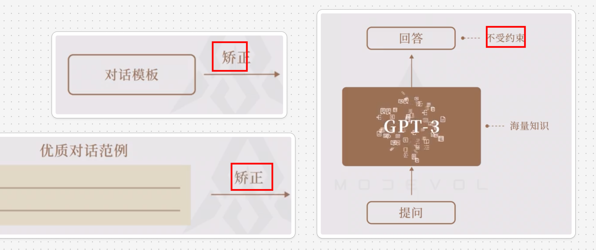

### 意外收获（涌现）

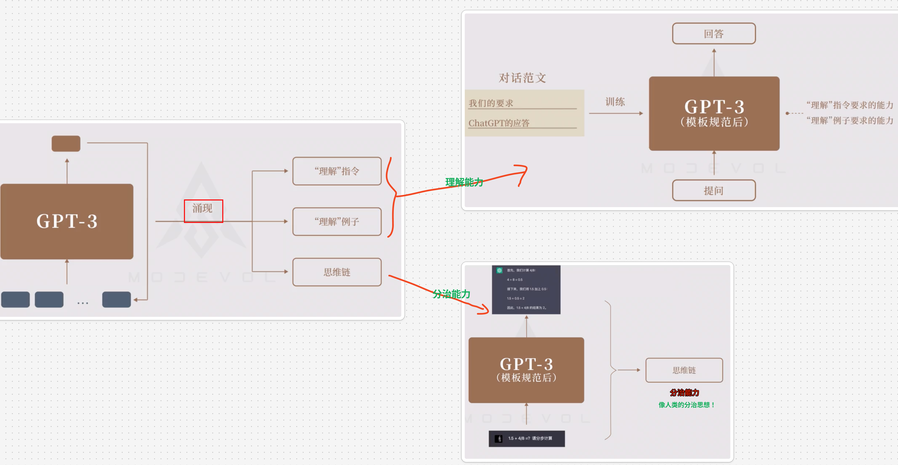

有了理解能力，比如，知道**事后诸葛亮**了

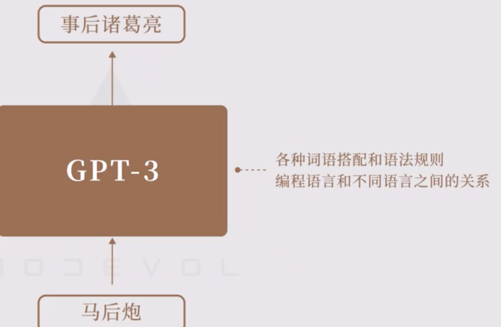

### 强化学习：创意引导

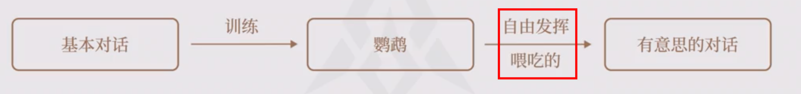

## 总结：GPT 的基础原理

