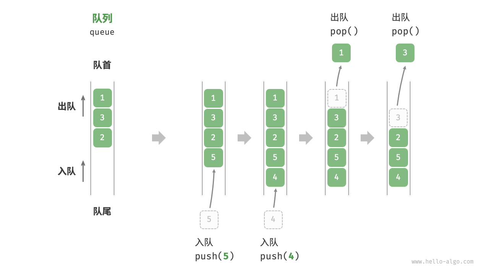
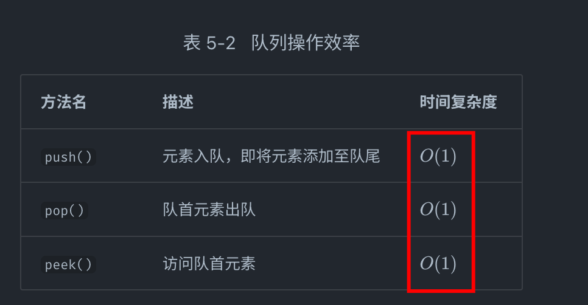
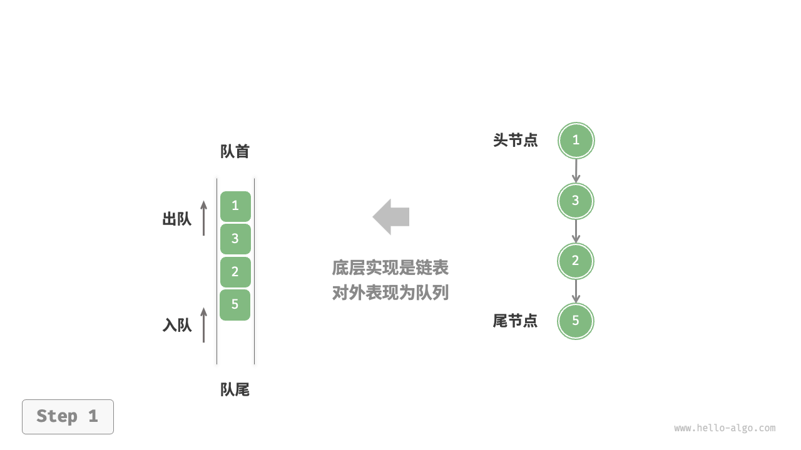
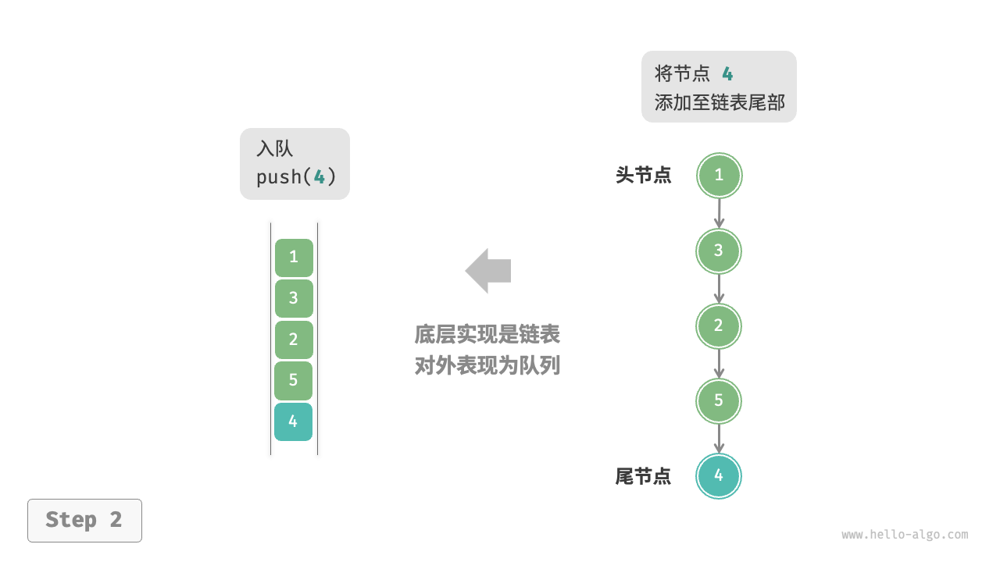
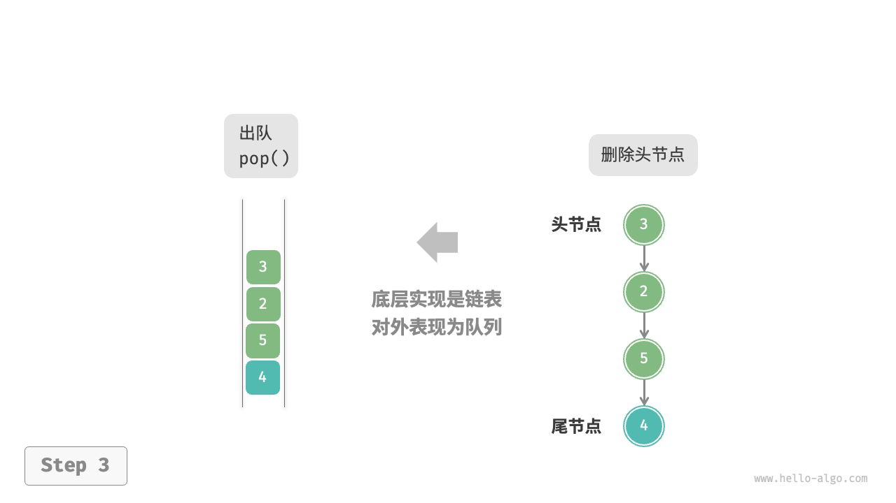
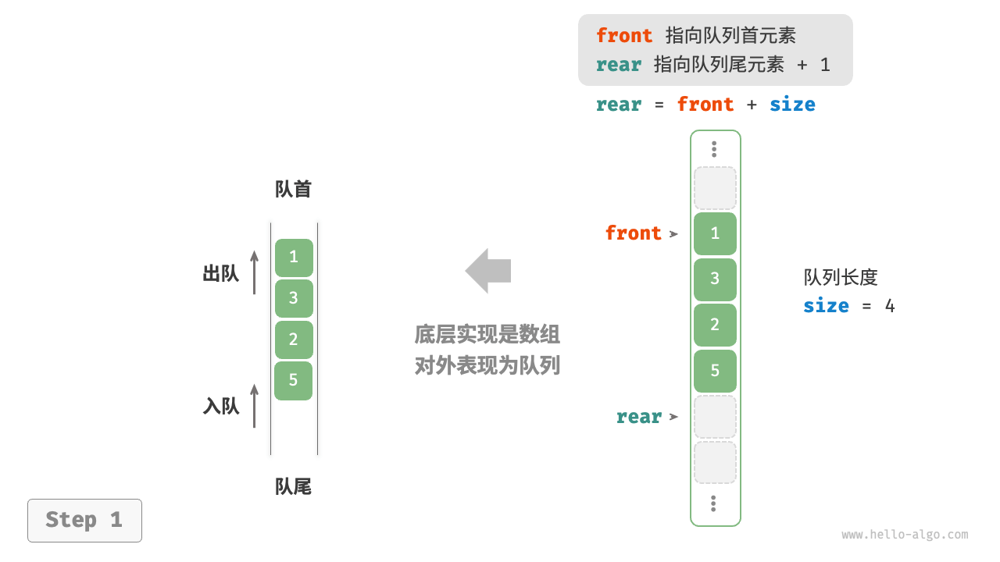

# 列队：Python 描述

`#列队` `#算法/列队` `#数据结构/列队`  `#环形数组`


## 目录
<!-- toc -->
 ## 1. 定义 



## 2. 列队的常用操作



> JavaScript 的**入队**操作是是 `push`  ，**出队**操作是 `shift`

## 3. 基于链表的实现



入队 


出队



### 3.1. 完全实现
```python
"""节点类: 用于构造链表节点"""
class ListNode:
    def __init__(self,val:int) -> None:
        # 节点值
        self.val = val
        # listNode | Node 代表 self.next 的值可能是 listNode | Node
        self.next:ListNode | None = None

# 基于链表的队列
class linkedQueue:
    def __init__(self):
        # 队列的头
        self.head = None
        # 队列的大小
        self.sz = 1

    # 返回队列的大小
    def size(self):
        return self.sz

    # 判断队列是否为空
    def isEmpty(self):
        return self.sz == 0

    # 入队
    def enqueue(self, val):
        # 创建一个新节点
        node = ListNode(val)
        # 如果队列为空
        if self.head is None:
            self.head = node
        # 如果队列不为空
        else:
            # 将新节点插入到队列的尾部 【底部】
            p = self.head
            while p.next is not None:
                p = p.next
            p.next = node
        self.sz += 1

    # 出队
    def dequeue(self):
        if self.isEmpty():
            raise Exception("queue is empty")
        # 保存队头元素
        item = self.head
        # 删除队头元素
        # 直接将 head 指向下一个元素即可
        # 但是要注意，如果 head 是 None，就不需要再指向下一个元素了
        # 因为 head 是 None 说明队列为空，没有下一个元素了
        # 所以这里需要判断一下 head 是否是 None
        if self.head is not None:
            self.head = self.head.next
        self.sz -= 1
        return item

    # 返回队头元素
    def peek(self):
        if self.isEmpty():
            raise Exception("queue is empty")
        return self.head
```

### 3.2. 基于 deque 的实现

```python
from collections import deque

# 用链表作为底层数据结构实现队列
# Python 的 deque 就是双链表
class MyLinkedQueue:
    def __init__(self):
        self.list = deque()

    # 向队尾插入元素，时间复杂度 O(1)
    def enqueue(self, e):
        self.list.append(e)

    # 从队头删除元素，时间复杂度 O(1)
    def dequeue(self):
        # 使用双端队列的 popleft 方法
        # 即从队头删除元素
        # popleft 代表从左边删除元素
        return self.list.popleft()

    # 查看队头元素，时间复杂度 O(1)
    def peek(self):
        return self.list[0]

    # 返回队列中的元素个数，时间复杂度 O(1)
    def size(self):
        return len(self.list)

```

## 4. 基于数组的实现



### 4.1. 先看下环形数组技巧

> [!danger]
> 环形数组技巧利用求模（余数）运算，将普通数组变成逻辑上的环形数组，可以让我们**用 `O(1)` 的时间在数组头部增删元素**

先看个示例，把数组循环打印

```python
arr = [1, 2, 3, 4, 5]

# 循环打印列表，当打印完成后，继续打印列表，一直循环
i = 0
while i < len(arr):
    print(arr[i])
    # 当 i 等于列表的最后一个元素时，将 i 设置为 0
    # 求模运算 %，也就是求余数
    # 当 i 到达数组末尾元素时，i + 1 和 arr.length 取余数又会变成 0，即会回到数组头部
    # 这样就在逻辑上形成了一个环形数组，永远遍历不完
    i = (i + 1) % len(arr)

```

#### 4.1.1. 比较复杂的版本：考虑扩容等

> [!danger]
> 知道就行，没必要，Python 内置的很多内容足够用了，不需要实现

>  `[start, end)` 注意区间
```python
class CycleArray:
    def __init__(self, size: int) -> None:
        # 数组容量
        self.capacity = size
        # 数组,初始化为 None
        self.arr = [None] * size
        # start 指针 指向第一个有效元素的索引
        self.start = 0
        # end 指针 指向最后一个有效元素的下一个位置索引
        self.end = 0
        self.count = 0

    def resize(self, newSize):
        # 创建新数组
        new_arr = [None] * newSize
        # 将原数组的元素复制到新数组
        for i in range(self.count):
            new_arr[i] = self.arr[(self.start + i) % self.capacity]
        # 更新数组
        self.arr = new_arr
        # 更新 start 指针
        self.start = 0
        # 更新 end 指针
        self.end = self.count
        # 更新容量
        self.capacity = newSize

    # 在队头添加元素
    def add_first(self, val):
        # 如果队列已满，扩容 2 倍
        if self.is_full():
            self.resize(self.capacity * 2)
        # 因为 start 是闭区间，所以先左移，再赋值
        self.start = (self.start - 1 + self.capacity) % self.capacity
        self.arr[self.start] = val
        self.count += 1
    # 删除队头元素
    def remove_first(self):
        if self.is_empty():
            raise Exception("Array is empty")
        self.arr[self.start] = None
        self.start = (self.start + 1) % self.capacity
        self.count -= 1
        if self.count > 0 and self.count == self.capacity // 4:
            self.resize(self.capacity // 2)

    def add_last(self, val):
        if self.is_full():
            self.resize(self.capacity * 2)
        self.arr[self.end] = val
        self.end = (self.end + 1) % self.capacity
        self.count += 1

    def remove_last(self):
        if self.is_empty():
            raise Exception("Array is empty")
        self.end = (self.end - 1 + self.capacity) % self.capacity
        self.arr[self.end] = None
        self.count -= 1
        if self.count > 0 and self.count == self.capacity // 4:
            self.resize(self.capacity // 2)

    def get_first(self):
        if self.is_empty():
            raise Exception("Array is empty")
        return self.arr[self.start]

    def get_last(self):
        if self.is_empty():
            raise Exception("Array is empty")
        return self.arr[(self.end - 1 + self.capacity) % self.capacity]

    def is_full(self):
        return self.count == self.capacity

    def size(self):
        return self.count

    def is_empty(self):
        return self.count == 0

```

#### 4.1.2. 使用 deque：最好的方式

```python
from collections import deque

# 创建一个最大长度为 5 的环形数组
circular_array = deque(maxlen=5)

# 添加元素
for i in range(7):
    circular_array.append(i)
    print(f"After appending {i}: {list(circular_array)}")
    
# 输出：
# After appending 0: [0]
# After appending 1: [0, 1]
# After appending 2: [0, 1, 2]
# After appending 3: [0, 1, 2, 3]
# After appending 4: [0, 1, 2, 3, 4]
# After appending 5: [1, 2, 3, 4, 5]
# After appending 6: [2, 3, 4, 5, 6]
    
# 从左侧添加元素
circular_array.appendleft(10)
print(f"After appendleft 10: {list(circular_array)}")
# 输出：After appendleft 10: [10, 2, 3, 4, 5]
```

### 4.2. 使用 deque 实现列队：最佳方案

```python
from collections import deque

# 用deque 来实现队列
class MyQueue:
    def __init__(self):
        self.list = deque()

    # 向队尾插入元素，时间复杂度 O(1)
    def enqueue(self, e):
        self.list.append(e)

    # 从队头删除元素，时间复杂度 O(1)
    def dequeue(self):
        return self.list.popleft()

    # 查看队头元素，时间复杂度 O(1)
    def peek(self):
        return self.list[0]

    # 返回队列中的元素个数，时间复杂度 O(1)
    def size(self):
        return len(self.list)

```

## 5. 再看下环形数组

### 5.1. 实现方式

1. 对于大多数情况，`collections.deque` 是最佳选择，因为它是 Python 标准库的一部分，性能好，使用简单。
2. 如果你需要更多的控制或者想要理解环形数组的工作原理，可以自己实现一个简单的版本。
3. 对于特殊需求，比如需要进行大量数值计算，可以考虑使用 **NumPy**。
4. 如果需要更专门的**环形缓冲区**实现，可以考虑使用第三方库如 **CircularBuffer**。

### 5.2. 使用场景

1. 缓冲区管理
    - 音频和视频流处理：在处理连续的音频或视频数据时，环形缓冲区可以用来存储最近的一段数据，便于**回放或处理**。
    - 网络数据包处理：网络设备可以使用**环形缓冲区**来临时存储接收到的数据包，等待处理。
2. 任务调度
    - 操作系统的进程调度：**操作系统可以使用环形数组来实现轮转调度算法**，循环分配CPU时间给不同的进程。
    - **定时任务**管理：在需要周期性执行任务的系统中，环形数组可以用来管理这些任务的执行顺序。
3. 数据流处理
    - 滑动窗口算法：在处理时间序列数据时，环形数组可以高效地实现滑动窗口，用于计算移动平均等指标。
    - 实时数据分析：保存**最近N个数据点**进行实时分析和统计。
4. 游戏开发
    - 回放功能：在游戏中实现最近N秒的即时回放功能。
    - 循环地图：一些2D游戏中的无限循环地图可以用环形数组来实现。
5. 内存管理
    - 内存分配器：某些内存分配算法使用环形数组来管理内存块。
6. 通信系统
    - 消息队列：在生产者-消费者模型中，环形缓冲区可以用作消息队列。
7. 历史记录管理
    - 命令历史：保存用户最近执行的N个命令，以便快速访问。
    - 浏览器历史：管理浏览器的前进/后退功能。
8. 数据压缩
    - LZ77等压缩算法：在某些数据压缩算法中，环形缓冲区用于存储最近处理过的数据。
9. 实时系统
    - 传感器数据处理：在实时系统中，环形缓冲区可以用于存储和处理来自传感器的连续数据流。
10. 数据库系统
    - 日志管理：某些数据库系统使用环形缓冲区来管理事务日志。

## 6. 列队的使用场景

- 任何需要实现“先来后到”功能的场景，例如打印机的任务队列、餐厅的出餐队列等，队列在这些场景中可以有效地维护处理顺序。
- 又比如购物者下单后，订单将加入队列中，系统随后会根据顺序处理队列中的订单
