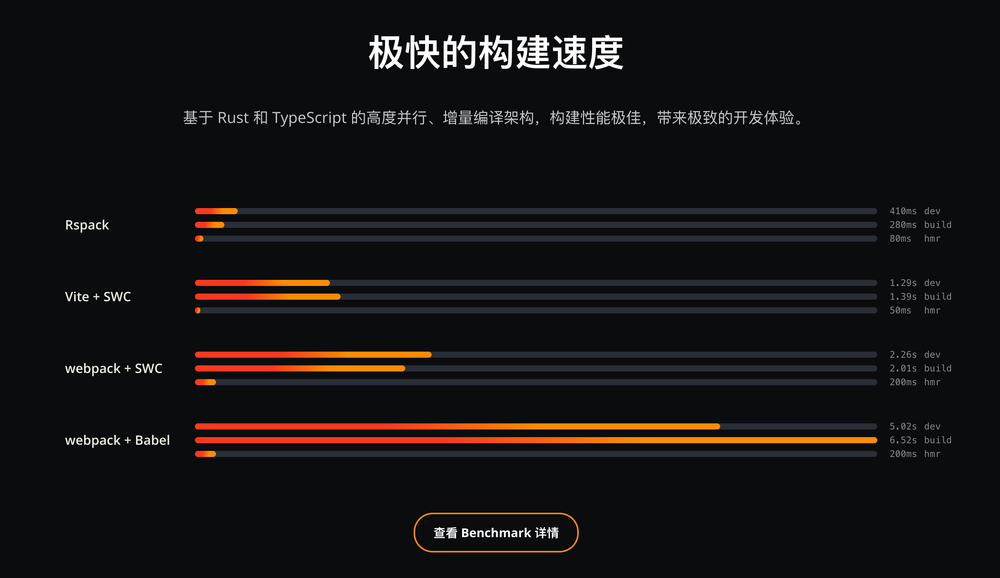
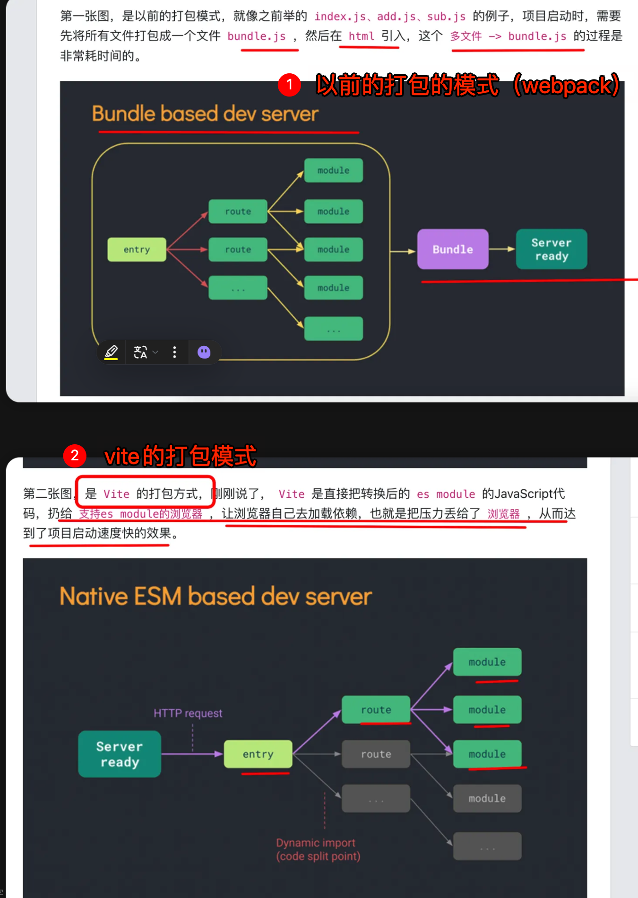

# 主流的前端构建工具

`#webpack` 


## 目录
<!-- toc -->
 ## 1. 总结 

- Rspack
	- 基于 Rust 
	- 兼容 webpack
- Vite
	- unbundle 的代表
		- 开发环境使用原生 ESM，启动速度快
	- 开发环境使用 esbuild
	- 生成使用 rollup
- Turbopack
	- Rust 编写
	- 与 Next.js 深度集成
	- 做到函数级别缓存
- esbuild
	- 用 Go 语言编写
	- vite 依赖它
- Webpack 5
	- 最成熟的解决方案，生态好
	- 大型项目==慢==
- Parcel
	- 零配置
- SWC (Speedy Web Compiler)
	- 用 Rust 编写的超快的 TypeScript/JavaScript 编译器
	- 比 Babel 快 20 倍

## 2. Rspack

- 基于 Rust 的高性能 Web 打包工具
- 使用兼容 API 无缝替换 webpack


> 没实际生产中用过

## 3. Vite

1. 开发环境使用原生 ESM，启动速度快
2. 生产环境使用 Rollup 构建
3. 内置对 TypeScript、JSX、CSS 等的支持
4. 优秀的 HMR 性能

### 3.1. 为什么 vite HMR 性能比较好



## 4. Turbopack (Next.js 13 的构建工具)

`Turbopack` 是 `Vercel` 推出的新一代打包工具，使用 Rust 编写。

```javascript
// next.config.js
module.exports = {
  experimental: {
    turbo: {
      loaders: {
        // 自定义加载器配置
        '.png': ['file-loader'],
        '.svg': ['@svgr/webpack']
      },
      resolveAlias: {
        '@': path.resolve(__dirname, 'src')
      }
    }
  }
}
```

主要特点：

1. 极快的构建速度（声称比 Vite 快 10 倍）
2. 增量计算
3. 与 Next.js 深度集成
4. 内存缓存优化

## 5. esbuild

超快的 JavaScript 打包器，用 Go 语言编写。

主要特点：
1. 极致的构建速度
2. 支持 TypeScript 和 JSX
3. 体积小，无依赖
4. API 简单直观

## 6. Rollup

面向 ESM 的专业打包工具。

主要特点：
1. 优秀的 Tree-shaking
2. 支持多种输出格式
3. 插件生态丰富
4. 适合库的打包

## 7. Webpack 5

仍然是最成熟的解决方案。

主要特点：
1. 功能最完整
2. 生态系统最大
3. 配置灵活
4. 支持模块联邦

## 8. Parcel

零配置的构建工具。

```javascript
// package.json
{
  "source": "src/index.html",
  "scripts": {
    "start": "parcel",
    "build": "parcel build"
  }
}
// 可选的 .parcelrc 配置
{
  "extends": "@parcel/config-default",
  "transformers": {
    "*.{ts,tsx}": ["@parcel/transformer-typescript-tsc"]
  }
}
```

主要特点：
1. 零配置
2. 自动安装依赖
3. 多核并行处理
4. 内置优化功能

## 9. SWC (Speedy Web Compiler)

用 Rust 编写的超快的 TypeScript/JavaScript 编译器。

```javascript
// .swcrc
{
  "jsc": {
    "parser": {
      "syntax": "typescript",
      "tsx": true
    },
    "transform": {
      "react": {
        "runtime": "automatic"
      }
    },
    "target": "es2015"
  },
  "minify": true
}
```

主要特点：
1. 比 Babel 快 20 倍
2. 可作为其他构建工具的编译器
3. 支持 TypeScript 和 JSX
4. 提供独立的 CLI 工具

## 10. 构建工具对比

| 工具        | 开发体验 | 构建速度 | 配置复杂度 | 生态系统 | 适用场景        |
| --------- | ---- | ---- | ----- | ---- | ----------- |
| Vite      | 极佳   | 快    | 低     | 良好   | **现代Web应用** |
| Turbopack | 极佳   | 极快   | 中     | 发展中  | Next.js项目   |
| esbuild   | 好    | 极快   | 低     | 一般   | 简单项目/工具库    |
| Rollup    | 好    | 中等   | 中     | 丰富   | 库开发         |
| Webpack   | 好    | 中等   | 高     | 最丰富  | 复杂应用        |
| Parcel    | 极佳   | 快    | 极低    | 一般   | 小型项目        |
| SWC       | 好    | 极快   | 低     | 发展中  | 编译器/工具链     |

