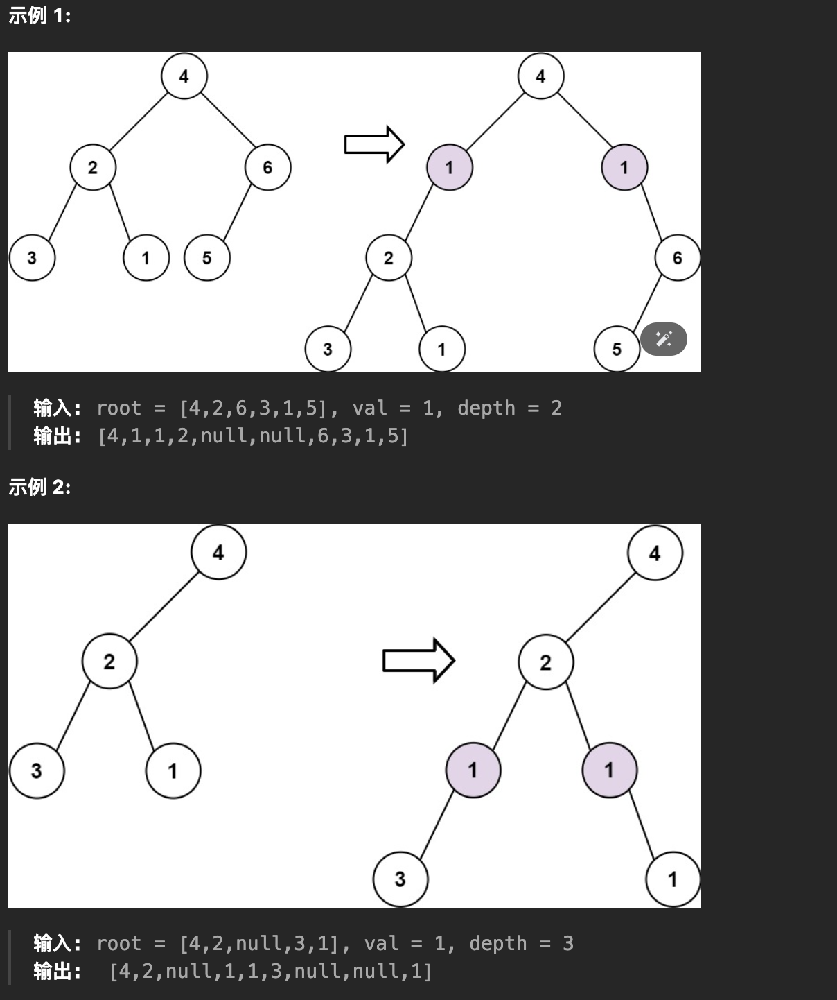

# 在二叉树中增加一行


> [623. 在二叉树中增加一行](https://leetcode.cn/problems/add-one-row-to-tree/)



- 用 `traverse` 函数遍历到对应行，进行插入即可
	- base case：目标层数是 1 时，特殊处理
	- 处理条件：当前深度是目标层数 depth 的父级，即 `curDepth = depth - 1`

```javascript
var addOneRow = function (root, val, depth) {
    // base case
    if (depth === 1) {
        const newRoot = new TreeNode(val);
        newRoot.left = root;
        return newRoot;
    }
    function traverse(root, curDepth) {
        if (!root) return;
        // 当前深度是目标深度的父级
        if (curDepth === depth - 1) {
            // 保存原来的左右节点
            let left = root.left;
            let right = root.right;
            root.left = new TreeNode(val);
            root.right = new TreeNode(val);
            root.left.left = left;
            root.right.right = right;
        }
        traverse(root.left, curDepth + 1);
        traverse(root.right, curDepth + 1);
    }
    traverse(root, 1);
    return root;
};
```