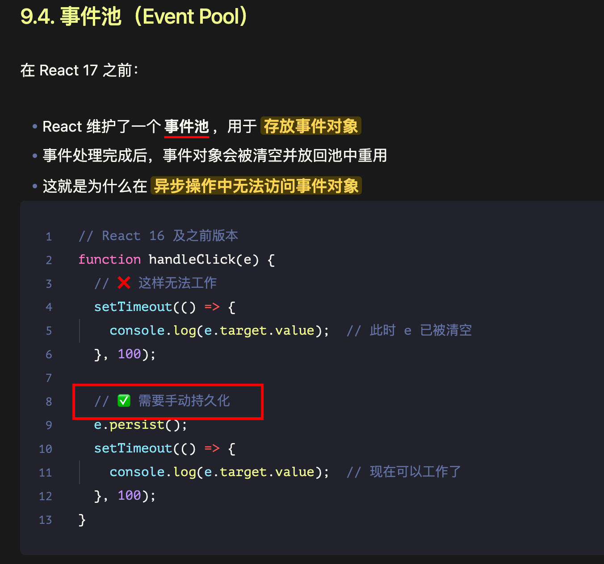

# React 的合成事件(Synthetic Event)和原生事件(Native Event)的执行顺序

`#react` 


## 目录
<!-- toc -->
 ## 1. 总结 

- 执行顺序：**原生捕获 → React 捕获 → React 冒泡 → 原生冒泡**
	1. document 原生事件：捕获阶段
	2. 子元素 原生事件：捕获阶段
	3. 父元素 React事件：捕获
	4. 子元素 React事件：捕获
	5. 子元素 React事件：冒泡
	6. 父元素 React事件：冒泡
	7. 子元素 原生事件：冒泡阶段
	8. document 原生事件：冒泡阶段
- 事件委托
	- React 事件是委托到 `root节点` 统一管理
		- 使得**多个 React 版本共存**成为可能
- 阻止事件传播
	- e.stopPropagation(); 
		- 阻止**React事件**传播
	- e.nativeEvent.stopImmediatePropagation(); 
		- 阻止**原生事件**传播
- **合成事件**的特点：
	- **抹平**了浏览器之间的兼容性差异
	- 事件代理
		- 对事件进行**统一的处理和优化**
	- 符合 W3C 规范
	- 可以通过 `e.nativeEvent` 访问原生事件对象
- 事件系统实现原理
	- 事件注册阶段
		- React 在初始化时，会在 root 容器上注册所有需要的事件（如 click、change 等）
		- 所有事件都会被存储在一个 Map 中进行统一管理
		- 通过 JSX 中声明的事件，会存储在组件的 fiber 节点中
	- 事件触发阶段
		- 事件触发时，首先**生成合成事件对象**
		- 按照事件传播的特性（捕获 -> 目标 -> 冒泡）遍历节点
		- 调用对应的事件处理函数
- 事件池
	- 


> 另外可参考 [21.  React 事件系统](/post/R7hQI7bo.html)

## 2. 事件执行顺序

```javascript
function App() {
  const divRef = useRef(null);

  useEffect(() => {
    const div = divRef.current;
    
    // 添加原生事件监听器
    div.addEventListener('click', () => {
      console.log('原生事件：冒泡阶段');
    });

    div.addEventListener('click', () => {
      console.log('原生事件：捕获阶段');
    }, true);  // true表示捕获阶段

    return () => {
      // 清理事件监听
      div.removeEventListener('click');
    };
  }, []);

  return (
    <div 
      ref={divRef}
      onClick={() => console.log('React事件：冒泡阶段')}
      onClickCapture={() => console.log('React事件：捕获阶段')}>
      点击我
    </div>
  );
}
```

当点击div时，事件执行顺序为：

1. 原生事件（捕获阶段）
2. React事件（捕获阶段）
3. React事件（冒泡阶段）
4. 原生事件（冒泡阶段）

## 3. 更复杂的嵌套结构来展示事件传播

```javascript
function Parent() {
  useEffect(() => {
    document.addEventListener('click', () => {
      console.log('document 原生事件：捕获阶段');
    }, true);

    document.addEventListener('click', () => {
      console.log('document 原生事件：冒泡阶段');
    });
  }, []);

  return (
    <div 
      onClick={() => console.log('父元素 React事件：冒泡')}
      onClickCapture={() => console.log('父元素 React事件：捕获')}
    >
      <Child />
    </div>
  );
}

function Child() {
  const childRef = useRef(null);

  useEffect(() => {
    const child = childRef.current;
    child.addEventListener('click', () => {
      console.log('子元素 原生事件：冒泡阶段');
    });

    child.addEventListener('click', () => {
      console.log('子元素 原生事件：捕获阶段');
    }, true);
  }, []);

  return (
    <button 
      ref={childRef}
      onClick={() => console.log('子元素 React事件：冒泡')}
      onClickCapture={() => console.log('子元素 React事件：捕获')}
    >
      点击我
    </button>
  );
}
```

点击按钮时的执行顺序：

```
1. document 原生事件：捕获阶段
2. 子元素 原生事件：捕获阶段
3. 父元素 React事件：捕获
4. 子元素 React事件：捕获
5. 子元素 React事件：冒泡
6. 父元素 React事件：冒泡
7. 子元素 原生事件：冒泡阶段
8. document 原生事件：冒泡阶段
```

## 4. 主要区别

### 4.1. 事件委托机制

- React事件是委托到 `root节点` 统一管理
- 原生事件是直接绑定到DOM元素上

### 4.2. 事件对象

```javascript hl:4,3,6
function HandleEvent({ onClick }) {
  const handleClick = (e) => {
    console.log('React合成事件对象：', e); // SyntheticEvent
    console.log('原生事件对象：', e.nativeEvent); // 原生Event
    
    // React 17之后，e.persist()不再需要
    // 事件对象可以被异步访问
    setTimeout(() => {
      console.log('异步访问事件对象：', e);
    }, 0);
    
  };

  return <button onClick={handleClick}>点击</button>;
}
```

## 5. 阻止事件传播

```javascript hl:7,8
function StopPropagation() {
  const handleParentClick = (e) => {
    console.log('父元素被点击');
  };

  const handleChildClick = (e) => {
    e.stopPropagation(); // 阻止React事件传播
    e.nativeEvent.stopImmediatePropagation(); // 阻止原生事件传播
    console.log('子元素被点击');
  };

  return (
    <div onClick={handleParentClick}>
      <button onClick={handleChildClick}>点击我</button>
    </div>
  );
}
```

## 6. 实际应用场景

```javascript hl:3,4
function Modal({ onClose }) {
  const handleBackdropClick = (e) => {
    // 确保只有点击背景时才关闭
    if (e.target === e.currentTarget) {
      onClose();
    }
  };

  const handleContentClick = (e) => {
    // 阻止事件冒泡，避免触发背景点击
    e.stopPropagation();
  };

  return (
    <div className="backdrop" onClick={handleBackdropClick}>
      <div className="modal-content" onClick={handleContentClick}>
        模态框内容
      </div>
    </div>
  );
}
```

## 7. 注意事项

### 7.1. 在使用原生事件时，记得在组件卸载时清理

```javascript
useEffect(() => {
  const handler = () => console.log('原生事件');
  element.addEventListener('click', handler);
  return () => element.removeEventListener('click', handler);
}, []);
```

## 8. React 17 前后的事件委托变化

- 事件不再绑定到 `document`，而是绑定到`root节点`
	- 这使得**多个 React 版本共存成为可能**


## 9. 性能考虑

- 优先使用 React 的合成事件系统
- 只在特殊情况下使用原生事件（如需要捕获特定的键盘事件）

## 10. React 的事件系统实现原理

### 10.1. 事件委托（Event Delegation）

React 实现了一个统一的事件系统，采用事件委托的方式：
- 所有事件都绑定到 document 上（在 React 17 之后改为绑定到 root 容器上）
- 当事件触发时，React 会找到对应的组件，然后执行相应的事件处理函数
- 这种方式可以提高性能，减少内存占用

### 10.2. 合成事件（SyntheticEvent）

React 自己实现了一套事件机制，叫做 `SyntheticEvent`（合成事件）：

```javascript
// React 事件示例
const Button = () => {
  const handleClick = (e) => {
    // e 是 SyntheticEvent 对象，而不是原生的 event
    console.log(e);
  }
  
  return <button onClick={handleClick}>点击</button>
}
```

合成事件的特点：
- 抹平了浏览器之间的兼容性差异
- 对事件进行统一的处理和优化
- 符合 W3C 规范
- 可以通过 `e.nativeEvent` 访问原生事件对象

### 10.3. 事件注册和触发流程

#### 10.3.1. **事件注册阶段**

   - React 在初始化时，会在 root 容器上注册所有需要的事件（如 click、change 等）
	   - 所有事件都会被存储在一个 Map 中进行统一管理
   - 通过 JSX 中声明的事件，会存储在组件的 fiber 节点中

#### 10.3.2. **事件触发阶段**

- 事件触发时，首先**生成合成事件对象**
- 按照事件传播的特性（捕获 -> 目标 -> 冒泡）遍历节点
- 调用对应的事件处理函数

### 10.4. 事件池（Event Pool）

在 React 17 之前：

- React 维护了一个**事件池**，用于**存放事件对象**
- 事件处理完成后，事件对象会被清空并放回池中重用
- 这就是为什么在**异步操作中无法访问事件对象**
```javascript 
// React 16 及之前版本
function handleClick(e) {
  // ❌ 这样无法工作
  setTimeout(() => {
    console.log(e.target.value);  // 此时 e 已被清空
  }, 100);
  
  // ✅ 需要手动持久化
  e.persist();
  setTimeout(() => {
    console.log(e.target.value);  // 现在可以工作了
  }, 100);
}
```

React 17 之后：
- 移除了事件池机制
- 事件对象可以在异步操作中被访问
- 提升了开发体验

### 10.5. 执行顺序

React 事件和原生事件的执行顺序：

1. 原生事件捕获阶段
2. React 事件捕获阶段
3. React 事件冒泡阶段
4. 原生事件冒泡阶段

```javascript hl:6
// 事件执行顺序示例
<div onClick={e => console.log('原生事件：冒泡')} 
     onClickCapture={e => console.log('原生事件：捕获')}>
  <button 
    onClick={e => console.log('React事件：冒泡')}
    onClickCapture={e => console.log('React事件：捕获')}>
    点击
  </button>
</div>
```

### 10.6. React 的合成事件与原生事件之间存在一些重要的交互特性

- 当同一个 DOM 同时绑定了原生事件和合成事件时，原生事件会先触发
- 在原生事件中调用 stopPropagation() 会**阻止合成事件的执行**
	- 这是因为合成事件依赖事件冒泡到 document（或 root）节点来实现事件委托