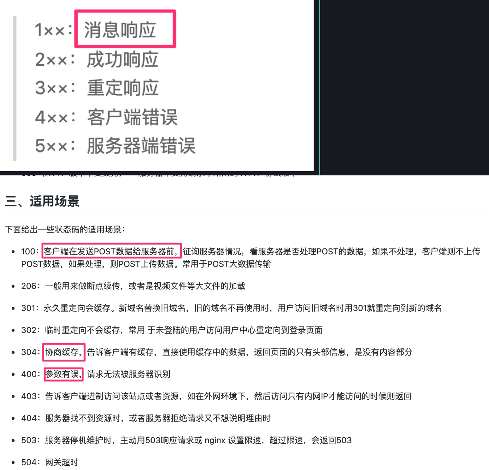

# 常见面试题：篇四


## 目录
<!-- toc -->
 ## 1. src、href区别 

- `src` ，资源引用，如script、image、video、audio等
- `href`，超文本引用，可`并行下载请求`，`link/a` 等标签

## 2. label 的作用

点击 label 时，对应的表单获得焦点

## 3. title与h1的区别、b与strong的区别、i与em的区别

- 强调：`strong、em`，seo 侧重些
- 只是样式斜体或者加粗：`b、i`
- `title`就是网页标题
- `H1`有层次的标题

## 4. img的`srcset`属性的作⽤

适配视网膜屏，比如`2x、3x`等等

## 5. svg 与 canvas

- svg 本质还是 dom、xml
- canvas 适合编程

## 6. 说说`defer`/`async`的区别

- 两者都没有
	- 立即加载并执行，不等待后续的文档是否加载好
- defer : 延迟
	- 文档解析和脚本加载是异步的
	- 等 DOM 解析完后才开始执行脚本
	- 类似于 script 标签放到 body 之后
- async 
	- 文档解析和脚本加载是异步的
	- 但下载后脚本后会停止 HTML 解析，开始执行脚本，脚本执行完后继续解析 HTML
- 同时有，async 优先级更高

## 7. `标签`通常与 `break语句` 和 `continue语句` 配合使用，跳出特定的循环

## 8. 判断数据类型

- typeof 
	- undefined ----> object 
	- function 
	- symbol
- instanceof
- Object.prototype.toString.call 方法

## 9. 基本类型：8 种

`Undefined、Null、Boolean、Number、 String 和 Symbol、Object、bigIng`

## 10. 错误处理

```javascript hl:6
// 可以返回 false 来阻止浏览器默 认报告错误的行为, 
// 这个函数实际上就变成了整个文档的 try/catch 语句,
// 最好别这么搞
window.onerror = (message, url, line) => { 
  console.log(message);
  return false;
};
```

## 11. try/catch/finally

- **try 里面还可以**`try`
- `finally`**无论正常错误都会执行**

## 12. 左结合 与 右结合

```javascript

// 左结合
x + y + z
===》 (x + y) + z

// 少数运算符是“右结合”，其中最主要的是赋值运算符（=）和三元条件运算符（?:） 和 ** 

// 赋值运算符（=）
w = x = y = z;
===》  w = (x = (y = z));

// 三元条件运算符（?:） 
q = a ? b : c ? d : e ? f : g;
===》
q = a ? b : (c ? d : (e ? f : g));

// 指数运算符（**）也是右结合
2 ** 3 ** 2
// 相当于 2 ** (3 ** 2)
// 512
```

## 13. 采用`function`命令和`var`赋值语句声明同一个函数，由于存在函数提升，最终以 var 定义的为准


## 14. 问：怎么用好Chrome Devtools工具

- 使用`console.table` 可以更直观的打印出数组或者对象
- 使用 `console.dir` 递归打印出所有对象，比如打印出一个DOM元素，以前都不能直接看里面的元素
- 使用`coverage`检查没用的css/js占比，没用的红色标识，用到的使用绿色标识，如下图
- 使用`console.trace` 追踪向 Web控制台 输出一个堆栈跟踪

## 15. 说说尾调用优化

**尾调用**： 是指一个函数的最后一个动作是调用另一个函数

```javascript
// 对 `g(x)` 的调用就是一个尾调用
function f(x) {
  return g(x);
}
```

**尾调用优化**：是指编译器或解释器能够优化尾调用，使其不在调用栈上创建新的栈帧。相反，**它会清除当前栈帧并重用它**。这样可以防止栈溢出，并且可以使某些递归算法在常量空间内运行

### 15.1. 正常的 fib

```javascript
function fib(n) {
  if (n <= 1) {
    return 1;
  }
  return fib(n - 1) + fib(n - 2);
}

fib(0); // 1
fib(1); // 1
fib(2); // 2
fib(3); // 3
fib(4); // 5
fib(5); // 8
fib(6); // 13
fib(7); // 21
fib(8); // 34
fib(9); // 55
fib(10); // 89
fib(100); // 超时
fib(500); // 超时
```

### 15.2. 尾调用优化

```javascript
// 尾调用优化
function fibTail(n, prev = 1, curr = 1) {
  // n 为 0 时，返回 prev
  if (n === 0) return prev;
  // 递归调用
  return fibTail(n - 1, curr, prev + curr); // 尾调用
}
```

### 15.3. 尾调用优化：bigInt

```javascript
function fibBigInt(n, prev = 1n, curr = 1n) {
  if (n === 0) return prev;
  return fibBigInt(n - 1, curr, prev + curr);
}
```

>  使用 `1n` 

## 16. 介绍一下 JavaScript 中的 BigInt 类型

### 16.1. BigInt 基础

> [!danger]
> 数字后面 + `n`

BigInt 是 JavaScript 中的一种基本数据类型，用于表示任意精度的整数。它是 ES2020 (ES11) 新增的特性。

```javascript
// 创建 BigInt 的两种方式
const a = 123n;                    // 字面量语法，数字后加 'n'
const b = BigInt(123);            // 构造函数
const c = BigInt("123456789");    // 从字符串创建

console.log(typeof a);  // 'bigint'
```

### 16.2. 为什么需要 BigInt？

JavaScript 的 Number 类型使用 64 位双精度浮点数（IEEE 754），这导致：
- 最大安全整数：`Number.MAX_SAFE_INTEGER` (2^53 - 1)
- 最小安全整数：`Number.MIN_SAFE_INTEGER` (-(2^53 - 1))

```javascript
// Number 类型的限制
console.log(Number.MAX_SAFE_INTEGER);  // 9007199254740991
console.log(9007199254740991 + 1);     // 9007199254740992
console.log(9007199254740991 + 2);     // 9007199254740992 (错误!)

// BigInt 没有这个限制
console.log(9007199254740991n + 1n);   // 9007199254740992n
console.log(9007199254740991n + 2n);   // 9007199254740993n
```

## 17. 函数作用域

一句话，函数执行时所在的作用域，是**定义时**的作用域，而**不是调用时**所在的作用域

```javascript hl:3
var a = 1;
var x = function () {
  // 定义时没有 var，所以是全局变量 a
  console.log(a);
};

function f() {
  var a = 2;
  x();
}

f(); // 1

```

```javascript
// 函数x是在函数y体外声明的，作用域绑定外层，因此找不到函数y的内部变量a，导致报错
var x = function () {
  console.log(a);
};

function y(f) {
  var a = 2;
  f();
}

y(x);
// ReferenceError: a is not defined
```

## 18. 说说闭包

闭包的最大用处有两个

- 一个是可以读取**外层函数内部的变量**，
- 另一个就是**让这些变量始终保持在内存**中，即闭包可以使得它诞生环境一直存在

## 19. JavaScript 函数内部的变量提升（Hoisting）机制

### 19.1. var 变量提升
```javascript
function example() {
    console.log(a); // 输出：undefined
    var a = 1;
    console.log(a); // 输出：1
}
// 等价于
function example() {
    var a;           // 变量声明被提升到函数顶部
    console.log(a);  // undefined
    a = 1;          // 赋值操作保持在原位置
    console.log(a);  // 1
}
```

### 19.2. 函数声明的提升

```javascript
function example() {
    sayHello(); // 输出："Hello!"
    
    function sayHello() {
        console.log("Hello!");
    }
}

```

### 19.3. let 与 const 

let 和 const 声明的变量也会提升，但是存在"暂时性死区"（Temporal Dead Zone，TDZ），在声明之前访问会抛出错误。

```javascript
function example() {
    console.log(a); // 报错：ReferenceError
    let a = 1;
}
```

> `暂时性死区`的本质就是，只要一进入当前作用域，所要使用的变量就已经存在了，但是不可获取，**只有等到声明变量的那一行代码出现**，才可以获取和使用该变量

### 19.4. 注意事项

- 函数声明会被提升到变量声明之前，比如 foo 同时是一个函数和变量
- 函数表达式不会被提升
- 使用 let 和 const 代替 var
- 在作用域顶部声明变量
- 先声明后使用
- 避免依赖变量提升机制

> [!tip]
> 虽然 JavaScript 引擎会帮我们处理提升，但是**显式地声明和初始化变量可以让代码更清晰、更易于理解**

## 20. `new.target` 标识函数只能作为构造函数

```javascript hl:2
function King() {
      if (!new.target) {
        throw 'King must be instantiated using "new"'
      }
      console.log('King instantiated using "new"');
}

new King(); // King instantiated using "new"
King();     // Error: King must be instantiated using "new"
```

## 21. 函数的 caller 属性

```javascript hl:5,6,9
function outer() {
  inner();
}
function inner() {
  // 这里的caller是outer函数，因为inner函数是由outer函数调用的
  // 但是在严格模式下，caller属性会抛出错误
  console.log(inner.caller);

  // 同上	
  // console.log(arguments.callee.caller);
}
outer();

```

## 22. es6中的变量申明有哪些？

- `var`命令
- `function`命令
- `let`
- `const`
- `import`命令
- `class`命令

## 23. 使用 React Hooks 实现一个 useFetchData

> 和 vue 的 hooks 真的很像

```javascript  hl:16,28,37
// 使用 React Hooks 实现一个 useFetchData
// 在我们的业务中经常会遇到列表或者表格页面
// 需要支持翻页，加载更多，错误处理， loading 的功能。希望能够实现一个 Hook 来抽象这部分逻辑

function useFetchData() {
  const [data, setData] = useState([]);
  const [loading, setLoading] = useState(false);
  const [error, setError] = useState(null);
  // 这些参数适合都放到 options 里面
  const [page, setPage] = useState(1);
  const [total, setTotal] = useState(0);
  const [pageSize, setPageSize] = useState(10);
  const [reload, setReload] = useState(false);

  // 用于保存 ref 的引用
  const ref = useRef();
  // 用于保存 AbortController 的引用, 用于取消请求
  const abortControllerRef = useRef();

  function destroy() {
    ref.current = true;
    setData([]);
    setLoading(false);
    setError(null);
    
    setPage(1);
    setTotal(0);
    setPageSize(10);
    setReload(false);
    // 销毁时取消请求
    abortControllerRef.current && abortControllerRef.current.abort();
  }

  useEffect(() => {
    setLoading(true);

    // 保存 AbortController 的引用
    abortControllerRef.current = new AbortController();
    const { signal } = abortControllerRef.current;

    fetch(
      "https://api.example.com/data?page=" + page + "&pageSize=" + pageSize,
      { signal },
    )
      .then((res) => res.json())
      .then((res) => {
        setData(res.data);
        setTotal(res.total);
        setLoading(false);
      })
      .catch((err) => {
        setError(err);
        setLoading(false);
      })
      .finally(() => {
        setLoading(false);
      });

    return () => {
      destroy();
    };
  }, [page, pageSize, reload]);

  return {
    data,
    loading,
    error,
  };
}

export default useFetchData;

```

## 24. git merge 与 git rebase 有什么区别

- 提交历史
	- `git merge` 会保留历史记录
	-  `git rebase`  会合并记录，可以有**线性**的提交历史，能够所以会丢历史记录
- 我之前所在的团队都是禁用`git rebase`  的

## 25. 深拷贝与浅拷贝

### 25.1. 常见的浅拷贝方式

```javascript
function shadowCopy(obj) {
  const newObj = {};
  for (let prop in obj) {
    if (obj.hasOwnProperty(prop)) {
      newObj[prop] = obj[prop];
    }
  }
  return newObj;
}

Object.assign({}, {});

Array.prototype.slice();

Array.prototype.concat();

let a = [...b];
```

### 25.2. 深拷贝的简易实现

```javascript
function deepCopy(obj) {
  if (typeof obj !== "object") {
    return obj;
  }
  const newObj = Array.isArray(obj) ? [] : {};
  for (let key in obj) {
    newObj[key] = deepCopy(obj[key]);
  }
  return newObj;
}
```

### 25.3. 如何解决循环引用问题：WeakMap

```javascript hl:5,9,2
function deepCopy(obj, hash = new WeakMap()) {
  // 基本类型
  if (typeof obj !== "object") {
    return obj;
  }
  if (hash.has(obj)) {
    return hash.get(obj);
  }
  const newObj = Array.isArray(obj) ? [] : {};
  hash.set(obj, newObj);
  for (let key in obj) {
    newObj[key] = deepCopy(obj[key], hash);
  }
  return newObj;
}
```

### 25.4. 考虑其他类型

```javascript hl:15
// 考虑 RegExp、Date、Function、Symbol、Map、Set、WeakMap、WeakSet、Error、Promise、BigInt 等特殊对象
function deepCopy(obj, hash = new WeakMap()) {
  if (obj instanceof RegExp) return new RegExp(obj);
  if (obj instanceof Date) return new Date(obj);
  if (obj instanceof Function) return new Function(obj);
  if (obj instanceof Symbol) return new Symbol(obj);
  if (obj instanceof Map) return new Map(obj);
  if (obj instanceof Set) return new Set(obj);
  if (obj instanceof WeakMap) return new WeakMap(obj);
  if (obj instanceof WeakSet) return new WeakSet(obj);
  if (obj instanceof Error) return new Error(obj);
  if (obj instanceof Promise) return new Promise(obj);
  if (obj instanceof BigInt) return new BigInt(obj);

  // 基本类型
  if (typeof obj !== "object") {
    return obj;
  }
  if (hash.has(obj)) {
    return hash.get(obj);
  }
  const newObj = Array.isArray(obj) ? [] : {};
  hash.set(obj, newObj);
  for (let key in obj) {
    newObj[key] = deepCopy(obj[key], hash);
  }
  return newObj;
}
```

### 25.5. 上面的代码肯定有问题的，比如函数，symbol ， map 、set 等

```javascript
function deepCopy(obj, hash = new WeakMap()) {
  // 处理null和undefined
  if (obj === null || typeof obj === 'undefined') return obj;

  // 处理基本类型
  if (typeof obj !== "object" && typeof obj !== "function") {
    return obj;
  }

  // 处理已经复制过的对象（循环引用）
  if (hash.has(obj)) {
    return hash.get(obj);
  }

  // 处理特殊对象类型
  if (obj instanceof Date) return new Date(obj);
  if (obj instanceof RegExp) return new RegExp(obj);
  if (obj instanceof Error) return new Error(obj.message);

  // 处理函数
  if (typeof obj === 'function') {
    return function() {
      return obj.apply(this, arguments);
    };
  }

  // 处理 Symbol
  if (typeof obj === 'symbol') return Object(Symbol.prototype.valueOf.call(obj));

  // 处理 Map
  if (obj instanceof Map) {
    const newMap = new Map();
    hash.set(obj, newMap);
    obj.forEach((value, key) => {
      newMap.set(deepCopy(key, hash), deepCopy(value, hash));
    });
    return newMap;
  }

  // 处理 Set
  if (obj instanceof Set) {
    const newSet = new Set();
    hash.set(obj, newSet);
    obj.forEach(value => {
      newSet.add(deepCopy(value, hash));
    });
    return newSet;
  }

  // 处理 WeakMap 和 WeakSet
  if (obj instanceof WeakMap || obj instanceof WeakSet) {
    // 这些对象不能被深拷贝，返回新的空实例
    return new obj.constructor();
  }

  // 处理 Promise
  if (obj instanceof Promise) {
    return new Promise((resolve, reject) => {
      obj.then(
        value => resolve(deepCopy(value, hash)),
        error => reject(deepCopy(error, hash))
      );
    });
  }

  // 处理 BigInt
  if (typeof obj === 'bigint') return BigInt(obj.toString());

  // 处理普通对象和数组
  const newObj = Array.isArray(obj) ? [] : {};
  hash.set(obj, newObj);
  
  for (const key in obj) {
    if (Object.prototype.hasOwnProperty.call(obj, key)) {
      newObj[key] = deepCopy(obj[key], hash);
    }
  }

  // 处理不可枚举属性
  const symbolProperties = Object.getOwnPropertySymbols(obj);
  for (const sym of symbolProperties) {
    newObj[sym] = deepCopy(obj[sym], hash);
  }

  return newObj;
}

```

### 25.6. JSON 的方式实现

`json`的方式会丢失很多内容，比如 map、regexp、set、date、set、函数以及循环引用的问题

### 25.7. 最后

还是使用 loadsh 、Ramda 等库吧 ，细节还有很多需要考虑的 


## 27. 统计HTML标签中以`b`开头的标签数量

```javascript hl:2,10
// 方法一：循环
const tags = document.getElementsByTagName('*');
// tags是类数组对象，内部实现了，部署 Iterator 接口，可以使用扩张运算符，否则不能使用扩张运算符
// 要使用数组的方法必须将类数组转为真正的数组
// tagName 都是大写的
const value = [...tags].filter((item) => item.tagName.startsWith('B'))

// 方法二：树查找
const prefixBElements = [];
function dfs(ele) {
    if (ele.tagName.startsWith('B')) {
        prefixBElements.push(ele);
    }
    for (const child of ele.children) {
        dfs(child);
    }
}
// 从HTML根节点开始找
dfs(document.documentElement);
console.log(prefixBElements);
```

## 28. 统计HTML标签中出现次数最多的标签

```javascript hl:1,11,13
const tags = document.getElementsByTagName('*');


let map = new Map();
let maxStr = '';
let max = 0;
// 只是使用下标来获取，没有使用数组的方法，所以不需要将类数组转为数组
for(let i = 0; i < tags.length; i++) {
    let value = map.get(tags[i].tagName)
    if(value) {
        map.set(tags[i].tagName, ++value)
    } else {
        map.set(tags[i].tagName, 1);
    }
    // 统计，计算最大，实时更新，max和maxStr
    if(value > max) {
        maxStr = tags[i].tagName;
        max = value;
    }
}
console.log(`当前最多的标签为 ${maxStr}，个数为 ${max}` );
```

## 29. 给一段 HTML 字符串判断合法性

```javascript hl:2
// 判断闭合标签
// \1 的使用
let tagClose = /<([a-zA-Z]+)[\s\S]*>[\s\S]*?<\/\1>/

let tagCloseNoContent = /<[a-zA-Z]+[\s\S]*\/>/

// 遍历，const tags = document.getElementsByTagName('*'); 来统一判断，校验各种合理性
// 或者通过查找树，递归来处理，校验合理性

① 标签正则：闭合或者非闭合的
② span 中不能包含 div , table td tr 的嵌套合理性
③ 所以，还是很麻烦的，很多需要考虑的点
```

## 30. 自己实现一个模板引擎

短时间内写不出来的，但需要考虑的点

- 模板正则匹配
- 可使用 `with` 注入变量，改变作用域
- 可使用 `new Function` 执行特定规则后的代码
- 使用 replace ，可能需要嵌套使用 replace 等等
- 可以参考的：
	- vue template
	- handlebar 
	- ejs
	- 等等

所以，这个别浪费时间了，pass 吧，真遇到 那么就说说思路，除非做小抄，不然很难段时间写出来的

## 31. 实现一个简易版本的前端路由

### 31.1. 哈希路由简易实现

- 关键点
	- 监听两个事件
		- DOMContentLoaded ->  onLoad
			- 主动触发一次 onHashChange
		- hashchange  ->  onHashChange
			- 每次更新直接修改 `#app` 的 `innerHtml`

```html
<body>
    <ul>
        <!-- 定义路由 -->
        <li><a href="#/home">home</a></li>
        <li><a href="#/about">about</a></li>
    </ul>
    <!-- 渲染路由对应的 UI -->
    <div id="app"></div>
</body>

<script type="text/javascript">
    // 页面加载完不会触发 hashchange
    // 所以这里需要主动触发一次 hashchange 事件
    window.addEventListener("DOMContentLoaded", onLoad);
    // 监听路由变化
    window.addEventListener("hashchange", onHashChange);

    // 路由视图，用于渲染路由对应的 UI
    var routerView = null;

    function onLoad() {
        routerView = document.querySelector("#app");
        onHashChange();
    }

    // 路由变化时，根据路由渲染对应 UI
    function onHashChange() {
        switch (window.location.hash) {
            case "#/home":
                routerView.innerHTML = "Home";
                return;
            case "#/about":
                routerView.innerHTML = "About";
                return;
            default:
                return;
        }
    }
</script>

```

### 31.2. history 路由简易实现

- 关键点
	- 监听两个事件
		- DOMContentLoaded ->  onLoad
			- 主动触发一次 onPopState
		- popstate  ->  onPopState
			- 每次更新直接修改 `#app` 的 `innerHtml`
			- 拦截 a 标签的默认行为

```html
<body>
    <ul>
        <!-- 定义路由 -->
        <li><a href="#/home">home</a></li>
        <li><a href="#/about">about</a></li>
    </ul>
    <!-- 渲染路由对应的 UI -->
    <div id="app"></div>
</body>

<script type="text/javascript">
    // 页面加载完不会触发 hashchange
    // 这里主动触发一次 hashchange 事件
    window.addEventListener("DOMContentLoaded", onLoad);
    // 监听路由变化
    window.addEventListener("popstate", onPopState);

    // 路由视图
    var routerView = null;

    function onLoad() {
        routerView = document.querySelector("#app");
        onPopState();

        // 拦截 <a> 标签点击事件默认行为， 点击时使用 pushState 修改 URL并更新手动 UI，
        // 从而实现点击链接更新 URL 和 UI 的效果。
        var linkList = document.querySelectorAll("a[href]");
        linkList.forEach((el) =>
            el.addEventListener("click", function (e) {
                e.preventDefault();
                history.pushState(null, "", el.getAttribute("href"));
                onPopState();
            }),
        );
    }

    // 路由变化时，根据路由渲染对应 UI
    function onPopState() {
        switch (location.pathname) {
            case "/home":
                routerView.innerHTML = "Home";
                return;
            case "/about":
                routerView.innerHTML = "About";
                return;
            default:
                return;
        }
    }
</script>

```

#### 31.2.1. 附：popstate 事件

- 仅仅调用`pushState()`方法或`replaceState()`方法 ，并不会触发该事件; 
	- 只有用户`点击浏览器倒退按钮和前进按钮`，
	- 或者使用 JavaScript 调用`History.back()、History.forward()、History.go()` 方法时才会触发。
	- 或者点击 `a 标签`的跳转
- 另外，该事件只针对同一个文档，如果浏览历史的切换，导致加载不同的文档，该事件也不会触发。
- 页面 `第一次加载的时候`，浏览器不会触发`popstate`事件
- `pushState 与 replaceState` 调用后 History 对象会变化，地址栏会变化，但不会触发页面刷新事件
	- 

### 31.3. 一个简单的 Router 类实现

#### 31.3.1. 入口

```html
<!DOCTYPE html>
<html>
<body>
  <nav>
    <a href="/" data-link>Home</a>
    <a href="/about" data-link>About</a>
    <a href="/contact" data-link>Contact</a>
  </nav>
  <div id="app"></div>
  <script src="router.js"></script>
</body>
</html>

```

#### 31.3.2. Router 实现

```javascript
class Router {
  constructor(routes) {
    this.routes = routes;
    this.rootElement = document.getElementById("app");
    this.init();
  }

  init() {
    window.addEventListener("popstate", this.handlePopState.bind(this));
    this.handleRouteChange();
    this.bindLinks();
  }

  // 为所有带有 data-link 属性的链接添加点击事件监听器
  // 阻止默认行为并调用 navigateTo 方法
  bindLinks() {
    document.addEventListener("click", (e) => {
      if (e.target.matches("[data-link]")) {
        e.preventDefault();
        this.navigateTo(e.target.href);
      }
    });
  }

  handlePopState() {
    this.handleRouteChange();
  }

  // 获取当前路径
  // 查找匹配的路由
  // 如果找到匹配的路由，渲染对应的组件
  // 如果没有找到匹配的路由，显示 404 页面
  handleRouteChange() {
    // 获取当前路径
    const path = window.location.pathname;
    const route = this.routes.find((route) => route.path === path);

    if (route) {
      this.rootElement.innerHTML = route.component();
    } else {
      this.rootElement.innerHTML = "<h1>404 Not Found</h1>";
    }
  }

  // 使用 History API 更新 URL
  // 触发路由变化处理
  navigateTo(url) {
    history.pushState(null, null, url);
    this.handleRouteChange();
  }
}

// 使用示例
const routes = [
  {
    path: "/",
    component: () => "<h1>Home Page</h1>",
  },
  {
    path: "/about",
    component: () => "<h1>About Page</h1>",
  },
  {
    path: "/contact",
    component: () => "<h1>Contact Page</h1>",
  },
];

const router = new Router(routes);


```

### 31.4. mini-react-router-dom 的简易实现

> 使用最新的 Hooks 的方式实现

`#todo` 

很多细节需要慢慢实现，比如
- 嵌套路由等
- 路由守卫
- 支持参数查询
- 路由过渡动画
- 路由懒加载
- 更复杂的路径匹配模式
- 路由元信息
- 路由钩子（beforeEach, afterEach）等

## 32. 如何终止或取消一个请求：AbortController 

`AbortController` 接口表示一个控制器对象，允许你根据需`要中止一个或多个 Web 请求`。


### 32.1. 使用 

```javascript
// `AbortController` 是 JavaScript 中的一个全局类，
const controller = new AbortController();  

// 可以将它传递给要中断的 API，来响应中断事件并进行相应处理，例如，传递给 `fetch()` 方法就可以终止这个请求了
controller.signal;  
// 调用这个方法会触发 `signal` 上的中止事件，并将信号标记为已中止
controller.abort();

// 监听 abort 事件
controller.signal.addEventListener('abort', () => {  
  // 实现中止逻辑  
});
```

### 32.2. 不仅可以使用请求，还可以用于各类事件

```javascript hl:14
useEffect(() => {  
  const controller = new AbortController();  
  
  window.addEventListener('resize', handleResize, {  
    signal: controller.signal,  
  });  
  window.addEventListener('hashchange', handleHashChange, {  
    signal: controller.signal,  
  });  
  window.addEventListener('storage', handleStorageChange, {  
    signal: controller.signal,  
  });  

 // 在清理函数中，我只需调用一次 `controller.abort()` 就可以删除所有添加的监听器
  return () => {  
    // 调用 `.abort()` 会删除所有关联的事件监听器  
    controller.abort();  
  };  
}, []);
```

### 32.3. Node.js 中由 `http` 模块发出的请求也支持 `signal` 属性

### 32.4. 一个示例：终止错误原因

```javascript
async function fetchData() {
  const controller = new AbortController();
  const signal = controller.signal; // 监听 abort 事件，并打印中止原因

  signal.addEventListener("abort", () => {
    console.log("请求中止原因:", signal.reason); // 打印自定义的中止原因
  });

  try {
    const response = await fetch(
      "https://jsonplaceholder.typicode.com/posts/1",
      { signal },
    );
    const data = await response.json();
    console.log("请求成功:", data);
  } catch (error) {
    if (error.name === "AbortError") {
      console.error("请求因中止被取消:", error.message);
    } else {
      console.error("请求出错:", error.message);
    }
  } // 保存 controller 以便取消操作
  window.currentAbortController = controller;
}

fetchData(); // 监听取消按钮的点击事件

document.getElementById("cancelButton").addEventListener("click", () => {
  if (window.currentAbortController) {
    window.currentAbortController.abort("用户取消了请求"); // 提供自定义的中止原因
    console.log("点击了取消请求按钮");
  } else {
    console.log("没有正在进行的请求");
  }
});

```

## 33. 函数声明会被提升到作用域的顶部

```javascript hl:5
// 为什么不会报错？
// 因为函数声明会被提升到作用域的顶部，
console.log(832, foo);

// 如果改成 var foo = function 则会报错
function foo() {
  console.log("foo");
}

var foo = 1;

```


## 34. this 的指向问题

### 34.1. 非严格模式

```javascript hl:18,21,24
// 非严格模式下，this 的值为 undefined 的时候，其值会被隐式转换为全局对象。
var value = 1;

var foo = {
  value: 2,
  bar: function () {
    return this.value;
  },
};

//示例1
console.log(foo.bar()); // 2
//示例2
console.log(foo.bar()); // 2
//示例3：
// 为什么这里会是 1 呢？ 因为 foo.bar 赋值给了一个变量，然后调用这个变量，相当于调用全局的 bar 函数
console.log((foo.bar = foo.bar)()); // 1
//示例4：false || foo.bar 返回的是函数 foo.bar，所以调用后，输出的是 1
console.log((false || foo.bar)()); // 1

//示例5: true && foo.bar 返回的是函数 foo.bar，所以调用后，输出的是 1
(true && foo.bar)(); // 1

//示例6: 逗号操作符返回最后一个表达式的值，所以这里返回的是 foo.bar 函数，调用这个函数相当于调用全局的 bar 函数，所以输出的是 1
console.log((foo.bar, foo.bar)()); // 1

```


### 34.2. 严格模式


## 35. apply/call/bind 的区别及简易实现

### 35.1. 区别

1. call 和 apply 的区别主要在于参数的传递方式:
    - call 接受一系列参数：`fn.call(obj,arg1,arg2)`
    - apply 接受一个参数数组：`fn.apply(obj,[arg1,arg2])`
2. bind 与 call/apply 的主要区别:
    - call 和 apply 会**立即执行**函数
    - bind 返回一个新函数,可以稍后执行
3. 使用场景:
    - call/apply: 当你想**立即调用函数**,并`临时`改变 this 指向时使用
    - bind: 当你想创建一个**永久改变 this 指向**的新函数时使用,常用于回调函数中保持 this 指向

### 35.2. 手写 apply

```javascript
// 使用ES6语法实现的apply 
Function.prototype._apply = function (context = window, args) {
  // 首先要获取那个函数调用了 apply ，即 this
  // 比如 foo.apply(bar, [1, 2, 3]) , 这里的 this 就是 foo
  context.fn = this;

  let res;
  if (Array.isArray(args)) {
    res = context.fn(...args);
  } else {
    // none args
    res = context.fn();
  }

  delete context.fn;
  return res;
};

```

### 35.3. 手写 call

```javascript
// 使用ES6语法实现的call: 记得使用扩展运算符
Function.prototype._call = function (context = window, ...args) {
  // 首先要获取那个函数调用了 call ，即 this
  // 比如 foo.call(bar, 1, 2, 3) , 这里的 this 就是 foo
  context.fn = this;

  let res = context.fn(...args);

  delete context.fn;
  return res;
};
```

### 35.4. 手写 bind

```javascript hl:4,7
// 使用ES6语法实现的bind
Function.prototype._bind = function (context = window, ...args) {
  let fn = this;
  // 返回的一个新函数: 注意这里需要合并参数
  return function (...newArgs) {
    return fn.apply(context, args.concat(newArgs));
    // 如果要求不能使用 apply, 那么就使用 上面定义的 _apply
    // return fn._apply(context, args.concat(newArgs));
  };
};
```

## 36. 获取函数参数的方法

- 使用 `arguments` 对象
	- 
- 使用**扩展运算符**
	- `function fn(first, ...args) {}`

## 37. 自己实现 myInstanceof

```javascript hl:3,5
function myInstanceof(left, right) {

  // 获取对象的原型，使用 Object.getPrototypeOf()
  let proto = Object.getPrototypeOf(left); 
  // 或者使用 left.__proto__
  // let proto = left.__proto__; 
  let prototype = right.prototype; // 获取构造函数的原型对象

  while (true) {
    // 查找到尽头，还没找到, 返回 false
    if (proto === null) {
      return false;
    }
    // 找到相同的原型对象，返回 true
    if (proto === prototype) {
      return true;
    }
    // 继续查找, 直到找到相同的原型对象
    proto = Object.getPrototypeOf(proto);
  }
}
```

## 38. 原型链


## 39. 如何清除浮动

- 子元素设置浮动时，父元素设置为 BFC，比如 `overflow:hidden`
- 前后两个兄弟元素，前一个设置了浮动  `float:left`，后一个把前一个覆盖了
	- 后一个设置为 BFC 即可，比如 `overflow:hidden

## 40. z-index 的规则

- 在同一个层叠上下文领域，**谁大谁上**
- 当元素的层叠水平一致时，**后来居上**

## 41. CSS 性能优化

- 文件压缩
- css 动画启用`GPU`加速，一些图形渲染的`放心交给GPU`
- 避免`@import`
- 减少`css嵌套`
- 减少过分`重排`
- `不要table布局`，一个很小的改动会导致 `致table重新布局`
- `css 选择器，不要通配符`

## 42. css 优先级计算规则


## 43. CSS 的编写方式有哪些？

- 手写源生 CSS
- 使用预处理器 `Sass/Less`
- 使用后处理器 `PostCSS` 、`css`的`babel` （类比于js）
- 使用 **css modules**
- 使用 **css in js**

## 44. 实现 trim

两种写法： `/^\s+|\s+$/`  ，注意使用 `^`  和 `$`


## 45. 实现千分位


关键点：
- 使用 replace 的第二个函数参数
- `x(?=y)`  
- `$` 匹配结束，应该从后往前匹配
- 遍历的话，需要转成数组
	- 遍历需要 reverse 
	- 或者 倒着遍历

## 46. 防抖和节流的实现

- 防抖：即 `只执行最后一次` ， 比如 resize 和 sug ，按钮提交、表单验证、
- 节流：即`单位时间只执行一次`，比如滚动加载更多，拖拽移动事件

```javascript hl:3,15
function debounce(fn, ms) {
  let timer = null;
  // 返回一个函数
  return function (...args) {
    timer && clearTimeout(timer);
    // 清除，重新settimeout
    timer = setTimeout(() => {
      fn.apply(this, args);
    }, ms);
  };
}

function throttle(fn, ms) {
  let timer = null;
  // 返回一个函数
  return function (...args) {
    // 保证一段时间只执行一次
    // 如果 timer 存在，说明已经执行过了，直接返回
    if (!timer) {
      timer = setTimeout(() => {
        fn.apply(this, args);
        timer = null;
      }, ms);
    }
  };
}

function throttle(fn, ms) {
  let start = 0;
  return function (...args) {
    if (Date.now() - start > ms) {
      start = Date.now();
      fn.apply(this, args);
    }
  }
}

```

## 47. 前端项目如何找出性能瓶颈

- 主动
	- 自己体验
	- 使用工具**分析收集**：chrome、lighthouse 、内存分析、渲染掉帧情况
	- 真实环境、真实数据
		- 埋点、性能数据上报
- 被动
	- 客户反馈，具体情况，具体分析

## 48. 介绍下前端加密的常见场景和方法

- https，使用TLS/SSL加密整个通信过程，传输层加密
- 用户名密码，token 等
- app store 热更新方案

## 49. 请介绍 webpack的三种hash模式

### 49.1. Hash

只要项目中有任何文件发生变化，所有文件的hash都会改变。

示例：
```javascript
output: {
    filename: '[name].[hash].js'
}
```

缺点：
- 不利于浏览器缓存，因为即使只修改了一个文件，所有文件的 hash 都会变化。
- 不利用**版本管理**

### 49.2. Chunkhash

Chunkhash 基于不同的入口文件(entry)进行依赖文件解析、构建对应的chunk，生成对应的hash值。

特点：
- 同一个chunk中的文件hash值相同。
- 不同chunk的hash值不同。
- 适用于多入口项目。

示例：

```javascript
output: {
    filename: '[name].[chunkhash].js'
}
```

优点：

- 相对于 hash，chunkhash 能够更好地利用浏览器缓存。

### 49.3. Contenthash

Contenthash是最精确的hash模式，它根据文件内容来生成hash值。

特点：
- 只有当文件内容发生变化时，该文件的hash才会改变。
- 最适合用于缓存。

示例：
```javascript
output: {
    filename: '[name].[contenthash].js'
}
```

优点：
- 能够最大化利用浏览器缓存。
- 即使是在同一个chunk中，如果文件内容没有变化，hash也不会改变。

### 49.4. 使用建议

1. 对于 JavaScript 文件，推荐使用 chunkhash
2. 对于 CSS 文件，推荐使用 contenthash
	1. 因为不希望 css 内容变化影响到 js 
3. 对于图片和字体等资源文件，可以使用 hash 或 contenthash 

需要确保在生产环境中**最大化利用浏览器缓存**，提高应用性能。

理解并正确使用这三种hash模式可以帮助您更好地**管理文件版本和优化缓存策略**，这在大型项目中尤为重要。

## 50. webpack的 `module` / `chuck` / `bundle` 是什么区别


## 51. webpack 的 resolve 有什么用？

```javascript
//webpack的 resolve有什么用？

const path = require("path");

module.exports = {
  resolve: {
    // 设置别名, 优化路径, 减少查找时间
    alias: {
      "@": path.resolve(__dirname, "src"),
      components: path.resolve(__dirname, "src/components"),
    },

    // 自动解析扩展名,应该尽量减少后缀列表长度，以减少尝试次数
    extensions: [".js", ".jsx", ".ts", ".tsx", ".json"],

    // 模块搜索目录，减少搜索时间
    // 优先搜索src目录，然后是node_modules
    // 应该尽量减少模块搜索目录长度，以减少尝试次数
    modules: ["node_modules", path.resolve(__dirname, "src")],

    // package.json中的主字段
    // - 根据不同环境可以选择不同的入口文件
    // 优先使用 module 字段，然后是browser字段，最后是main字段
    mainFields: ["browser", "module", "main"],

    // 性能优化
    // 优先使用缓存，减少文件系统访问
    // symlinks: 是否跟随符号链接解析模块,是否解析符号链接
    // - 在使用npm link时很有用- 设为false可以提高性能
    symlinks: false,
    // cacheWithContext: 是否缓存模块上下文解析
    cacheWithContext: false,

    // 强制使用 require.resolve 作为解析器
    enforceModuleExtension: false,
  },
};

```

## 52. 接上题`mainFields: ["browser", "module", "main"]`, 关于这几个主字段的选择，有什么区别吗？

```javascript
{
  "name": "my-library",
  "main": "./dist/index.js",         // Node.js环境使用,默认 commonjs
  "module": "./dist/index.esm.js",   // 现代打包工具使用,默认 es module
  "browser": "./dist/index.umd.js"   // 浏览器直接使用,默认 umd
}

```


如下，就没必要兼容浏览器了，优化打包性能


## 53. 下面的TS代码，会警告，请找出问题并修复


### 53.1. 解决方法一


### 53.2. 解决方法二


## 54. 幂等请求与非幂等请求

- 幂等
	- get 
	- delete
	- put
- 非幂等请求
	-  post

## 55. 常见的 HTTP 状态码



## 56. 列举常见的几种 POST 数据提交方式

### 56.1. application/x-www-form-urlencoded（默认）

这是最常见的 POST 提交数据的方式，浏览器的原生 **form 表单**如果不设置 `enctype 属性`，默认会以这种方式提交数据。

```http
Content-Type: application/x-www-form-urlencoded

name=John+Doe&age=30
```

### 56.2. multipart/form-data

这种方式主要用于上传文件，也可以用于提交普通表单数据。

```http
Content-Type: multipart/form-data; boundary=----WebKitFormBoundary7MA4YWxkTrZu0gW

------WebKitFormBoundary7MA4YWxkTrZu0gW
Content-Disposition: form-data; name="name"

John Doe
------WebKitFormBoundary7MA4YWxkTrZu0gW
Content-Disposition: form-data; name="file"; filename="example.txt"
Content-Type: text/plain

(file content here)
------WebKitFormBoundary7MA4YWxkTrZu0gW--
```

### 56.3. application/json

现在越来越多的 API 使用 JSON 格式传输数据。

```http
Content-Type: application/json

{
  "name": "John Doe",
  "age": 30
}
```

### 56.4. text/plain

纯文本格式。

```http
Content-Type: text/plain

Some plain text content
```

### 56.5. application/xml

XML 格式。

```http
Content-Type: application/xml

<?xml version="1.0" encoding="UTF-8"?>
<user>
  <name>John Doe</name>
  <age>30</age>
</user>
```

### 56.6. application/octet-stream

用于发送二进制数据。

```http
Content-Type: application/octet-stream

(Binary data)
```

### 56.7. 示例

让我们看一些代码示例，展示如何使用不同的方式发送 POST 请求：

1. 使用 HTML 表单（application/x-www-form-urlencoded）：

```html
<form action="/submit" method="post">
  <input type="text" name="name" value="John Doe">
  <input type="number" name="age" value="30">
  <input type="submit" value="Submit">
</form>
```

2. 使用 HTML 表单（multipart/form-data）：

```html hl:2
<form action="/upload" method="post" 
	  enctype="multipart/form-data">
  <input type="text" name="name" value="John Doe">
  <input type="file" name="file">
  <input type="submit" value="Upload">
</form>
```

3. 使用 JavaScript 发送 JSON 数据：

```javascript
fetch('/api/user', {
  method: 'POST',
  headers: {
    'Content-Type': 'application/json',
  },
  body: JSON.stringify({
    name: 'John Doe',
    age: 30
  })
})
.then(response => response.json())
.then(data => console.log(data))
.catch((error) => console.error('Error:', error));
```

4. 使用 Python requests 库发送不同类型的 POST 请求：

```python
import requests

# application/x-www-form-urlencoded
response = requests.post('https://httpbin.org/post', data={'key': 'value'})

# multipart/form-data
files = {'file': open('example.txt', 'rb')}
response = requests.post('https://httpbin.org/post', files=files)

# application/json
response = requests.post('https://httpbin.org/post', json={'key': 'value'})

# text/plain
headers = {'Content-Type': 'text/plain'}
response = requests.post('https://httpbin.org/post', data='Some text', headers=headers)

print(response.text)
```

5. 使用 Node.js 的 axios 库发送 POST 请求：

```javascript
const axios = require('axios');

// application/x-www-form-urlencoded
axios.post('https://httpbin.org/post', 'name=John&age=30', {
  headers: { 'Content-Type': 'application/x-www-form-urlencoded' }
})
.then(response => console.log(response.data))
.catch(error => console.error('Error:', error));

// application/json
axios.post('https://httpbin.org/post', {
  name: 'John',
  age: 30
})
.then(response => console.log(response.data))
.catch(error => console.error('Error:', error));

// multipart/form-data
const FormData = require('form-data');
let form = new FormData();
form.append('name', 'John');
form.append('file', fs.createReadStream('example.txt'));

axios.post('https://httpbin.org/post', form, {
  headers: form.getHeaders()
})
.then(response => console.log(response.data))
.catch(error => console.error('Error:', error));
```

在选择 POST 数据提交方式时，需要考虑以下因素：

1. 服务器端的支持情况
2. 数据的类型和结构
3. 是否需要上传文件
4. API 的设计规范
5. 客户端的兼容性

不同的数据提交方式适用于不同的场景，选择合适的方式可以提高数据传输的效率和可靠性。

