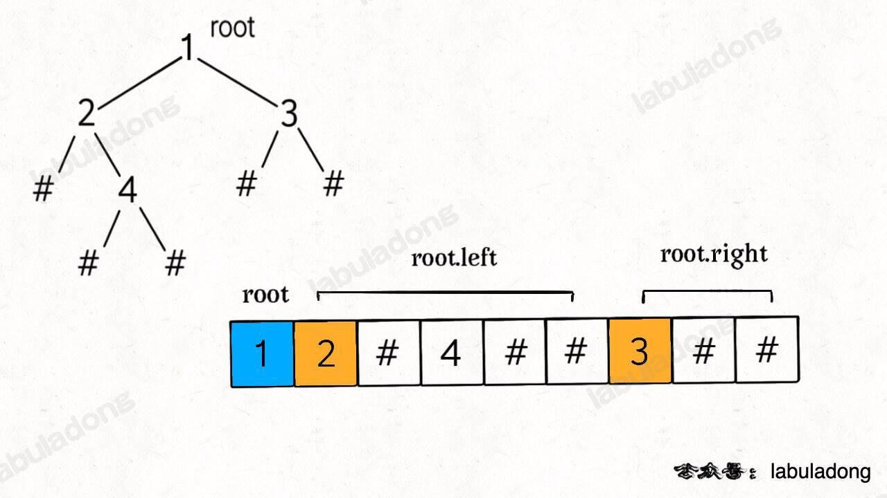
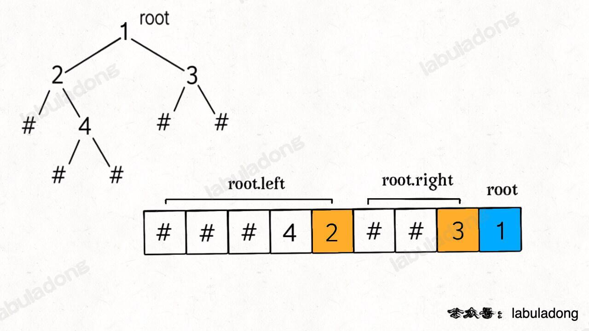
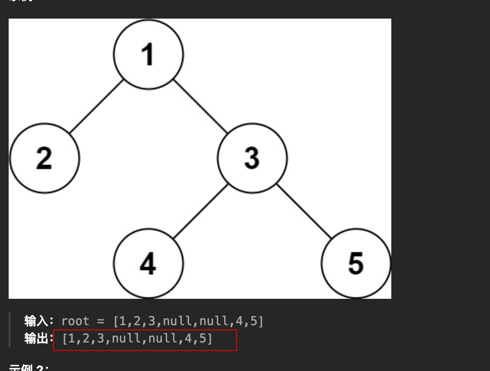
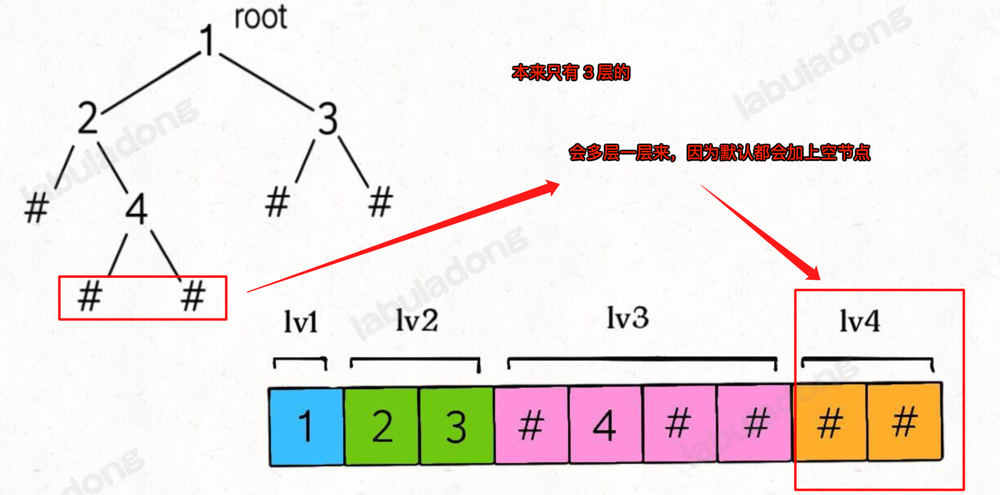

# 二叉树的序列化与反序列化

`#二叉树的序列化` `#二叉树的构造`

> [297. 二叉树的序列化与反序列化](https://leetcode.cn/problems/serialize-and-deserialize-binary-tree/)


## 目录
<!-- toc -->
 ## 1. 分析 

- 序列化：
	- root 转成 字符串 `"1,2,#,#,#,#,#,#"` 的格式
- 反序列化：
	- 即 `字符串` 转成 `二叉树对象`
	- 即 ==构造二叉树==
- 注意点：必须配对，不能序列化使用前序，而反序列化使用后序
	- 想想就清楚了
- 加上节点后，其实你就可以把这棵树理解为==满二叉树了==

## 2. 前序遍历的思路

- 序列化：正常前序遍历
	- 碰到为空的场景，`push("#")`
- 反序列化：
	- 即根据前序遍历结果，==还原==一颗二叉树
	- 重点：==因为前序遍历结果记录空指针，所以能够唯一还原一个二叉树==

>  至少要得到前、中、后序遍历中的两种互相配合才能还原二叉树。那是因为前文的遍历结果==没有记录空指针==的信息。
>  这里的 `nodes` 列表包含了空指针的信息，所以只使用 `nodes` 列表就可以还原二叉树



### 2.1. 序列化

```javascript hl:5
/**
 * Encodes a tree to a single string.
 *
 * @param {TreeNode} root
 * @return {string}  比如： "1,2,#,#,4,#,#,#,#";
 */
var serialize = function (root) {
  let res = [];
  function traverse(root) {
    if (!root) {
      res.push("#");
      return;
    }
    res.push(root.val);
    traverse(root.left);
    traverse(root.right);
  }
  traverse(root);

  return res.join(",");
};
```

### 2.2. 反序列

```javascript
/**
 * Decodes your encoded data to tree.
 *
 * @param {string} data 字符串
 * @return {TreeNode}  "1,2,#,#,#,#,#,#" → 转成 node 节点，本质上就是构造一颗二叉树
 */
var deserialize = function (data) {
  console.log("data:", data);
  let arr = data.split(",");

  return build(arr);
  function build(arr) {
    if (arr.length === 0) return null;
    let first = arr.shift();
    
    if (first === "#") return null;
    
    let root = new TreeNode(parseInt(first));
    root.left = build(arr);
    root.right = build(arr);
    return root;
  }
};
```

## 3. 中序遍历的思路

- 序列化可以，换个位置而已
- 但无法实现反序列化

## 4. 后序遍历的思路

- 序列化可以，换个位置而已
- 反序列，如下图，一样的思路，
	- ==根据后序遍历结果（包括空指针）构造一颗二叉树==
	- 只不过，每次取值时，`pop` 即可，不是 `shift` 



## 层次遍历思路

### 序列化

- 会多出一层来，别被下图无界了
	- 
		- 上图中，觉得序列化的结果应该是 `1,2,3,#,#,5`
			- 但其实是：`1,2,3,#,#,5,#,#,#,#` 
				- 多出一层，又比如下图
					- 


```javascript
var serialize = function (root) {
  let res = [];
  let q = [root];
  while (q.length) {
    let size = q.length;
    for (let i = 0; i < size; i++) {
      let node = q.shift();
      if (!node) {
        res.push("#");
        continue;
      }
      res.push(node.val);
      q.push(node.left);
      q.push(node.right);
    }
  }
  return res.join(",");
};
```

### 反序列化

- 关键点： `if (data === "#") return null;`
	- 搞了很久，因为 base case有问题
- 构造树一定包括
	- 构造 root
	- 构造 left
	- 构造 right
	- 因为这个层次遍历，没有递归遍历左右子树

```javascript
var deserialize = function (data) {
  console.log("data:", data);
  // 1. 处理空树情况
  if (data === "#") return null;
  let arr = data.split(",");
  let root = new TreeNode(parseInt(arr[0]));
  let q = [root];
  let index = 1;
  while (q.length) {
    let size = q.length;
    for (let i = 0; i < size; i++) {
      let node = q.shift();
      // 构造左树
      let left = arr[index++];
      console.log("left***", left);
      if (left !== "#") {
        node.left = new TreeNode(parseInt(left));
        q.push(node.left);
      }
      // 构造右树
      let right = arr[index++];
      if (right !== "#") {
        node.right = new TreeNode(parseInt(right));
        q.push(node.right);
      }
    }
  }
  return root;
};
```

## 5. 附：各种遍历是否能够确定二叉树

| 遍历组合      | 是否可以唯一确定树    |
| --------- | ------------ |
| 仅前序       | 否            |
| 仅中序       | 否            |
| 仅后序       | 否            |
| 前序+中序     | 是            |
| 中序+后序     | 是            |
| 前序+后序     | 不一定（取决于树的结构） |
| 前序（包括空指针） | 是            |
| 后序（包括空指针） | 是            |
| 中序（包括空指针） | 否            |

## 6. 更多

- https://labuladong.online/algo/data-structure/serialize-and-deserialize-binary-tree/