# 跨端（PC、移动端、小程序、Web 等）

`#跨端` 

> 源于个人的某次分享


## 目录
<!-- toc -->
 ## 1. 端场景 

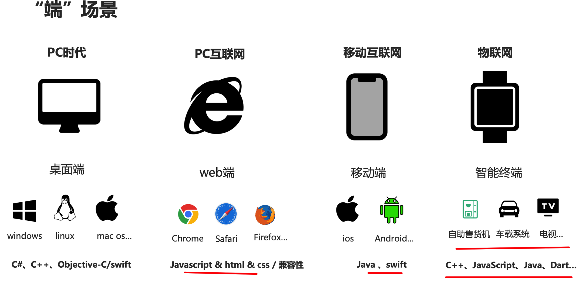

## 2. 当前市面上跨端技术

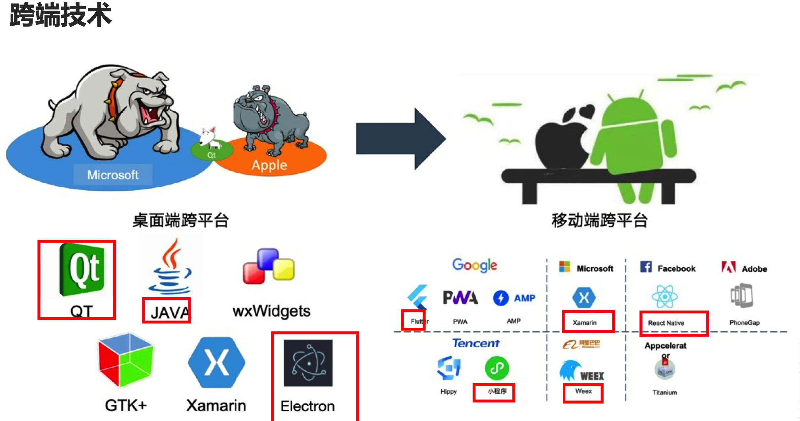

## 3. PC 跨端

### 3.1. 基于 Web 技术的跨端方案

#### 3.1.1. Electron

>  它的的性能上限是 `vscode`

 最成熟和广泛使用的跨端框架
 
- 优点：
	- 开发体验好，可直接使用 Web 技术栈
	- 生态系统成熟，大量现成解决方案
	- 跨平台支持完善
- 缺点：
	- 应用体积较大
	- 内存占用高
	- 性能相对较差

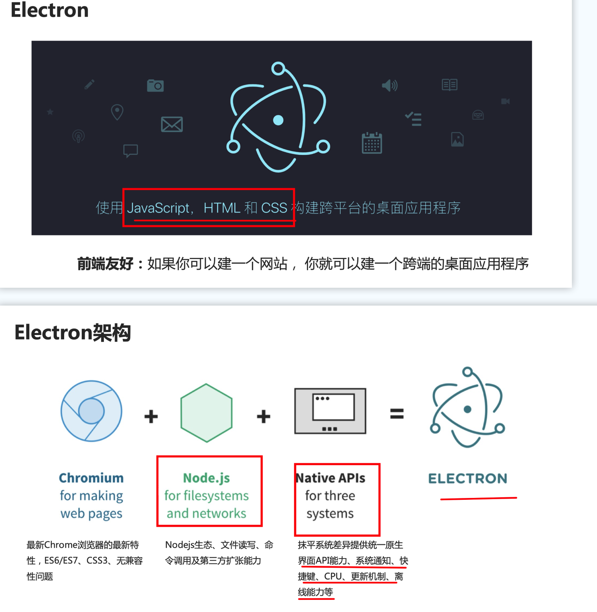

#### 3.1.2. Tauri

- 新一代跨端框架
- 优点：
	- 性能更好，内存占用更低
	- 应用体积小（通常比 **Electron 小 10-20 倍**）
	- 安全性更高，默认采用更严格的安全策略
- 缺点：
	- 生态相对不够成熟
	- 学习曲线较陡（需要了解 Rust）
	- 某些特性的实现相对复杂

#### 3.1.3. Tauri 为什么能够比 Electron 小这么多

- Electron
	- 每个 Electron 应用都会打包**完整的 Chromium 引擎（约 150MB+）**
	- 包含完整的 Node.js 运行时
		- 比如 npm 依赖包 就很大啊
	- 所有依赖都需要打包进应用中
- tauri
	- 使用**系统原生的 WebView**
	    - Windows：使用 Edge WebView2
	    - macOS：使用 WebKit
	    - Linux：使用 WebKitGTK
	- 核心使用 Rust 编写，体积小且高效
	- 不包含额外的运行时环境
	- 所以
		- 不需要打包 Chromium（节省约 150MB）
		- 不需要 Node.js 运行时（节省约 20MB）
		- 更高效的资源打包方式（节省约 5-10MB）

### 3.2. 原生跨平台框架

#### 3.2.1. Flutter Desktop

- Google 推出的全平台框架
- 特点：
	- 单一代码库支持所有平台
	- 高性能渲染引擎
	- 丰富的 UI 组件库
	- 热重载支持
- 适用场景：
	- 需要高性能和一致 UI 体验的应用 

#### 3.2.2. .NET MAUI

- 微软的跨平台框架
- 特点：
	- 支持 Windows、macOS
	- 与 .NET 生态深度集成
	- 原生性能
	- XAML 布局系统
- 适用场景：企业级应用开发，特别是已有 `.NET` 技术栈的团队 

### 3.3. 混合开发框架

#### 3.3.1. Qt

- 传统且强大的跨平台框架
- 特点：
	- 高性能
	- 原生外观
	- 完善的工具链
	- 支持多种编程语言
- 适用场景：对性能要求高的专业软件 

### 3.4. 各框架对比

#### 3.4.1. 性能对比

```
性能排名（从高到低）：
1. Qt/原生应用
2. Tauri
3. Flutter Desktop
4. Electron
```

#### 3.4.2. 开发效率对比

```
开发效率（从高到低）：
1. Electron
2. Flutter
3. Tauri
4. Qt
```

### 3.5. 应用场景选择

- **Web 技术栈团队**：
	- 轻量级应用：选择 Tauri
	- 复杂应用：选择 Electron 
- **性能敏感场景**：
	- 专业软件：选择 Qt
	- 通用应用：选择 Tauri 或 Flutter
- **.NET 技术栈**：
	- 企业应用：选择 .NET MAUI
	- 跨平台需求：考虑 Avalonia

#### 3.5.1. 选择建议

- **如果你是 Web 开发者**：
	- 小型应用推荐 Tauri
	- 大型应用或需要大量第三方库支持时推荐 `Electron`
- **如果你需要最好的性能**：
	- 考虑 Qt 或 Tauri
- **如果你需要漂亮的 UI 和良好的开发体验**：
	- 考虑 Flutter Desktop
- **如果你是 .NET 开发者**：
	- 考虑 .NET MAUI 或 Avalonia

## 4. 移动端跨端

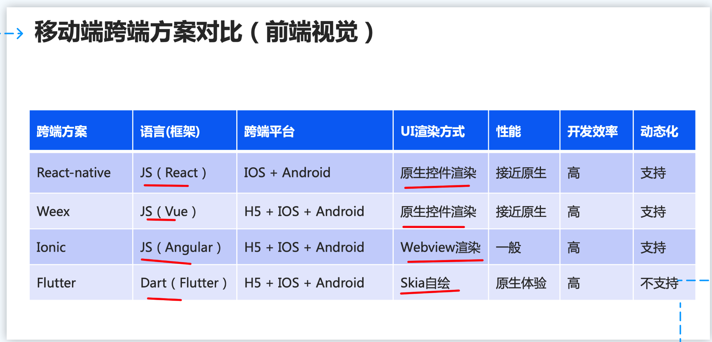

### 4.1. 贝壳的 Flutter 实践分享

#### 4.1.1. 接入方案

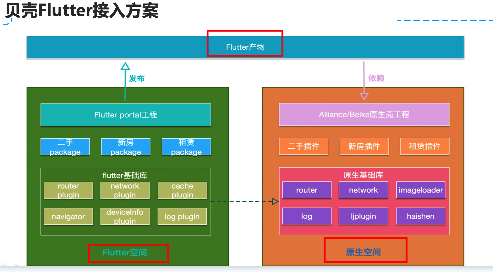

- 两个空间
	- flutter 空间
	- 原生空间

#### 4.1.2. 开发模式：业务空间

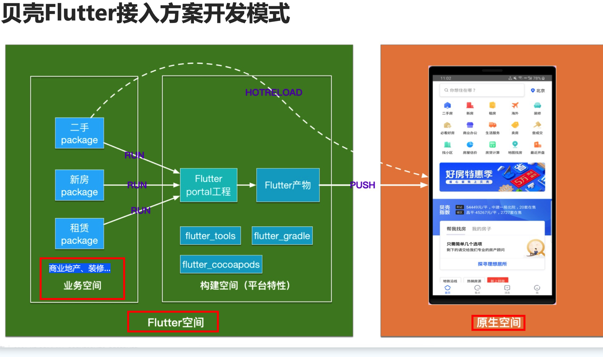

#### 4.1.3. 工程组织

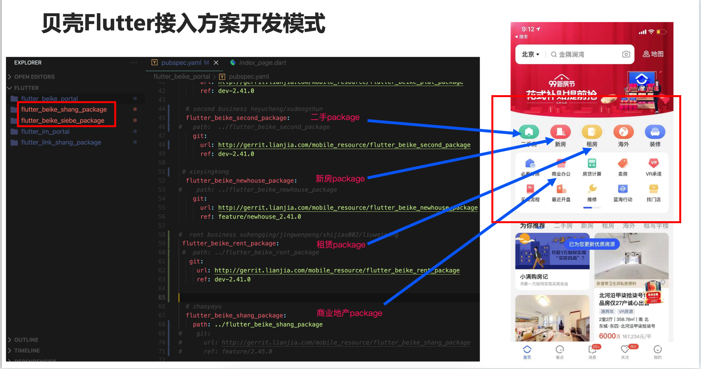

#### 4.1.4. 接入特点

- 业务分离
- 平台分离：
	- 只需要会 dart 和 flutter api
- 支持热重载
- 集成无感

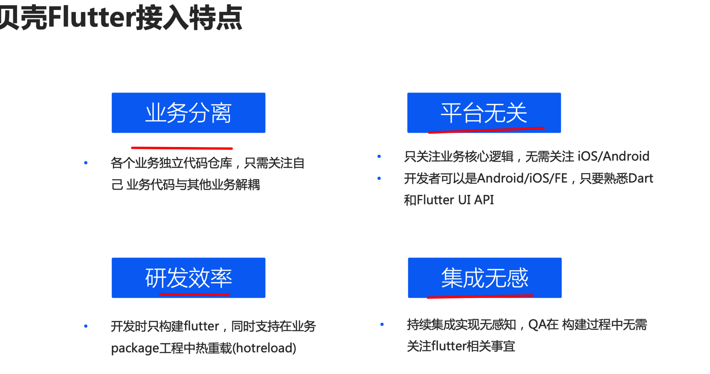

#### 4.1.5. Flutter H5 应用

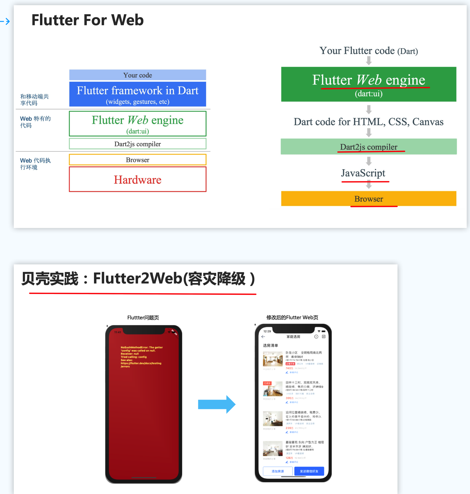

### 4.2. 小程序

#### 4.2.1. 能做什么

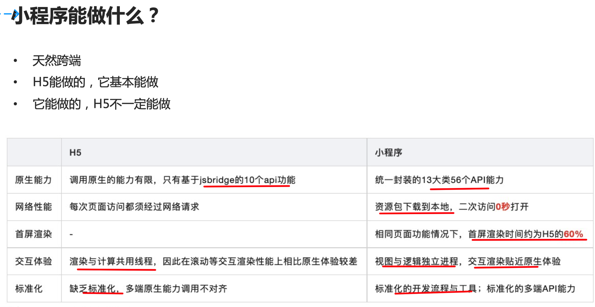

#### 4.2.2. 性价比最高 

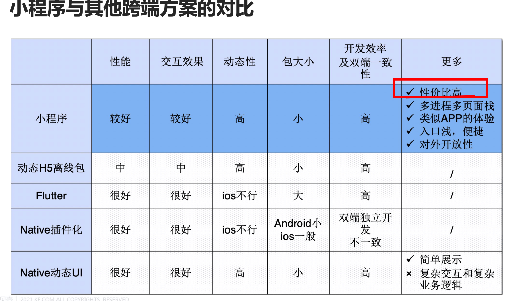

### 4.3. 小程序解决方案

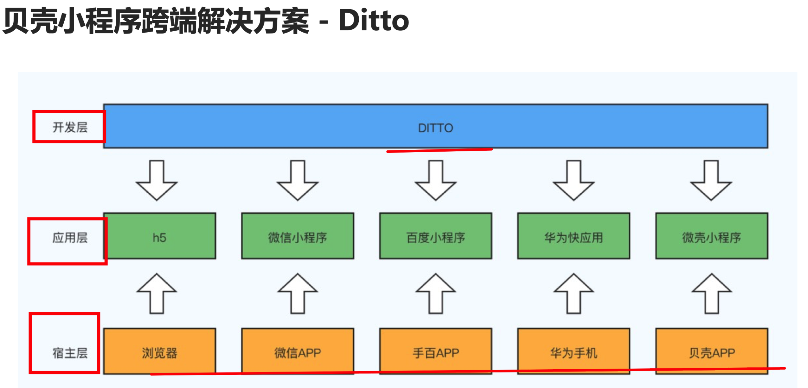

- taro 
- uni-app

## 5. 跨端技术演进

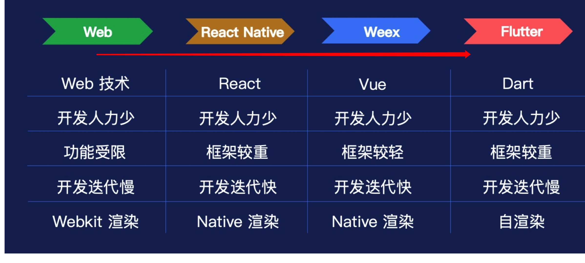

## 6. 演进平衡点：`性能体验`与`研发效率/动态性` 的平衡

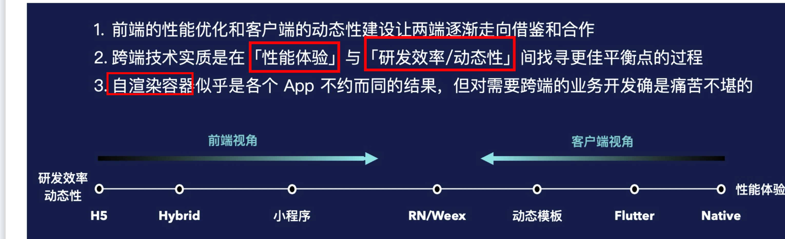

## 7. 前端能进入的场

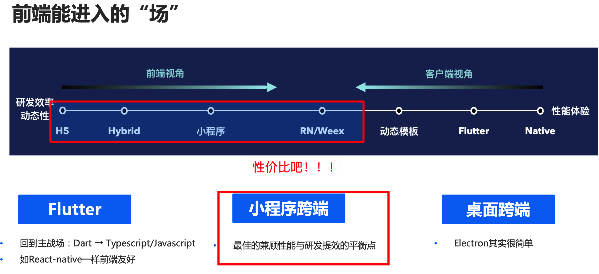

