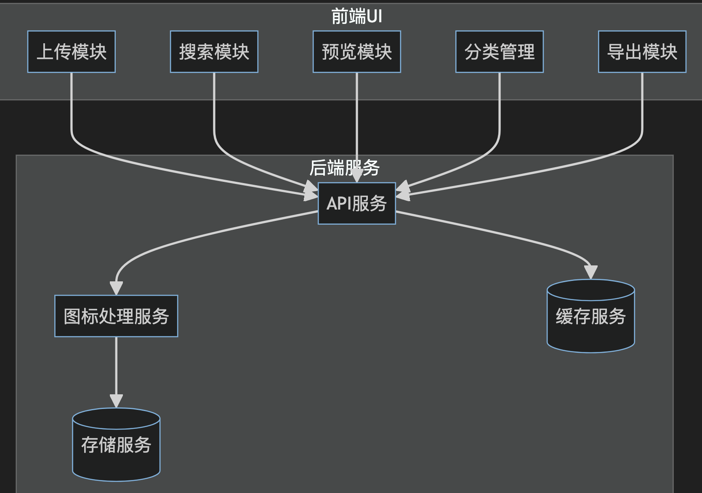
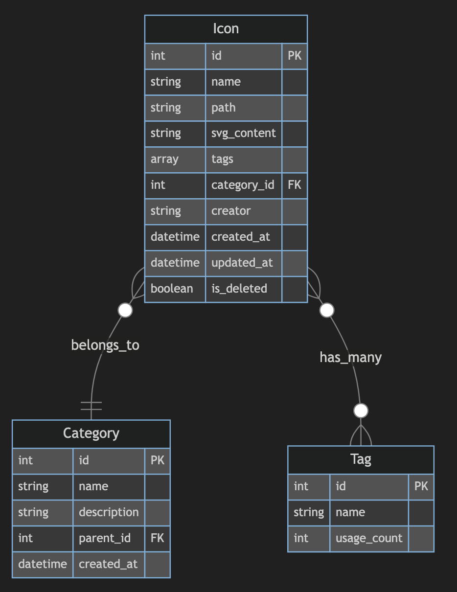

# 图标库管理系统设计

`#系统设计` `#前端系统设计` 

## 目录
<!-- toc -->
 ## 1. 总结 

> 略

## 2. 前后端模块及服务架构图

## 3. 数据库设计

## 4. 功能清单列举

- 图标上传处理
	- 处理 SVG
		- 移除无用属性
		- 压缩路径
		- 标准化色值
	- 处理 PNG
	- 提取元信息
		- 尺寸
		- 颜色信息
		- 复杂度
- 搜索功能实现
	- 分词处理
	- 执行搜索
	- 结果排序和评分
- 性能优化：
	- 使用 `CDN` 分发图标资源
	- 实现图标懒加载
	- 使用 `WebP` 格式优化预览图
	- 实现客户端缓存策略
- 用户体验：
	- 支持拖拽上传
	- 提供批量操作功能
	- 实现快捷键操作
	- 支持预览大图
- 安全性：
	- 文件上传验证
	- 防止XSS攻击
	- 访问权限控制
	- 操作日志记录
- 可扩展性：
	- 支持插件系统
	- 提供API接口
	- 支持自定义主题
	- 多语言支持
- 部署和监控：
	- 部署策略：
		- 使用容器化部署
		- 实现自动化部署
		- 配置 CDN
		- 实现负载均衡
	- 监控指标：
		- 系统性能监控
		- 用户行为分析
		- 错误日志收集
		- 资源使用监控

