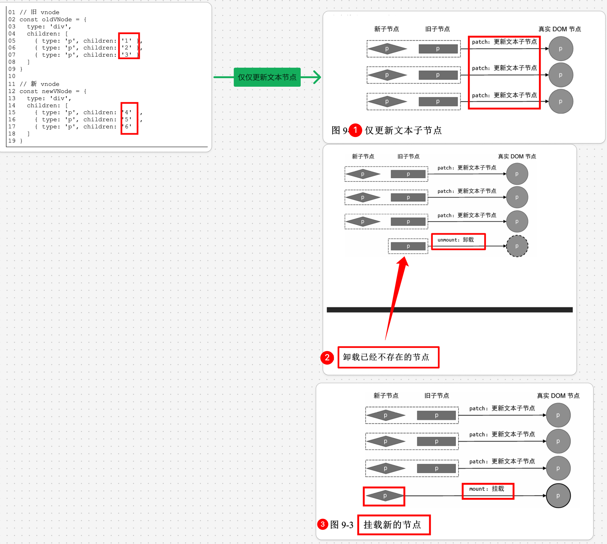

# Vue3 的 diff 算法

`#vue` `#R2` 


>  - [41. React 的 Diff 算法](/post/xnovmtPU.html)
>  - [14. Vue3 的 Diff 算法复杂的分析](/post/nqGBNMVr.html)


## 目录
<!-- toc -->
 ## 1. 总结 

### 1.1. 快速 Diff 算法 + 最长递增子序列

是一种**同级节点间的比较算法**

#### 1.1.1. 原理

主要分为以下步骤：
1. 预处理：处理**新旧两组节点的头尾节点**
2. 特殊处理：处理**新增和删除**的情况
3. 最长递增子序列：处理**未知子序列**

#### 1.1.2. 优势

1. 预处理优化：
    - 快速处理头尾相同的节点
    - 减少需要处理的节点数量
2. 空间复杂度优化：
    - 使用 Map 存储索引映射
    - 避免多余的数组操作
3. 时间复杂度优化：
    - 最长递增子序列算法优化移动操作
    - 减少 DOM 操作次数
4. 内存优化：
    - 复用已有节点
    - 最小化 DOM 操作

### 1.2. 快速 Diff 算法 和 双端 Diff 算法的区别

#### 1.2.1. 基本原理对比

双端 Diff 算法：→ ==vue 2==
- 同时对新旧两组节点的头尾进行比较（4 种比较方式）
- 需要维护 4 个指针（新头、新尾、旧头、旧尾）
快速 Diff 算法： → ==vue3==
- 只处理头尾相同的节点
- 然后处理剩余未知序列，使用**最长递增子序列**优化移动

#### 1.2.2. 算法复杂度对比

- 双端 Diff：
	- 时间复杂度相对较高
	- 需要进行 4 次比较
- 快速 Diff：
	- 只需处理头尾相同节点
	- 使用 Map 优化查找过程

#### 1.2.3. 节点移动策略

- 双端 Diff：
	- 可能产生多次DOM操作
	- 逐个移动节点
- 快速 Diff：
	- 使用最长递增子序列
	- 最小化移动操作

#### 1.2.4. 性能对比

```js
// 场景1：节点顺序变化
// 原始顺序：[1, 2, 3, 4, 5]
// 新顺序：[1, 3, 2, 4, 5]

// 双端 Diff
// 需要多次比较和移动操作

// 快速 Diff
// 1. 处理头部 [1]
// 2. 处理尾部 [4, 5]
// 3. 使用最长递增子序列处理 [2, 3]
```

#### 1.2.5. 适用场景

 双端 Diff 适合：
 
```js
// 1. 对称性变化
const oldNodes = ['A', 'B', 'C', 'D']
const newNodes = ['D', 'C', 'B', 'A']

// 2. 小规模列表更新
const oldList = ['item1', 'item2', 'item3']
const newList = ['item2', 'item3', 'item1']
```

快速 Diff 适合：

```js
// 1. 大规模列表更新
const oldList = [/* 大量数据 */]
const newList = [/* 大量数据 */]

// 2. 带有明显头尾相同部分的更新
const oldNodes = ['A', 'B', 'C', 'D', 'E']
const newNodes = ['A', 'B', 'X', 'Y', 'E']
```

#### 1.2.6. 优缺点总结

双端 Diff：
- 优点：
	- 实现相对简单
	- 对小规模更新效果好
- 缺点：
	- 需要多次比较
	- 性能可能不如快速 Diff
快速 Diff：
- 优点：
	- 性能更好
	- 移动操作最小化
- 缺点：
	- 实现相对复杂
	- 需要额外的空间存储索引映射

### 1.3. Vue2 和 Vue3 的选择

- Vue 2.x 使用的是**双端 Diff 算法**
- Vue 3.x 改用了**快速 Diff 算法 +  最长递增子序列**
	- 最长递增子序列排序的依据是
		- ==节点的索引==
			- 则需要`根据节点的索引关系，构造出一个最长递增子序列`
			- 最长递增子序列所指向的节点即为==不需要移动的节点==


> 以上是总结内容，下面看看如何 Vue 的 Diff 优化思路

## 2. 不做任何 diff 优化 的渲染

看个例子，由 `vnode1` 变成 `vnode2` ，如果按照 [12. Vue3 渲染器的原理和实现](/post/yfbT1DXt.html) 中的简易实现，即 `先卸载所有，再挂载所有`，那么：我们需要 `8 次 DOM 操作`

- 卸载所有旧子节点，需要 3 次 DOM 删除操作
- 挂载所有新子节点，需要 3 次 DOM 添加操作

```javascript
const VNode1 = {
    type: 'div',
    children: [
        {type: 'p', children: '1'},
        {type: 'p', children: '2'},
        {type: 'p', children: '3'},
    ]
}

const VNode2 = {
    type: 'div',
    children: [
        {type: 'p', children: '4'},
        {type: 'p', children: '5'},
        {type: 'p', children: '6'},
    ]
}
```

如果，我们做 diff 算法，我们发现，上面的 vnode 只是 `文本内容`发生了变化，所以只需要更新文本节点即可，最终只需要 `3 次 DOM 操作`

所以，对于 `这新旧两组节点`，我们以下优化策略：

- 比较新旧两组节点的个数，新组节点多，则说明有新的节点需要挂载，否则有旧的节点需要卸载
- 另外，我们需要 `遍历长度较段的节点`，进行 `patch`，保证尽可能多的 patch，避免更多的 DOM 操作



## 3. 简单 Diff 算法：考虑可复用 DOM ，减少 DOM 操作

还是看个例子，按照上面的优化策略，还是得 `6 次 DOM 操作` 
- 但是我们发现，其实每个节点的区别仅仅在于 `位置移动了`
- 所以我们需要考虑如何**复用** DOM，而不是`销毁了重建`

```javascript
const vNode1 = {
    type: 'div',
    children: [
        {type: 'p', children: '4'},
        {type: 'div', children: '2'},
        {type: 'h1', children: '1'},
        {type: 'span', children: '3'}
    ]
}

const vNode2 = {
    type: 'div',
    children: [
        {type: 'div', children: '2'},
        {type: 'span', children: '3'},
        {type: 'p', children: '4'},
        {type: 'h1', children: '1'}
    ]
}

```

基于上，我们需要思考：

### 3.1. 如何找可复用的节点？

答案是唯一 `key` , 最简单的方式，我们遍历（嵌套遍历）新旧节点，然后找到 `key 相同`的新旧节点，然后打补丁 `patch(oldNode , newNode)` ，换另外一种说明，即拿着一组节点，去旧节点组中查找，是否有可复用的节点，复用的依据是` key` ，下面是代码描述：

```javascript hl:8
 // 遍历新的 children
  for (let i = 0; i < newChildren.length; i++) {
    const newVNode = newChildren[i]
    let j = 0
    // 遍历旧的 children
    for (j; j < oldChildren.length; j++) {
      const oldVNode = oldChildren[j]
      // 如果找到了具有相同 key 值的两个节点，则调用 `patch` 函数更新之
      if (newVNode.key === oldVNode.key) {
        patch(oldVNode, newVNode, container)
        break // 这里需要 break
      }
    }
  }
```

### 3.2. 如何判断节点是否需要移动？

这里直接给结论，初始化`最大索引值为 0`，拿着新的节点，尝试去旧的节点组去找具有相同` key` 值的，更新 `最大索引值`；如果后续后续查找过程中，在旧的的节点组中招到的索引 小于 这个 `最大索引值`，则需要移动。

代码描述如下图：


下面是具体代码：

```javascript
  const oldChildren = n1.children
  const newChildren = n2.children
  // 遍历新的 children
  for (let i = 0; i < newChildren.length; i++) {
    const newVNode = newChildren[i]
    let j = 0
    // 遍历旧的 children
    for (j; j < oldChildren.length; j++) {
      const oldVNode = oldChildren[j]
      // 如果找到了具有相同 key 值的两个节点，则调用 `patch` 函数更新之
      if (newVNode.key === oldVNode.key) {
        patch(oldVNode, newVNode, container)
        if (j < lastIndex) {
          // 需要移动
        } else {
          // 更新 lastIndex
          lastIndex = j
        }
        break // 这里需要 break
      }
    }
  }
```

上面的 `patch 代码`，因为可以`复用DOM`，所以会在 `pathElement` 中把 `DOM 引用（ 即oldNode.el ）`直接给新的节点，达到复用的效果，如下代码：

```javascript hl:2
function patchElement(n1, n2) {
    const el = n2.el = n1.el
    // 。。。 其他代码
}
```

### 3.3. 如何移动可复用节点？

首先，移动节点，移动的是`真实的 DOM`，你想嘛，要复用DOM 节点嘛。所以，会调用 DOM `insertBefore(el, anchor)`操作

如下图：


最终代码：

```javascript
      const oldChildren = n1.children
      const newChildren = n2.children
      let lastIndex = 0
      // 遍历新的 children
      for (let i = 0; i < newChildren.length; i++) {
        const newVNode = newChildren[i]
        let j = 0
        let find = false
        // 遍历旧的 children
        for (j; j < oldChildren.length; j++) {
          const oldVNode = oldChildren[j]
          // 如果找到了具有相同 key 值的两个节点，则调用 `patch` 函数更新之
          if (newVNode.key === oldVNode.key) {
            find = true
            patch(oldVNode, newVNode, container)
            if (j < lastIndex) {
              // 需要移动
              const prevVNode = newChildren[i - 1]
              if (prevVNode) {
                const anchor = prevVNode.el.nextSibling
                insert(newVNode.el, container, anchor)
              }
            } else {
              // 更新 lastIndex
              lastIndex = j
            }
            break // 这里需要 break
          }
        }
```

`insert` 依赖于原生 `insertBefore` 方法，如下：

```javascript
insert(el, parent, anchor = null) {
    parent.insertBefore(el, anchor)
},
```

### 3.4. 如何添加新节点

如下图：


直接看代码，注意解释部分：


具体代码部分：

```javascript
if (!find) {
    const prevVNode = newChildren[i - 1]
    let anchor = null
    if (prevVNode) {
        anchor = prevVNode.el.nextSibling // 下一个兄弟节点
    } else {
        anchor = container.firstChild // 是第一个元素
    }
    patch(null, newVNode, container, anchor)
}
```

### 3.5. 删除不存在的元素


这个时候，我们需要遍历 `旧的节点组`，代码如下：

```javascript

// 遍历旧的节点
for (let i = 0; i < oldChildren.length; i++) {
    const oldVNode = oldChildren[i]
    // 拿着旧 VNode 去新 children 中寻找相同的节点
    const has = newChildren.find(
        vnode => vnode.key === oldVNode.key
    )
    if (!has) {
        // 如果没有找到相同的节点，则移除
        unmount(oldVNode)
    }
}
```

### 3.6. 总结

- Diff 算法用来计算`两组子节点`的差异，并试图最大程度地复用 DOM 元素。
- 遍历新旧两组子节点中`数量较少`的那一组，并逐个调用 patch 函数进行打补丁，然后比较新旧两组子节点的数量
	- 如果新的一组子节点数量更多，说明有新子节点需要挂载
	- 否则说明在旧的一组子节点中，有节点需要卸载
- 虚拟节点中 key 属性的作用，它就像虚拟节点 的“身份证号”。
	- 在更新时，渲染器通过 key 属性找到`可复用`的节点， 
	- 然后尽可能地通过 DOM 移动操作来完成更新，避免过多地对 DOM 元素进行销毁和重建。
- 简单 Diff 算法的核心逻辑是，拿新的一组子节点中的节点去旧的一组子节点中寻找可复用的节点。
	- 如果找到了，则记录该节点的`位置索引`。我们把这个位置索引称为`最大索引`。
	- 在整个更新过程中，如果一个节点的索引值`小于`最大索引，则说明该节点对应的真实 DOM 元素需要移动。

## 4. 双端 Diff 算法

### 4.1. 先看看一个示例

如下图，如果使用前文所使用的的 简易 Diff 算法，那么需要移动 `两次 DOM 操作`


但其实，我只需要`移动一次DOM`即可，即 把 P3 移动 P1 后面 即可，如下图：


### 4.2. 理想情况双端算法处理

具体双端算法流程图，参考 `fj`
[https://www.figma.com/file/hT9k2YbVvV1UIITtUmbJ0C/2023.05.LOG?type=whiteboard&node-id=167-296&t=i3ztBjIOmSVuaLfT-4](https://www.figma.com/file/hT9k2YbVvV1UIITtUmbJ0C/2023.05.LOG?type=whiteboard&node-id=167-296&t=i3ztBjIOmSVuaLfT-4)

部分代码如下：

```javascript hl:12
function patchKeyedChildren(n1, n2, container) {
    const oldChildren = n1.children
    const newChildren = n2.children
    let oldStartIdx = 0
    let oldEndIdx = oldChildren.length - 1
    let newStartIdx = 0
    let newEndIdx = newChildren.length - 1
    let oldStartVNode = oldChildren[oldStartIdx]
    let oldEndVNode = oldChildren[oldEndIdx]
    let newStartVNode = newChildren[newStartIdx]
    let newEndVNode = newChildren[newEndIdx]
    while (oldStartIdx <= oldEndIdx && newStartIdx <= newEndIdx) {
        //  第1步：
        if (oldStartVNode.key === newStartVNode.key) {
            patch(oldStartVNode, newStartVNode, container)
            oldStartVNode = oldChildren[++oldStartIdx]
            newStartVNode = newChildren[++newStartIdx]
        //  第2步：	
        } else if (oldEndVNode.key === newEndVNode.key) {
            patch(oldEndVNode, newEndVNode, container)
            oldEndVNode = oldChildren[--oldEndIdx]
            newEndVNode = newChildren[--newEndIdx]
        //  第3步：	
        } else if (oldStartVNode.key === newEndVNode.key) {
            patch(oldStartVNode, newEndVNode, container)
            insert(oldStartVNode.el, container, newEndVNode.el.nextSibling)
            oldStartVNode = oldChildren[++oldStartIdx]
            newEndVNode = newChildren[--newEndIdx]
        //  第4步：
        } else if (oldEndVNode.key === newStartVNode.key) {
            // 步骤四：oldEndVNode 和 newStartVNode 比对
            patch(oldEndVNode, newStartVNode, container)
            insert(oldEndVNode.el, container, oldStartVNode.el)
            oldEndVNode = oldChildren[--oldEndIdx]
            newStartVNode = newChildren[++newStartIdx]
        }else{
            //********* 非理想情况下 *********
        }
    }
}
```

是的，双端，4 个指针，按照一定规则移动，但上面代码中 `else部分` 是干啥的 ？ 看下面图：


前 4 步骤都没法命中，所以才需要`在 else 里`处理。

### 4.3. 非理想情况下双端算法

看流程图：
[https://www.figma.com/file/hT9k2YbVvV1UIITtUmbJ0C/2023.05.LOG?type=whiteboard&node-id=169-371&t=i3ztBjIOmSVuaLfT-4](https://www.figma.com/file/hT9k2YbVvV1UIITtUmbJ0C/2023.05.LOG?type=whiteboard&node-id=169-371&t=i3ztBjIOmSVuaLfT-4)
部分代码截图：


上面第 5 步，如果找不到可以复用的节点呢？ 说明需要`添加节点`了，见下面：

### 4.4. 新增元素


[https://www.figma.com/file/hT9k2YbVvV1UIITtUmbJ0C/2023.05.LOG?type=whiteboard&node-id=169-503&t=i3ztBjIOmSVuaLfT-4](https://www.figma.com/file/hT9k2YbVvV1UIITtUmbJ0C/2023.05.LOG?type=whiteboard&node-id=169-503&t=i3ztBjIOmSVuaLfT-4)

### 4.5. 移动元素


详见流程图：
[https://www.figma.com/file/hT9k2YbVvV1UIITtUmbJ0C/2023.05.LOG?type=whiteboard&node-id=169-542&t=i3ztBjIOmSVuaLfT-4](https://www.figma.com/file/hT9k2YbVvV1UIITtUmbJ0C/2023.05.LOG?type=whiteboard&node-id=169-542&t=i3ztBjIOmSVuaLfT-4)

### 4.6. 最后总结

- 顾名思义，双端 Diff 算法指的是，在新旧两组子节点的四个端点之间分别进行比较， 并试图找到可复用的节点
- 相较于`简单 Diff 算法`，`双端Diff 算法`的优势在于
	- 同样的更新场景，执行的 DOM 操作更少一点而已。

## 5. 快速 Diff 算法 + 最长递增子序列

Vue3 是通过`双端对比`+`最长递增子序列算法`得出**最小的更新消耗**。下面我们先看看 `快速 Diff 算法`

### 5.1. 相同的前置元素和后置元素


### 5.2. 添加的节点的情况

[https://www.figma.com/file/hT9k2YbVvV1UIITtUmbJ0C/2023.05.LOG?type=whiteboard&node-id=189-731&t=2Hh2yCqllM2zgzaD-4](https://www.figma.com/file/hT9k2YbVvV1UIITtUmbJ0C/2023.05.LOG?type=whiteboard&node-id=189-731&t=2Hh2yCqllM2zgzaD-4)

### 5.3. 删除节点的情况

[https://www.figma.com/file/hT9k2YbVvV1UIITtUmbJ0C/2023.05.LOG?type=whiteboard&node-id=189-695&t=2Hh2yCqllM2zgzaD-4](https://www.figma.com/file/hT9k2YbVvV1UIITtUmbJ0C/2023.05.LOG?type=whiteboard&node-id=189-695&t=2Hh2yCqllM2zgzaD-4)

### 5.4. 更复杂的情况

[https://www.figma.com/file/hT9k2YbVvV1UIITtUmbJ0C/2023.05.LOG?type=whiteboard&node-id=189-731&t=2Hh2yCqllM2zgzaD-4](https://www.figma.com/file/hT9k2YbVvV1UIITtUmbJ0C/2023.05.LOG?type=whiteboard&node-id=189-731&t=2Hh2yCqllM2zgzaD-4)

### 5.5. 最后

`快速 Diff 算法`在实测中性能最优。它借鉴了`文本 Diff 中`的 `预处理思路`，
1. 先处理`新旧两组子节点`中`相同的前置节点`和`相同的后置节点`。 
2. 当前置节点和后置节点全部处理完毕后，
	- 如果**无法简单地通过挂载新节点或者卸载已经不存在的节点**来完成更新
		- 则需要`根据节点的索引关系，构造出一个最长递增子序列`。
			- `最长递增子序列所指向的节点`即为`不需要移动的节点`。

