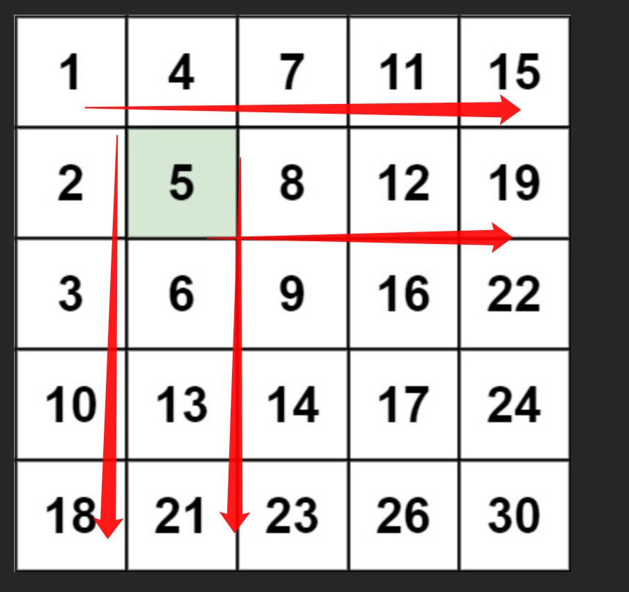

# 搜索二维矩阵 II：行递增、列递增


>  [240. 搜索二维矩阵 II](https://leetcode.cn/problems/search-a-2d-matrix-ii/)





## 目录
<!-- toc -->
 ## 思路 

- 不要从**左上角**开始，而是从**右上角**开始
- 规定只能**向左或向下**移动
	- 如果向左移动，元素在减小
	- 如果向下移动，元素在增大
		- 

## 代码

```javascript
var searchMatrix = function (matrix, target) {
  let m = matrix.length,
    n = matrix[0].length;
  // 初始化在右上角
  let i = 0,
    j = n - 1;
  while (i < m && j >= 0) {
    if (matrix[i][j] === target) {
      return true;
    }
    if (matrix[i][j] < target) {
      // 需要大一点，往下移动
      i++;
    } else {
      // 需要小一点，往左移动
      j--;
    }
  }
  // while 循环中没有找到，则 target 不存在
  return false;
};

```

## 相关题目

- [74. 搜索二维矩阵：打平成一维也严格递增](/post/gNK4bQAR.html)