# 调研：编辑器&设计态如何设计?

`#lowcode` 

## 目录
<!-- toc -->
 ## 1. Amis：设计态渲染有什么不一样？ 

- 编辑器在渲染 `amis` 配置的时候，会把所有的 json（配置） 节点都自动加个 `$$id` 唯一 id。然后复写了 `rendererResolver` 方法。
- 某个节点 `{type: 'xxxx'}` 在找到对应 amis 组件渲染前，都会调用这个方法。 这个方法会在渲染之前，基于 schema、渲染器信息，通过插件去收集编辑器信息
	- 如果收集到了，会额外的通过一个 `Wrapper` 包裹。
	- 这个 `Wrapper` 主要是自动把 `$$id` 写入到 dom 的属性上`data-editor-id="$$id"`。
	- 这样鼠标点击的时候，能够根据 dom 上的标记知道是哪个 json 节点，同时根据渲染器编辑器信息，能够生成对应的配置面板，并把对应 json 的节点做配置修改。
	- 有些组件是带区域的，所以除了 dom 上标记节点信息外，还需要标记区域信息。节点能够通过 `Wrapper` 自动包裹来实现，但是区域则不能，这个要去分析组件本身是怎么实现。
	- 最终目的是要通过 `RegionWrapper` 去包裹对应 JSX.Element 来完成标记。这个 `RegionWrapper` 会自动完成 dom 的标记 `data-region="xxx" data-region-host="$$id"`，这样点击到这个 dom 的时候，能知道是哪个组件的哪个区域，这样就能往里面拖入新组件。

左侧的组件列表主要是将收集到的渲染器编辑器信息做个汇总展示，可拖入到指定区域内。

## 2. 撤销及快捷键设计

- 撤销、返回使用 `undo` 
	- 类似于 `redux-undo` 的插件
- pinia 有类似于的插件
- 再结合快捷键即可

## 3. Amis ：plugins 目录

- 如果是`弹框类`的，统一放到一个组件里，所以单独提一个组件来渲染，以方便配置
- `makeWrapper` 
- 各类 `Wrapper` 组件，包裹起来，方便配置，选中
- 关于预览，如果是移动端，
	- 使用 iframe 预览
	- PC 正常预览
- 有点类似于之前些的 `SchemaEditor` 组件
- 每个组件都有一个对应的插件，需要时注册进去
	- 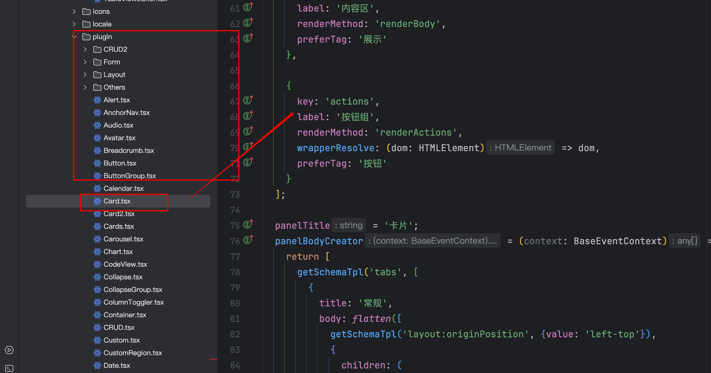
	- 在里面需要**写详细的信息，比如任何配置**
	- 或者其他有助于开发的
		- 组件的`文档地址`
		- 组件的`截图`
	- 右侧，并且这些其实都是可以配置，都源于组件的设计态
		- 属性
		- 外观
		- 事件等等

## 4. 设计态是个细活

- 设计态绝对是一个细活
- 比如拖入需要配置数据源的组件表格，一拖进来，应该是配置必要的数据源，配置完后方便展示
	- 否则就是空的了
- 因为 `amis` 的设计，最终拖入的都是基于 json 的编辑以及渲染
- 功能细节点，很多很多的，所以**设计态初版**好做，但想做的很好，很难的，特别是面向非程序员的
	- 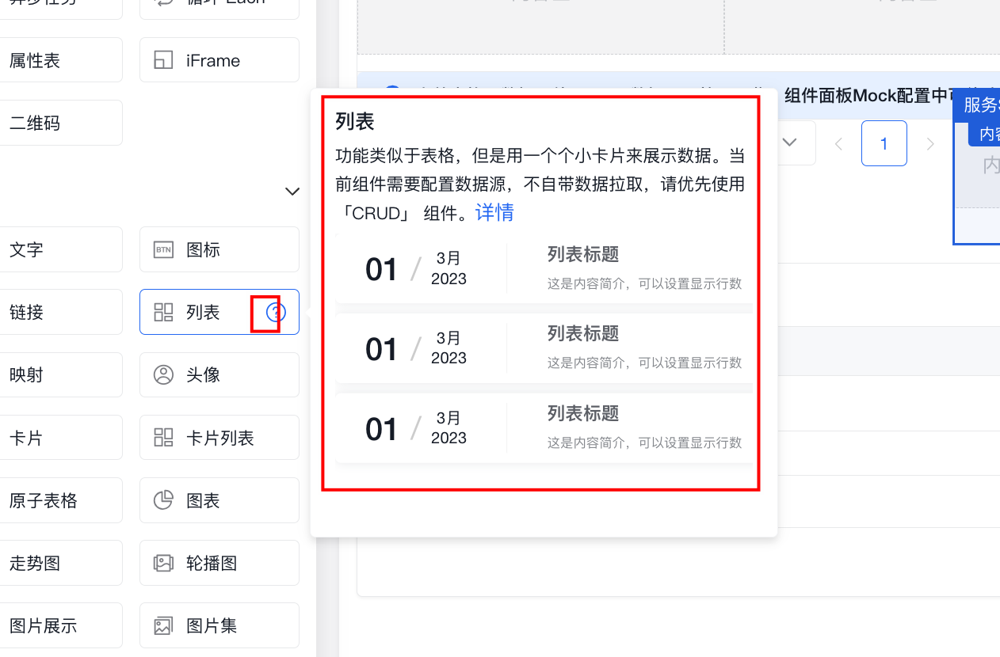
- 比如各类快捷键等等

## 5. 竞品长什么样？微搭、爱搭、宜搭 → 所以知道这是个工作量大的细活

### 5.1. 设置区域

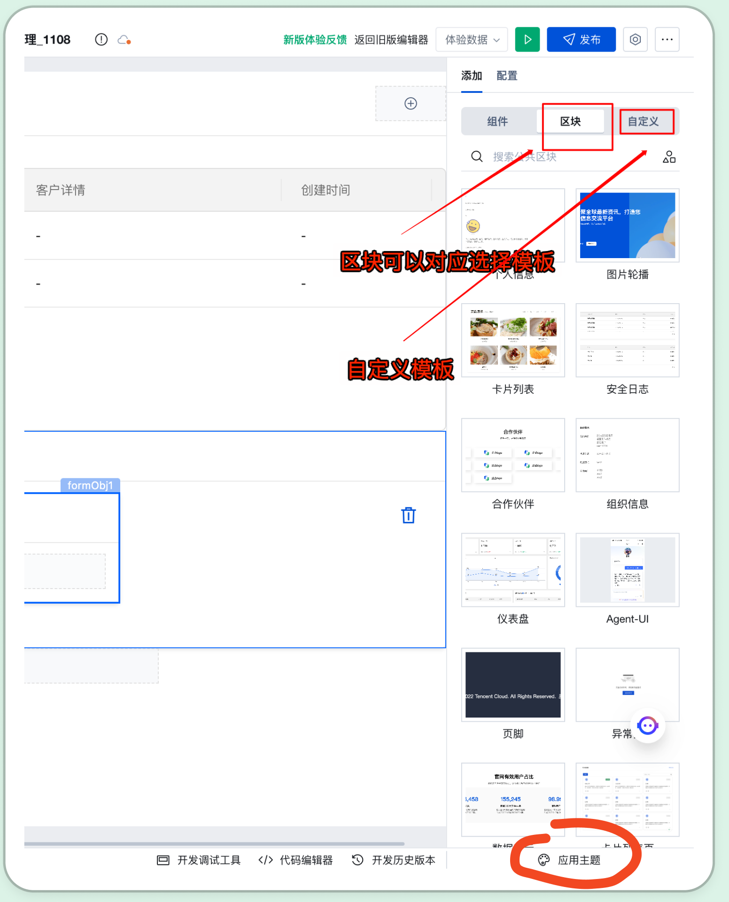

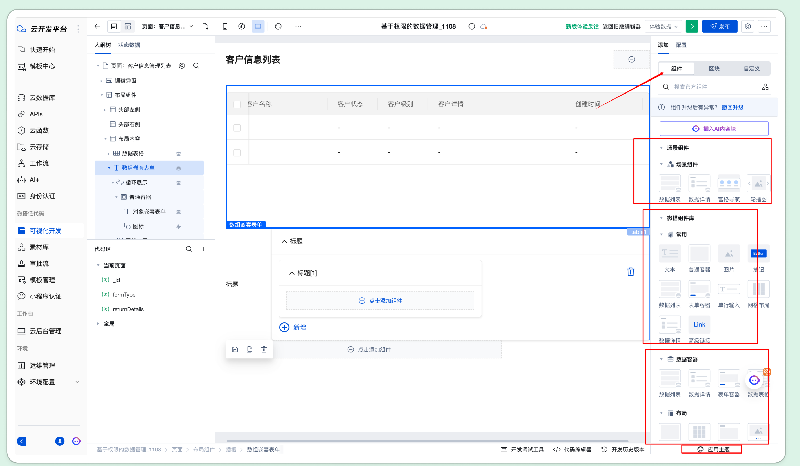

### 5.2. 可选组件列表参考

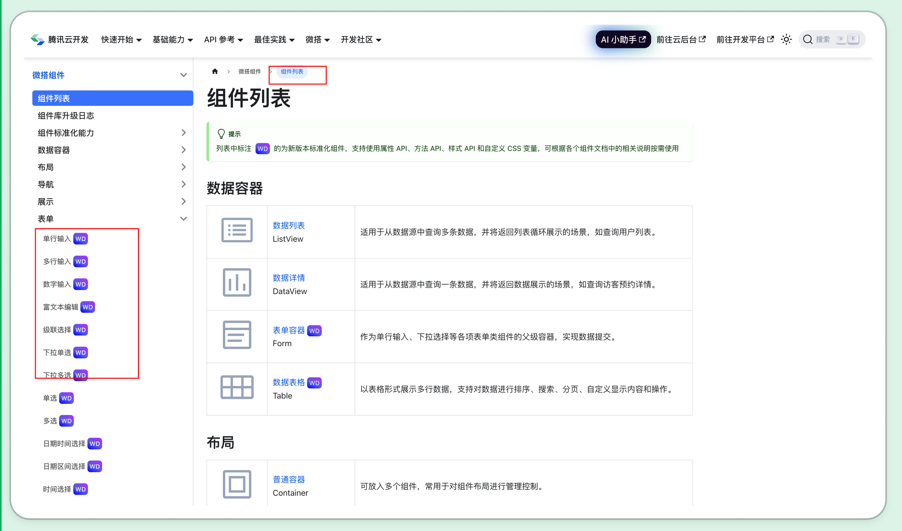

### 5.3. 主题设计器

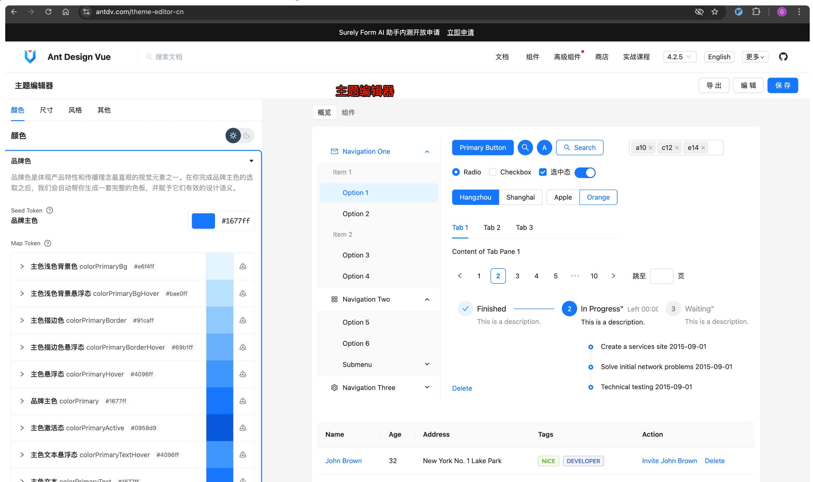

## 6. 数据源如何选择

### 6.1. 数据库建模

- 智能体厂
- 直连数据库
- 等等

> 这个挺多，各大云平台都有产品可参考

### 6.2. API 编排的方式

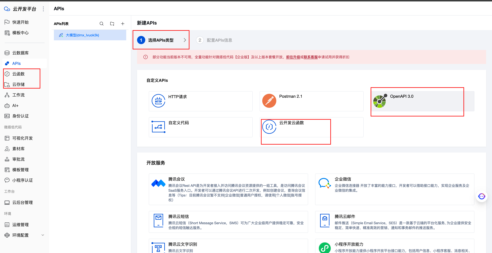

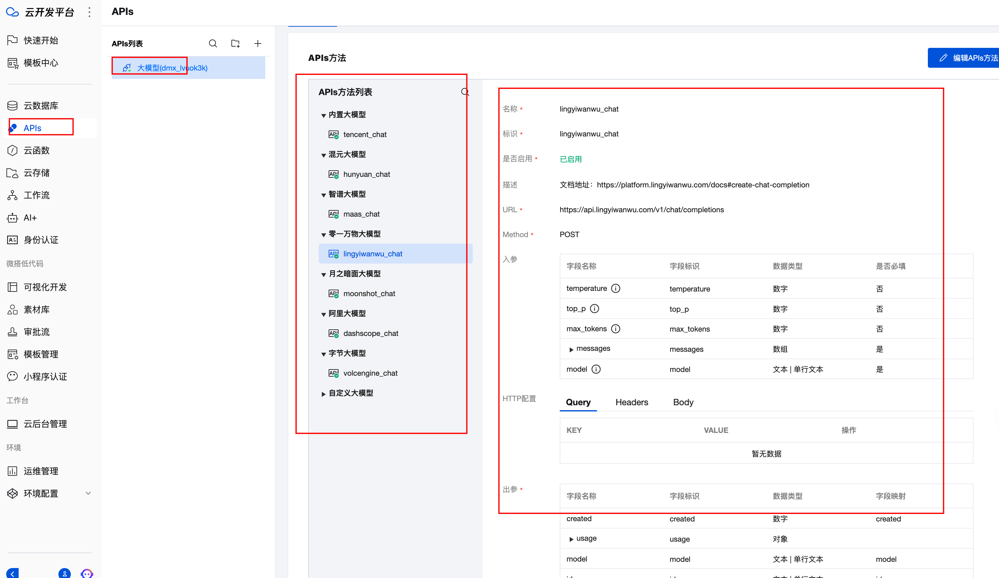

## 7. 前沿：如何结合 AI 的能力

- 自然语言描述，自动生成特定 json 结构即可
- AI 搭建助手
- 更高的能力，需要模型训练

### 7.1. AI 能力展示：微搭、爱搭、宜搭

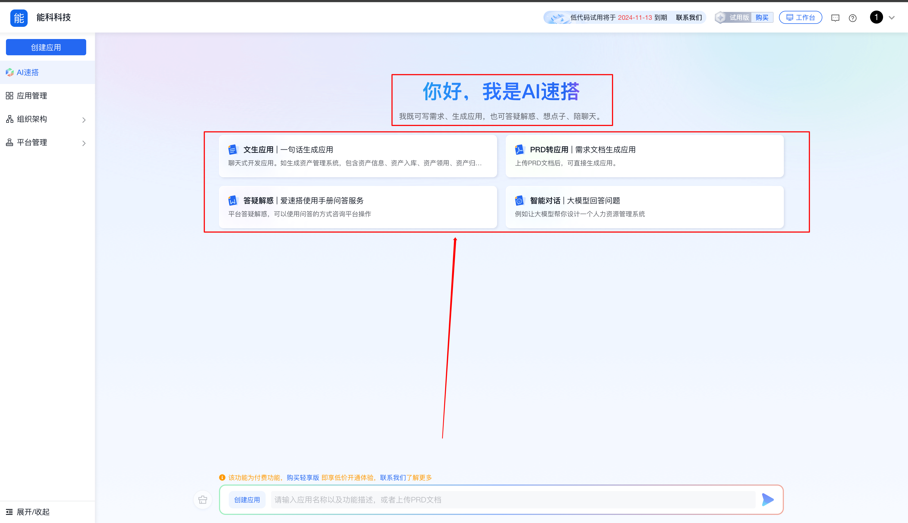

- 还是基本的使用 `chatbot` 的方式来搭建
- 上传 `PRD 文档`，可直接生成内容
- 平台搭建解惑
- 开发助手：智能对话

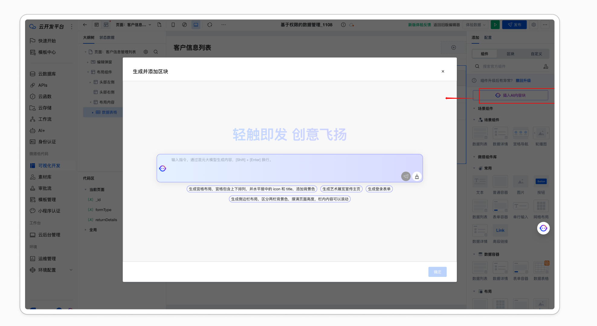

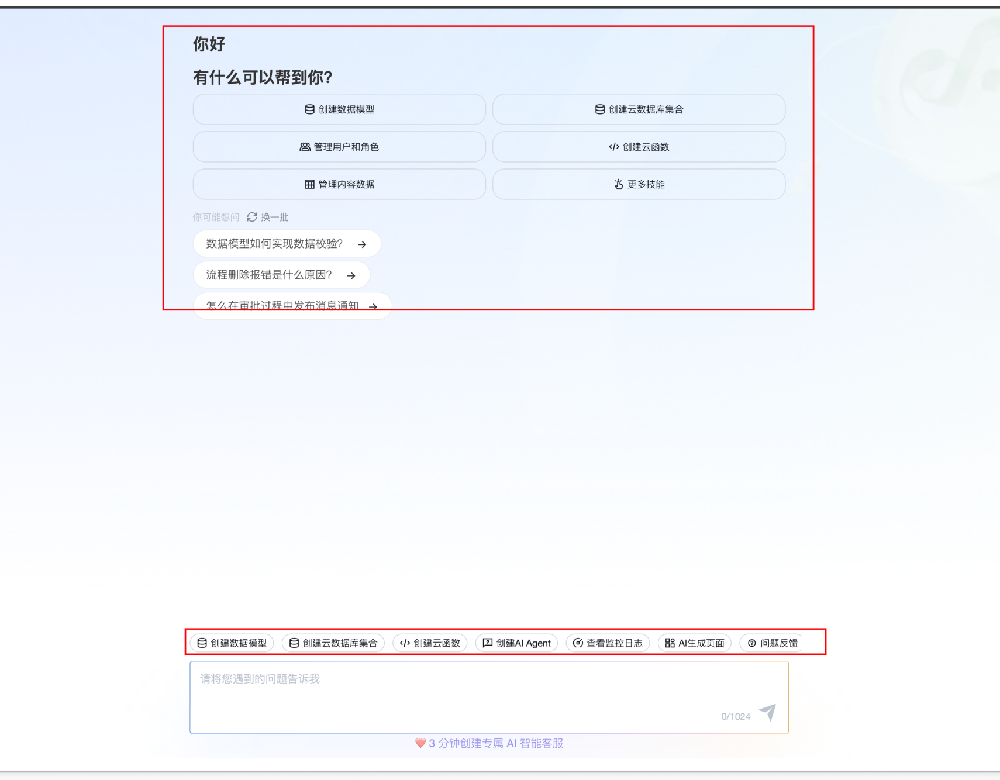

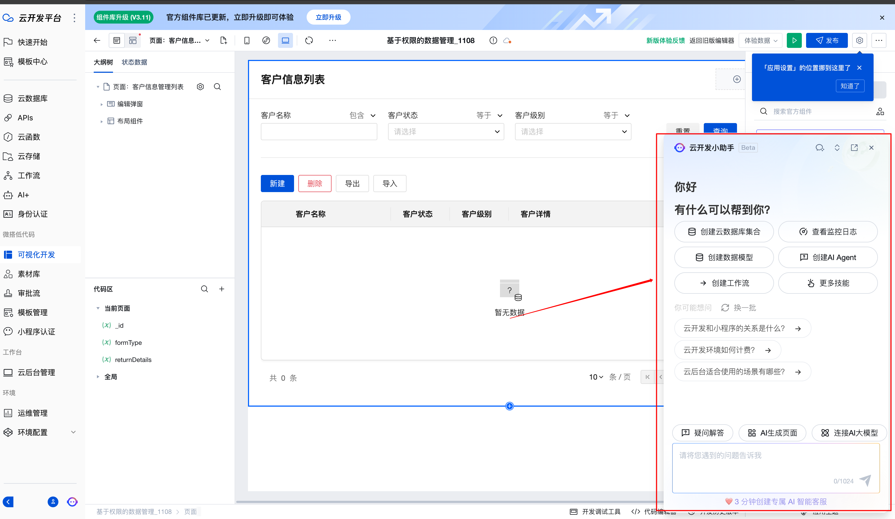

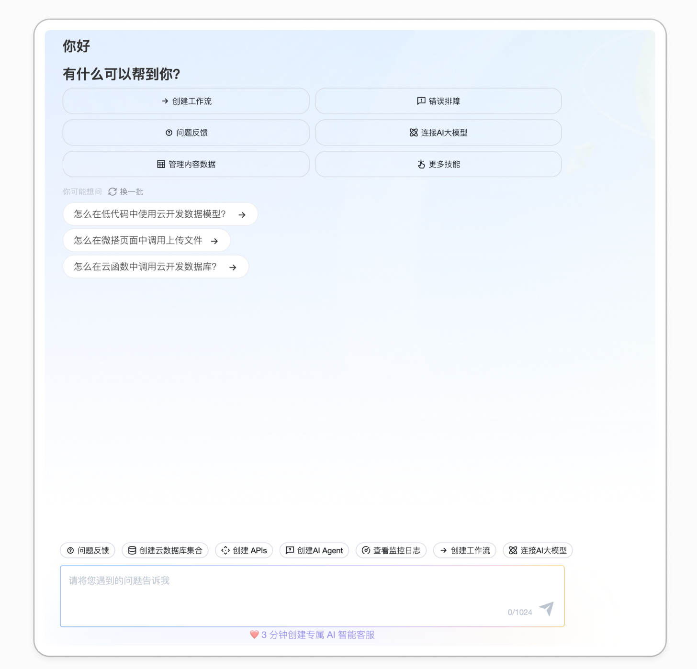

