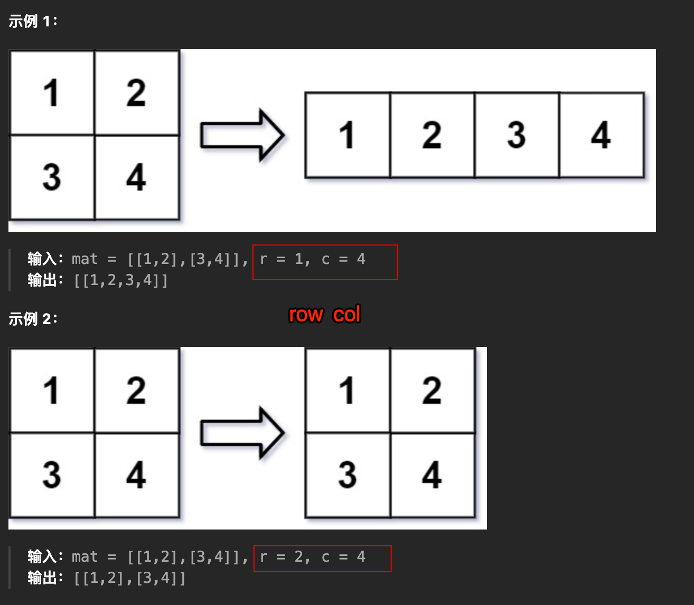

# 重塑矩阵：m*n 转成 r*c

`#算法/二维数组` 


> [566. 重塑矩阵](https://leetcode.cn/problems/reshape-the-matrix/)


## 目录
<!-- toc -->
 ## 1. 题目 

- 原始矩阵的所有元素以相同的 **行遍历顺序** 填充



## 2. 思路

- `多维`数组都可以被映射到`一维`
	- 所以，你先把`多维`的坐标转化成`一维`
	- 然后再从`一维坐标`转化到`多维`


> [!danger]
> 只要知道二维数组的的行数 `m` 和列数 `n`
> - 二维数组的坐标 `(i, j)` 可以映射成一维的 `index = i * n + j`；
> - 反过来也可以通过一维 `index` 反解出二维坐标 `i = index / n, j = index % n`。

## 3. 代码

- 根据一维数组的坐标计算二维数组的坐标：都使用**二维数组的列数**
	- `const i = Math.floor(index / n);`
	- `const j = index % n;`
- 注意：`n` 和 `c` 两个变量别用混了
- 写到函数体里面省得传参了，但实际工作中别这么干

```javascript
/**
 * @param {number[][]} mat
 * @param {number} r
 * @param {number} c
 * @return {number[][]}
 */
var matrixReshape = function (mat, r, c) {
  let m = mat.length;
  let n = mat[0].length;
  // base case: 重塑前后个数不相同，则返回原始矩阵
  if (r * c !== m * n) {
    return mat;
  }
  // 重塑后的矩阵
  let res = new Array(r).fill().map(() => {
    return new Array(c);
  });
  for (let i = 0; i < m * n; i++) {
    let item = getIndex(i);
    setIndex(i, item);
  }
  return res;
  // 通过一维坐标访问二维数组中的元素
  function getIndex(index) {
    // 二维中的横纵坐标
    const i = Math.floor(index / n);
    const j = index % n;
    return mat[i][j];
  }
  // 通过一维坐标设置二维数组中的元素
  function setIndex(index, value) {
    // 这里是 c 即新矩阵的列数
    const i = Math.floor(index / c);
    const j = index % c;
    res[i][j] = value;
  }
};

```