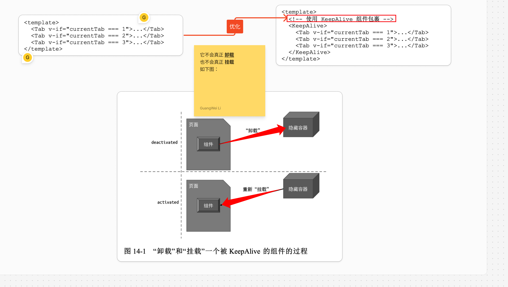

# Vue3 中 keepAlive组件的实现原理


`#vue` 


## 目录
<!-- toc -->
 ## 1. 为什么需要 keepalive 

类似于HTTP 中的 `keepAlive` , 为了避免频繁地销毁、创建 HTTP 连接会带来额外 的性能开销；故允许多个请求或响应共用一个 TCP 连接

同样的， `keepAlive组件` 可以避免一个组件被频繁地销毁/重建

## 2. KeepAlive 的定义

```typescript
interface KeepAliveProps {
  /**
   * 如果指定，则只有与 `include` 名称
   * 匹配的组件才会被缓存。
   */
  include?: MatchPattern
  /**
   * 任何名称与 `exclude`
   * 匹配的组件都不会被缓存。
   */
  exclude?: MatchPattern
  /**
   * 最多可以缓存多少组件实例。
   */
  max?: number | string
}

type MatchPattern = string | RegExp | (string | RegExp)[]
```

## 3. KeepAlive 的本质

它的功能是在多个组件间动态切换时缓存被移除的组件实例

**本质是缓存管理，再加上特殊的挂载/卸载逻辑**

具体如下图：



## 4. 具体的代码架子


>  当然，比如卸载时，需要看这个组件是否是`内部组件`，是的话会对特殊处理。

下面是 `move` 的一些具体逻辑：


## 5. include 和 exclude

即能够显示的配置应该 被缓存的组件或不应该缓存的组件，**本质是通过内部组件的名称进行正则匹配，如果匹配到则直接渲染“内部组件”，不对其进行后续的缓存操作**

## 6. 缓存管理

总结下就是：

- 如果缓存存在，则继承组件实例，并将用于描述`组件的 vnode 对象`标记为 `keptAlive`，这样渲染器就不会重新创建新的组件实例； 
- 如果缓存不存在，则设置缓存
- 缓存策略：
	- 目前是`最近一次访问`
	- 另外还需要关注是否设置`最大缓存容量`，如果设置了，还需要`修剪`

>  注1：缓存的是组件的实例

## 7. 总结

- KeepAlive 组件的作用类似于 HTTP 中的持久链接。它可以避免组件实例不断地被销毁和重建。
- KeepAlive 的基本实现并不复杂。
	- 当被 KeepAlive 的组件“卸载”时，渲染器并不会真的将其卸载掉，而是会将该组件搬运到一个隐藏容器中，从而使得组件可以维持当前状态。
	- 当被 KeepAlive 的组件“挂载”时，渲染器也不会真的挂载它，而是将它从隐藏容器搬运到原容器。
-  KeepAlive 的其他能力，如匹配策略和缓存策略。
	-  include 和 exclude 这两个选项用来指定哪些组件需要被 KeepAlive，哪些组件不需要被 KeepAlive。默认情况下，include 和 exclude 会匹配组件的 `name 选项`。但是在具体实现中，我们可以扩展匹配能力。
	- 对于缓存策略，Vue.js 默认采用“最新一次访问”。为了让用户能`自行实现缓存策略`

> 具体代码见仓库，这里主要是列举了关键点

