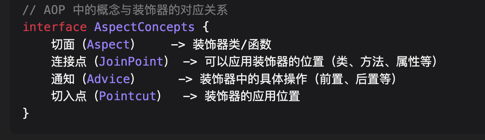
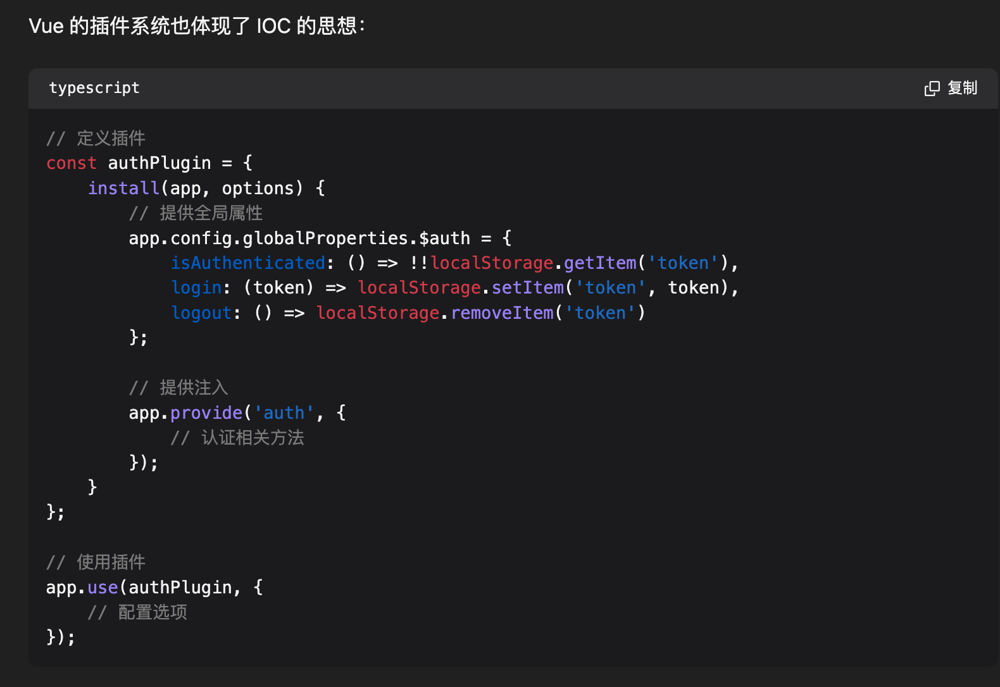

# 编程思想&范式

`#编程思想` 


## 目录
<!-- toc -->
 ## 1. OOP (面向对象编程 Object-Oriented Programming) 

- **封装（Encapsulation）**：
	- 将数据和操作数据的方法绑定在一起，对外部隐藏具体实现细节
- **继承（Inheritance）**：
	- 允许创建一个类作为另一个类的扩展，复用代码并建立类之间的层次关系
- **多态（Polymorphism）**：
	- **同一个操作可以作用于不同的对象上，产生不同的执行结果**

### 1.1. 多态例子：遥控器的 

### 1.2. 定义遥控器类

- 遥控器 RemoteControl
	- 电视遥控器 TVRemote extends RemoteControl
	- 空调遥控器 ACRemote extends RemoteControl
	- 音响遥控器 StereoRemote extends RemoteControl

```javascript
// 定义一个遥控器接口
class RemoteControl {
    pressButton() {
        console.log('按下按钮');
    }
}
// 电视遥控器
class TVRemote extends RemoteControl {
    pressButton() {
        console.log('电视开关切换了');
    }
}
// 空调遥控器
class ACRemote extends RemoteControl {
    pressButton() {
        console.log('空调开始制冷了');
    }
}
// 音响遥控器
class StereoRemote extends RemoteControl {
    pressButton() {
        console.log('音响开始播放音乐了');
    }
}
```

#### 1.2.1. 使用遥控器 →  useRemote

```javascript
// 使用遥控器
function useRemote(remote) {
    remote.pressButton();  // 同样的动作，不同的表现
}
// 测试不同遥控器
const tvRemote = new TVRemote();
const acRemote = new ACRemote();
const stereoRemote = new StereoRemote();

useRemote(tvRemote);     // 输出：电视开关切换了
useRemote(acRemote);     // 输出：空调开始制冷了
useRemote(stereoRemote); // 输出：音响开始播放音乐了
```

### 1.3. Typescript 的多态：基于继承的多态 → 以 Animal 为例

#### 1.3.1. 动物类

```ts hl:9
// 基类：动物
abstract class Animal {
    name: string;
    
    constructor(name: string) {
        this.name = name;
    }
    
    // 抽象方法：必须由子类实现
    abstract makeSound(): void;
    
    // 共同方法
    move(): void {
        console.log(`${this.name} is moving`);
    }
}

// 子类：狗
class Dog extends Animal {
    makeSound(): void {
        console.log(`${this.name} says: Woof!`);
    }
    
    fetch(): void {
        console.log(`${this.name} is fetching the ball`);
    }
}

// 子类：猫
class Cat extends Animal {
    makeSound(): void {
        console.log(`${this.name} says: Meow!`);
    }
    
    climb(): void {
        console.log(`${this.name} is climbing`);
    }
}


```

#### 1.3.2. 多态使用

```ts
// 多态使用
function makeAnimalSound(animal: Animal) {
    animal.makeSound();  // 调用的具体实现取决于实际对象类型
}

const dog = new Dog("Buddy");
const cat = new Cat("Whiskers");

makeAnimalSound(dog);  // 输出: Buddy says: Woof!
makeAnimalSound(cat);  // 输出: Whiskers says: Meow!
```

### 1.4. Typescript：基于接口、基于范型等的多态实现

## 2. 面向切面编程（AOP - Aspect Oriented Programming）

### 2.1. 定义

面向切面编程（AOP - Aspect Oriented Programming） 是一种编程范式，它允许我们：
- 将横切关注点（cross-cutting concerns）从主要业务逻辑中分离出来
- **不修改原有代码的情况下增加新功能**
- **TypeScript 的装饰器**是实现 AOP（面向切面编程）的一种重要方式
	- 
- 常见的应用场景包括：
	- 日志记录、性能统计、权限控制、错误处理等

### 2.2. React 和 Vue 中体现 AOP 的特性

1. Vue 中使用
	- 全局混入 `mixin`
	- 自定义指令
	- 自定义 Hooks
	- 插件系统
	- 路由守卫
	- 状态管理中间件
2. React 中使用
	- **高阶组件（HOC）**
	- 装饰器
	- 中间件 

### 2.3. 使用 TypeScript 的装饰器是实现 AOP（面向切面编程）

以 前置通知（Before Advice）为例：

```typescript
// 前置通知装饰器
function before(beforeFn: Function) {
    return function(target: any, propertyKey: string, descriptor: PropertyDescriptor) {
        // 保存原始方法
        const originalMethod = descriptor.value;

        // 创建新的方法
        descriptor.value = function(...args: any[]) {
            // 执行前置通知
            beforeFn.apply(this, args);
            
            // 执行原始方法
            return originalMethod.apply(this, args);
        };

        return descriptor;
    };
}

// 使用示例
class UserService {
    @before(function(username: string) {
        console.log(`准备创建用户: ${username}`);
    })
    createUser(username: string) {
        console.log(`创建用户: ${username}`);
    }
}
```

### 2.4. 基础函数装饰器：实现`调用函数前`和`调用函数后`的日志打印

```javascript
// 基础函数装饰器
function decorator(fn) {
    return function(...args) {
        // 前置处理
        console.log('Before function execution');
        
        // 执行原函数
        const result = fn.apply(this, args);
        
        // 后置处理
        console.log('After function execution');
        
        return result;
    }
}

// 使用示例
function greet(name) {
    console.log(`Hello, ${name}!`);
}

// 装饰原函数
const decoratedGreet = decorator(greet);

// 调用装饰后的函数
decoratedGreet('John'); 
/* 输出:
Before function execution
Hello, John!
After function execution
*/

```

### 2.5. 示例：使用 Typescript 的装饰器实现**性能监控**

```ts
// 性能监控切面
function measurePerformance() {
    return function(target: any, propertyKey: string, descriptor: PropertyDescriptor) {
        const originalMethod = descriptor.value;
        descriptor.value = async function(...args: any[]) {
            const start = performance.now();
            try {
                return await originalMethod.apply(this, args);
            } finally {
                const end = performance.now();
                console.log(`${propertyKey} 执行时间: ${end - start}ms`);
            }
        };
        return descriptor;
    };
}

class DataService {
    @measurePerformance()
    async fetchData() {
        // 模拟异步操作
        await new Promise(resolve => setTimeout(resolve, 1000));
        return { data: 'some data' };
    }
}

```

### 2.6. 示例：数据统计

```javascript
const statistics = function(fn) {
    return function() {
        // 发送统计数据
        sendStatistics();
        return fn.apply(this, arguments);
    }
}
```

### 2.7. 使用时机

- 当多个模块**共享相同的横切关注点**
- 需要动态添加或移除功能
- 需要**统一处理某些特定操作**

## 3. IOC（控制反转）

IOC（Inversion of Control）是一种设计原则，核心思想是：
- 将组件间的依赖关系从程序内部提到外部
- 将控制权从具体业务代码转移到统一的容器
- 用于解决组件之间的**耦合问题**

### 3.1. 使用好处

1. 降低组件间的**耦合度**
2. 提高代码的可测试性
3. 更好的代码组织和**维护**
4. 提供了**统一的依赖管理方式**
5. 便于实现功能的替换和**扩展**

### 3.2. Vue 和 React 中的控制反转体现

- Vue 
	-  provider 和 injection 等
		- 虽然 Vue3 中的依赖注入机制不是传统意义上完整的 IOC 容器，但它确实体现了控制反转的思想，并且以一种更适合前端组件化开发的方式来实现
	- Vue 的插件系统
		- 
-  React 的 Context API 