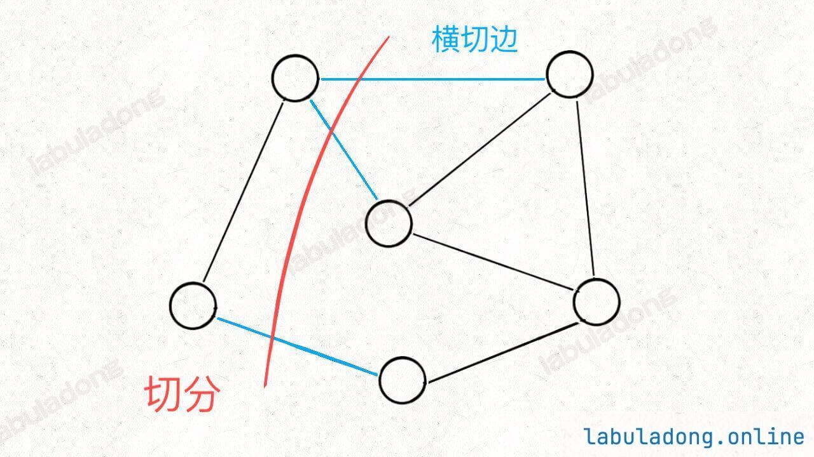

# 最小生成树：Prim 算法

`#最小生成树`

## 目录
<!-- toc -->
 ## 1. 总结 

- `Prim 算法`不需要事先对所有边排序，而是利用`优先级队列`动态实现排序的效果
	- 重点是理解切分定理
- [1584. 连接所有点的最小费用](/post/h89bm858.html) 和 [1135. 最低成本连通所有城市](/post/rJhpGJpw.html) 这两题都可以使用 `Prim 算法` 来解决
	- 能使用 `Prim 算法` 解决问题大概率能使用 [10. 最小生成树： Kruskal 算法](/post/HQ064QJk.html) 来解决，所以必须掌握一个

>  **先这样，后面真有场景的时候再好好研究下这个算法** @todo

## 2. 切分定理

- **红色**的这一刀把图中的节点分成了两个集合，就是一种「**切分**」
- 其中被红线切中的的边（标记为蓝色）叫做「**横切边**」。

切分定理：
- 对于任意一种「切分」，其中权重最小的那条「横切边」一定是构成最小生成树的一条边

