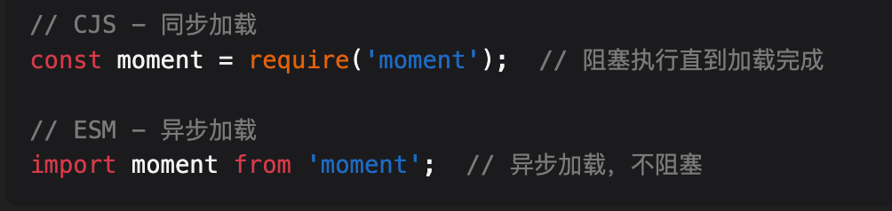
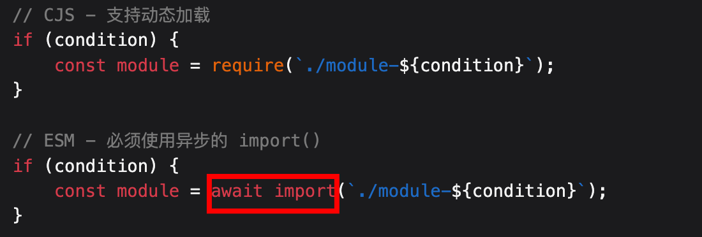
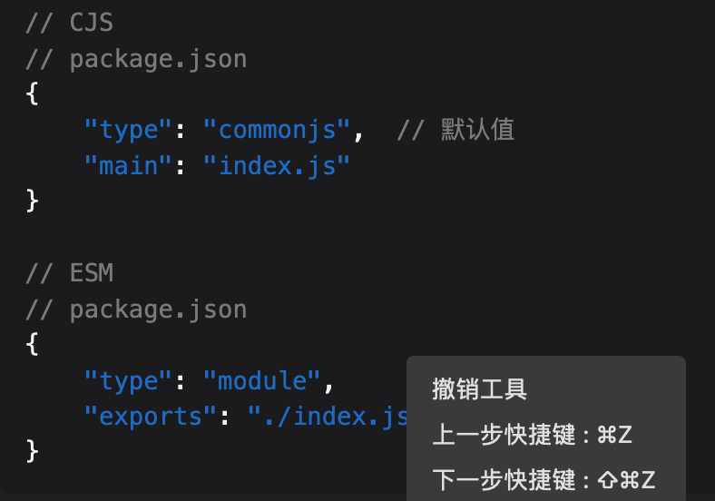
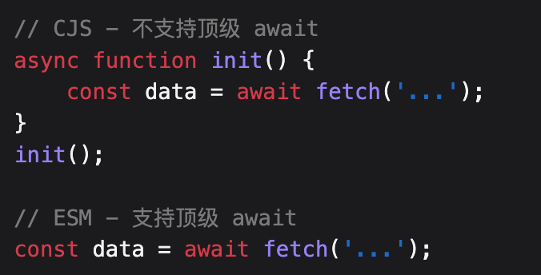

# Nodejs 篇（篇一）

`#前端面试` 


## 目录
<!-- toc -->
 ## 1. 磁盘上某目录下有100个JSON文件，请合并成 1个JSON文件 

- 使用 `require` 直接简单同步写入，然后合并
	- 同步阻塞，内存消耗大
- 使用 `readFile` 异步读取，并修改成 Promise 
	- 可并发，但内存占用高
- 流处理：引入 `stream` 、 `createWriteStream`  、`new Readalble`
	- 内存占用低，可处理大文件，但串行处理，速度较慢
- 工作线程：使用 `worker_threads` 
	- 充分利用多核CPU，并行处理
- 优化的流处理
	- 异步 + 流处理

补充说明：
- 所有方案都应该添加`错误处理`
- 生产环境中应该添加`日志记录`
- 可以根据具体需求`调整并发数和缓冲区大小`
- 考虑添加`进度提示`功能

## 2. require 和 readFileSync 一个 JSON 文件的区别是？

- 是否缓存
	- require 会缓存，所以会**常驻内存**
	- readFileSync 每次都重新读取，所以 **不常驻内存**
- 文件更新处理
	- require 不会感知文件更新，即使外部修改了， 依然是从缓存里获取旧数据
	- readFileSync 每次都是最新数据
- 错误处理
	- require 的错误处理，会抛出 MODULE_NOT_FOUND 错误
	- readFileSync 的错误处理，会抛出 ENOENT 错误（ENOENT = Error NO ENTry（或 Error NO ENTity））
		- 表示系统找不到指定的文件或目录
		- 主要原因包括路径错误、权限问题、异步操作顺序等
- 路径解析
	- require 使用模块解析规则
	- readFileSync 使用文件系统路径
- 实际应用场景
	- require：配置文件（不需要动态更新）、静态数据、模块化的 JSON 数据
	- readFileSync：文件监控场景、需要动态更新的配置、**大文件处理** ，但大文件建议考虑使用**流式**处理

## 3. cjm / esm 的区别

### 3.1. 引用与拷贝

- ESM输出的是`值的引用`，而CJS输出的是`值的拷贝`；

### 3.2. 运行时与编译时

- CJS的输出是`运行时加载`，而ESM是 `编译时` 输出接口；

### 3.3. 同步与异步

- CJS是`同步加载`，ESM是`异步加载`； 
	-  同步是服务器代码都在**本地**，浏览器需要去**异步**拿
	- 

### 3.4. 动态加载

- 都支持  `动态加载`
	- 
### 3.5. 文件扩展名与 `package.json`配置

- 

### 3.6. 顶级 `await` 支持



### 3.7. `this` 指向


### 3.8. **循环引用**的处理差异

- CommonJS
	- 模块在首次 require 时会被 `缓存`
		- 因为是`缓存` ，所以避免了 **无限循环**
	- 如果出现循环引用，会返回未完成的导出对象
	- 可能导致获取到部分初始化的对象
- ESM
	- 使用绑定引用而不是 值拷贝
	- 提供了`静态分析能力`，可以在`编译`时检测问题
	- `webpack 插件`或者 `vite 插件`检测是否循环引用了

### 3.9. 错误处理机制

#### 3.9.1. cjs 


```javascript
// CJS
try {
    require('./non-existent');
} catch (err) {
    console.log(err.code);  // MODULE_NOT_FOUND
}

// ESM
import './non-existent.js'
    .catch(err => {
        console.log(err.code);  // ERR_MODULE_NOT_FOUND
    });

```

## 4. ESM 和 CJS 的混合使用

### 4.1. ESM 中使用 CJS 模块

```javascript hl:1,9
// 方法1：使用 createRequire
import { createRequire } from 'module';
const require = createRequire(import.meta.url);

// 现在可以使用 require 了
const fs = require('fs');
const lodash = require('lodash');

// 方法2：使用动态 import 代替 require
// cjs-module.js (CommonJS)
module.exports = { hello: 'world' };

// esm-module.mjs (ESM)
const cjsModule = await import('./cjs-module.js');
console.log(cjsModule.default.hello); // 注意：需要使用 .default
```

### 4.2. CJS 中使用 ESM 模块

```javascript hl:1,12
// 方法1：使用异步 import()
// esm-module.mjs
export const hello = 'world';

// cjs-module.js
async function loadEsm() {
    const esmModule = await import('./esm-module.mjs');
    console.log(esmModule.hello);
}
loadEsm();

// 方法2：使用 async/await 包装
(async () => {
    const { hello } = await import('./esm-module.mjs');
    console.log(hello);
})();
```

### 4.3. 包装 CJS 模块为 ESM

```javascript hl:8
// wrapper.mjs
import { createRequire } from 'module';
const require = createRequire(import.meta.url);

// 导入 CJS 模块
const cjsModule = require('./cjs-module');

// 重新导出为 ESM
export const { methodA, methodB } = cjsModule;
export default cjsModule;
```

### 4.4. 在 package.json 中配置双模式支持

```json
{
    "name": "my-package",
    "exports": {
        ".": {
            "import": "./dist/index.mjs",
            "require": "./dist/index.cjs"
        }
    },
    "main": "./dist/index.cjs",
    "module": "./dist/index.mjs",
    "type": "module"
}
```

### 4.5. 条件导出

```javascript
// index.cjs
if (typeof require !== 'undefined') {
    module.exports = require('./cjs/index.js');
}

// index.mjs
export * from './esm/index.js';
```

### 4.6. 处理不同的导出方式

```javascript
// CJS 模块
// math.cjs
module.exports = {
    add: (a, b) => a + b,
    subtract: (a, b) => a - b
};

// ESM 包装器
// math.mjs
import { createRequire } from 'module';
const require = createRequire(import.meta.url);

const cjsMath = require('./math.cjs');

// 重新导出为具名导出
export const { add, subtract } = cjsMath;

// 同时提供默认导出
export default cjsMath;
```

### 4.7. 处理异步操作

```javascript
// async-cjs.cjs
module.exports = async function getData() {
    return Promise.resolve('data');
};

// async-esm.mjs
import { createRequire } from 'module';
const require = createRequire(import.meta.url);

const getData = require('./async-cjs.cjs');

// 使用异步函数包装
export async function fetchData() {
    return await getData();
}
```

### 4.8. 类型定义的处理

```typescript
// types.d.ts
declare module 'my-mixed-module' {
    // CJS 风格
    export = {
        method: () => void
    };
    
    // ESM 风格
    export const method: () => void;
}
```

### 4.9. 动态导入处理

- 先尝试 ESM 导入
- 降级到 CJS

```javascript
// dynamic-import.mjs
async function loadModule(modulePath) {
    try {
        // 尝试 ESM 导入
        return await import(modulePath);
    } catch (err) {
        // 降级到 CJS
        const require = createRequire(import.meta.url);
        return require(modulePath);
    }
}
```

### 4.10. 环境检测：`typeof require === 'undefined'`

```javascript
// utils.js
export function isESM() {
    return typeof require === 'undefined';
}

export function isCJS() {
    return typeof require !== 'undefined';
}

// 根据环境使用不同的导入方式
const loader = isESM() ? 
    (m) => import(m) : 
    (m) => Promise.resolve(require(m));
```

### 4.11. 错误处理

```javascript
// error-handler.mjs
export async function safeImport(modulePath) {
    try {
        const module = await import(modulePath);
        return module;
    } catch (err) {
        if (err.code === 'ERR_REQUIRE_ESM') {
            // 处理 ESM 模块的情况
            console.log('This is an ESM module');
        } else if (err.code === 'MODULE_NOT_FOUND') {
            // 处理模块未找到的情况
            console.log('Module not found');
        }
        throw err;
    }
}
```

### 4.12. 构建工具配置

```javascript
// rollup.config.js
import commonjs from '@rollup/plugin-commonjs';

export default {
    input: 'src/index.js',
    output: [
        {
            file: 'dist/bundle.cjs.js',
            format: 'cjs'
        },
        {
            file: 'dist/bundle.esm.js',
            format: 'esm'
        }
    ],
    plugins: [
        commonjs() // 转换 CJS 到 ESM
    ]
};
```

### 4.13. 最佳实践建议

1. 尽可能使用 ESM
2. 为旧模块提供 ESM 包装器
3. 在 package.json 中提供双模式支持
4. 使用构建工具处理兼容性
5. 谨慎处理异步操作
6. 提供清晰的类型定义
7. 做好错误处理
8. 考虑向后兼容性

这样的混合使用策略可以帮助你在过渡期间平稳地处理不同模块系统的代码。

## 5. 说说 `commonjs` 的`require`机制

### 5.1. 基本加载过程：7 个步骤

```javascript
// require 的基本实现原理
function require(modulePath) {

    // 1. 解析路径
    const absolutePath = resolveModulePath(modulePath);
    
    // 2. 检查缓存
    if (require.cache[absolutePath]) {
        return require.cache[absolutePath].exports;
    }
    
    // 3. 创建模块对象
    const module = {
        exports: {},
        loaded: false,
        id: absolutePath
    };
    
    // 4. 将模块放入缓存
    require.cache[absolutePath] = module;
    
    // 5. 加载模块
    loadModule(absolutePath, module, require);
    
    // 6. 标记为已加载
    module.loaded = true;
    
    // 7. 返回 exports 对象
    return module.exports;
}
```

### 5.2. 模块缓存机制：查看缓存和清除缓存

```javascript
// example.js
module.exports = {
    count: 0,
    increment() {
        this.count++;
    }
};

// main.js
const module1 = require('./example');
const module2 = require('./example');

console.log(module1 === module2); // true
// 因为缓存的存在，两次 require 返回同一个对象

// 查看缓存
console.log(require.cache);
// 清除缓存
delete require.cache[require.resolve('./example')];
```

### 5.3. 路径解析规则

```javascript hl:14
// 1. 核心模块
const fs = require('fs');              // 直接从 Node.js 核心模块加载

// 2. 文件模块
const myModule = require('./myModule'); // 相对路径
const config = require('/opt/config');  // 绝对路径

// 3. npm 包
const lodash = require('lodash');      // 从 node_modules 查找

// 文件扩展名解析顺序
require('./myModule');  

// 依次查找：
// 1. myModule.js
// 2. myModule.json
// 3. myModule.node
// 4. myModule/index.js
```

### 5.4. 模块包装机制

```javascript hl:1
// Node.js 实际上会将你的模块代码包装在一个函数中
(function(exports, require, module, __filename, __dirname) {
    // 你的模块代码在这里
    const something = require('./something');
    module.exports = {
        // ...
    };
});
```

### 5.5. 异常处理

```javascript
try {
    // 处理模块不存在
    const nonExistent = require('./non-existent');
} catch (err) {
    if (err.code === 'MODULE_NOT_FOUND') {
        console.log('模块未找到');
    }
}

// 处理模块加载错误
try {
    const badModule = require('./bad-module');
} catch (err) {
    console.error('模块加载失败:', err);
}
```

### 5.6. 条件加载

```javascript
// 根据环境加载不同的配置
const config = require(process.env.NODE_ENV === 'production'
    ? './config.prod'
    : './config.dev');

// 动态加载模块
function loadPlugin(name) {
    try {
        return require(`./plugins/${name}`);
    } catch (err) {
        console.error(`插件 ${name} 加载失败`);
        return null;
    }
}
```

### 5.7. 性能优化：比如 fs/path等

```javascript hl:5,12
// 1. 使用路径缓存
const modulePath = require.resolve('./myModule');
const myModule = require(modulePath);

// 2. 预加载模块
const modules = {
    fs: require('fs'),
    path: require('path'),
    util: require('util')
};

// 3. 延迟加载
let heavyModule;
function getHeavyModule() {
    if (!heavyModule) {
        heavyModule = require('./heavyModule');
    }
    return heavyModule;
}
```

### 5.8. 模块导出方式

```javascript
// 1. module.exports 导出
module.exports = {
    method1() {},
    method2() {}
};

// 2. exports 快捷方式
exports.method1 = function() {};
exports.method2 = function() {};

// 3. 注意: 直接赋值 exports 无效
exports = { method: () => {} };  // 这样做是错误的
```

### 5.9. 目录作为模块

```javascript
// myModule/index.js
module.exports = {
    // 模块内容
};

// myModule/package.json
{
    "main": "lib/entry.js"  // 指定入口文件
}

// 使用
const myModule = require('./myModule');
```

### 5.10. require.main 的使用

```javascript
// 检查模块是否为入口文件
if (require.main === module) {
    // 直接运行此文件
    console.log('这是主模块');
} else {
    // 被其他模块引用
    console.log('这是被导入的模块');
}
```

### 5.11. 调试技巧

```javascript
// 1. 查看模块搜索路径
console.log(module.paths);

// 2. 查看已加载的模块
console.log(Object.keys(require.cache));

// 3. 模块解析路径
console.log(require.resolve('./myModule'));

// 4. 模块元信息
console.log(module);
```

### 5.12. 最佳实践

1. 总是使用 const 声明 require
2. 将所有 require 语句放在文件顶部
3. 使用明确的文件扩展名
4. 适当使用模块缓存机制
5. 注意循环依赖问题
6. 正确处理异常情况
7. 合理组织模块结构
8. 使用 package.json 管理依赖
9. 注意模块加载性能
10. 遵循单一职责原则

## 6. 核心模块是二进制和缓存是的 nodejs 很快

- `require('fs')`  核心模块很快，因为是编译好的`二进制可执行文件` 
- 缓存：导致很快

## 7. Node.js 中对不同扩展名文件的处理机制

### 7.1. 扩展名解析优先级

```javascript
// require 的扩展名解析优先级
const path = './myModule';
require(path);  // 按以下顺序查找：
// 1. ./myModule.js
// 2. ./myModule.json
// 3. ./myModule.node
// 4. ./myModule/index.js
// 5. ./myModule/index.json
// 6. ./myModule/index.node
```

### 7.2. `.js` 文件处理

```javascript
// 1. JS 文件会被包装在函数中执行
(function(exports, require, module, __filename, __dirname) {
    // 你的 JS 代码
    const foo = 'bar';
    module.exports = { foo };
});

// 2. 支持所有 JavaScript 特性
// example.js
const fs = require('fs');

class MyClass {
    constructor() {
        this.data = 'test';
    }
}

module.exports = {
    MyClass,
    async readFile(path) {
        return fs.promises.readFile(path, 'utf8');
    }
};
```

### 7.3. .json 文件处理

>  会有 `json.parse ` 的操作

```javascript
// 1. JSON 文件直接被解析为对象
// config.json
{
    "host": "localhost",
    "port": 3000,
    "debug": true
}

// 使用 JSON 文件
const config = require('./config.json');
console.log(config.host);  // localhost

// 2. JSON 文件的错误处理
try {
    const badJson = require('./bad.json');
} catch (err) {
    if (err instanceof SyntaxError) {
        console.error('JSON 解析错误');
    }
}

// 3. JSON 文件是只读的
const config = require('./config.json');
config.port = 4000;  // 修改只影响内存中的副本
// 重新 require 时会获得原始文件的内容
```

### 7.4. .node 文件处理

```javascript
// .node 文件是编译好的 C++ 插件
// 1. 加载 .node 文件
try {
    const nativeModule = require('./addon.node');
} catch (err) {
    console.error('加载 native 模块失败:', err);
}

// 2. 通常通过 node-gyp 编译
// binding.gyp
{
    "targets": [{
        "target_name": "addon",
        "sources": [ "addon.cc" ]
    }]
}

// 3. C++ 插件示例
// addon.cc
`#include` <node.h>

void Initialize(v8::Local<v8::Object> exports) {
    // 导出函数和对象
}

NODE_MODULE(NODE_GYP_MODULE_NAME, Initialize)
```

### 7.5. 目录模块处理

```javascript
// 1. package.json 方式
// myModule/package.json
{
    "name": "myModule",
    "main": "./lib/index.js"  // 指定入口文件
}

// 2. index 文件方式
// myModule/index.js
module.exports = {
    // 模块内容
};

// 3. 目录模块加载顺序
const myModule = require('./myModule');
// 查找顺序：
// 1. ./myModule/package.json 中的 main 字段
// 2. ./myModule/index.js
// 3. ./myModule/index.json
// 4. ./myModule/index.node
```

### 7.6. 特殊文件处理

```javascript
// 1. 处理二进制文件
const binary = require('fs').readFileSync('./file.bin');

// 2. 处理源码文件
const sourceMap = require('./file.js.map');

// 3. 处理配置文件
const tsConfig = require('./tsconfig.json');
const babelConfig = require('./.babelrc');
```

### 7.7. 自定义扩展名处理

```javascript
// 注册自定义扩展名处理器
require.extensions['.xyz'] = function(module, filename) {
    const content = fs.readFileSync(filename, 'utf8');
    // 处理内容
    module._compile(content, filename);
};

// 使用自定义扩展名
const xyzModule = require('./file.xyz');
```

### 7.8. 文件缓存机制

```javascript hl:15
// 1. 不同扩展名的缓存处理
const jsModule = require('./file.js');
const jsonModule = require('./file.json');
const nodeModule = require('./file.node');

// 2. 清除特定扩展名的缓存
function clearCache(extension) {
    Object.keys(require.cache).forEach(key => {
        if (key.endsWith(extension)) {
            delete require.cache[key];
        }
    });
}

// 3. 监视文件变化：fs.watch
const fs = require('fs');
fs.watch('./config.json', (event, filename) => {
    delete require.cache[require.resolve('./config.json')];
});
```

### 7.9. 错误处理最佳实践

```javascript
function safeRequire(path) {
    try {
        return require(path);
    } catch (err) {
        if (err.code === 'MODULE_NOT_FOUND') {
            console.error(`模块 ${path} 不存在`);
        } else if (err instanceof SyntaxError) {
            console.error(`模块 ${path} 语法错误`);
        } else {
            console.error(`加载模块 ${path} 时发生错误:`, err);
        }
        return null;
    }
}

// 使用示例
const config = safeRequire('./config.json') || defaultConfig;
const addon = safeRequire('./addon.node') || mockAddon;
```

### 7.10. 性能考虑

```javascript
// 1. JSON 文件缓存
const configs = new Map();

function loadConfig(path) {
    if (!configs.has(path)) {
        configs.set(path, require(path));
    }
    return configs.get(path);
}

// 2. 大文件处理
const fs = require('fs');
const stream = fs.createReadStream('./large-file.json');
// 使用流处理大型 JSON 文件

// 3. 延迟加载
let heavyModule;
function getHeavyModule() {
    if (!heavyModule) {
        heavyModule = require('./heavy.node');
    }
    return heavyModule;
}
```

### 7.11. 最佳实践建议

1. 显式指定文件扩展名以提高可读性
2. 对 JSON 文件进行验证
3. 谨慎处理二进制模块
4. 实现适当的错误处理
5. 注意缓存机制
6. 考虑性能影响
7. 遵循模块化原则
8. 使用适当的文件组织结构
9. 注意跨平台兼容性
10. 保持代码整洁和可维护性

## 8. `module.exports` 和 `exports` 的区别

### 8.1. 基本关系

```javascript
// Node.js 模块系统中
exports = module.exports = {};  // 初始时，exports 是 module.exports 的引用
```

### 8.2. 关键区别

```javascript hl:8
// 正确使用
exports.foo = 'bar';           // 添加属性有效

module.exports.foo = 'bar';    // 添加属性有效
module.exports = { foo: 'bar' };// 直接赋值有效

// 错误使用
// 无效！这会断开与 module.exports 的引用
exports = { foo: 'bar' };      
```

### 8.3. 简单记忆

- `exports` 只能通过 `.` 语法添加属性
- `module.exports` 可以直接赋值新对象
- 最终导出的始终是 `module.exports` 的值

### 8.4. 最后

因此，为避免混淆，建议统一使用 `module.exports`。

## 9. 列举比较常用的 package.json 字段说明

```json
{
  // 基础信息：忽略
  

  // 入口文件配置
  "main": "./dist/index.js",  // CommonJS 入口
  "module": "./dist/index.mjs",// ES Module 入口
  "types": "./dist/index.d.ts",// TypeScript 类型声明文件
  "exports": {                // 现代化的导出配置
    ".": {
      "import": "./dist/index.mjs",
      "require": "./dist/index.js",
      "types": "./dist/index.d.ts"
    }
  },

  // 脚本命令：忽略
  "scripts": {

  },

  // 依赖配置
  "dependencies": {           // 生产环境依赖
    "react": "^18.0.0"
  },
  "devDependencies": {        // 开发环境依赖
    "typescript": "^5.0.0",
    "vite": "^4.0.0"
  },
  // `peerDependencies` 表示宿主项目中需要安装的依赖，这些依赖不会被自动安装，而是期望由使用该包的项目提供
  // 1. 避免依赖重复安装
  // 2. 确保版本兼容性 等
  "peerDependencies": {      // 同版本对等依赖
    "react": "^18.0.0"
  },

  // 项目配置
  "private": true,           // 是否私有包
  "type": "module",          // 指定模块类型(commonjs/module)
  "engines": {               // 指定 node/npm 版本要求
    "node": ">=14.0.0",
    "npm": ">=6.0.0"
  },

  // 发布配置，npm 发布包含的文件
  "files": [                
    "dist",
    "README.md"
  ]
}
```

常见场景：
1. 开发库/框架时，重点关注：`main`、`module`、`types`、`exports`、`peerDependencies`
2. 开发应用时，重点关注：`scripts`、`dependencies`、`devDependencies`
3. 发布 npm 包时，重点关注：`name`、`version`、`files`、`keywords`

## 10. 流/pipe


### 10.1. `koa`实现流对象读取示例


## 11. 探讨 Node.js 中的进程和线程机制

### 11.1. 基本概念

- 进程（Process）：是操作系统分配资源的最小单位，每个进程都有自己**独立的内存空间**
- 线程（Thread）：是 CPU 调度的最小单位，同一进程内的线程**共享内存空间**

### 11.2. Node.js 的单线程特性

- Node.js 默认运行在`单线程环境`中，这个主线程被称为"事件循环"（Event Loop）
- 使用事件驱动和非阻塞 I/O 模型来处理并发
- 虽然是单线程，但通过事件循环可以高效处理大量并发连接

### 11.3. 多进程支持

- Node.js 提供了 `child_process` 模块，允许`创建子进程`
	- 常用的方法包括：
		- `fork()`: 专门用于创建 Node.js 进程
		- `spawn()`: 启动一个子进程来执行命令
		- `exec()`: 启动一个 shell 并在 shell 中执行命令
- 通过 `cluster` 模块可以创建共享服务器端口的子进程 

### 11.4. 多线程支持：Worker Threads（工作线程） 

- Node.js 从版本 10.5.0 开始引入了 `worker_threads` 模块
- 允许在 Node.js 中运行**真正的多线程代码**
	- 特点：
		- 线程之间可以共享内存
		- 通过消息传递进行通信
		- 每个工作线程都有自己的事件循环

### 11.5. 进程 vs 工作线程

- 进程：
	- 独立的内存空间
	- 更高的资源开销
	- 适合 CPU 密集型任务
	- 通过 IPC（进程间通信）交换数据
- 工作线程：
	- 共享内存空间
	- 更低的资源开销
	- 适合并行计算
	- 通过 `postMessage()` 进行通信 

### 11.6. 最佳实践

- CPU 密集型任务：使用 Worker Threads
- I/O 密集型任务：使用异步操作即可
- 需要隔离的任务：使用子进程
- 需要扩展到多核：使用 cluster 模块

示例代码：

#### 11.6.1. 创建工作线程

````javascript 
const { Worker, isMainThread, parentPort } = require('worker_threads');

if (isMainThread) {
  // 这段代码运行在主线程
  const worker = new Worker(__filename);
  worker.on('message', (msg) => {
    console.log('从工作线程收到:', msg);
  });
  worker.postMessage('Hello, Worker!');
} else {
  // 这段代码运行在工作线程
  parentPort.on('message', (msg) => {
    console.log('从主线程收到:', msg);
    parentPort.postMessage('Hello, Main Thread!');
  });
}
````

#### 11.6.2. 创建子进程

````javascript
const { fork } = require('child_process');

// 创建子进程
const child = fork('child.js');

// 发送消息给子进程
child.send({ hello: 'world' });

// 接收子进程的消息
child.on('message', (msg) => {
  console.log('从子进程收到:', msg);
});
````

### 11.7. 注意事项

1. 不要为了使用多线程而使用多线程，Node.js 的单线程模型在大多数情况下已经足够高效
2. 在使用 Worker Threads 时要注意内存管理，避免过度创建线程
3. 进程间通信会有性能开销，需要根据实际场景选择合适的方案
4. 在使用集群模式时，要注意状态同步的问题

## 12. nodejs是单线程的， 那么它是如何利用现代计算机的多核能力的

虽然 Node.js 的主线程是单线程的，但它提供了**多种方式**来利用多核处理器：

### 12.1. Node.js 的单线程本质

Node.js 的单线程主要体现在：
- 事件循环（Event Loop）运行在单个线程上
- JavaScript 代码执行在主线程上
- 用户代码的同步操作都在这个主线程上执行

```javascript
// 典型的单线程示例
console.log('1');
setTimeout(() => console.log('2'), 0);
console.log('3');

// 输出顺序：1, 3, 2
// 即使setTimeout为0，也会在主线程执行完后才执行
```

### 12.2. 利用多核的主要方式

#### 12.2.1. 使用 Cluster 模块来实现多进程

```javascript
const cluster = require('cluster');
const http = require('http');
const numCPUs = require('os').cpus().length;

if (cluster.isMaster) {
    // 主进程
    console.log(`主进程 ${process.pid} 正在运行`);

    // 衍生工作进程
    for (let i = 0; i < numCPUs; i++) {
        cluster.fork();
    }

    cluster.on('exit', (worker, code, signal) => {
        console.log(`工作进程 ${worker.process.pid} 已退出`);
    });
} else {
    // 工作进程可以共享任何 TCP 连接
    http.createServer((req, res) => {
        res.writeHead(200);
        res.end('你好世界\n');
    }).listen(8000);

    console.log(`工作进程 ${process.pid} 已启动`);
}
```

#### 12.2.2. 使用 Worker Threads模块来实现工作线程

```javascript
const { Worker, isMainThread, parentPort } = require('worker_threads');

if (isMainThread) {
    // 这段代码运行在主线程

    // 创建多个工作线程
    const worker1 = new Worker(__filename);
    const worker2 = new Worker(__filename);

    // 接收工作线程的消息
    worker1.on('message', (msg) => {
        console.log('来自工作线程1的消息:', msg);
    });

    worker2.on('message', (msg) => {
        console.log('来自工作线程2的消息:', msg);
    });

    // 向工作线程发送消息
    worker1.postMessage('开始任务1');
    worker2.postMessage('开始任务2');
} else {
    // 这段代码运行在工作线程
    parentPort.on('message', (msg) => {
        // 执行CPU密集型任务
        const result = heavyComputation();
        parentPort.postMessage(result);
    });
}
```

### 12.3. 内置的异步并行处理

Node.js 通过 `libuv 库`提供的`线程池`来处理某些异步操作，比如`文件操作`、`加密操作`

```javascript
const fs = require('fs');
const crypto = require('crypto');

// 文件操作会使用线程池
fs.readFile('large-file.txt', (err, data) => {
    if (err) throw err;
    console.log('文件读取完成');
});

// CPU密集型的加密操作也会使用线程池
crypto.pbkdf2('密码', '盐值', 100000, 512, 'sha512', (err, key) => {
    if (err) throw err;
    console.log('加密完成');
});

// 这些操作会并行执行
console.log('主线程继续执行');
```

### 12.4. 实际应用示例

#### 12.4.1. 使用worker_threads 来处理 CPU密集型任务处理（多线程池）

```javascript
const { Worker } = require('worker_threads');

class WorkerPool {
    constructor(numThreads) {
        this.workers = [];
        this.freeWorkers = [];

        // 创建工作线程池
        for (let i = 0; i < numThreads; i++) {
            const worker = new Worker('./worker.js');
            this.workers.push(worker);
            this.freeWorkers.push(worker);
        }
    }

    async runTask(data) {
        return new Promise((resolve, reject) => {
            if (this.freeWorkers.length === 0) {
                reject(new Error('没有可用的工作线程'));
                return;
            }

            const worker = this.freeWorkers.pop();
            
            worker.once('message', (result) => {
                this.freeWorkers.push(worker);
                resolve(result);
            });

            worker.once('error', reject);
            worker.postMessage(data);
        });
    }
}

// 使用示例
const pool = new WorkerPool(4); // 创建4个工作线程
pool.runTask({ type: 'compute', data: [1,2,3,4] })
    .then(result => console.log('计算结果:', result))
    .catch(err => console.error('错误:', err));
```

#### 12.4.2. 使用cluster 模考 来处理  Web服务器负载均衡

```javascript
const cluster = require('cluster');
const express = require('express');
const numCPUs = require('os').cpus().length;

if (cluster.isMaster) {
    console.log(`主进程 ${process.pid} 正在运行`);

    // 追踪工作进程状态
    const workers = new Map();

    // 创建工作进程
    for (let i = 0; i < numCPUs; i++) {
        const worker = cluster.fork();
        workers.set(worker.id, { 
            pid: worker.process.pid,
            requests: 0 
        });
    }

    // 监控工作进程
    cluster.on('exit', (worker, code, signal) => {
        console.log(`工作进程 ${worker.process.pid} 已退出`);
        workers.delete(worker.id);
        // 创建新的工作进程替代死掉的进程
        const newWorker = cluster.fork();
        workers.set(newWorker.id, {
            pid: newWorker.process.pid,
            requests: 0
        });
    });

} else {
    // 工作进程创建 HTTP 服务器
    const app = express();

    app.get('/', (req, res) => {
        res.send(`由工作进程 ${process.pid} 处理的请求`);
    });

    app.listen(3000, () => {
        console.log(`工作进程 ${process.pid} 已启动`);
    });
}
```

### 12.5. 性能优化建议

#### 12.5.1. **合理使用进程数量**

- 一般建议与 CPU 核心数相当
- 考虑预留一些系统资源
- 注意内存使用情况

#### 12.5.2. **选择合适的并行策略**

- I/O密集型任务：使用异步操作即可
- CPU密集型任务：使用 Worker Threads
- **需要隔离**的任务：使用 Cluster

#### 12.5.3. **监控和管理**

```javascript
// 进程监控示例
if (cluster.isMaster) {
    const workers = new Map();

    // 监控内存使用
    setInterval(() => {
        const usage = process.memoryUsage();
        console.log(`内存使用：${Math.round(usage.heapUsed / 1024 / 1024)}MB`);
        
        // 如果内存使用过高，可以重启工作进程
        if (usage.heapUsed > threshold) {
            restartWorkers();
        }
    }, 30000);
}
```

通过以上这些机制，Node.js 可以充分利用现代计算机的多核能力，在保持简单的单线程编程模型的同时，实现高效的并行处理。选择哪种方式取决于具体的应用场景和需求，通常的建议是：

- 普通的Web应用：使用 Cluster 模式就足够了
- 计算密集型应用：结合使用 Cluster 和 Worker Threads
- I/O密集型应用：使用内置的异步机制即可

## 13. 再详细介绍下 Cluster 模块

### 13.1. Cluster 模块基本概念

Cluster 模块允许我们**创建共享服务器端口的子进程**。它主要用于：

- 利用多核 CPU
- 提高应用程序性能
- 实现负载均衡
- 提高应用可用性

### 13.2. 基本工作原理

```javascript
const cluster = require('cluster');
const http = require('http');
const numCPUs = require('os').cpus().length;

if (cluster.isPrimary) {
    console.log(`主进程 ${process.pid} 正在运行`);

    // 衍生工作进程
    for (let i = 0; i < numCPUs; i++) {
        cluster.fork();
    }

    cluster.on('exit', (worker, code, signal) => {
        console.log(`工作进程 ${worker.process.pid} 已退出`);
    });
} else {
    // 工作进程共享同一个TCP连接
    http.createServer((req, res) => {
        res.writeHead(200);
        res.end(`工作进程 ${process.pid} 响应\n`);
    }).listen(8000);

    console.log(`工作进程 ${process.pid} 已启动`);
}
```

### 13.3. 进程间通信（IPC）

#### 13.3.1. 主进程与工作进程通信

```javascript
if (cluster.isPrimary) {
    const worker = cluster.fork();
    
    // 主进程发送消息给工作进程
    worker.send({ type: 'command', data: 'hello' });
    
    // 主进程接收工作进程消息
    worker.on('message', (msg) => {
        console.log('主进程收到消息:', msg);
    });
} else {
    // 工作进程接收消息
    process.on('message', (msg) => {
        console.log('工作进程收到消息:', msg);
        // 工作进程回复消息
        process.send({ type: 'response', data: 'received' });
    });
}
```

#### 13.3.2. 工作进程之间通信

```javascript
if (cluster.isPrimary) {
    const workers = [];
    
    // 创建工作进程
    for (let i = 0; i < 2; i++) {
        workers.push(cluster.fork());
    }

    // 转发消息
    workers.forEach((worker) => {
        worker.on('message', (msg) => {
            workers.forEach((w) => {
                if (w.id !== worker.id) {
                    w.send(msg);
                }
            });
        });
    });
} else {
    // 工作进程逻辑
    process.on('message', (msg) => {
        console.log(`工作进程 ${process.pid} 收到消息:`, msg);
    });
}
```

### 13.4. 负载均衡

#### 13.4.1. 内置的轮询调度

```javascript
// Node.js 默认使用轮询调度
if (cluster.isPrimary) {
    for (let i = 0; i < numCPUs; i++) {
        cluster.fork();
    }
} else {
    http.createServer((req, res) => {
        res.end(`Handled by process ${process.pid}`);
    }).listen(8000);
}
```

#### 13.4.2. 自定义负载均衡

```javascript
if (cluster.isPrimary) {
    const workers = new Map();
    
    // 跟踪每个工作进程的负载
    function createWorker() {
        const worker = cluster.fork();
        workers.set(worker.id, {
            process: worker,
            load: 0
        });
        return worker;
    }

    // 创建工作进程
    for (let i = 0; i < numCPUs; i++) {
        createWorker();
    }

    // 监控工作进程负载
    workers.forEach((data, id) => {
        data.process.on('message', (msg) => {
            if (msg.type === 'load') {
                data.load = msg.load;
            }
        });
    });

    // 当工作进程退出时重新创建
    cluster.on('exit', (worker, code, signal) => {
        console.log(`工作进程 ${worker.process.pid} 已退出`);
        workers.delete(worker.id);
        createWorker();
    });
}
```

### 13.5. 优雅退出和零停机重启

```javascript
if (cluster.isPrimary) {
    const workers = new Set();

    // 创建工作进程
    for (let i = 0; i < numCPUs; i++) {
        workers.add(cluster.fork());
    }

    // 优雅退出函数
    function gracefulShutdown() {
        workers.forEach(worker => {
            worker.send('shutdown');
            
            // 给工作进程一定时间来完成当前请求
            setTimeout(() => {
                if (!worker.isDead()) {
                    worker.kill();
                }
            }, 5000);
        });
    }

    // 零停机重启
    function reload() {
        workers.forEach(worker => {
            // 创建新的工作进程
            const newWorker = cluster.fork();
            
            // 等待新进程准备就绪
            newWorker.on('listening', () => {
                // 优雅地关闭旧进程
                worker.disconnect();
                workers.delete(worker);
                workers.add(newWorker);
            });
        });
    }

    // 监听信号
    process.on('SIGTERM', gracefulShutdown);
    process.on('SIGHUP', reload);
} else {
    const server = http.createServer((req, res) => {
        res.writeHead(200);
        res.end('hello world\n');
    });

    // 监听关闭信号
    process.on('message', (msg) => {
        if (msg === 'shutdown') {
            server.close(() => {
                process.exit(0);
            });
        }
    });

    server.listen(8000);
}
```

### 13.6. 监控和日志

```javascript
if (cluster.isPrimary) {
    const workers = new Map();

    // 监控指标
    const metrics = {
        totalRequests: 0,
        activeWorkers: 0,
        failedRequests: 0
    };

    function createWorker() {
        const worker = cluster.fork();
        workers.set(worker.id, {
            startTime: Date.now(),
            requests: 0,
            errors: 0
        });
        metrics.activeWorkers++;
        
        // 监听工作进程消息
        worker.on('message', (msg) => {
            if (msg.type === 'metric') {
                const stats = workers.get(worker.id);
                stats.requests++;
                metrics.totalRequests++;
                
                if (msg.error) {
                    stats.errors++;
                    metrics.failedRequests++;
                }
            }
        });

        return worker;
    }

    // 定期输出监控信息
    setInterval(() => {
        console.log('集群状态:', {
            activeWorkers: metrics.activeWorkers,
            totalRequests: metrics.totalRequests,
            failedRequests: metrics.failedRequests,
            workerStats: Array.from(workers.entries()).map(([id, stats]) => ({
                id,
                uptime: (Date.now() - stats.startTime) / 1000,
                requests: stats.requests,
                errors: stats.errors
            }))
        });
    }, 10000);

    // 创建工作进程
    for (let i = 0; i < numCPUs; i++) {
        createWorker();
    }
}
```

### 13.7. 最佳实践

#### 13.7.1. **进程数量管理**
```javascript
const WORKERS = process.env.NODE_ENV === 'production' 
    ? numCPUs 
    : Math.min(2, numCPUs);
```

#### 13.7.2. **错误处理**
```javascript
if (cluster.isPrimary) {
    cluster.on('exit', (worker, code, signal) => {
        if (signal) {
            console.log(`工作进程被信号${signal}终止`);
        } else if (code !== 0) {
            console.log(`工作进程异常退出，错误码：${code}`);
            cluster.fork(); // 重新创建工作进程
        }
    });
}
```

#### 13.7.3. **健康检查**
```javascript
if (cluster.isPrimary) {
    function healthCheck() {
        workers.forEach((worker) => {
            worker.send({ type: 'health_check' });
            
            const timeout = setTimeout(() => {
                console.log(`工作进程 ${worker.process.pid} 无响应`);
                worker.kill();
            }, 5000);

            worker.once('message', (msg) => {
                if (msg.type === 'health_check_response') {
                    clearTimeout(timeout);
                }
            });
        });
    }

    setInterval(healthCheck, 30000);
}
```

通过这些机制和最佳实践，Cluster 模块能够帮助我们构建高可用、可伸缩的 Node.js 应用。它是利用多核系统、提高应用性能的重要工具。


## 14. Node.js 应用中多核、多 CPU、多进程和多线程的区别和关系

### 14.1. 多核（Multi-Core）

多核指的是在**单个 CPU** 物理芯片上集成多个完整的计算核心。

```javascript
const os = require('os');

// 获取 CPU 信息
console.log('CPU 核心数:', os.cpus().length);
console.log('CPU 详细信息:', os.cpus());

// 输出示例
/*
CPU 核心数: 8
CPU 详细信息: [
  {
    model: 'Intel(R) Core(TM) i7-9750H CPU @ 2.60GHz',
    speed: 2600,
    times: { user: 123456, nice: 0, sys: 34567, idle: 789012, irq: 1234 }
  },
  // ... 更多核心信息
]
*/
```

### 14.2. 多 CPU（Multi-CPU）

多 CPU 指系统中安装了**多个物理 CPU 芯片**。每个 CPU 可能包含多个核心。

```javascript
const os = require('os');

// 检查系统架构和平台信息
console.log('系统架构:', os.arch());
console.log('平台:', os.platform());
console.log('总内存:', os.totalmem() / 1024 / 1024 / 1024, 'GB');
console.log('空闲内存:', os.freemem() / 1024 / 1024 / 1024, 'GB');

```

### 14.3. 多进程（Multi-Process）

进程是程序的一个独立实例，拥有独立的内存空间。**Node.js 通过 cluster 模块实现多进程**。

```javascript
const cluster = require('cluster');
const http = require('http');
const numCPUs = require('os').cpus().length;

if (cluster.isPrimary) {
    console.log(`主进程 ${process.pid} 正在运行`);

    // 记录进程信息
    const workers = new Map();

    // 创建工作进程
    for (let i = 0; i < numCPUs; i++) {
        const worker = cluster.fork();
        workers.set(worker.id, {
            pid: worker.process.pid,
            startTime: Date.now(),
            requests: 0
        });
    }

    // 进程间通信示例
    cluster.on('message', (worker, message) => {
        const workerInfo = workers.get(worker.id);
        if (message.type === 'request_completed') {
            workerInfo.requests++;
        }
    });

    // 监控进程状态
    setInterval(() => {
        console.log('进程状态报告:');
        for (const [id, info] of workers) {
            console.log(`工作进程 ${info.pid}:`, {
                uptime: (Date.now() - info.startTime) / 1000,
                requests: info.requests
            });
        }
    }, 10000);

} else {
    // 工作进程创建 HTTP 服务器
    http.createServer((req, res) => {
        res.writeHead(200);
        res.end(`来自进程 ${process.pid} 的响应\n`);
        
        // 通知主进程请求完成
        process.send({ type: 'request_completed' });
    }).listen(8000);

    console.log(`工作进程 ${process.pid} 已启动`);
}
```

### 14.4. 多线程（Multi-Thread）

线程是进程中的执行单元，共享进程的内存空间。**Node.js 通过 worker_threads 模块实现多线程**。

```javascript
const { Worker, isMainThread, parentPort, workerData } = require('worker_threads');

if (isMainThread) {
    // 主线程代码
    const threads = new Map();
    const threadCount = 4;
    
    // 创建线程池
    class ThreadPool {
        constructor(size) {
            this.size = size;
            this.workers = new Map();
            this.queue = [];
            this.activeWorkers = 0;
        }

        addWorker() {
            const worker = new Worker(__filename, {
                workerData: { threadId: this.workers.size }
            });

            const workerInfo = {
                worker: worker,
                busy: false,
                taskCount: 0
            };

            worker.on('message', (result) => {
                workerInfo.busy = false;
                workerInfo.taskCount++;
                this.activeWorkers--;
                this.processQueue();
            });

            this.workers.set(worker.threadId, workerInfo);
        }

        async runTask(task) {
            return new Promise((resolve, reject) => {
                const queueItem = { task, resolve, reject };
                this.queue.push(queueItem);
                this.processQueue();
            });
        }

        processQueue() {
            if (this.queue.length === 0) return;

            for (const [threadId, workerInfo] of this.workers) {
                if (!workerInfo.busy && this.queue.length > 0) {
                    const { task, resolve, reject } = this.queue.shift();
                    workerInfo.busy = true;
                    this.activeWorkers++;
                    
                    workerInfo.worker.postMessage(task);
                    
                    workerInfo.worker.once('message', resolve);
                    workerInfo.worker.once('error', reject);
                }
            }
        }

        getStats() {
            const stats = {
                totalWorkers: this.workers.size,
                activeWorkers: this.activeWorkers,
                queueLength: this.queue.length,
                workerStats: []
            };

            for (const [threadId, info] of this.workers) {
                stats.workerStats.push({
                    threadId,
                    busy: info.busy,
                    taskCount: info.taskCount
                });
            }

            return stats;
        }
    }

    // 使用线程池
    const pool = new ThreadPool(threadCount);
    
    // 初始化线程池
    for (let i = 0; i < threadCount; i++) {
        pool.addWorker();
    }

    // 示例：执行CPU密集型任务
    async function runTasks() {
        const tasks = Array(10).fill().map((_, i) => ({
            type: 'compute',
            data: i
        }));

        console.log('开始执行任务...');

        const results = await Promise.all(
            tasks.map(task => pool.runTask(task))
        );

        console.log('所有任务完成:', results);
        console.log('线程池状态:', pool.getStats());
    }

    runTasks().catch(console.error);

} else {
    // 工作线程代码
    parentPort.on('message', (task) => {
        // 模拟CPU密集型操作
        let result;
        
        switch (task.type) {
            case 'compute':
                // 示例计算任务
                result = heavyComputation(task.data);
                break;
            default:
                result = null;
        }

        parentPort.postMessage({
            threadId: workerData.threadId,
            result: result
        });
    });

    function heavyComputation(n) {
        let result = 0;
        for (let i = 0; i < 1000000; i++) {
            result += Math.sqrt(n * i);
        }
        return result;
    }
}
```

### 14.5. 各种模型的对比

#### 14.5.1. **资源占用**

```javascript
// 内存使用对比示例
const process = require('process');

function showMemoryUsage() {
    const used = process.memoryUsage();
    console.log({
        rss: `${Math.round(used.rss / 1024 / 1024 * 100) / 100} MB`,    // 进程总内存
        heapTotal: `${Math.round(used.heapTotal / 1024 / 1024 * 100) / 100} MB`,  // V8 总堆内存
        heapUsed: `${Math.round(used.heapUsed / 1024 / 1024 * 100) / 100} MB`,    // V8 已用堆内存
        external: `${Math.round(used.external / 1024 / 1024 * 100) / 100} MB`,     // C++ 对象内存
    });
}
```

#### 14.5.2. **通信成本**

```javascript
// 进程间通信示例
if (cluster.isPrimary) {
    const worker = cluster.fork();
    console.time('ipc');
    worker.send('ping');
    worker.on('message', (msg) => {
        if (msg === 'pong') {
            console.timeEnd('ipc');
        }
    });
} else {
    process.on('message', (msg) => {
        if (msg === 'ping') {
            process.send('pong');
        }
    });
}

// 线程间通信示例
if (isMainThread) {
    const worker = new Worker(__filename);
    console.time('thread');
    worker.postMessage('ping');
    worker.on('message', (msg) => {
        if (msg === 'pong') {
            console.timeEnd('thread');
        }
    });
} else {
    parentPort.on('message', (msg) => {
        if (msg === 'ping') {
            parentPort.postMessage('pong');
        }
    });
}
```

### 14.6. 选择建议

#### 14.6.1. **I/O 密集型应用**

```javascript
// 使用异步 I/O 即可，不需要多进程/多线程
const fs = require('fs').promises;

async function handleIO() {
    const file1 = fs.readFile('file1.txt');
    const file2 = fs.readFile('file2.txt');
    const [content1, content2] = await Promise.all([file1, file2]);
    // 处理文件内容
}
```

#### 14.6.2. **CPU 密集型应用**

```javascript
// 使用 Worker Threads
const { Worker } = require('worker_threads');

function runWorker(workerData) {
    return new Promise((resolve, reject) => {
        const worker = new Worker('./worker.js', { workerData });
        worker.on('message', resolve);
        worker.on('error', reject);
        worker.on('exit', (code) => {
            if (code !== 0) {
                reject(new Error(`Worker stopped with exit code ${code}`));
            }
        });
    });
}
```

#### 14.6.3. **Web 服务器**

```javascript
// 使用 Cluster
if (cluster.isPrimary) {
    // 根据 CPU 核心数创建工作进程
    for (let i = 0; i < numCPUs; i++) {
        cluster.fork();
    }
} else {
    // Express 应用
    const express = require('express');
    const app = express();
    app.listen(3000);
}
```

#### 14.6.4. 总结：

- 多核和多 CPU 是硬件层面的概念
- 多进程适合需要隔离的场景，如 Web 服务器
- 多线程适合 CPU 密集型任务
- Node.js 的事件循环适合 I/O 密集型任务

选择时需要考虑：

1. 应用类型（I/O密集 vs CPU密集）
2. 资源占用
3. 开发维护成本
4. 稳定性要求