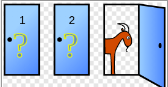

# 反直觉的概率问题

`#数学运算` 


## 目录
<!-- toc -->
 ## 概率原则 

- 请搞清楚**样本空间是什么**？

## 男孩女孩问题

假设有一个家庭，有两个孩子，现在告诉你其中有一个男孩，请问另一个也是男孩的概率是多少？

- `1/2`  ？ 
	- 因为另一个孩子要么是男孩，要么是女孩，而且概率相等呀
	- 但是**实际上，答案是 1/3**。

- 有两个孩子，那么**样本空间**为 4
	- 即哥哥妹妹，哥哥弟弟，姐姐妹妹，姐姐弟弟这四种情况
	- 已知有一个男孩，那么排除姐姐妹妹这种情况，所以样本空间变成 3
		- 另一个孩子也是男孩只有哥哥弟弟这 1 种情况，所以概率为 1/3。

## 生日悖论

一个屋子里需要有多少人，才能使得存在至少两个人生日是同一天的概率达到 50% ？ 
- 按照直觉，要得到 50% 的概率，起码得有 183 个人吧，因为一年有 365 天呀

```javascript
function birthdayProbability(n) {
  // 如果人数超过365，概率必然为1
  if (n > 365) {
    return 1.0;
  }

  // 计算所有人生日都不同的概率
  // 使用乘积计算所有人生日都不同的概率
  let probDifferent = 1.0;
  for (let i = 0; i < n; i++) {
    probDifferent *= (365 - i) / 365;
  }

  // 返回至少两个人生日相同的概率（1减去所有人生日都不同的概率）
  // 返回至少有两个人生日相同的概率
  return 1 - probDifferent;
}

// 找到使概率超过50%的最小人数
let n = 1;
while (birthdayProbability(n) < 0.5) {
  n++;
}

console.log(`需要${n}人，才能使得至少两个人生日相同的概率超过50%`);

// 展示不同人数下的概率
console.log("\n不同人数下的概率：");
for (let i = n - 2; i <= n + 2; i++) {
  const prob = birthdayProbability(i);
  console.log(`${i}人时的概率: ${(prob * 100).toFixed(2)}%`);
}

```

```javascript
需要23人，才能使得至少两个人生日相同的概率超过50%

不同人数下的概率：
21人时的概率: 44.37%
22人时的概率: 47.57%
23人时的概率: 50.73%
24人时的概率: 53.83%
25人时的概率: 56.87%

```

当人数达到 `70` 时，存在两个人生日相同的概率就上升到了 99.9%，基本可以认为是 100% 了。所以从概率上说，一个几十人的小团体中存在生日相同的人真没啥稀奇的。

> 在组合事件中，即使单个事件的概率很小，但当样本量增加时，某些事件发生的概率会快速增长，并不是线性的

## 三门问题

游戏参与者面对三扇门，其中两扇门后面是山羊，一扇门后面是跑车

- 你是游戏参与者，现在有门 1,2,3，假设你随机选择了门 1，然后主持人打开了门 3 告诉你那后面是山羊。
- 现在，你是坚持你最初的选择门 1，还是选择换成门 2 呢
	- 换还是不换？



主持人开门实际上**在「浓缩」概率**。
- 一开始你选择到跑车的概率当然是 1/3，剩下两个门中包含跑车的概率当然是 2/3，这没啥可说的。
- 但是主持人帮你排除了一个含有山羊的门，相当于把那 2/3 的概率浓缩到了剩下的这一扇门上。
- 那么，你说你**是抱着原来那扇 1/3 的门**，还是换成那扇经过「浓缩」的 2/3 概率的门呢

假设三扇门分别标记为 A、B、C，我们来列举所有可能的情况：

### 假设汽车在 A 门后面
初始选择 | 主持人可打开的门 | 剩余可换的门 | 换门结果 | 不换结果
---------|-----------------|-------------|----------|----------
选A | B或C (主持人选一个) | C或B | 输 | 赢
选B | C | A | 赢 | 输
选C | B | A | 赢 | 输

### 假设汽车在 B 门后面
| 初始选择 | 主持人可打开的门     | 剩余可换的门 | 换门结果 | 不换结果 |
| ---- | ------------ | ------ | ---- | ---- |
| 选A   | C            | B      | 赢    | 输    |
| 选B   | A或C (主持人选一个) | C或A    | 输    | 赢    |
| 选C   | A            | B      | 赢    | 输    |

### 假设汽车在 C 门后面
初始选择 | 主持人可打开的门 | 剩余可换的门 | 换门结果 | 不换结果
---------|-----------------|-------------|----------|----------
选A | B | C | 赢 | 输
选B | A | C | 赢 | 输
选C | A或B (主持人选一个) | B或A | 输 | 赢

### 总结统计

1. **总共有12种基本情况**（考虑主持人的选择）
2. **如果选择换门**：
   - 赢的情况：6种（当初始选择是羊时）
   - 输的情况：3种（当初始选择是车时）
   - 获胜概率：6/9 = 2/3 ≈ 66.7%
3. **如果选择不换**：
   - 赢的情况：3种（当初始选择是车时）
   - 输的情况：6种（当初始选择是羊时）
   - 获胜概率：3/9 = 1/3 ≈ 33.3%

### 关键点说明

1. 初始选择时，选中汽车的概率是 1/3，选中羊的概率是 2/3
2. 主持人的行为不是随机的，他知道车在哪里，并且一定会打开一扇有羊的门
3. 当你最初选中羊时（概率 2/3），换门必赢
4. 当你最初选中车时（概率 1/3），换门必输

