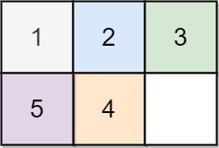
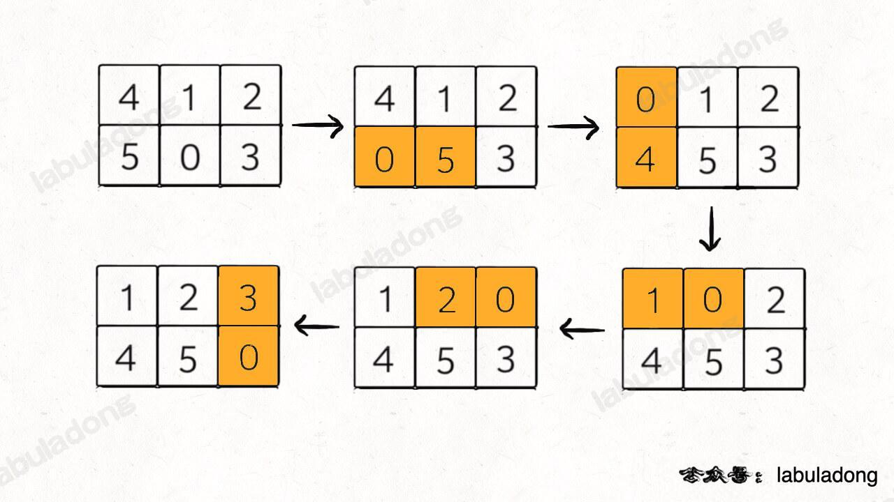
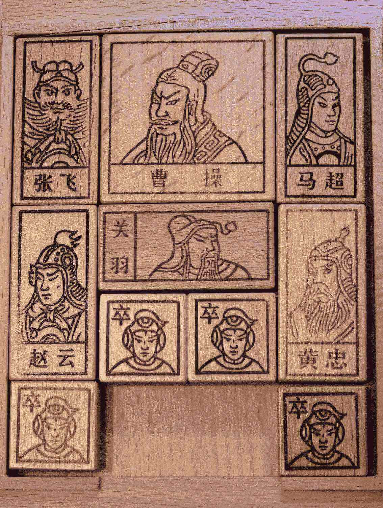

# 滑动谜题

> [773. 滑动谜题](https://leetcode.cn/problems/sliding-puzzle/)

类似的拼图游戏

## 目录
<!-- toc -->
 ## 思路 

- 如何穷举出 `board` 当前局面下可能==衍生出的所有局面==
	- 看数字 0 的位置呗，和上下左右的数字进行交换就行了，如下图：

- 这样就是一个 BFS 问题
	- 每次先找到数字 0，然后和周围的数字进行交换，形成新的局面加入队列…… 
	- 当第一次到达 `target` 时，就得到了赢得游戏的==最少步数==

