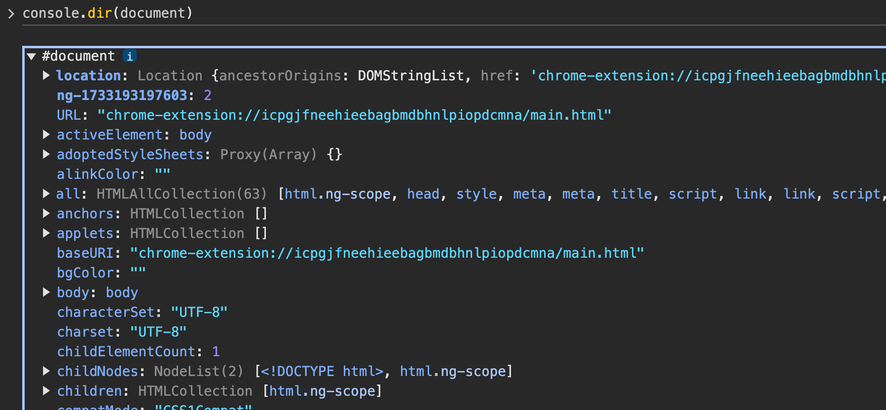
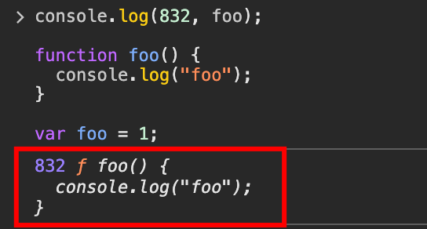
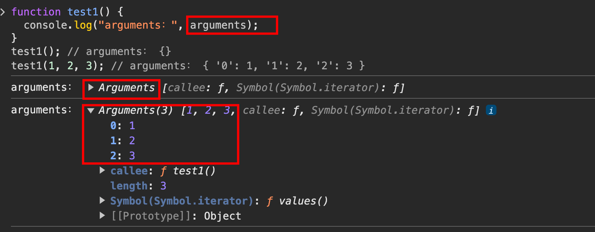
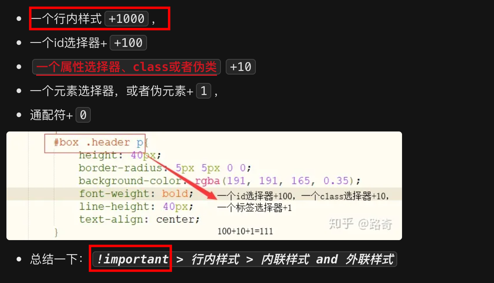
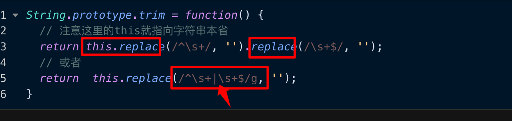
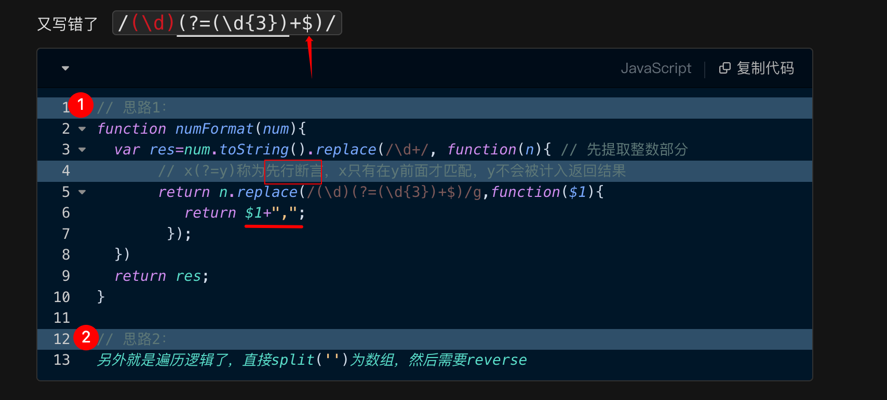

# 常见面试题：篇四

`#前端面试` 


## 目录
<!-- toc -->
 ## 1. src、href区别 

- `src` ，资源引用，如 
	- script、image、video、audio等
- `href`
	- 超文本引用，可`并行下载请求`，`link/a` 等标签

## 2. label 的作用

点击 `label` 时，对应的表单获得焦点

## 3. title 与 h1 的区别、b与strong的区别、i与em的区别

- 强调：`strong、em`，seo 侧重些
- 只是样式斜体或者加粗：`b、i`
- `title`就是网页标题
- `H1`有层次的标题

## 4. img 的`srcset`属性的作⽤

适配视网膜屏，比如`2x、3x`等等

## 5. svg 与 canvas

- svg 本质还是 dom、xml
- canvas 适合编程

## 6. 说说`defer`/`async`的区别

- 下载**都不受影响**
	- 两者都没有
		- 立即加载并执行，不等待后续的文档是否加载好
- defer : 相对延迟的执行脚本，下载不受影响
	- 文档解析和脚本加载是异步的
	- 等 DOM 解析完后才开始执行脚本
	- 类似于 script 标签放到 body 之后
- async ：更快的执行脚本
	- 文档解析和脚本加载是异步的
	- 但下载后脚本后会停止 HTML 解析，开始执行脚本，脚本执行完后继续解析 HTML
- 同时有，==async 优先级更高==

## 7. `标签`通常与 `break语句` 和 `continue语句` 配合使用，跳出特定的循环

## 8. 判断数据类型

- typeof 
	- undefined  
	- function 
	- symbol
- instanceof
- **Object.prototype.toString.call(`"a"`)** 方法


> 使用`[].slice.call(this,arg)` 转成真正数组，别和它搞混了

## 9. 基本类型：8 种

`Undefined、Null、Boolean、Number、 String 和 Symbol、Object、bigIng`

## 10. 错误处理

```javascript hl:6
// 可以返回 true 来阻止浏览器默 认报告错误的行为, 
// 这个函数实际上就变成了整个文档的 try/catch 语句,
// 最好别这么搞
window.onerror = (message, url, line) => { 
  console.log(message);
  return true;
};


window.onerror = (message, url, line, column, error) => {
  // return true  : 表示错误已经被处理，阻止浏览器默认的错误处理
  // return false : 表示错误未被处理，浏览器会继续执行默认的错误处理
  // 不返回值    : 等同于 return false
};


// 示例 1: 返回 false - 错误会显示在控制台
window.onerror = (message, url, line) => {
  console.log('捕获到错误：', message);
  return false; // 浏览器会在控制台显示错误
};

// 示例 2: 返回 true - 错误被"吞掉"
window.onerror = (message, url, line) => {
  console.log('捕获到错误：', message);
  return true; // 浏览器不会在控制台显示错误
};

window.onerror = (message, url, line) => {
  try {
    // 尝试处理错误
    handleError(message, url, line);
    return true; // 如果处理成功，阻止默认错误显示
  } catch (e) {
    console.error('错误处理失败：', e);
    return false; // 如果处理失败，让浏览器显示原始错误
  }
};

```

## 11. try/catch/finally

- **try 里面还可以**`try`
- `finally`**无论正常错误都会执行**

## 12. 左结合 与 右结合

总结：
- 大部分都是**左结合**
- **少数运算符是右结合** ==其实就三个==
	- 赋值运算符（`=`）
	- 三元条件运算符（`?:`） 
	- 和 `**` 

```javascript

// 左结合
x + y + z
===》 (x + y) + z

// 少数运算符是“右结合”，其中最主要的是赋值运算符（=）和三元条件运算符（?:） 和 ** 

// 赋值运算符（=）
w = x = y = z;
===》  w = (x = (y = z));

// 三元条件运算符（?:） 
q = a ? b : c ? d : e ? f : g;
===》
q = a ? b : (c ? d : (e ? f : g));

// 指数运算符（**）也是右结合
2 ** 3 ** 2
// 相当于 2 ** (3 ** 2)
// 512
```

## 13. 采用`function`命令和`var`赋值语句声明同一个函数，由于存在函数提升，最终以 var 定义的为准


## 14. 怎么用好Chrome Devtools工具

- 使用`console.table` 可以更直观的打印出数组或者对象
- 使用 `console.dir`
	- 递归打印出所有对象，比如打印出一个 DOM 元素，以前都不能直接看里面的元素
	- 
- 使用`coverage`
	- 检查没用的css/js占比，没用的红色标识，用到的使用绿色标识，如下图
- 使用`console.trace` 追踪向 Web控制台 输出一个堆栈跟踪

## 15. 说说尾调用优化

**尾调用**： 是指一个函数的最后一个动作是调用另一个函数

```javascript
// 对 `g(x)` 的调用就是一个尾调用
function f(x) {
  return g(x);
}
```

**尾调用优化**：
- 是指编译器或解释器能够优化尾调用，使其不在调用栈上创建新的栈帧。
- 相反，**它会清除当前栈帧并重用它**。这样可以防止栈溢出，并且可以使某些递归算法在常量空间内运行

### 15.1. 正常的 fib

```javascript
function fib(n) {
  if (n <= 1) {
    return 1;
  }
  return fib(n - 1) + fib(n - 2);
}

fib(0); // 1
fib(1); // 1
fib(2); // 2
fib(3); // 3
fib(4); // 5
fib(5); // 8
fib(6); // 13
fib(7); // 21
fib(8); // 34
fib(9); // 55
fib(10); // 89
fib(100); // 超时
fib(500); // 超时
```

### 15.2. 尾调用优化：记着这个就好了

```javascript
// 尾调用优化
function fibTail(n, prev = 1, curr = 1) {
  // n 为 0 时，返回 prev
  if (n === 0) return prev;
  // 递归调用
  return fibTail(n - 1, curr, prev + curr); // 尾调用
}
```

### 15.3. 尾调用优化：bigInt

```javascript
function fibBigInt(n, prev = 1n, curr = 1n) {
  if (n === 0) return prev;
  return fibBigInt(n - 1, curr, prev + curr);
}
```

>  使用 `1n` 

## 16. 函数作用域

> 一句话，函数执行时所在的作用域，是**定义时的作用域，而不是调用时所在的作用域** 

> **这和普通函数和箭头函数的 this 的指向 别搞混了**

```javascript hl:3
var a = 1;
var x = function () {
  // 定义时没有 var，所以是全局变量 a
  console.log(a);
};

function f() {
  var a = 2;
  x();
}

f(); // 1

```

```javascript
// 函数x是在函数y体外声明的，作用域绑定外层，因此找不到函数y的内部变量a，导致报错
var x = function () {
  console.log(a);
};

function y(f) {
  var a = 2;
  f();
}

y(x);
// ReferenceError: a is not defined
```

> **想表达的是，var 本来就是 js 设计的不合理的地方，使用 let 就好了**

## 17. 说说闭包

闭包的最大用处有两个

- 一个是可以读取**外层函数内部的变量**，
- 另一个就是**让这些变量始终保持在内存**中，即闭包可以使得它诞生环境一直存在

## 18. JavaScript 函数内部的变量提升（Hoisting）机制

### 18.1. var 变量提升

```javascript
function example() {
    console.log(a); // 输出：undefined
    var a = 1;
    console.log(a); // 输出：1
}
// 等价于
function example() {
    var a;           // 变量声明被提升到函数顶部
    console.log(a);  // undefined
    a = 1;          // 赋值操作保持在原位置
    console.log(a);  // 1
}
```

### 18.2. 函数声明的提升

```javascript
function example() {
    sayHello(); // 输出："Hello!"
    
    function sayHello() {
        console.log("Hello!");
    }
}

```

### 18.3. let 与 const 

let 和 const 声明的变量也会提升，但是存在"暂时性死区"（Temporal Dead Zone，TDZ），在声明之前访问会抛出错误。

```javascript
function example() {
    console.log(a); // 报错：ReferenceError
    let a = 1;
}
```

> `暂时性死区`的本质就是，只要一进入当前作用域，所要使用的变量就已经存在了，但是不可获取，**只有等到声明变量的那一行代码出现**，才可以获取和使用该变量

### 18.4. 注意事项

- 函数声明会被提升到变量声明之前，比如 foo 同时是一个函数和变量
- 函数表达式不会被提升
- 使用 let 和 const 代替 var
- 在作用域顶部声明变量
- 先声明后使用
- 避免依赖变量提升机制

> [!tip]
> 虽然 JavaScript 引擎会帮我们处理提升，但是**显式地声明和初始化变量可以让代码更清晰、更易于理解**

## 19. `new.target` 标识函数只能作为构造函数

```javascript hl:2
function King() {
      if (!new.target) {
        throw 'King must be instantiated using "new"'
      }
      console.log('King instantiated using "new"');
}

new King(); // King instantiated using "new"
King();     // Error: King must be instantiated using "new"
```

## 20. 函数的 caller 属性

```javascript hl:5,6,9
function outer() {
  inner();
}
function inner() {
  // 这里的caller是outer函数，因为inner函数是由outer函数调用的
  // 但是在严格模式下，caller属性会抛出错误
  console.log(inner.caller);

  // 同上	
  // console.log(arguments.callee.caller);
}
outer();

```

## 21. es6中的变量申明有哪些？

- `var`命令
- `function`命令
- `let`
- `const`
- `import`命令
- `class`命令

## 22. 使用 React Hooks 实现一个 useFetchData

> 和 vue 的 hooks 真的很像

```javascript  hl:16,28,37
// 使用 React Hooks 实现一个 useFetchData
// 在我们的业务中经常会遇到列表或者表格页面
// 需要支持翻页，加载更多，错误处理， loading 的功能。希望能够实现一个 Hook 来抽象这部分逻辑
function useFetchData() {
  const [data, setData] = useState([]);
  const [loading, setLoading] = useState(false);
  const [error, setError] = useState(null);
  // 这些参数适合都放到 options 里面
  const [page, setPage] = useState(1);
  const [total, setTotal] = useState(0);
  const [pageSize, setPageSize] = useState(10);
  const [reload, setReload] = useState(false);

  // 用于保存 ref 的引用
  const ref = useRef();
  // 用于保存 AbortController 的引用, 用于取消请求
  const abortControllerRef = useRef();

  function destroy() {
    ref.current = true;
    setData([]);
    setLoading(false);
    setError(null);
    setPage(1);
    setTotal(0);
    setPageSize(10);
    setReload(false);
    // 销毁时取消请求
    abortControllerRef.current && abortControllerRef.current.abort();
  }

  useEffect(() => {
    setLoading(true);

    // 保存 AbortController 的引用
    abortControllerRef.current = new AbortController();
    const { signal } = abortControllerRef.current;

    fetch(
      "https://api.example.com/data?page=" + page + "&pageSize=" + pageSize,
      { signal },
    )
      .then((res) => res.json())
      .then((res) => {
        setData(res.data);
        setTotal(res.total);
        setLoading(false);
      })
      .catch((err) => {
        setError(err);
        setLoading(false);
      })
      .finally(() => {
        setLoading(false);
      });

    return () => {
      destroy();
    };
  }, [page, pageSize, reload]);

  return {
    data,
    loading,
    error,
  };
}

export default useFetchData;

```

## 23. 发现没有，清理函数都是通过 return 返回的

- 比如 vue watch 的 `cleanup`
- 比如 React `useEffect` 的返回值
- 又比如平时写的函数等等

## 24. git merge 与 git rebase 有什么区别

- 提交历史
	- `git merge` 会保留历史记录
	- `git rebase` 会合并记录，可以**有线性的提交历史，会丢历史记录**
- 我之前所在的团队都是禁用`git rebase` 的
	- 好看而已，但会丢历史数据

## 25. 统计HTML标签中以`b`开头的标签数量：

>  `document.getElementsByTagName('*')`

```javascript hl:2,10
// 方法一：循环
const tags = document.getElementsByTagName('*');
// tags是类数组对象，内部实现了，部署 Iterator 接口，可以使用扩张运算符，否则不能使用扩张运算符
// 要使用数组的方法必须将类数组转为真正的数组
// tagName 都是大写的
const value = [...tags].filter((item) => item.tagName.startsWith('B'))

// 方法二：树查找
const prefixBElements = [];
function dfs(ele) {
    if (ele.tagName.startsWith('B')) {
        prefixBElements.push(ele);
    }
    for (const child of ele.children) {
        dfs(child);
    }
}
// 从HTML根节点开始找
dfs(document.documentElement);
console.log(prefixBElements);
```

## 26. 统计HTML标签中出现次数最多的标签

```javascript hl:1,11,13
const tags = document.getElementsByTagName('*');


let map = new Map();
let maxStr = '';
let max = 0;
// 只是使用下标来获取，没有使用数组的方法，所以不需要将类数组转为数组
for(let i = 0; i < tags.length; i++) {
    let value = map.get(tags[i].tagName)
    if(value) {
        map.set(tags[i].tagName, ++value)
    } else {
        map.set(tags[i].tagName, 1);
    }
    // 统计，计算最大，实时更新，max和maxStr
    if(value > max) {
        maxStr = tags[i].tagName;
        max = value;
    }
}
console.log(`当前最多的标签为 ${maxStr}，个数为 ${max}` );
```

## 27. 给一段 HTML 字符串判断合法性

- 正则
- 或者直接插入 innerHtml 即可，看看是否渲染报错


```javascript hl:2
// 判断闭合标签
// \1 的使用
let tagClose = /<([a-zA-Z]+)[\s\S]*>[\s\S]*?<\/\1>/

let tagCloseNoContent = /<[a-zA-Z]+[\s\S]*\/>/

// 遍历，const tags = document.getElementsByTagName('*'); 来统一判断，校验各种合理性
// 或者通过查找树，递归来处理，校验合理性

① 标签正则：闭合或者非闭合的
② span 中不能包含 div , table td tr 的嵌套合理性
③ 所以，还是很麻烦的，很多需要考虑的点
```

## 28. 自己实现一个模板引擎

短时间内写不出来的，但需要考虑的点

- 模板正则匹配
- 可使用 `with` 注入变量，改变作用域
- 可使用 `new Function` 执行特定规则后的代码
- 使用 replace ，可能需要嵌套使用 `replace` 等
- 可以参考的：
	- vue template
	- handlebar 
	- ejs
	- 等等

所以，这个别浪费时间了，pass 吧，真遇到那么就说说思路，很难段时间写出来的

## 29. 函数声明会被提升到作用域的顶部

```javascript hl:5
// 为什么不会报错？
// 因为函数声明会被提升到作用域的顶部，
console.log(832, foo);

// 如果改成 var foo = function 则会报错
function foo() {
  console.log("foo");
}

var foo = 1;

```



## 30. 获取函数参数的方法

- 使用 `arguments` 对象
	- 
- 使用**扩展运算符**
	- `function fn(first, ...args) {}`

## 31. 如何清除浮动

- 子元素设置浮动时，父元素设置为 BFC，比如 `overflow:hidden`
- 前后两个兄弟元素，前一个设置了浮动 `float:left`，后一个把前一个覆盖了
	- 后一个设置为 BFC 即可，比如 `overflow:hidden

## 32. z-index 的规则

- 在同一个层叠上下文领域，**谁大谁上**
- 当元素的层叠水平一致时，**后来居上**

> 还需要关注是否在一个层叠上下文

## 33. CSS 性能优化

- 文件压缩
- css 动画启用`GPU`加速，一些图形渲染的`放心交给GPU`
- 避免`@import`
- 减少`css嵌套`
- 减少过分`重排`
- `不要table布局`，一个很小的改动会导致 `致table重新布局`
- `css 选择器，不要通配符`

## 34. css 优先级计算规则



## 35. CSS 的编写方式有哪些？

- 手写源生 CSS
- 使用预处理器 `Sass/Less`
- 使用后处理器 `PostCSS` 、`css`的`babel` （类比于js）
- 使用 **css modules**
- 使用 **css in js**

## 36. 实现 trim

两种写法： `/^\s+|\s+$/` ，注意使用 `^` 和 `$`



## 37. 实现千分位



关键点：
- 使用 replace 的第二个函数参数
- `x(?=y)`  
- `$` 匹配结束，应该从后往前匹配
- 遍历的话，需要转成数组
	- 遍历需要 reverse 
	- 或者 倒着遍历

## 38. 防抖和节流的实现

- 防抖：即 `只执行最后一次` ， 
	- 比如 resize 和 sug ，按钮提交、表单验证
- 节流：即`单位时间只执行一次`
	- 比如滚动加载更多，拖拽移动事件
- **关键点**：
	- 都返回一个 `return function (...args) {`
		- 真正执行：`fn.apply(this, args);`

```javascript hl:3,15
function debounce(fn, ms) {
  let timer = null;
  // 返回一个函数
  return function (...args) {
    timer && clearTimeout(timer);
    // 清除，重新settimeout
    timer = setTimeout(() => {
      fn.apply(this, args);
    }, ms);
  };
}

function throttle(fn, ms) {
  let timer = null;
  // 返回一个函数
  return function (...args) {
    // 保证一段时间只执行一次
    // 如果 timer 存在，说明已经执行过了，直接返回
    if (!timer) {
      timer = setTimeout(() => {
        fn.apply(this, args);
        timer = null;
      }, ms);
    }
  };
}

function throttle(fn, ms) {
  let start = 0;
  return function (...args) {
    if (Date.now() - start > ms) {
      start = Date.now();
      fn.apply(this, args);
    }
  }
}
```

## 39. 前端项目如何找出性能瓶颈

- 主动
	- 自己体验
	- 使用工具**分析收集**：
		- chrome、lighthouse 、内存分析、渲染掉帧情况、可以直接监控等
	- 真实环境、真实数据
		- 埋点、性能数据上报
- 被动
	- 客户反馈，具体情况，具体分析

## 40. 介绍下前端加密的常见场景和方法

- https，使用TLS/SSL**加密整个通信过程**，传输层加密
- 用户名密码，token 等
- app store 热更新方案

## 41. webpack的 `module` / `chuck` / `bundle` 是什么区别


## 42. webpack 的 resolve 有什么用？

```javascript
//webpack的 resolve有什么用？

const path = require("path");

module.exports = {
  resolve: {
    // 设置别名, 优化路径, 减少查找时间
    alias: {
      "@": path.resolve(__dirname, "src"),
      components: path.resolve(__dirname, "src/components"),
    },

    // 自动解析扩展名,应该尽量减少后缀列表长度，以减少尝试次数
    extensions: [".js", ".jsx", ".ts", ".tsx", ".json"],

    // 模块搜索目录，减少搜索时间
    // 优先搜索src目录，然后是node_modules
    // 应该尽量减少模块搜索目录长度，以减少尝试次数
    modules: ["node_modules", path.resolve(__dirname, "src")],

    // package.json中的主字段
    // - 根据不同环境可以选择不同的入口文件
    // 优先使用 module 字段，然后是browser字段，最后是main字段
    mainFields: ["browser", "module", "main"],

    // 性能优化
    // 优先使用缓存，减少文件系统访问
    // symlinks: 是否跟随符号链接解析模块,是否解析符号链接
    // - 在使用npm link时很有用- 设为false可以提高性能
    symlinks: false,
    // cacheWithContext: 是否缓存模块上下文解析
    cacheWithContext: false,

    // 强制使用 require.resolve 作为解析器
    enforceModuleExtension: false,
  },
};

```

## 43. 接上题`mainFields: ["browser", "module", "main"]`, 关于这几个主字段的选择，有什么区别吗？

```javascript
{
  "name": "my-library",
  "main": "./dist/index.js",         // Node.js环境使用,默认 commonjs
  "module": "./dist/index.esm.js",   // 现代打包工具使用,默认 es module
  "browser": "./dist/index.umd.js"   // 浏览器直接使用,默认 umd
}

```


如下，就没必要兼容浏览器了，优化打包性能


## 44. 下面的TS代码，会警告，请找出问题并修复


### 44.1. 解决方法一


### 44.2. 解决方法二


