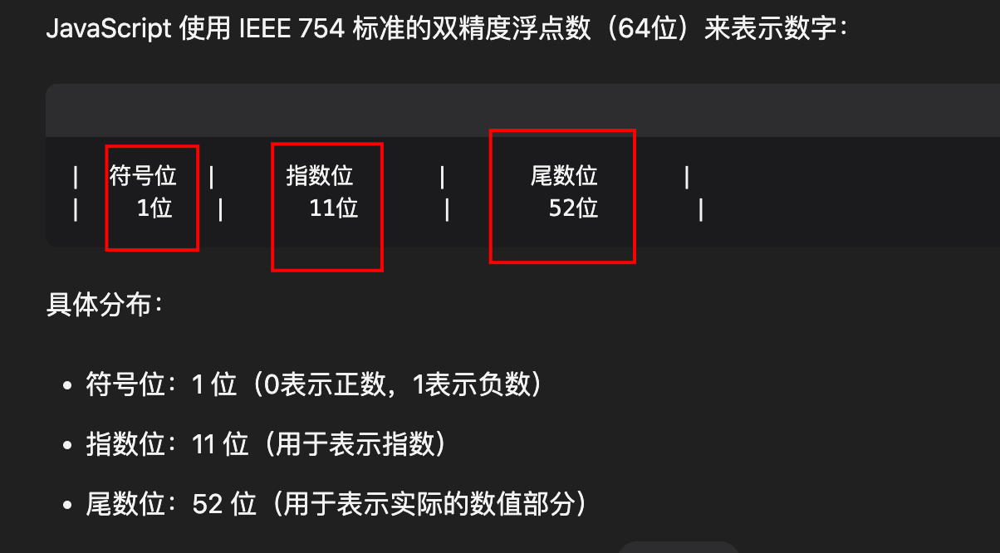

# BigInt 类型

`#javascript` 


## 目录
<!-- toc -->
 ## 1. BigInt 基础 

> [!danger]
> 数字后面 + `n`

BigInt 是 JavaScript 中的一种基本数据类型，用于表示任意精度的整数。它是 ES2020 (ES11) 新增的特性。

```javascript
// 创建 BigInt 的两种方式
const a = 123n;                    // 字面量语法，数字后加 'n'
const b = BigInt(123);            // 构造函数
const c = BigInt("123456789");    // 从字符串创建

console.log(typeof a);  // 'bigint'
```

## 2. 为什么需要 BigInt？

JavaScript 的 Number 类型使用 64 位双精度浮点数（IEEE 754），这导致：
- 最大安全整数：`Number.MAX_SAFE_INTEGER` (2^53 - 1)
	- 
- 最小安全整数：`Number.MIN_SAFE_INTEGER` (-(2^53 - 1))

```javascript
// Number 类型的限制
console.log(Number.MAX_SAFE_INTEGER);  // 9007199254740991
console.log(9007199254740991 + 1);     // 9007199254740992
console.log(9007199254740991 + 2);     // 9007199254740992 (错误!)

// BigInt 没有这个限制
console.log(9007199254740991n + 1n);   // 9007199254740992n
console.log(9007199254740991n + 2n);   // 9007199254740993n
```
