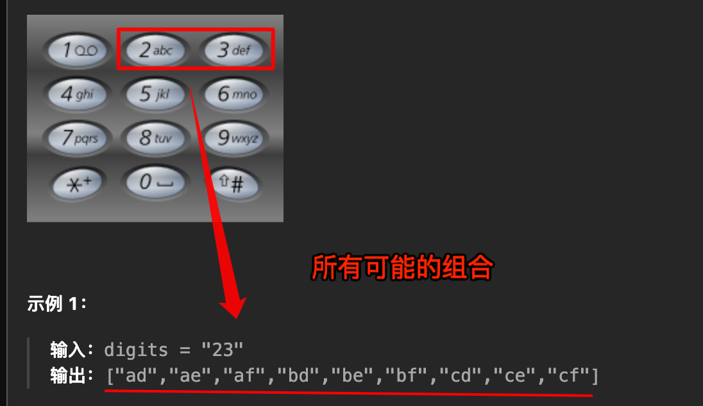

# 电话号码的字母组合

`#回溯算法` 


> [17. 电话号码的字母组合](https://leetcode.cn/problems/letter-combinations-of-a-phone-number/)


## 目录
<!-- toc -->
 ## 题目 



## 代码

- 注意 base case 别忘了
- mapping 使用数组来表示

```javascript
/**
 * @param {string} digits
 * @return {string[]}
 */
var letterCombinations = function (digits) {
    // base case
    if (!digits) return [];
    const mapping = ["", "", "abc", "def", "ghi", "jkl", "mno", "pqrs", "tuv", "wxyz"];
    let res = [];
    let n = digits.length;
    function backtrack(track, index) {
        if (track.length === n) {
            res.push(track.join(''));
            return;
        }
        let str = mapping[parseInt(digits[index])]
        for (let c of str) {
            track.push(c);
            backtrack(track, index + 1);
            track.pop();
        }
    }
    backtrack([], 0);
    return res;
};
```

> 其实这题和 [10. SKU 排列](/post/B4N0ebmQ.html) 很类似