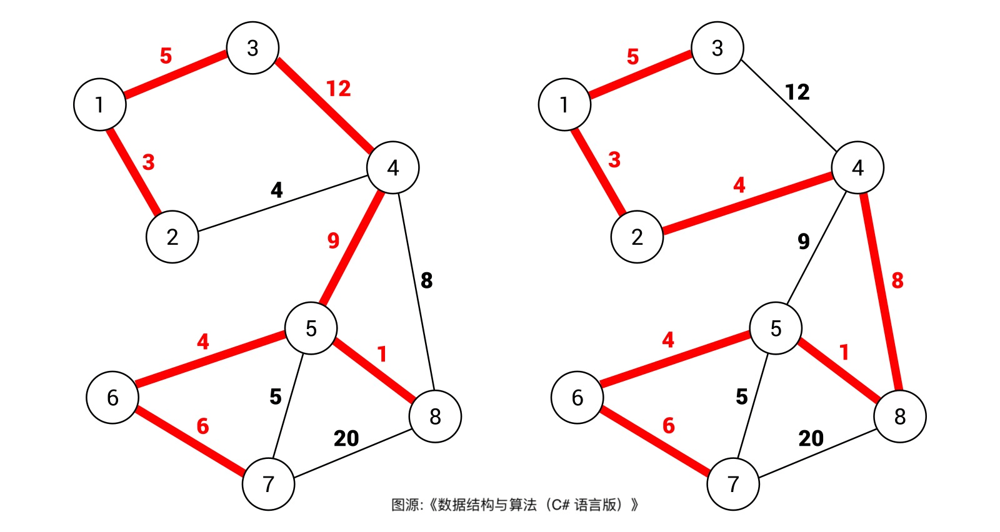

# 最小生成树： Kruskal 算法

## 目录
<!-- toc -->
 ## 最小生成图定义 

- `树和图`的根本区别：
	- `树`不会包含环
	- `图`可以包含环
- 无环连通图
	- 树一种特殊的图
- **生成树**
	- ① 在图中找一棵**包含图中的所有节点**的树。
	- ② 含有图中**所有顶点**的**无环连通子图**

比如下面这幅图，红色的边就组成了两棵不同的`生成树`

- 最小生成树
	- 所有可能的`生成树`中，权重和最小的那棵生成树就叫`最小生成树`
	- 比如上图，`右侧生成树`的`权重和`显然比`左侧生成树`的`权重和`要小

>  一般来说，我们都是在**无向加权图**中计算最小生成树的，所以使用最小生成树算法的现实场景中，图的边权重一般代表**成本、距离**这样的标量。

## 图生成树的合法性

更多参考  [261. 以图判树：判断图是否可以生成树](/post/L7jcaVf6.html)

## Kruskal 算法（克鲁斯卡尔算法）

>  MST 是 Minimum Spanning Tree 的缩写，中文译为"最小生成树"

所谓**最小生成树**，就是**图中若干边的集合**（ `mst`，最小生成树的英文缩写），你要保证这些边：
1. 包含图中的所有节点
2. 形成的结构是树结构（即不存在环）
3. 权重和最小

- 前两条就是 [261. 以图判树：判断图是否可以生成树](/post/L7jcaVf6.html) 这题实现的功能
- 关键在于第 3 点，如何保证**生成树权重和最小**

这里就用到了**贪心思路**：
- 将所有边按照权重从小到大排序，从权重最小的边开始遍历
	- 如果这条边和 `mst` 中的其它边不会形成环，则这条边是最小生成树的一部分，将它加入 `mst` 集合；
	- 否则，这条边不是最小生成树的一部分，不要把它加入 `mst` 集合。

这样，最后 `mst` 集合中的边就形成了最小生成树

下面我们看两道例题来运用一下 **Kruskal 算法**

## 例题一：最低成本连通所有城市

[1135. 最低成本连通所有城市](/post/rJhpGJpw.html)

## 例题二：

