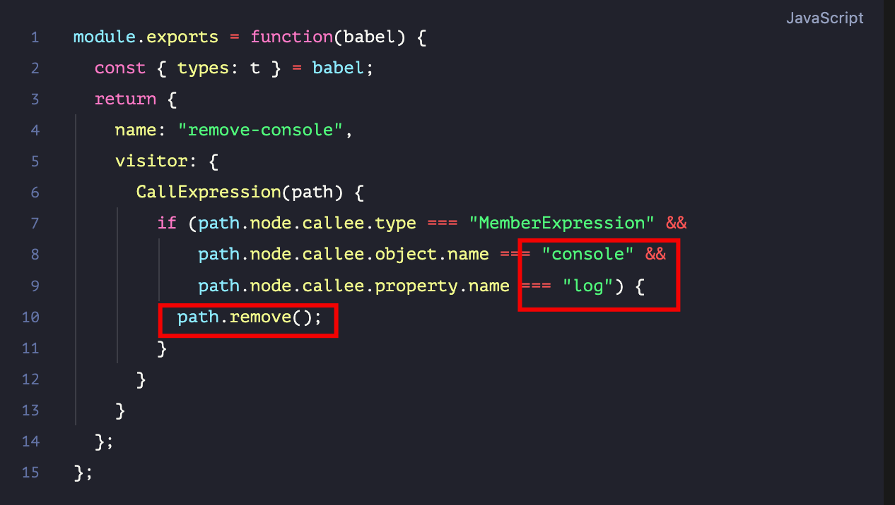

# Babel 插件开发

`#babel` `#前端工程化` 


## 目录
<!-- toc -->
 ## 1. 总结 

- Babel 插件==本质上==是通过==访问者模式==来操作 AST
	- 再具体点，就是==多叉树的遍历==
	- 并在遍历过程中对其进行==修改==
		- 看下面 ==移除 console.log 的示例==
- 使用场景
	- es6 → es5
	- JSX 转换为普通 JavaScript 
	- ts → es5
- 示例：移除 console.log
	- 

## 2. Babel 插件的基本概念

Babel 插件本质上是通过访问者模式（Visitor Pattern）来操作 AST（抽象语法树）。

每个插件都可以访问源代码的语法树，并在遍历过程中对其进行修改。

## 3. 常见的 Babel 插件使用场景

1. **代码转换**
   - ES6+ 语法转换为 ES5
   - TypeScript&Flow 类型注解的移除
   - JSX 转换为普通 JavaScript 

1. **开发环境优化**
   - 移除测试相关的代码
      - （如 data-testid 属性）
   - 条件编译
   - 开发环境特定代码的处理 

## 4. 插件开发步骤

1. **理解 AST**
   - 首先需要理解代码的 AST 结构
   - 使用 AST Explorer 工具来可视化 AST
   - 确定需要转换的节点类型

2. **实现访问者对象**
```javascript
module.exports = function(babel) {
  return {
    visitor: {
      // 访问特定类型的节点
      Identifier(path) {
        // 转换逻辑
      }
    }
  };
}
```

## 5. 实际案例示例

以下是一个简单的 Babel 插件示例，用于移除代码中的 console.log：

```javascript
module.exports = function(babel) {
  const { types: t } = babel;
  return {
    name: "remove-console",
    visitor: {
      CallExpression(path) {
        if (path.node.callee.type === "MemberExpression" &&
            path.node.callee.object.name === "console" &&
            path.node.callee.property.name === "log") {
          path.remove();
        }
      }
    }
  };
};
```

## 6. 开发建议

1. **测试驱动开发**
   - 编写单元测试确保转换正确
   - 使用 babel-plugin-tester 进行测试
   - 考虑边界情况

2. **性能考虑**
   - 避免不必要的遍历
   - 缓存重复使用的数据
   - 优化转换逻辑

3. **调试技巧**
   - 使用 console.log 打印 AST 节点
   - 利用断点调试
   - 使用 AST 可视化工具

## 7. 实际应用场景

1. **自动国际化**
   - 自动提取文本到语言文件
   - 替换硬编码的字符串
   - 添加 i18n 包装器

2. **代码优化**
   - ==自动引入模块==
   - 删除未使用的代码
   - 转换特定的语法结构

3. **开发工具支持**
   - 自动生成文档
   - 代码检查
   - 自动化重构

通过开发 Babel 插件，我们可以实现很多自动化的代码转换任务，提高开发效率，确保代码质量。在实际开发中，建议从简单的转换开始，逐步掌握更复杂的转换场景。