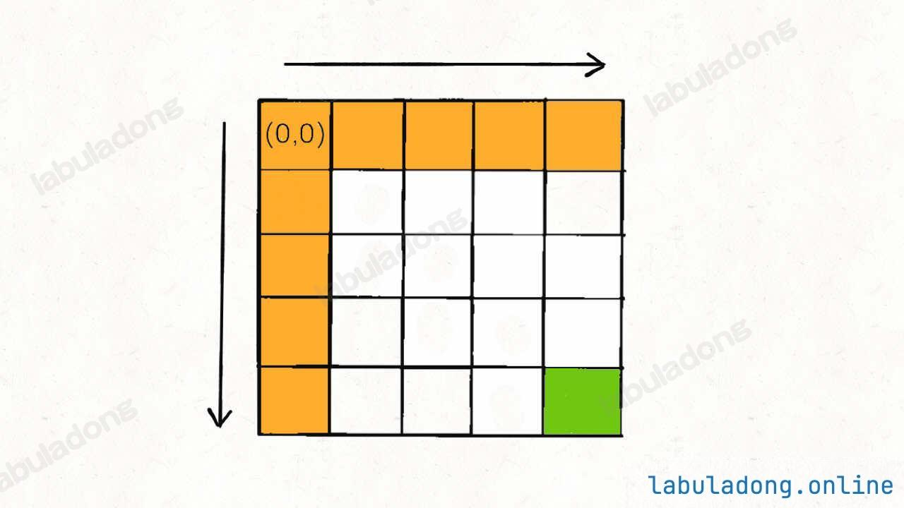
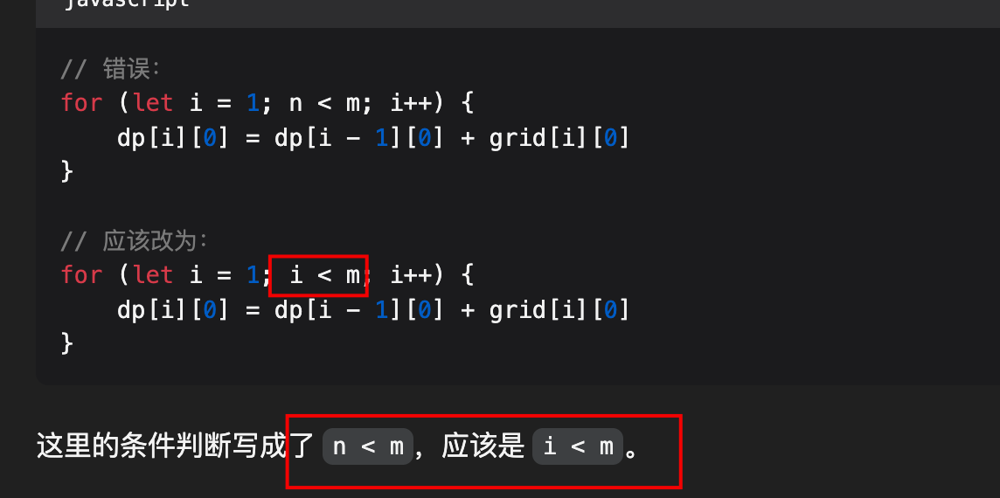
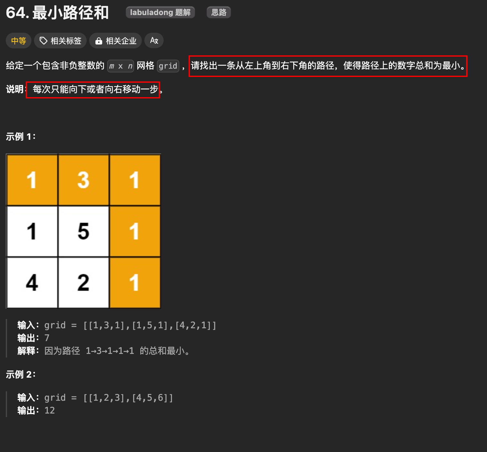
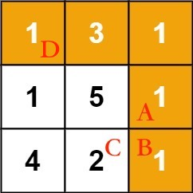

# 最小路径和

`#算法/动态规划` 

>  [64. 最小路径和](https://leetcode.cn/problems/minimum-path-sum/)


## 目录
<!-- toc -->
 ## 总结 

- 思路
	- 定义 ：`dp[i][j]` 
		- `从 grid[0][0] 走到 grid[i][j] 的最小路径和`
	- base case
		- 
	- 尽量使用**迭代解法**，解出来的大概率都能通过用例

### 代码：迭代解法

```javascript
/**
 * @param {number[][]} grid
 * @return {number}
 */
var minPathSum = function (grid) {
  let m = grid.length;
  let n = grid[0].length;
  let dp = new Array(m).fill().map(() => {
    return new Array(n).fill(-1);
  });

  // dp[i][j]  从 grid[0][0] 走到 grid[i][j] 的最小路径和
  dp[0][0] = grid[0][0];
  for (let j = 1; j < n; j++) {
    dp[0][j] = dp[0][j - 1] + grid[0][j];
  }
  for (let i = 1; i < m; i++) {
    dp[i][0] = dp[i - 1][0] + grid[i][0];
  }

  for (let i = 1; i < m; i++) {
    for (let j = 1; j < n; j++) {
      dp[i][j] = Math.min(
        dp[i - 1][j] + grid[i][j], 
        dp[i][j - 1] + grid[i][j]);
    }
  }

  return dp[m - 1][n - 1];
};
```

### 错误记录



>  找了半天，人眼睛还是不容易发现，AI 一下就发现了

## 1. 题目



## 2. 分析

一般来说，让你在二维矩阵中求最优化问题（最大值或者最小值），肯定需要**递归 + 备忘录**，也就是动态规划技巧



「从 `D` 走到 `B` 的最小路径和这个问题转化成了
- 从 `D` 走到 `A` 的最小路径和
- 从 `D` 走到 `C` 的最小路径和 这两个问题

### 2.1. 状态转移方法定义

```javascript
// 从左上角位置 `(0, 0)` 走到位置 `(i, j)` 的最小路径和为 `dp(grid, i, j)`
var dp = function(grid, i, j) {}
```

### 2.2. 所以这个题的框架代码为

```javascript hl:5
var minPathSum = function(grid) {
    var m = grid.length;
    var n = grid[0].length;
    // 计算从左上角走到右下角的最小路径和
    return dp(grid, m - 1, n - 1);
};
```

### 3. base Case 分析


## 4. 自顶向下动态规划解法：会超时

```javascript hl:18,15
var minPathSum = function (grid) {
  var m = grid.length;
  var n = grid[0].length;
  // 计算从左上角走到右下角的最小路径和
  return dp(grid, m - 1, n - 1);

  function dp(grid, i, j) {
    // base case：如果没有格子，取最左边和最上边的格子
    if (i == 0 && j == 0) {
      return grid[0][0];
    }
    // 如果索引出界，返回一个很大的值，
    // 保证在取 min 的时候不会被取到
    if (i < 0 || j < 0) {
      return Number.MAX_VALUE;
    }
    return (
      Math.min(
        dp(grid, i - 1, j), // 左边的格子
        dp(grid, i, j - 1), // 上边的格子
      ) + grid[i][j] // 当前格子的值
    );
  }
};

```

## 5. 自顶向下动态规划解法：使用备忘录优化

```javascript hl:5
var minPathSum = function (grid) {
  var m = grid.length;
  var n = grid[0].length;

  let memo = new Array(m).fill(-1).map(() => new Array(n).fill(-1));

  // 计算从左上角走到右下角的最小路径和
  return dp(grid, m - 1, n - 1);

  function dp(grid, i, j) {
    // base case：如果没有格子，取最左边和最上边的格子
    if (i == 0 && j == 0) {
      return grid[0][0];
    }
    // 如果索引出界，返回一个很大的值，
    // 保证在取 min 的时候不会被取到
    if (i < 0 || j < 0) {
      return Number.MAX_VALUE;
    }

    // 如果计算过这个状态，就不要重复计算
    if (memo[i][j] != -1) {
      return memo[i][j];
    }

    return (memo[i][j] =
      Math.min(
        dp(grid, i - 1, j), // 左边的格子
        dp(grid, i, j - 1), // 上边的格子
      ) + grid[i][j]); // 当前格子的值
  }
};

```

## 6. 自底向上的迭代解法

```javascript
var minPathSum = function (grid) {
  var m = grid.length;
  var n = grid[0].length;

  let memo = new Array(m).fill(-1).map(() => new Array(n).fill(-1));

  // 计算从左上角走到右下角的最小路径和
  return dp(grid, m - 1, n - 1);

  function dp(grid, i, j) {
    // base case：如果没有格子，取最左边和最上边的格子
    if (i == 0 && j == 0) {
      return grid[0][0];
    }
    // 如果索引出界，返回一个很大的值，
    // 保证在取 min 的时候不会被取到
    if (i < 0 || j < 0) {
      return Number.MAX_VALUE;
    }

    // 如果计算过这个状态，就不要重复计算
    if (memo[i][j] != -1) {
      return memo[i][j];
    }

    return (memo[i][j] =
      Math.min(
        dp(grid, i - 1, j), // 左边的格子
        dp(grid, i, j - 1), // 上边的格子
      ) + grid[i][j]); // 当前格子的值
  }
};

```