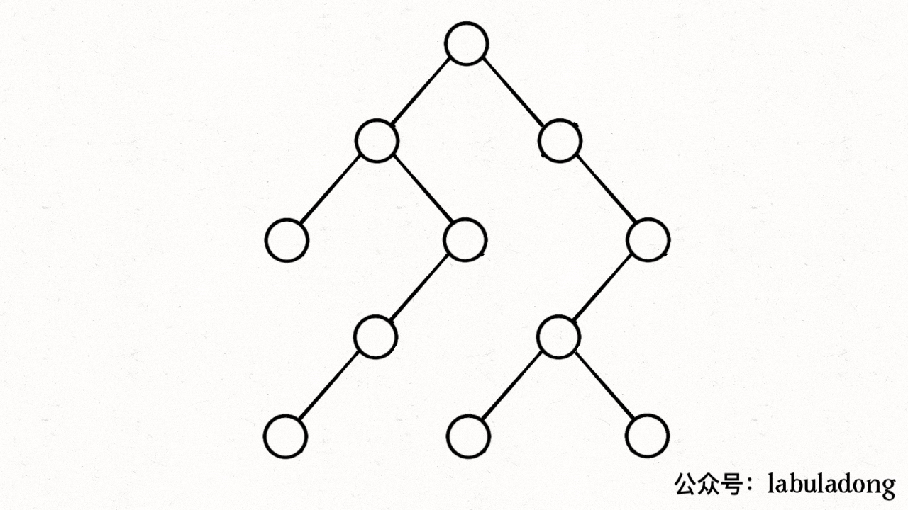

# 二叉搜索树迭代器


[173. 二叉搜索树迭代器](https://leetcode.cn/problems/binary-search-tree-iterator/)


实现一个二叉搜索树迭代器 BSTIterator 类：
1. `next()` 返回 BST 中的下一个最小值
2. `hasNext()` 返回是否还有下一个值
3. 要求平均时间复杂度为 `O(1)`，空间复杂度为 `O(h)`，其中 `h` 是树的高度


## 目录
<!-- toc -->
 ## 1. 思路一： 中序遍历数组法：提前将所有节点存入数组 

不满足空间复杂度需求

## 2. 思路二： 受控中序遍历法：使用栈模拟中序遍历过程（推荐）




```javascript
var BSTIterator = function (root) {
    // 模拟递归栈
    let stk = [];
    // 左侧树枝一撸到底
    var pushLeftBranch = function (p) {
        while (p != null) {
            stk.push(p);
            p = p.left;
        }
    };
    pushLeftBranch(root);
    this.next = function () {
        let p = stk.pop();
        pushLeftBranch(p.right);
        return p.val;
    };
    this.hasNext = function () {
        return stk.length > 0;
    };
};
```