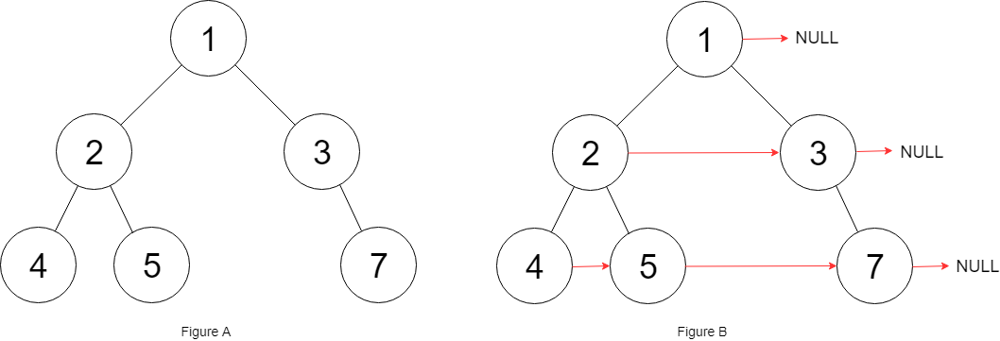

# 填充每个节点的下一个右侧节点指针 II

`#层序遍历`

>  [117. 填充每个节点的下一个右侧节点指针 II](https://leetcode.cn/problems/populating-next-right-pointers-in-each-node-ii/)


## 目录
<!-- toc -->
 ## 1. 题目 




和 [116. 填充每个节点的下一个右侧节点指针](/post/VLS5qdnO.html) 不一样，**输入的不是完全二叉树，所以不好直接用递归**

## 2. 思路

- 使用 [102. 二叉树的层序遍历](/post/DuLs92ng.html) 
	- 然后把这个节点和相邻节点连起来即可
	- 注意 base case


```javascript hl:12,16
var connect = function (root) {
  if (root === null) {
    return null;
  }
  let q = [];
  q.push(root);
  while (q.length > 0) {
    let sz = q.length;
    let pre = null;
    for (let i = 0; i < sz; i++) {
      let cur = q.shift();
      // 链接当前层所有节点的 next 指针
      if (pre !== null) {
        pre.next = cur;
      }
      pre = cur;
      // 将下一层节点装入队列
      if (cur.left !== null) q.push(cur.left);
      if (cur.right !== null) q.push(cur.right);
    }
  }
  return root;
};

```


