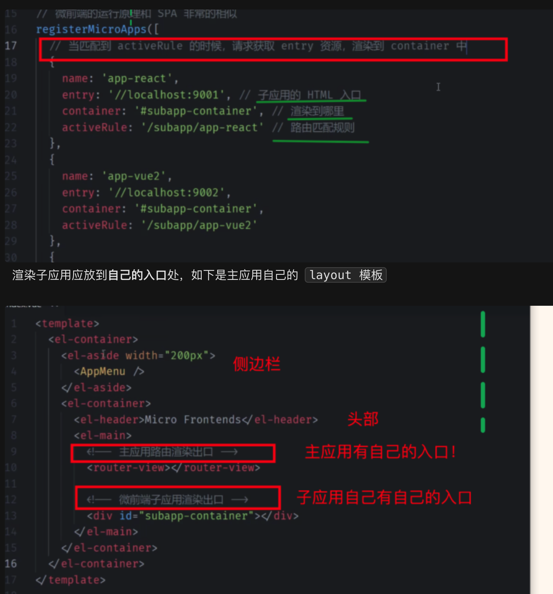
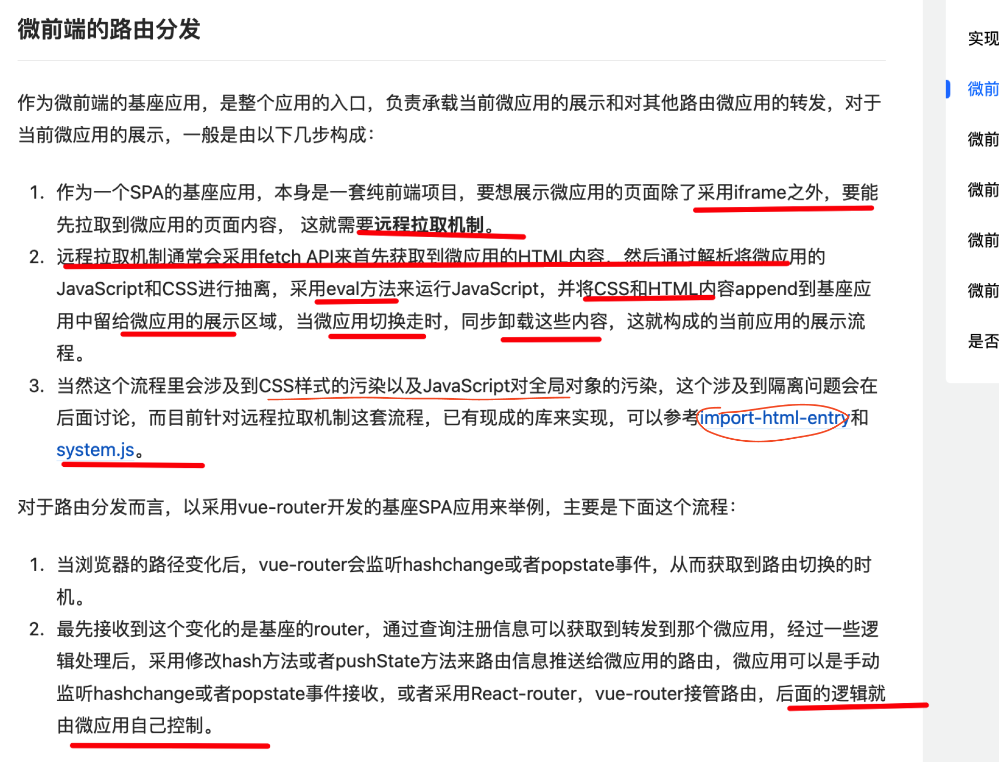

# 微前端核心原理及常见的微前端方案


`#微前端`


## 目录
<!-- toc -->
 ## 1. 微前端的核心原理 

- 应用隔离：确保各个子应用之间的 JavaScript、CSS、DOM 互不干扰
	- JavaScript 沙箱：确保各个子应用的 JS 运行环境相互隔离
	- CSS 隔离：防止样式冲突
	- 全局变量隔离：避免全局变量污染
- 生命周期管理：主应用统一管理各个子应用的加载、挂载、卸载等生命周期
	- 加载（bootstrap）
	- 挂载（mount）
	- 卸载（unmount）
	- 更新（update）
- 通信机制：在主应用和子应用之间建立通信渠道
	- 基于事件总线
	- 基于 Props 传递
	- 基于全局状态管理
	- 基于自定义事件
- 路由分发：统一的路由管理，将不同路由分发到对应的子应用

## 2. 常见的 JavaScript 沙箱实现方案及其代码实现

### 2.1. 快照沙箱 (Snapshot Sandbox)

快照沙箱的核心思想是在沙箱`启动时`记录全局状态，在沙箱`关闭时`恢复全局状态。
- 比如，进入一个新的容器，那么就使用启动，否则关闭

```javascript
class SnapshotSandbox {
  constructor() {
    this.snapshot = {}; // 存储快照
    this.modifyPropsMap = {}; // 存储被修改的属性
  }

  // 激活沙箱
  active() {
    // 1. 记录当前window对象的快照
    for (const prop in window) {
      this.snapshot[prop] = window[prop];
    }

    // 2. 恢复之前被修改的属性
    Object.keys(this.modifyPropsMap).forEach(prop => {
      window[prop] = this.modifyPropsMap[prop];
    });
  }

  // 关闭沙箱
  inactive() {
    // 1. 记录被修改的属性
    for (const prop in window) {
      if (window[prop] !== this.snapshot[prop]) {
        this.modifyPropsMap[prop] = window[prop];
        // 2. 恢复原来的属性值
        window[prop] = this.snapshot[prop];
      }
    }
  }
}

// 使用示例
const sandbox = new SnapshotSandbox();
sandbox.active();   // 激活沙箱
// 在沙箱中运行代码
window.newVar = "test";
sandbox.inactive(); // 关闭沙箱
console.log(window.newVar); // undefined
```

### 2.2. 代理沙箱 (Proxy Sandbox)

使用 Proxy 代理对象来实现沙箱，可以精确控制对全局对象的访问和修改。

```javascript
class ProxySandbox {
  constructor() {
    this.running = false;
    this.proxyWindow = {};
    
    const fakeWindow = Object.create(null);
    const proxy = new Proxy(fakeWindow, {
      set: (target, prop, value) => {
        if (this.running) {
          target[prop] = value;
          return true;
        }
        return false;
      },
      
      get: (target, prop) => {
        // 优先从代理对象中取值
        if (prop in target) {
          return target[prop];
        }
        // 否则从真实window对象中取值
        const value = window[prop];
        return typeof value === 'function' 
          ? value.bind(window) 
          : value;
      },

      has: (target, prop) => {
        return prop in target || prop in window;
      }
    });

    this.proxy = proxy;
  }

  active() {
    this.running = true;
  }

  inactive() {
    this.running = false;
  }
}

// 使用示例
const sandbox = new ProxySandbox();
sandbox.active();
sandbox.proxy.newVar = "test";
console.log(window.newVar); // undefined
console.log(sandbox.proxy.newVar); // "test"
```

### 2.3. Legacy 沙箱 (基于 with + eval)

使用 `with 语句`和 `eval` 来实现简单的沙箱隔离。

```javascript
class LegacySandbox {
  constructor(context = {}) {
    this.context = context;
  }

  run(code) {
    const contextStr = Object.keys(this.context)
      .map(key => `let ${key} = this.context.${key}`)
      .join(';');
    
    return new Function(`
      with (this.context) {
        ${contextStr};
        return eval(\`${code}\`);
      }
    `).call(this);
  }
}

// 使用示例
const sandbox = new LegacySandbox({
  name: 'test',
  log: console.log
});

sandbox.run(`
  log(name);  // 输出: test
  log(window); // window 是未定义的
`);
```

### 2.4. iframe 沙箱

利用 iframe 的天然隔离特性实现沙箱。

```javascript
class IframeSandbox {
  constructor() {
    this.iframe = document.createElement('iframe');
    this.iframe.style.display = 'none';
    document.body.appendChild(this.iframe);
    
    this.global = this.iframe.contentWindow;
  }

  run(code) {
    // 注入代码到 iframe 环境中执行
    const script = this.iframe.contentDocument.createElement('script');
    script.text = code;
    this.iframe.contentDocument.body.appendChild(script);
  }

  destroy() {
    document.body.removeChild(this.iframe);
  }
}

// 使用示例
const sandbox = new IframeSandbox();
sandbox.run(`
  window.testVar = "hello";
  console.log(window.testVar);
`);
console.log(window.testVar); // undefined
```

### 2.5. VM 沙箱 (基于 vm2)

使用 Node.js 的 `vm2 模块`实现更安全的沙箱（仅在 Node.js 环境中可用）。

```javascript
const { VM } = require('vm2');

class VMSandbox {
  constructor(context = {}) {
    this.vm = new VM({
      timeout: 1000,
      sandbox: context
    });
  }

  run(code) {
    return this.vm.run(code);
  }
}

// 使用示例
const sandbox = new VMSandbox({
  name: 'test',
  console: console
});

sandbox.run(`
  console.log(name); // 输出: test
  // 以下代码将抛出错误，因为process是未定义的
  // console.log(process.env);
`);
```

### 2.6. 组合沙箱 (Composite Sandbox)

在实际应用中，我们可能需要组合多种沙箱技术来实现更完善的隔离。

```javascript
class CompositeSandbox {
  constructor() {
    this.proxySandbox = new ProxySandbox();
    this.snapshotSandbox = new SnapshotSandbox();
    this.running = false;
  }

  active() {
    if (!this.running) {
      this.snapshotSandbox.active();
      this.proxySandbox.active();
      this.running = true;
    }
  }

  inactive() {
    if (this.running) {
      this.snapshotSandbox.inactive();
      this.proxySandbox.inactive();
      this.running = false;
    }
  }

  // 获取代理对象
  get proxyWindow() {
    return this.proxySandbox.proxy;
  }
}

// 使用示例
const sandbox = new CompositeSandbox();
sandbox.active();

const proxyWindow = sandbox.proxyWindow;
proxyWindow.newVar = "test";

console.log(window.newVar); // undefined
console.log(proxyWindow.newVar); // "test"

sandbox.inactive();
```

## 3. 样式隔离方案
### 3.1.  Shadow DOM 隔离

- 完全隔离，最彻底的方案
- 浏览器原生支持
- 弹窗类组件需要特殊处理
### 3.2. 动态样式表切换

在应用切换时动态切换样式表，常用于 qiankun 等方案中， 性能开销较大，可能出现样式闪烁

### 3.3. CSS Modules 方案

- 优点
	- 编译时处理，运行时零开销
	- 局部作用域，避免冲突
- 缺点
	- 需要修改构建配置
	- 所有样式需要模块化处理

### 3.4. BEM 命名约定、css-In—js、子应用添加唯一前缀 等

通过规范的命名约定来避免样式冲突

## 4. 常见的微前端方案及对比

| 特性      | 无界(wujie)             | qiankun                        | micro-app          | single-spa | iframe      | Module Federation |
| ------- | --------------------- | ------------------------------ | ------------------ | ---------- | ----------- | ----------------- |
| 基础实现    | WebComponent + iframe | single-spa + import-html-entry | WebComponent       | 路由劫持       | 原生 iframe   | Webpack 5 模块联邦    |
| 隔离方案    | CSS/JS 完全隔离           | 快照沙箱/代理沙箱                      | Shadow DOM         | 无          | 天然隔离        | 无                 |
| 性能      | 优秀                    | 一般                             | 较好                 | 较好         | 一般          | 优秀                |
| 预加载     | 支持                    | 支持                             | 支持                 | 不支持        | 不支持         | 支持                |
| 通信方式    | props + 发布订阅          | props + 发布订阅                   | CustomEvent + 数据属性 | 发布订阅       | postMessage | 模块导入导出            |
| 子应用改造   | 极少                    | 中等                             | 较少                 | 较多         | 无           | 中等                |
| 主应用改造   | 较少                    | 中等                             | 较少                 | 较多         | 无           | 中等                |
| 技术栈限制   | 无                     | 无                              | 无                  | 无          | 无           | 需使用 Webpack 5     |
| 子应用共享依赖 | 支持                    | 支持                             | 不支持                | 支持         | 不支持         | 原生支持              |
| 样式隔离    | 完全隔离                  | 动态样式表切换                        | Shadow DOM         | 无          | 完全隔离        | 无                 |
| JS 沙箱   | iframe + Proxy        | Proxy/Snapshot                 | iframe Proxy       | 无          | 天然隔离        | 无                 |
| CSP 策略  | 友好                    | 不友好                            | 较友好                | 友好         | 友好          | 友好                |
| 子应用调试   | 便捷                    | 一般                             | 便捷                 | 一般         | 便捷          | 便捷                |

## 5. 实现一个主应用和子应用之间的通信系统

这个`通信系统`提供了三种主要的通信方式：

1. **事件总线**：用于发布-订阅模式的事件通信
2. **状态管理**：用于共享数据和状态
3. **直接调用**：用于直接调用其他应用提供的方法

主要特点：
- 支持多种通信方式
- 类型安全
- 统一的API
- 支持事件解绑和状态取消订阅
- 错误处理
- 支持所有框架（框架无关）
在实际使用中，可以根据需求选择合适的通信方式，并可以进一步扩展功能，如：
- 添加通信日志
- 实现通信加密
- 添加权限控制
- 实现通信超时处理
- 添加消息队列
- 实现通信重试机制

```typescript
// 事件类型定义
type EventHandler = (...args: any[]) => void;

// 事件总线类
class EventBus {
  private events: Map<string, Set<EventHandler>>;

  constructor() {
    this.events = new Map();
  }

  // 订阅事件
  on(event: string, handler: EventHandler) {
    if (!this.events.has(event)) {
      this.events.set(event, new Set());
    }
    this.events.get(event)!.add(handler);
  }

  // 取消订阅
  off(event: string, handler: EventHandler) {
    if (this.events.has(event)) {
      this.events.get(event)!.delete(handler);
    }
  }

  // 发送事件
  emit(event: string, ...args: any[]) {
    if (this.events.has(event)) {
      this.events.get(event)!.forEach(handler => {
        try {
          handler(...args);
        } catch (error) {
          console.error(`Error in event handler for ${event}:`, error);
        }
      });
    }
  }

  // 只订阅一次
  once(event: string, handler: EventHandler) {
    const wrapper = (...args: any[]) => {
      handler(...args);
      this.off(event, wrapper);
    };
    this.on(event, wrapper);
  }
}

// 共享状态管理
class StateManager {
  private state: Record<string, any>;
  private subscribers: Map<string, Set<(value: any) => void>>;

  constructor() {
    this.state = {};
    this.subscribers = new Map();
  }

  // 设置状态
  setState(key: string, value: any) {
    this.state[key] = value;
    if (this.subscribers.has(key)) {
      this.subscribers.get(key)!.forEach(callback => callback(value));
    }
  }

  // 获取状态
  getState(key: string) {
    return this.state[key];
  }

  // 监听状态变化
  subscribe(key: string, callback: (value: any) => void) {
    if (!this.subscribers.has(key)) {
      this.subscribers.set(key, new Set());
    }
    this.subscribers.get(key)!.add(callback);

    // 返回取消订阅函数
    return () => {
      this.subscribers.get(key)?.delete(callback);
    };
  }
}

// 通信管理类
class CommunicationManager {
  private eventBus: EventBus;
  private stateManager: StateManager;
  private apps: Map<string, any>;

  constructor() {
    this.eventBus = new EventBus();
    this.stateManager = new StateManager();
    this.apps = new Map();
  }

  // 注册应用
  registerApp(appName: string, appInstance: any) {
    this.apps.set(appName, appInstance);
  }

  // 获取应用实例
  getApp(appName: string) {
    return this.apps.get(appName);
  }

  // 获取事件总线
  getEventBus() {
    return this.eventBus;
  }

  // 获取状态管理器
  getStateManager() {
    return this.stateManager;
  }

  // 直接调用子应用方法
  invokeMethod(appName: string, methodName: string, ...args: any[]) {
    const app = this.apps.get(appName);
    if (app && typeof app[methodName] === 'function') {
      return app[methodName](...args);
    }
    throw new Error(`Method ${methodName} not found in app ${appName}`);
  }
}

// 创建全局通信管理器实例
const communicationManager = new CommunicationManager();

// 导出通信实例
export const communication = {
  eventBus: communicationManager.getEventBus(),
  stateManager: communicationManager.getStateManager(),
  registerApp: (appName: string, instance: any) => communicationManager.registerApp(appName, instance),
  getApp: (appName: string) => communicationManager.getApp(appName),
  invokeMethod: (appName: string, methodName: string, ...args: any[]) => 
    communicationManager.invokeMethod(appName, methodName, ...args)
};
```

### 5.1. 主应用中的使用

```typescript
// main-app.ts
import { communication } from './communication';

// 监听子应用发送的事件
communication.eventBus.on('subAppEvent', (data) => {
  console.log('Received from sub app:', data);
});

// 设置共享状态
communication.stateManager.setState('globalConfig', {
  theme: 'dark',
  language: 'zh-CN'
});

// 向子应用发送事件
function notifySubApp() {
  communication.eventBus.emit('mainAppEvent', {
    type: 'update',
    data: { message: 'Hello from main app' }
  });
}

// 注册主应用API供子应用调用
const mainAppAPI = {
  showDialog(message: string) {
    alert(message);
  }
};

communication.registerApp('mainApp', mainAppAPI);
```

### 5.2. 子应用中的使用

```typescript
// sub-app.ts
import { communication } from './communication';

// 监听主应用事件
communication.eventBus.on('mainAppEvent', (data) => {
  console.log('Received from main app:', data);
});

// 订阅共享状态变化
communication.stateManager.subscribe('globalConfig', (config) => {
  console.log('Global config updated:', config);
  updateTheme(config.theme);
});

// 向主应用发送事件
function sendMessageToMain() {
  communication.eventBus.emit('subAppEvent', {
    type: 'message',
    data: { message: 'Hello from sub app' }
  });
}

// 调用主应用方法
function showMainDialog() {
  communication.invokeMethod('mainApp', 'showDialog', 'Message from sub app');
}

// 注册子应用API
const subAppAPI = {
  refreshData() {
    // 刷新子应用数据
  }
};

communication.registerApp('subApp', subAppAPI);
```

### 5.3. 使用示例 - Vue子应用

```vue
<!-- SubApp.vue -->
<template>
  <div>
    <button @click="sendMessage">发送消息到主应用</button>
    <button @click="updateState">更新共享状态</button>
  </div>
</template>

<script>
import { communication } from './communication';

export default {
  name: 'SubApp',
  created() {
    // 监听主应用事件
    communication.eventBus.on('mainAppEvent', this.handleMainEvent);
    
    // 监听共享状态
    this.unsubscribe = communication.stateManager.subscribe(
      'globalConfig',
      this.handleConfigChange
    );
  },
  beforeDestroy() {
    // 清理事件监听
    communication.eventBus.off('mainAppEvent', this.handleMainEvent);
    this.unsubscribe && this.unsubscribe();
  },
  methods: {
    handleMainEvent(data) {
      console.log('Received event from main:', data);
    },
    handleConfigChange(config) {
      console.log('Global config changed:', config);
    },
    sendMessage() {
      communication.eventBus.emit('subAppEvent', {
        message: 'Hello from Vue sub app'
      });
    },
    updateState() {
      const currentTheme = communication.stateManager.getState('globalConfig')?.theme;
      communication.stateManager.setState('globalConfig', {
        theme: currentTheme === 'dark' ? 'light' : 'dark'
      });
    }
  }
};
</script>
```

### 5.4. 使用示例 - React子应用

```jsx
// SubApp.jsx
import React, { useEffect } from 'react';
import { communication } from './communication';

function SubApp() {
  useEffect(() => {
    const handleMainEvent = (data) => {
      console.log('Received event from main:', data);
    };

    // 监听主应用事件
    communication.eventBus.on('mainAppEvent', handleMainEvent);

    // 监听共享状态
    const unsubscribe = communication.stateManager.subscribe(
      'globalConfig',
      (config) => {
        console.log('Global config changed:', config);
      }
    );

    // 清理函数
    return () => {
      communication.eventBus.off('mainAppEvent', handleMainEvent);
      unsubscribe();
    };
  }, []);

  const sendMessage = () => {
    communication.eventBus.emit('subAppEvent', {
      message: 'Hello from React sub app'
    });
  };

  const updateState = () => {
    const currentTheme = communication.stateManager.getState('globalConfig')?.theme;
    communication.stateManager.setState('globalConfig', {
      theme: currentTheme === 'dark' ? 'light' : 'dark'
    });
  };

  return (
    <div>
      <button onClick={sendMessage}>发送消息到主应用</button>
      <button onClick={updateState}>更新共享状态</button>
    </div>
  );
}

export default SubApp;
```

## 6. qiankun 的实现原理

>  看 [figjam](https://www.figma.com/board/9ykLrmg5xwkZvY8cxFinog/0022.%E5%B8%B8%E8%A7%81%E7%9A%84%E5%BE%AE%E5%89%8D%E7%AB%AF%E6%96%B9%E6%A1%88%E5%8F%8A%E5%BE%AE%E5%89%8D%E7%AB%AF%E7%9A%84%E5%8E%9F%E7%90%86%E8%A7%A3%E6%9E%90?node-id=0-1&node-type=canvas&t=4hrfzhAvEhnaDpVF-0)

基座应用，需要做以下事情
- ① **负责注册子应用**，示例如下
	- 
- ② **基座里，需要监听全局路由，然后找到匹配子应用，然后加载子应用，再然后卸载或切换等**
	- fetch 子应用的入口文件 `index.html` ，然后需要抽取 js , eval 执行它
	- 所以，需要处理成兼容的 umd 格式，故需要修改 webpack
	- fetch 所以要求同域
	- 执行完子应用的脚本后，需要挂载 `#app` 上，但可能会直接覆盖丢主应用；所以才会要求子应用有 自己的 `container` 属性，这也是为什么建议子应用 name/id 唯一；
	- 图片路径可能 404，所以需要注入正确的子应用 public path
	- 两个子应用相互跳转时，如果不及时卸载，可能会出现两个子应用**同时展示**的情况
	- 关于**样式隔离**，两种方案
		- 命名空间，类似于vue style scopt
		- webcomponet 方案

## 7. 路由分发原理



## 8. 更多

>  再把之前整理的草稿流程图看看，详见 [figjam](https://www.figma.com/board/9ykLrmg5xwkZvY8cxFinog/0022.%E5%B8%B8%E8%A7%81%E7%9A%84%E5%BE%AE%E5%89%8D%E7%AB%AF%E6%96%B9%E6%A1%88%E5%8F%8A%E5%BE%AE%E5%89%8D%E7%AB%AF%E7%9A%84%E5%8E%9F%E7%90%86%E8%A7%A3%E6%9E%90?node-id=0-1&node-type=canvas&t=4hrfzhAvEhnaDpVF-0)

