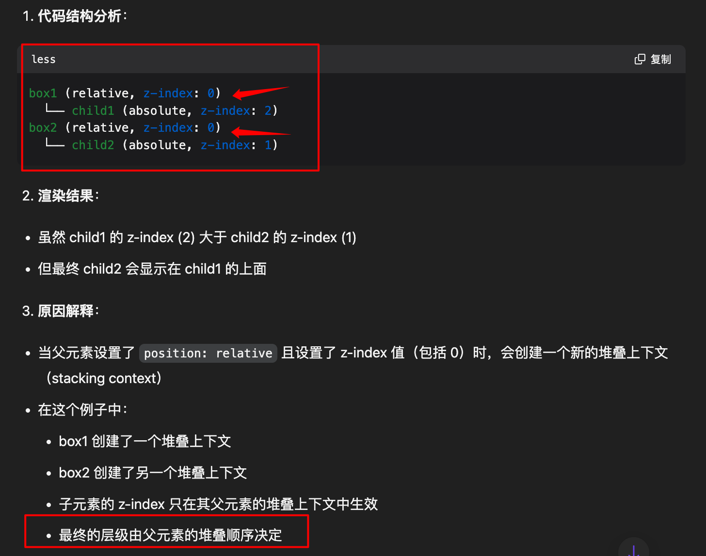
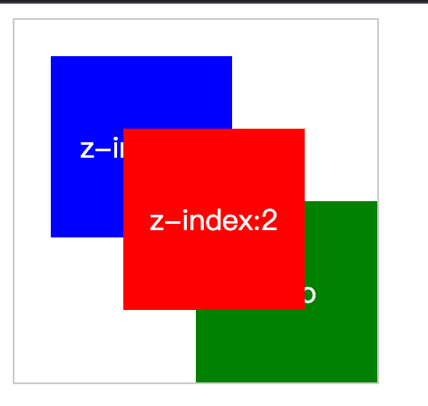

# 常见面试题：篇八


`#前端面试` 


## 目录
<!-- toc -->
 ## 1. 一个样式问题：z-index 与 position:relative 

### 1.1. 下面的代码情况

```html
<html lang="en">
  <head>
    <meta charset="UTF-8" />
    <meta name="viewport" content="width=device-width, initial-scale=1.0" />
    <title>Document</title>
    <style>
      .box1,
      .box2 {
        position: relative;
        z-index: 0;
      }
      .child1, .child2 {
        position: absolute;
        width: 200px;
        height: 200px;
      }
      .child1 {
        background: pink;
        z-index: 2;
      }
      .child2 {
        background: yellow;
        z-index: 1;
      }
    </style>
  </head>
  <body>
    <div class="box1">
      <div class="child1">第一个</div>
    </div>
    <div class="box2">
      <div class="child2">第二个</div>
    </div>
  </body>
</html>
```



### 1.2. 如果层级都一样，就看 HTML 结构谁在后面，而不是定义的 CSS 谁在后面

```html hl:18,21
<html lang="en">  
<head>  
    <meta charset="UTF-8" />  
    <meta name="viewport" content="width=device-width, initial-scale=1.0" />  
    <title>Document</title>  
    <style>        
	    .box1,  
        .box2 {  
            position: relative;  
            z-index: 0;  
        }  
        .child1, .child2 {  
            position: absolute;  
            width: 200px;  
            height: 200px;  
        }  
        .child1 {  
            background: pink;  
            z-index: 132333;  
        }  
        .child2 {  
            background: yellow;  
            z-index: 3;  
        }  
    </style>  
</head>  
<body>  
<div class="box2">  
    <div class="child2">第二个</div>  
</div>  
<div class="box1">  
    <div class="child1">第一个</div>  
</div>  
</body>  
</html>
```

> 结果：因为“第一个”在DOM 结果在后面，所以最终结果还是child1 在上面，虽然 child1的 z-index很大很大

### 1.3. 解释一下 `position: relative` 元素的 z-index 表现特点：

1. **基本概念**：
	- `position: relative` 的元素设置 z-index 时，只会在当前的**堆叠上下文（stacking context）**中生效
	- ==元素的默认 z-index 值是 auto（相当于 0）==
2. **主要特点**：
	- 只有设置了 `position` 属性（relative、absolute、fixed、sticky）的元素，`z-index` 才会生效
	- `relative` 定位的元素会保持在正常文档流中的位置
	- 相对定位元素的 `z-index` 会影响其子元素的堆叠顺序

3. **堆叠规则**：
```css
/* 数值越大，显示层级越高 */
.element1 {
    position: relative;
    z-index: 1;
}
.element2 {
    position: relative;
    z-index: 2; /* 会显示在 element1 上面 */
}
```

4. **注意事项**：
- 如果父元素设置了 `z-index`，子元素的 `z-index` 只在父元素内部生效
- 负值的 `z-index` 会使元素显示在其他普通元素的下方
- 同级元素中，后面的元素默认会覆盖前面的元素

来看一个具体示例：

````html
  <!DOCTYPE html>
  <html>
  <head>
    <style>
      .container {
        position: relative;
        height: 200px;
        width: 200px;
        border: 1px solid `#ccc;`
      }
      .box {
        position: relative;
        width: 100px;
        height: 100px;
        display: flex;
        align-items: center;
        justify-content: center;
        color: white;
      }
      .box1 {
        background: blue;
        z-index: 1;
        top: 20px;
        left: 20px;
      }
      .box2 {
        background: red;
        z-index: 2;
        top: -40px;
        left: 60px;
      }
      .box3 {
        background: green;
        top: -100px;
        left: 100px;
      }
    </style>
  </head>
  <body>
    <div class="container">
      <div class="box box1">z-index:1</div>
      <div class="box box2">z-index:2</div>
      <div class="box box3">auto</div>
    </div>
  </body>
  </html>
````

在这个例子中：
1. 三个盒子都设置了 `position: relative`
2. box1 的 z-index 为 1
3. box2 的 z-index 为 2
4. box3 没有设置 z-index（默认为 auto）

表现结果：
- box2 (红色) 会显示在最上层，因为它的 z-index 值最大
- box1 (蓝色) 会显示在第二层，因为它的 z-index 为 1
- box3 (绿色) 虽然没有设置 z-index，但因为在 HTML 结构中最后，所以会显示在 `box1` 之上，但在 `box2` 之下



这个例子展示了 `position: relative` 元素的 z-index 如何影响元素的堆叠顺序，以及默认堆叠行为。

> 记住，**z-index 只有在设置了 position 属性（非 static）的元素上才会生效。**
