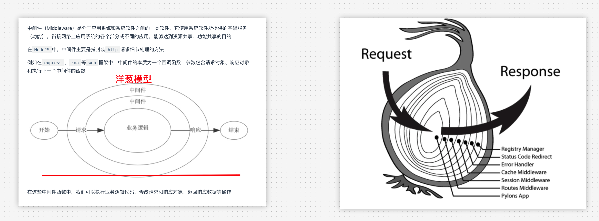
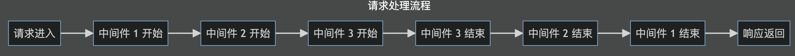
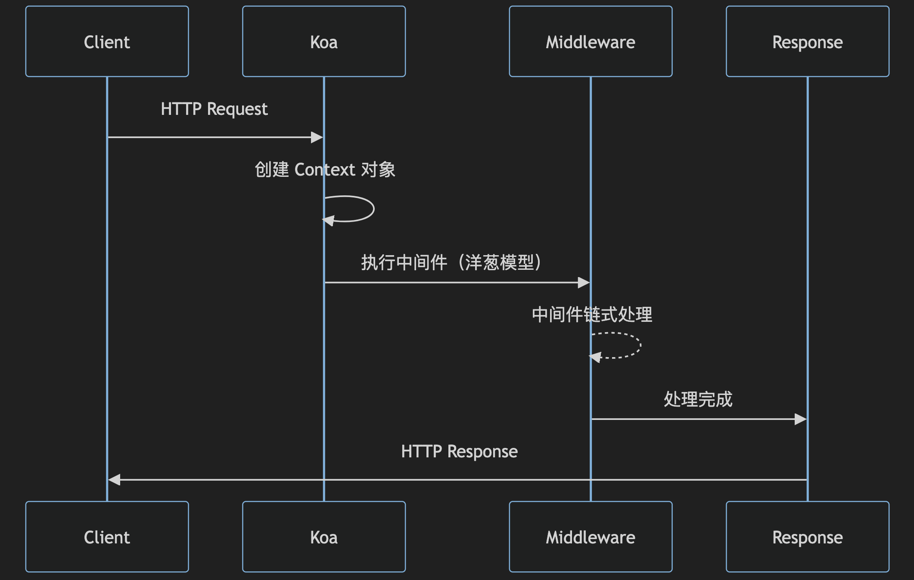

# Koa 的核心原理

`#koa` 

Koa 是一个轻量级的 Node.js Web 框架


## 目录
<!-- toc -->
 ## 1. 中间件机制与洋葱模型 

Koa 最核心的特性是其`中间件机制`，采用洋葱模型（Onion Model）。这种模型的工作方式如下：





### 1.1. 中间件的核心实现原理

```javascript hl:4,12
// 简化版的中间件实现原理
class Koa {
  constructor() {
    this.middleware = [];
  }

  use(fn) {
    this.middleware.push(fn);
    return this;
  }

  // 核心的中间件组合函数
  compose(middleware) {
    return function(context, next) {
      let index = -1;
      
      function dispatch(i) {
        if (i <= index) {
          return Promise.reject(new Error('next() called multiple times'));
        }
        index = i;
        
        let fn = middleware[i];
        if (i === middleware.length) fn = next;
        if (!fn) return Promise.resolve();
        
        try {
          return Promise.resolve(fn(context, dispatch.bind(null, i + 1)));
        } catch (err) {
          return Promise.reject(err);
        }
      }
      
      return dispatch(0);
    };
  }
}
```

### 1.2. 中间件机制（洋葱模型）：示例

```javascript
const Koa = require('koa');
const app = new Koa();

// 中间件1
app.use(async (ctx, next) => {
    console.log('1 开始');
    await next();
    console.log('1 结束');
});

// 中间件2
app.use(async (ctx, next) => {
    console.log('2 开始');
    await next();
    console.log('2 结束');
});

// 1 开始 -> 2 开始 -> 2 结束 -> 1 结束
```

## 2. Context 对象

Koa 的 Context 对象是请求的上下文，将 node 的 request 和 response 对象封装到单个对象中：

```javascript
class Context {
  constructor(req, res) {
    this.req = req;
    this.res = res;
    this.state = {};  // 用于在中间件之间传递信息
    
    // 代理 request 和 response 对象的属性
    delegate(this, 'response')
      .method('attachment')
      .method('redirect')
      .access('type')
      .access('status');
      
    delegate(this, 'request')
      .method('acceptsLanguages')
      .method('acceptsEncodings')
      .access('querystring')
      .access('socket');
  }
}
```

## 3. 错误处理机制

Koa 提供了优雅的错误处理方式：

```javascript
app.use(async (ctx, next) => {
  try {
    await next();
  } catch (err) {
    ctx.status = err.status || 500;
    ctx.body = {
      message: err.message
    };
    // 触发应用级错误事件
    ctx.app.emit('error', err, ctx);
  }
});
```

## 4. 异步流程控制

Koa 2.x 版本利用 async/await 来处理异步流程：

```javascript
app.use(async (ctx, next) => {
  const start = Date.now();
  await next();
  const ms = Date.now() - start;
  console.log(`${ctx.method} ${ctx.url} - ${ms}ms`);
});
```

## 5. 请求和响应的封装

Koa 对 Node.js 原生的 req 和 res 对象进行了封装，形成了`更易用的 Request 和 Response 对象`：

```javascript
class Request {
  get header() {
    return this.req.headers;
  }
  
  get method() {
    return this.req.method;
  }
  
  get url() {
    return this.req.url;
  }
  
  get query() {
    const str = this.querystring;
    return qs.parse(str);
  }
}

class Response {
  set type(type) {
    this.set('Content-Type', type);
  }
  
  set body(val) {
    this._body = val;
    // 根据不同类型设置对应的 Content-Type
    if (typeof val === 'string') this.type = 'text/plain';
    if (Buffer.isBuffer(val)) this.type = 'application/octet-stream';
    if (typeof val === 'object') this.type = 'application/json';
  }
}
```

## 6. 工作流程

完整的 Koa 工作流程如下：



## 7. 主要特点总结

- 轻量级：核心代码量很小，但扩展性强
- 中间件机制：基于洋葱模型的优雅中间件机制
- 异步流程：完美支持 async/await
- 上下文封装：将 request 和 response 封装为单一的 context 对象
- 错误处理：统一的错误处理机制
- 无回调地狱：通过 async/await 彻底解决回调问题

