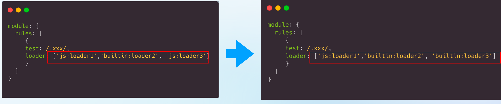

# Rspack 分享


`#前端工程化` 


## 目录
<!-- toc -->
 ## 1. 总结 

- 长期项目与大型项目
	- **⻓期项目**都几乎不可避免的成为大项目
	- **大型项目**往往是公司内**比较重点的项目**
		- 否则也活不了这么久
	- 热更新 10s+
	- 构建时间：15 分钟
- 基于 webpack 继续优化：
	- 治标不治本，性能没提升多少
		- swc-loader、多线程、hard-source-webpack-plugin
	- **配置复杂翻倍**
- esbuild 原生不支持 **HMR**
	- 需要自行通过插件实现，性能下降严重
	- 使用 esbuild 的 watch 模式 + 自定义 HMR 实现
	- esbuild 通过插件实现热更新，**性能严重下降**
		- **为保证准确性需要大量额外检查**
- vite
	- 中小型项目很香，开发体验很好  
	- 大型项目该有的问题还是会有
	- **增量构建 & 按需编译**
- rspack
	- 历经十年，稳如泰山
	- **迁移成本**
	- 可控的自研成本

## 2. 背景：大型项目与长期项目

- 公司内有相当多的大型应用(10000+模块) 
- 冷启动时间 2-5 分钟，甚至更久 
- 构建时间 15-30 分钟，甚至更久  
- HMR 10s+ 甚至更久
 
- **⻓期项目**都几乎不可避免的成为大项目
- **大型项目**往往是公司内**比较重点的项目**
	- 否则也活不了这么久
 
**大型项目的性能优化是必须要做的事情**

## 3. 优化路径 → 治标不治本，性能没提升多少，**配置复杂翻倍**

- 高级语言的 loader
	- swc-loader 
	- esbuild-loader  
- 缓存
	- cache-loader 
	- persistent-cache 
	- hard-source-webpack-plugin
	- DllPlugin MFSU
- 多线程：thread-loader  
- 编译策略
	- lazy compilation  

## 4. 换个打包工具？

- Parcel: 
	- 架构很好，但无奈内部实践太少  
- Turbopack:
	-  架构很好，但是还没诞生( Rspack 和 Turbopack 大概同时诞生) 
- Rollup: 
	- 库场景良好，应用场景性能和功能都缺失的较为严重 
- esbuild: ?  
	- **验证了基于原生语言架构的 bundler 的性能天花板非常高**(100x faster) 
	- resolve 和 load hook基于 golang regex 的设计巧妙避免了跨语言通信开销 
	- 验证了没有一套基于**增量架构的 HMR** 是不可行的( bundler 再快也没用) 
	- 验证了增量构建中跨语言通信是瓶颈问题
- Vite: ?

### 4.1. 愁人的 HMR

- Hook 不支持增量构建，rebuild 性能较差
- **esbuild 原生不支持 HMR，需要自行通过插件实现，性能下降严重**

### 4.2. esbuild 实现热更新的方法

虽然 esbuild 本身不直接支持 HMR，但我们可以通过以下几种方式实现热更新：

#### 4.2.1. 使用 chokidar + esbuild

```javascript
const esbuild = require('esbuild');
const chokidar = require('chokidar');
const http = require('http');
const WebSocket = require('ws');

// 创建 WebSocket 服务器
const wss = new WebSocket.Server({ port: 8001 });

// 基础构建配置
const buildOptions = {
  entryPoints: ['src/index.js'],
  bundle: true,
  outdir: 'dist',
  sourcemap: true,
  watch: false, // 不使用 esbuild 的 watch 模式
};

// 构建函数
async function build() {
  try {
    await esbuild.build({
      ...buildOptions,
      banner: {
        js: `
          (() => {
            const ws = new WebSocket('ws://localhost:8001');
            ws.onmessage = () => location.reload();
          })();
        `,
      },
    });
    console.log('Build completed');
  } catch (err) {
    console.error('Build failed:', err);
  }
}

// 设置文件监听
chokidar.watch('src/**/*').on('change', async (path) => {
  console.log(`File ${path} changed`);
  await build();
  // 通知所有客户端刷新
  wss.clients.forEach(client => {
    if (client.readyState === WebSocket.OPEN) {
      client.send('reload');
    }
  });
});

// 启动开发服务器
const server = http.createServer((req, res) => {
  // 简单的静态文件服务
  // ... 实现静态文件服务逻辑
});

server.listen(3000);
build();
```

#### 4.2.2. 使用 esbuild 的 watch 模式 + 自定义 HMR 实现

```javascript
const esbuild = require('esbuild');
const path = require('path');

// HMR 客户端代码
const hmrClient = `
  const hmr = {
    socket: new WebSocket('ws://localhost:8001'),
    
    // 存储模块
    modules: new Map(),
    
    // 注册模块
    register(id, mod) {
      this.modules.set(id, mod);
    },
    
    // 更新模块
    update(id, newMod) {
      const oldMod = this.modules.get(id);
      if (oldMod) {
        // 保存状态
        const state = oldMod.__hmrState || {};
        // 更新模块
        this.modules.set(id, newMod);
        // 恢复状态
        newMod.__hmrState = state;
        // 触发更新回调
        if (newMod.onHMR) {
          newMod.onHMR(state);
        }
      }
    }
  };

  hmr.socket.onmessage = (event) => {
    const { type, id, code } = JSON.parse(event.data);
    if (type === 'update') {
      // 执行更新的模块代码
      const newMod = eval(code);
      hmr.update(id, newMod);
    }
  };
`;

// 构建配置
const ctx = await esbuild.context({
  entryPoints: ['src/index.js'],
  bundle: true,
  outdir: 'dist',
  sourcemap: true,
  format: 'esm',
  plugins: [{
    name: 'hmr',
    setup(build) {
      // 注入 HMR 客户端代码
      build.onEnd(result => {
        // 处理构建结果
        if (result.errors.length === 0) {
          // 发送更新消息给客户端
          wss.clients.forEach(client => {
            if (client.readyState === WebSocket.OPEN) {
              client.send(JSON.stringify({
                type: 'update',
                modules: result.outputFiles
                  .filter(file => file.path.endsWith('.js'))
                  .map(file => ({
                    id: path.relative('src', file.path),
                    code: file.text
                  }))
              }));
            }
          });
        }
      });
    }
  }]
});

// 启动 watch 模式
await ctx.watch();
```

#### 4.2.3. 结合 Vite 的 HMR 实现

```javascript
const esbuild = require('esbuild');
const { createServer } = require('vite');

async function createDevServer() {
  const vite = await createServer({
    // Vite 配置
    server: {
      middlewareMode: true
    },
    optimizeDeps: {
      // 使用 esbuild 进行依赖预构建
      esbuildOptions: {
        // esbuild 配置
      }
    },
    plugins: [{
      name: 'esbuild-hmr',
      handleHotUpdate({ file, modules }) {
        // 使用 esbuild 构建更新的模块
        const result = await esbuild.build({
          entryPoints: [file],
          write: false,
          bundle: true,
          format: 'esm',
          sourcemap: true
        });

        // 通过 Vite 的 HMR API 发送更新
        modules.forEach(mod => {
          mod.importers.forEach(importer => {
            server.ws.send({
              type: 'update',
              updates: [{
                type: 'js-update',
                timestamp: Date.now(),
                path: mod.url,
                acceptedPath: mod.url
              }]
            });
          });
        });
      }
    }]
  });

  return vite;
}
```

#### 4.2.4. 使用建议

1. **选择合适的方案**
```javascript
// 简单项目：使用方案1
// 中型项目：使用方案2
// 复杂项目：使用方案3或考虑直接使用 Vite
```

2. **性能优化**
```javascript
// 增加缓存机制
const cache = new Map();

async function buildWithCache(filePath) {
  const hash = await getFileHash(filePath);
  if (cache.has(hash)) {
    return cache.get(hash);
  }
  
  const result = await esbuild.build({/*...*/});
  cache.set(hash, result);
  return result;
}
```

3. **错误处理**
```javascript
// 添加错误边界
try {
  await build();
} catch (err) {
  // 发送错误到客户端
  wss.clients.forEach(client => {
    if (client.readyState === WebSocket.OPEN) {
      client.send(JSON.stringify({
        type: 'error',
        error: err.message
      }));
    }
  });
}
```

这些方案各有优劣：
- 方案1最简单，但功能有限
- 方案2更灵活，但需要更多维护
- 方案3功能最完整，但复杂度较高

选择哪种方案取决于项目需求和复杂度。对于简单项目，方案1足够；对于需要精细控制的项目，可以考虑方案2或3。

### 4.3. esbuild 通过插件实现热更新，性能严重下降

#### 4.3.1. esbuild 的设计理念

esbuild 主要关注构建性能，它的核心功能是：
- 快速的代码打包
- 代码转换
- 代码压缩
- 基础的文件监听（watch）

```javascript
// esbuild 原生的 watch 模式
await esbuild.context({
  entryPoints: ['src/index.js'],
  bundle: true,
  outdir: 'dist',
  watch: true, // 只是简单的重新构建
})
```

#### 4.3.2. 为什么自行实现 HMR 会导致性能下降

1. **额外的文件监听开销**
```javascript
// 需要额外的文件监听系统
const chokidar = require('chokidar');
chokidar.watch('src/**/*').on('change', async (path) => {
  // 每次文件变化都需要：
  // 1. 解析依赖关系
  // 2. 确定更新范围
  // 3. 重新构建受影响的模块
  // 这些都是额外的开销
});
```

2. **模块依赖追踪**
```javascript
// 需要维护模块依赖图
const dependencyGraph = new Map();

function updateModule(path) {
  // 1. 找出所有受影响的模块
  const affectedModules = findAffectedModules(path);
  
  // 2. 重新构建这些模块
  // 3. 通过 WebSocket 发送更新
  // 这个过程会带来额外的内存和计算开销
}
```

3. **状态管理复杂性**
```javascript
// HMR 需要管理模块的状态
const moduleState = {
  id: 'module-id',
  instances: new Set(),
  acceptCallback: null,
  disposeCallback: null
};

// 这些状态管理会增加内存开销和复杂度
```

#### 4.3.3. 性能下降的具体表现

```javascript
// 原生 esbuild 构建
const buildTime = await measure(() => 
  esbuild.build({
    entryPoints: ['src/index.js'],
    bundle: true,
    outdir: 'dist'
  })
); // 可能只需要 50ms

// 带 HMR 的构建
const hmrBuildTime = await measure(() => {
  // 1. 文件变更检测
  // 2. 依赖图更新
  // 3. 模块重新构建
  // 4. WebSocket 通信
  // 5. 状态管理
  // 可能需要 200-300ms
});
```

#### 4.3.4. 与其他工具的对比

```javascript
// Vite 的优势
// 1. 预构建优化
// 2. 高效的模块依赖分析
// 3. 智能的 HMR 边界确定
// 4. 经过优化的更新策略

// 自实现 esbuild HMR 的劣势
// 1. 需要完整重建依赖图
// 2. 更新粒度较大
// 3. 缺乏优化的缓存策略
```

#### 4.3.5. 实际影响

1. **内存占用增加**
```javascript
// 需要维护的额外数据结构
const hmrState = {
  moduleMap: new Map(), // 模块映射
  dependencyGraph: new Map(), // 依赖图
  moduleInstances: new Map(), // 模块实例
  watchers: new Set(), // 文件监听器
};
```

2. **构建时间延长**
```javascript
// 原本的构建流程
esbuild.build() // 50ms

// 添加 HMR 后的流程
async function buildWithHMR() {
  // 1. 文件系统监听 (+50ms)
  // 2. 依赖分析 (+100ms)
  // 3. esbuild 构建 (50ms)
  // 4. HMR 更新处理 (+50ms)
  // 总计约 250ms
}
```

3. **CPU 使用率上升**
```javascript
// 需要处理的额外任务
function handleHMR() {
  // 1. 文件监听回调
  // 2. 依赖图更新
  // 3. 模块状态管理
  // 4. WebSocket 通信
  // 这些都会增加 CPU 负载
}
```

#### 4.3.6. 解决方案建议

1. **使用现成的解决方案**
```javascript
// 推荐使用 Vite，它已经优化了 HMR
import { createServer } from 'vite';
const server = await createServer({
  // Vite 配置
});
```

2. **如果必须使用 esbuild + HMR**
```javascript
// 优化建议：
// 1. 使用增量构建
// 2. 实现智能的依赖追踪
// 3. 添加有效的缓存策略
// 4. 限制更新范围
```

这就是为什么开发者会说 esbuild 不适合直接用于 HMR 的原因。如果项目需要 HMR，建议：

1. 使用 Vite（它在底层使用 esbuild，但有优化的 HMR 实现）
2. 使用 webpack（虽然较慢，但 HMR 实现成熟）
3. 如果一定要用 esbuild，考虑是否真的需要 HMR，或者接受性能损耗

### 4.4. vite

- 中小型项目很香，开发体验很好  
- Build 性能虽然一般，但是对中小型项目足够
- 大型项目该有的问题还是会有

## 5. esbuild 关于增量架构 HMR 不可行的问题：

### 5.1. 增量架构 HMR 的基本概念

````mermaid

  graph TB
    A[源代码改动] --> B[增量构建]
    B --> C[模块替换]
    C --> D[状态保持]
    
    B --> E[问题: 依赖图不准确]
    B --> F[问题: 副作用处理困难]
    B --> G[问题: 状态一致性]
    
    E --> H[构建结果不可靠]
    F --> H
    G --> H
    
    style H fill:#ff9999,stroke:#333,stroke-width:2px
````

### 5.2. esbuild 遇到的具体问题

#### 5.2.1. 依赖图维护问题

```javascript hl:11
// 示例：模块间复杂依赖
// moduleA.js
import { value } from './moduleB'
export const result = process(value)

// moduleB.js
import { helper } from './moduleC'
export const value = helper()

// 当 moduleC.js 改变时
// 增量构建难以准确追踪所有受影响的模块
```

#### 5.2.2. 副作用处理

```javascript hl:15
// 全局副作用示例
// global.js
window.globalState = {
  count: 0
}

// component.js
import './global.js'
export class Component {
  constructor() {
    this.state = window.globalState
  }
}

// 增量更新时难以处理这些全局副作用
```

### 5.3. 为什么增量架构不可行

#### 5.3.1. **依赖追踪问题**

```javascript hl:11
// 构建时的依赖图
const buildGraph = {
  'moduleA.js': ['moduleB.js', 'moduleC.js'],
  'moduleB.js': ['moduleC.js'],
  'moduleC.js': []
}

// 运行时的实际依赖可能因为动态导入而改变
async function dynamicImport() {
  const module = await import('./moduleD.js')
  // 这种动态依赖很难在增量构建中准确追踪
}
```

>  这种动态依赖很难在增量构建中准确追踪

#### 5.3.2. **状态一致性问题**

```javascript hl:7
// 模块状态
let counter = 0
export function increment() {
  counter++
}

// HMR 更新时
if (module.hot) {
  module.hot.accept(() => {
    // 难以确保状态正确迁移
    // counter 的值应该保持还是重置？
  })
}
```

#### 5.3.3. **构建缓存问题**

```javascript hl:6
// esbuild 的构建缓存
let buildContext = await esbuild.context({
  entryPoints: ['app.js'],
  bundle: true,
  outfile: 'dist/bundle.js',
  incremental: true, // 增量构建
})

// 缓存可能导致不一致
await buildContext.rebuild()
```

### 5.4. Vite 的解决方案

```javascript
// Vite 采用基于原生 ESM 的方案
// 开发服务器模式
export default {
  server: {
    // 按需编译
    // 不依赖增量构建
    hmr: {
      // 模块热替换配置
      overlay: true
    }
  }
}
```

### 5.5. 主要挑战

#### 5.5.1. **构建一致性**

```javascript
// 增量构建可能导致不一致
const cache = new Map()

function rebuild(file) {
  // 难点：确保缓存与实际代码同步
  cache.set(file, buildResult)
  // 可能错过一些依赖更新
}
```

#### 5.5.2. **性能与准确性的权衡**

```javascript hl:1
// 完整构建 - 准确但慢
function fullBuild() {
  // 重新构建所有内容
}

// 增量构建 - 快但可能不准确
function incrementalBuild() {
  // 只构建改变的部分
  // 可能遗漏依赖
}
```

### 5.6. 技术限制

#### 5.6.1. **静态分析限制**

```javascript
// 动态导入路径
const moduleName = getModuleName()
import(`./modules/${moduleName}.js`)
// 静态分析无法确定具体导入内容
```

#### 5.6.2. **运行时依赖**

```javascript
// 运行时生成的依赖
const plugins = []
if (condition) {
  plugins.push(await import('./plugin-a.js'))
}
// 增量构建难以追踪这类动态依赖
```

### 5.7. 结论

esbuild 的实践证明，基于增量架构的 HMR 存在以下根本性问题：

- **可靠性问题**
	- 依赖追踪不准确
	- 状态管理困难
	- 缓存一致性难以保证
- **复杂性问题**
	- 实现复杂度高
	- 维护成本大
	- 错误处理困难
- **性能问题**
	- **为保证准确性需要大量额外检查**
	- 可能导致性能反而下降

### 5.8. 现代解决方案 → **增量构建 & 按需编译**

- **基于 ESM 的开发服务器**
	- Vite 的方案
	- 不依赖增量构建
	- 按需编译
- **完整重建 + 智能缓存**
	- 保证构建结果可靠性
	- 通过缓存优化性能
- **混合方案**
	- 开发环境使用 ESM
	- 生产环境完整构建

## 6. vite 的经验

- 出色的开箱即用体验非常重要
- 兼容生态十分重要，避免所有轮子都要自己造一遍
- 高质量的 loader 和 plugin 里包含了无数的细节，小团队根本无法维护
- 拆包能力至关重要，关乎到能不能应用到**重要C端应用**
- bundleless 目前不适合公司的大型业务场景

## 7. 我们需要

**先看成本，再看收益，成本和收益的结合**
- 成本：
	- 迁移成本
	- 自研成本
- 收益？
	- ？

- 极致的拆包能力
	- 特别是 C 端
- 冷启动性能
- 生产环境构建性能
- HMR 性能
- **迁移成本**
- 丰富的生态
- Legacy code 兼容
	- 很重要，需要兼容以前的项目
	- 毕竟 webpack 已经 10 年了
- 稳定的产物质量
- **可控的自研成本**
	- 重新造轮子

## 8. Rollup 的问题

- 核心架构问题:
	- Rollup 的架构是只有 `esm` 为一等公⺠，其他均需要转换成 `esm` 进行处理  
	- commonjs 的支持是错误的方案，不可能彻底实现兼容(non strict cjs -> strict esm)，除非引入 runtime(esbuild) 
	- 没考虑**其他资源的多样性**，如css、图片、esm、 commonjs 等语言在 resolve 层面的差异性

## 9. ESbuild 的问题

- **架构比 rollup 更适合应用，css、图片等均作为一等公⺠**， resolve 和 commonjs 相比都更加正确  
- **插件 api 极其薄弱**，难以支持复杂需求，几乎无生态 content-hash 问题在 esbuild 上几乎无解(鸡蛋问题)
- HMR 必须内置支持，外置插件实现无任何性能保障
- **Native 插件和 JS 插件难以穿插组合**
- bundle splitting 和 tree shaking 两个深度优化在原有架构，实现⻛险较大
- 海量业务都是基于 Webpack 的，迁移成本非常大

## 10. 希望：Loader 的组合性可以实现工具链的渐进式原生化




 

## 11. rspack 架构

- 和 Webpack5 基本一致(历经十年，稳如泰山) 
- 将原本在 JS 里难以并行化的操作充分并行化 
- 使用 NAPI-RS 实现 Rust 和 JS 的桥接

## 12. rspack 生态

