# Umi 4 的设计思路

`#前端工程化` `#2022/12`  


## 目录
<!-- toc -->
 ## 总结 

- 最佳工程化的实践集合
- 那么`编译时框架`和`非编译时框架`的区别是啥？
	- `非编译时框架`
		- 比如非常流行的 `create-react-app`，把源码简单直接地交给 `webpack` 就完成使命；
	- `编译时框架`则会自己加很多戏
		- 比如拿到源码后==做 ast 分析，拿到依赖图谱，做检查，生成临时文件==，等等，
			- 最后把编译后的源码交给 `webpack`，这中间的很多事，本来是需要开发者手动处理或编码的。
- 约点
	- 比如在 `pages` 目录下新建文件即是**路由**
	- 新建 `access.ts` 文件即是**权限**
	- 在 `locales` 目录下新建文件即是`国际化语言`
	- 等等
- Normal Mode 、 Low Import Mode 
	- improt all from umi
- `Semver` ==Semantic Versioning（语义化版本）== 的问题 ？
- 预打包
	- ncc
		- 用于将 Node.js 模块**编译成一个单一文件，连同其所有依赖项，类似于 gcc 风格**。
	- 通过 `ncc` 和 `dts-packer` 实现
		- 会分别在 compiled/webpack 目录生成 `index.js` 和 `index.d.ts`，以实现预打包的目的
- esm cdn & npm cdn 方案
- 数据量化
	- 服务了多少个项目？

> 来自 umi 作者 CC 的分享： https://www.yuque.com/seeconf/2022/ibm88n

## 1. 最佳工程化的实践集合

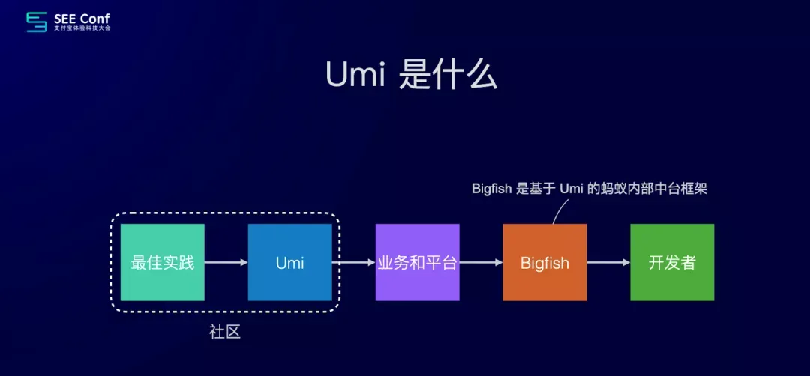

## 2. 特点

- all in one
	- improt all from umi
	- low import mode
- 约束与开放
	- 强约束
- 编译时框架
- 双引擎构建
- esm cdn
- 应用云数据

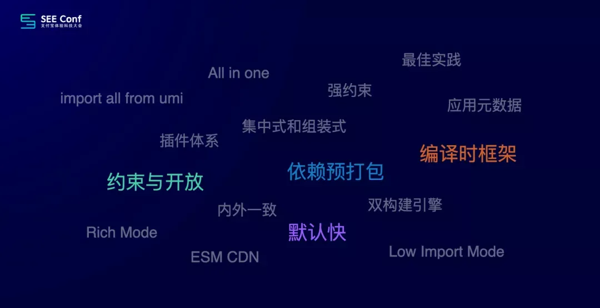

## 3. 编译时框架

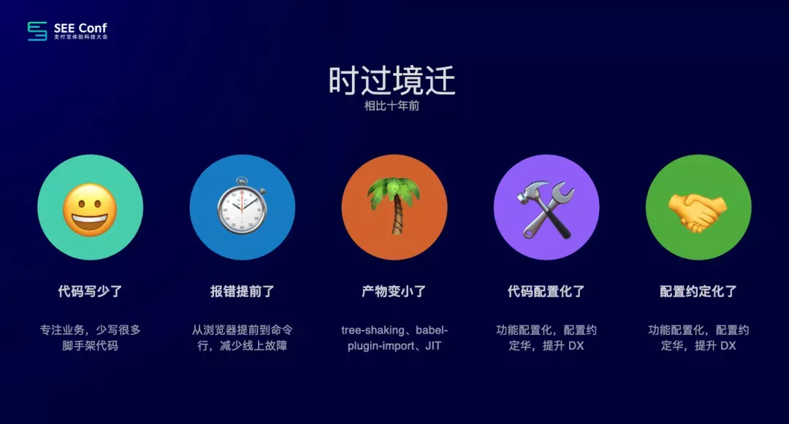

相比 10 年前前端编码有了很多变化，以下这些是和**编译时**相关的。

- 代码写少了
	- 少了很多脚手架代码
		- 比如数据流、国际化、模块加载、路由等，从而让开发者有更多精力**专注在业务视图和逻辑上**；
- 报错提前了
	- 比如模块不存在，使用了不存在的变量，之前是运行时才能发现，现在**报错提前了**，在**命令行里就能看到**。
	- 除了 DX 的提升，额外的好处的此类问题不会再被带到线上；
- 产物变小了
	- 之前用一个 button 要引入整个 antd，用一个 isEqual 要引入整个 lodash
	- 现在通过 tree-shaking 或 babel-plugin-import 或 TailwindCSS 的 JIT 引擎，能准确知道你用了啥，然后做按需打包，让产物变小；
- 功能==配置化==了
	- 现在很多标准化的功能都配置化了，比如想要兼容 ie11，做个配置，框架就会在背后加补丁，转 es 5，
	- 比如想要用 `external` 自动`提速`，想要`高清`方案，想要`埋点`，想要用 `esbuild 压缩`，都是一个**配置的事情**；
- 配置==约定化==了
	- 有些场景配置化还是繁琐了，比如路由、数据流 model、国际化语言文件，可以通过约定的方式，就没必要做配置了；

这是因为框架都帮你做了

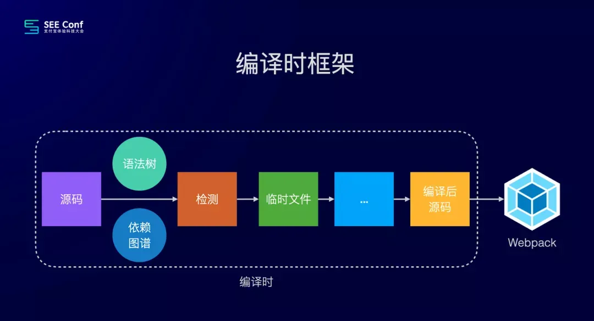

那么`编译时框架`和`非编译时框架`的区别是啥？
- `非编译时框架`
	- 比如非常流行的 `create-react-app`，把源码简单直接地交给 `webpack` 就完成使命；
- `编译时框架`则会自己加很多戏
	- 比如拿到源码后==做 ast 分析，拿到依赖图谱，做检查，生成临时文件==，等等，
		- 最后把编译后的源码交给 `webpack`，这中间的很多事，本来是需要开发者手动处理或编码的。

### 3.1. 社区的编译ui

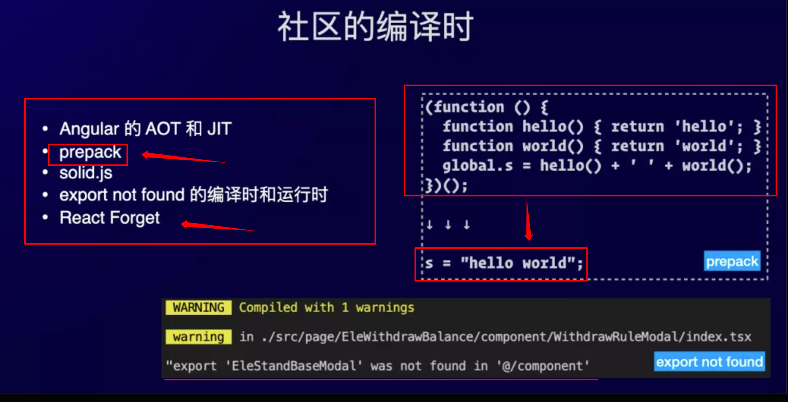


社区有很多编译时的尝试
- 比如 Angular 的 AOT 和 JIT，可以==简单理解 AOT 为编译时，JIT 为运行时==
	- AOT 可以让产物更小，同时运行更快；
- 比如 facebook 之前出的 `prepack`，也是编译时优化的尝试，在保证结果一致的前提下，改变源码，让性能更快；
- 还有最近的 `React Forget` 更是编译时优化的典型。

Umi 做了很多编译时的事，如果你用过 umi，应该了解 src 下有个 `.umi 临时目录`，
- 这里存放的文件本是需要开发者自己写的，现在由框架或插件在编译时自动生成。
	- 比如在 `pages` 目录下新建文件即是**路由**
	- 新建 `access.ts` 文件即是**权限**
	- 在 `locales` 目录下新建文件即是`国际化语言`
	- 等等

### 3.2. Normal Mode 、 Low Import Mode 

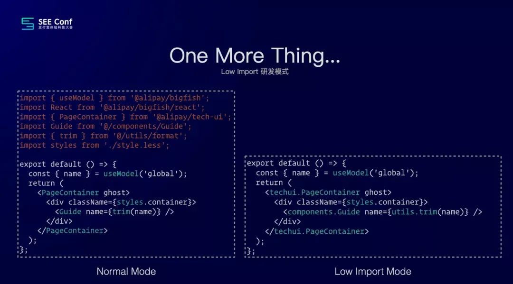


- 这部分的 `One More Thing` 是 `Low Import` 开发模式，他会随着 Umi 4 发布，但默认不开启。
- 左图是开启前，右图是开启后，区别是`大部分 import 语句`不用写，交给框架自动补全。
	- `webstorm` 报错怎么办？
- 这个方案很有争议，喜欢的很喜欢，不喜欢的很不喜欢，但不管如何，这也是编译时领域的一次尝试。

### 3.3. 依赖预打包


- 不知大家是否有此经历。睡一觉醒来，很多事发生了变化。
- 比如 dev 或 build 跑不起来，啥都没干迭代发布后线上白屏还背了个故障
	- `npm i` 时出现某人的求职广告，依赖库被黑客挂马，等等。
	- 之前 ==antd 版本圣诞节那天== ，logo 出现圣诞帽
- 然后你打开 **package.json 一看，只有 10 个依赖呀，我还写死了版本**，这是为啥？
	- 因为你忽略了成千上万的间接依赖，而这些依赖总有一个会发生点意外，比如某个依赖的不兼容更新，就会导致你项目挂掉

### 3.4. 附：Semver

`Semver` 是 ==Semantic Versioning（语义化版本）==的缩写

#### 3.4.1. Semver 基本结构

版本号格式：**主版本号.次版本号.修订号**（MAJOR.MINOR.PATCH）

````mermaid
  graph TB
    A[2.3.4] --> B[主版本号<br>Major<br>2]
    A --> C[次版本号<br>Minor<br>3]
    A --> D[修订号<br>Patch<br>4]
    
    B --> B1[破坏性更新<br>不兼容的API修改]
    C --> C1[新功能<br>向下兼容]
    D --> D1[Bug修复<br>向下兼容]

    style A fill:#f9f,stroke:#333,stroke-width:4px
    style B fill:#bbf,stroke:#333,stroke-width:2px
    style C fill:#bbf,stroke:#333,stroke-width:2px
    style D fill:#bbf,stroke:#333,stroke-width:2px
````

#### 3.4.2. 版本号含义

1. **主版本号（Major）**
   - 当进行不兼容的 API 修改时递增
   - 例如：从 1.x.x 升级到 2.0.0

2. **次版本号（Minor）**
   - 当==添加功能但保持向下兼容时==递增
   - 例如：从 1.1.x 升级到 1.2.0

3. **修订号（Patch）**
   - 当==做向下兼容的缺陷修复时==递增
   - 例如：从 1.1.1 升级到 1.1.2

#### 3.4.3. 版本范围符号

```json
{
  "dependencies": {
    "package1": "^1.2.3",  // 兼容 1.x.x
    "package2": "~1.2.3",  // 兼容 1.2.x
    "package3": ">=1.2.3", // 大于等于 1.2.3
    "package4": "1.2.3",   // 精确版本 1.2.3
    "package5": "*"        // 任意版本
  }
}
```

符号说明：
- `^`：允许次版本和修订版本更新
- `~`：只允许修订版本更新
- `>`：大于指定版本
- `>=`：大于等于指定版本
- `<`：小于指定版本
- `<=`：小于等于指定版本
- `*`：任意版本
- `x`：任意版本（同 `*`）

#### 3.4.4. 版本示例

```plaintext
版本号示例：
1.0.0：首个稳定版本
1.0.1：修复bug
1.1.0：添加新功能，向下兼容
2.0.0：进行了破坏性更新
```

#### 3.4.5. 预发布版本

```plaintext
预发布版本标识：
1.0.0-alpha：内部测试版
1.0.0-beta：公测版本
1.0.0-rc：候选发布版
```

#### 3.4.6. 实际应用场景

```json
// package.json 示例
{
  "name": "my-project",
  "version": "1.2.3",
  "dependencies": {
    // 生产环境依赖推荐使用确切版本
    "react": "17.0.2",
    
    // 开发依赖可以使用更宽松的版本范围
    "typescript": "^4.5.0",
    
    // 测试框架版本
    "jest": "~27.0.0"
  }
}
```

#### 3.4.7. 版本选择建议

1. **生产依赖**
   - 使用精确版本号
   - 避免使用 `^` 或 `~`
   - 手动控制版本更新

2. **开发依赖**
   - 可以使用 `^` 获取新特性
   - 使用 `~` 获取bug修复
   - 定期更新和测试

3. **测试依赖**
   - 可以使用较宽松的版本范围
   - 注意主版本更新的破坏性变更

#### 3.4.8. 最佳实践

1. **版本锁定**
   ```bash
   # 生成 package-lock.json
   npm install --save-exact
   ```

2. **版本更新**
   ```bash
   # 检查过时的包
   npm outdated
   
   # 更新到新版本
   npm update
   ```

3. **安全性检查**
   ```bash
   # 检查安全漏洞
   npm audit
   
   # 修复安全问题
   npm audit fix
   ```

#### 3.4.9. 注意事项

1. **避免使用不安全的版本范围**
   - 不要使用 `*`
   - 谨慎使用 `>`
   - 避免过于宽松的版本范围

2. **保持依赖更新**
   - 定期检查更新
   - 测试新版本
   - 记录更新日志

3. **版本控制**
   - 提交 package-lock.json
   - 统一团队版本管理策略
   - 建立版本更新流程

#### 3.4.10. 依赖冲突问题

```plaintext
项目结构示例：
my-app
├── package.json
├── node_modules
│   ├── package-a (依赖 lodash@^4.0.0)
│   └── package-b (依赖 lodash@^3.0.0)
```

#### 3.4.11. 过于宽松的版本范围

```json hl:3
{
  "dependencies": {
    // 危险的版本范围
    "express": "^4.0.0",    // 可能引入破坏性更新
    "lodash": "*",          // 完全不限制版本
    "moment": ">=2.0.0"     // 过于宽泛的范围
  }
}
```

#### 3.4.12. 锁文件问题

```json hl:7
// package-lock.json 示例
{
  "name": "my-project",
  "dependencies": {
    "package-a": {
      "version": "1.2.3",
      "resolved": "https://registry.npmjs.org/package-a/-/package-a-1.2.3.tgz",
      "integrity": "sha512..."
    }
  }
}
```

#### 3.4.13. 使用精确版本

```json
{
  "dependencies": {
    "express": "4.17.1",        // 精确版本
    "react": "17.0.2",          // 精确版本
    "typescript": "4.5.4"       // 精确版本
  }
}
```

#### 3.4.14. 使用 package-lock.json

```bash
# 确保团队成员都使用锁文件
npm ci  # 而不是 npm install
```

#### 3.4.15. 版本固定策略

```json
{
  "dependencies": {
    // 使用更严格的版本范围
    "express": "~4.17.1",     // 只允许补丁版本更新
    "react": "16.14.0",       // 完全固定版本
    "lodash": "4.17.x"        // 限制在特定次版本内
  }
}
```

#### 3.4.16. 版本控制策略

```bash
// .npmrc 文件配置
save-exact=true              # 保存精确版本
package-lock=true           # 启用锁文件
```

#### 3.4.17. 依赖审查

```bash
# 定期检查依赖更新
npm audit                    # 安全审计
npm outdated                # 检查过时包
```

#### 3.4.18. 依赖树分析

```bash
# 查看依赖树
npm ls                      # 查看完整依赖树
npm ls package-name        # 查看特定包的依赖关系

# 扁平化依赖
npm dedupe                 # 删除重复依赖
```

#### 3.4.19. 版本冲突解决

```bash
# 强制解析到特定版本
npm install package@version --force

# 或使用 resolutions（在 package.json 中）
{
  "resolutions": {
    "package-name": "1.2.3"
  }
}
```

#### 3.4.20. 预防措施

1. **使用锁文件**
   - 始终提交 package-lock.json
   - 使用 `npm ci` 而不是 `npm install`

2. **版本策略**
   - 为生产依赖使用精确版本
   - 为开发依赖使用更宽松的版本范围

3. **定期维护**
   - 定期更新依赖
   - 运行安全审计
   - 测试新版本的兼容性

4. **工具支持**
   - 使用 `npm-check-updates`
   - 配置自动化依赖更新工具
   - 使用 CI/CD 进行依赖检查

#### 3.4.21. 自定义 npm 配置

```ini
# .npmrc
save-exact=true
package-lock=true
audit=true
fund=false
```

#### 3.4.22. 使用工作区

```json
// package.json
{
  "workspaces": [
    "packages/*"
  ]
}
```

### 3.5. Semver 的理想和现实

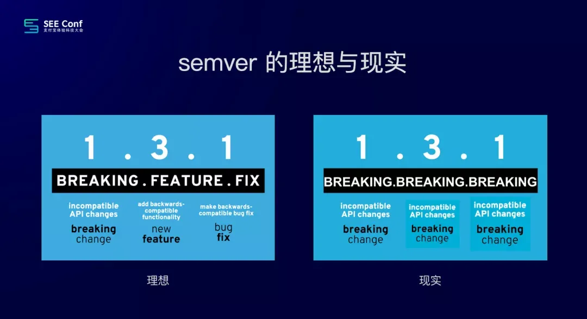

### 3.6. 社区的解

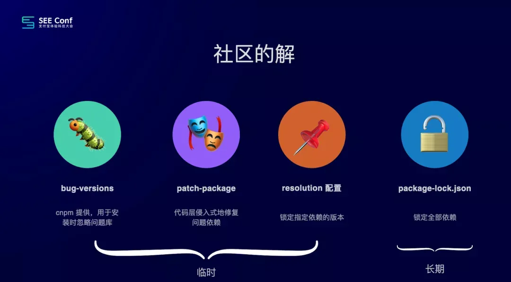

临时的解决：
- 比如 `cnpm` 提供的 `bug-versions`
- npm 提供的 `resolutions`，侵入式改代码的 `patch-package` 等；
长期的
- 比如 npm、yarn 和 pnpm 具备的 `lock 能力`，tnpm/cnpm 目前暂不支持，但可以用 yarn mode。

### 3.7. 框架的解

还有个思路是「中间商锁依赖，定期更新，并对此负责」。==框架是开发者的倒数第二道防线==，自然而然就应该是这个中间商。

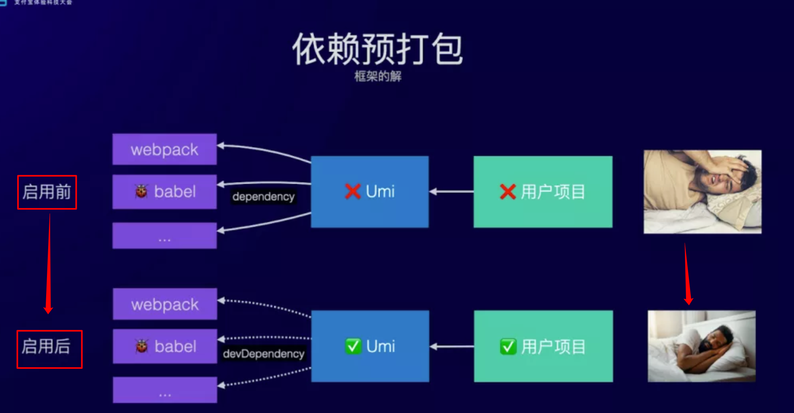

这个思路在 Umi 里的实现是**依赖预打包**。
- 打包前，Umi 通过 `dependency` 依赖 webpack、babel 等，这时如果 babel 出现 bug，会导致 umi 挂，然后用户项目也挂，睡不好，😴；
- 打包后，Umi 通过 `devDependency` 依赖 webpack、babel 等，如果 babel 又出现 bug，Umi 会不会受影响，Umi 用户的项目也不会受影响，睡得香，😄。

### 3.8. 怎么预打包

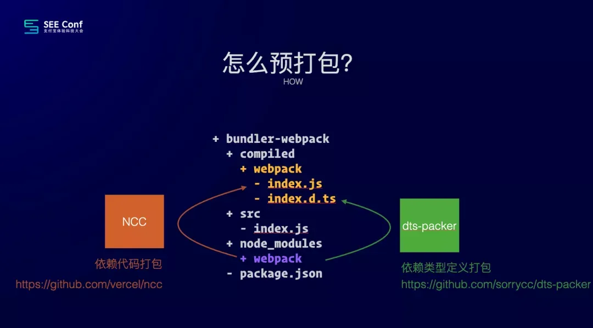

- https://github.com/vercel/ncc
	- 简单的命令行工具，用于将 Node.js 模块**编译成一个单一文件，连同其所有依赖项，类似于 gcc 风格**。

- 简单介绍下如何预打包，分代码和类型定义两部分
	- 分别通过 ncc 和 dts-packer 实现。
		- 比如 webpack，借助两个工具，会分别在 compiled/webpack 目录生成 `index.js` 和 `index.d.ts`，以实现预打包的目的

### 3.9. Father

这部分的 One More Thing 是 Father 的下个版本 V4，他是基于 Umi 的组件打包工具，在 V4 里，除了其他 nb 的特性外，还有个重要的点就是前面我们介绍的依赖预打包功能，大家可以期待下。

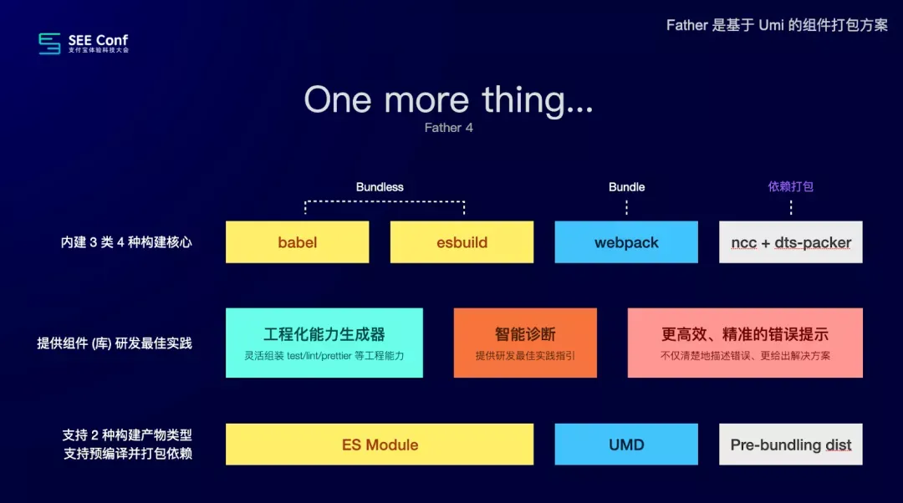

## 4. 数据量化

- 服务了 `10000+` 项目
	- 如何统计呢？