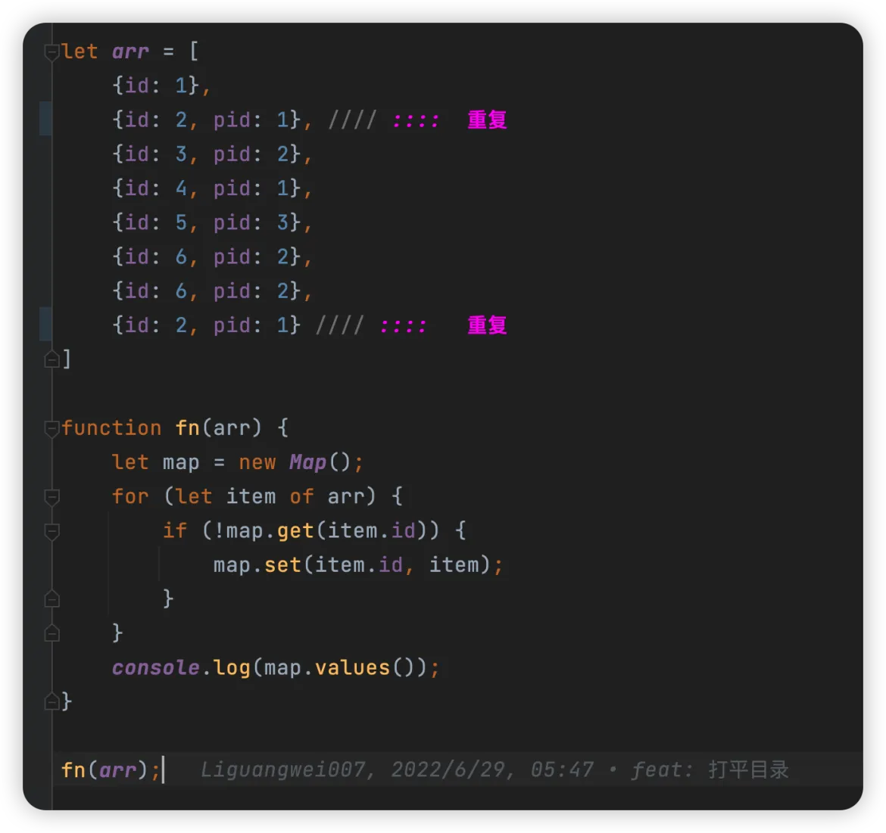

# 打平数组转成树形结构

`#编程题` 


## 目录
<!-- toc -->
 ## 1. 总结 

- 使用 `Object` 和 `Object.values` 去重
	- 或使用 `Map` 和 `map.values()` 去重
- 借助 `map` ，每个对象都添加 `children 属性`
- 然后再 `removeEmptyChildren` 即可


```javascript hl:29,26
let arr = [
  { id: 1, pid: 0 },
  { id: 2, pid: 1 },
  { id: 6, pid: 2 }, // 重复
  { id: 3, pid: 2 },
  { id: 4, pid: 1 },
  { id: 2, pid: 1 }, // 重复
  { id: 5, pid: 3 },
  { id: 6, pid: 2 },
];

// 去重
function fn1(arr) {
  let obj = {};
  for (let item of arr) {
    obj[item.id] = item;
  }
  return [...Object.values(obj)];
}

function fn(arr, rootId) {
  let map = {};
  // 先去重
  arr = fn1(arr);
  for (item of arr) {
    // 一定要浅拷贝
    map[item.id] = {
      ...item,
      children: [],
    };
  }

  let res = [];
  for (item of arr) {
    let { pid, id } = item;
    if (pid === rootId) {
      res.push(map[id]);
    } else {
      map[pid].children.push(map[id]);
    }
  }

  function removeEmptyChildren(arr) {
    for (item of arr) {
      if (item.children.length === 0) {
        delete item.children;
      } else {
        removeEmptyChildren(item.children);
      }
    }
  }

  removeEmptyChildren(res);

  return res;
}

console.log(fn(arr, 0));

```

## 2. 使用 map.values() 先去重

- 使用 `map.values()`



## 3. 转成数组

- 关键点：函数的参数 `fn(array,pid)`
- 必须知道根节点

```javascript hl:20
/**
 *  21、数组转成树形结构
 *  如何将 [{id: 1}, {id: 2, pId: 1}, ...] 的重复数组（有重复数据）
 *  转成树形结构的数组 [{id: 1, child: [{id: 2, pId: 1}]}, ...] （需要去重） `#243`
 * */
// :::: 已经去重了
let arr = [
  { id: 1, pid: 0 },
  { id: 2, pid: 1 },
  { id: 3, pid: 2 },
  { id: 4, pid: 1 },
  { id: 5, pid: 3 },
  { id: 6, pid: 2 },
];

/**
 * @rootId 跟节点的 pid
 * */
function fn(array, rootId) {
  // 第一次遍历： 借助map对象， 转成以id为 key , item为value的 对象
  let map = {};
  array.forEach((item) => {
    map[item.id] = { ...item }; // 浅拷贝
  });
  const res = [];
  // 第二次遍历： 组装 
  array.forEach((item) => {
    let { id, pid } = item;
    // 如果是根节点，那么直接push 给 res
    if (pid === rootId) {
      res.push(map[id]);
      // 否则，操作后面的 map,判断是否有 children，没有就复制给一个
    } else {
      if (map[pid].children) {
        map[pid].children.push(map[id]);
      } else {
        map[pid].children = [map[id]];
      }
    }
  });
  return res;
}
console.log(fn(arr, 0));
```
