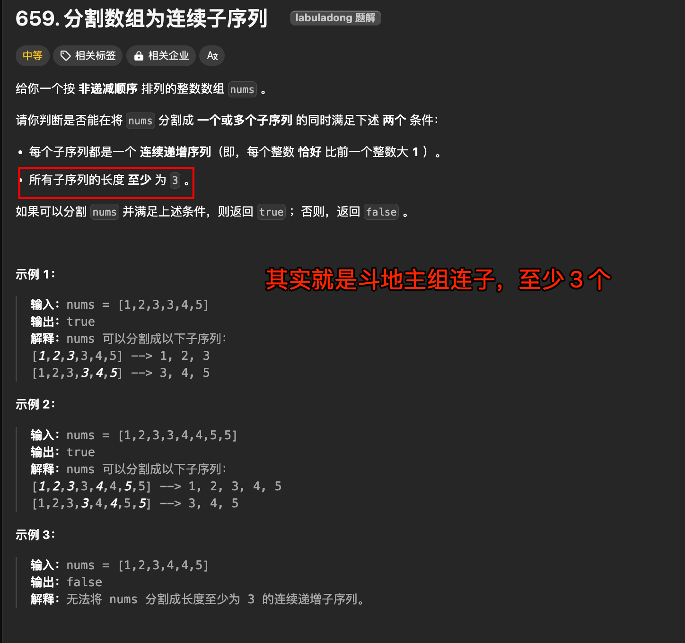

# 分割数组为连续子序列：斗地主的顺子


## 目录
<!-- toc -->
 ## 题目 

| LeetCode                                                                                                                   | 力扣                                                                                         | 难度  |
| -------------------------------------------------------------------------------------------------------------------------- | ------------------------------------------------------------------------------------------ | --- |
| [659. Split Array into Consecutive Subsequences](https://leetcode.com/problems/split-array-into-consecutive-subsequences/) | [659. 分割数组为连续子序列](https://leetcode.cn/problems/split-array-into-consecutive-subsequences/) | 🟠  |



> 但斗地主里面顺子至少要 5 张连续的牌，和这个题唯一的差别了就是这个了

要点：
- 给定一个按**升序排序**的整数数组 nums，判断能否将它分割成**一个或多个**  `长度至少为 3` 的连续子序列。
比如题目举的例子
- 输入 `nums = [1,2,3,3,4,4,5,5]`，算法返回 true。因为 `nums` 可以被分割成 `[1,2,3,4,5]` 和 `[3,4,5]` 两个包含连续整数子序列。
- 但如果输入 `nums = [1,2,3,4,4,5]`，算法返回 false，因为无法分割成**两个长度至少为 3** 的连续子序列。

## 思路

1. 使用贪心算法
    - 优先将数字加入到已有的序列中
    - 如果不能加入已有序列，才尝试新建序列
3. 需要两个哈希表：
    - countMap：统计`每个数字的剩余次数`
    - endMap：统计`以某个数字结尾`的连续子序列的个数

## 代码

```javascript
/**
 * @param {number[]} nums
 * @return {boolean}
 */
var isPossible = function (nums) {
  // 统计每个数字的出现次数
  const countMap = new Map();
  // 统计以某个数字结尾的连续子序列的个数
  const endMap = new Map();

  // 初始化 countMap
  for (const num of nums) {
    countMap.set(num, (countMap.get(num) || 0) + 1);
  }

  // 遍历数组
  for (const num of nums) {
    const count = countMap.get(num);
    if (count === 0) {
      // 当前数字已经被使用完
      continue;
    }

    // 先判断是否可以加入到已有的子序列后面
    if (endMap.get(num - 1) > 0) {
      // 可以接在前一个数字结尾的子序列后面
      countMap.set(num, count - 1);
      endMap.set(num - 1, endMap.get(num - 1) - 1);
      endMap.set(num, (endMap.get(num) || 0) + 1);
    } else {
      // 需要新建一个子序列，检查后续两个数字是否可用
      const count1 = countMap.get(num + 1) || 0;
      const count2 = countMap.get(num + 2) || 0;

      if (count1 > 0 && count2 > 0) {
        // 可以形成新的长度为3的子序列
        countMap.set(num, count - 1);
        countMap.set(num + 1, count1 - 1);
        countMap.set(num + 2, count2 - 1);
        endMap.set(num + 2, (endMap.get(num + 2) || 0) + 1);
      } else {
        // 无法形成长度为3的子序列
        return false;
      }
    }
  }

  return true;
};

```