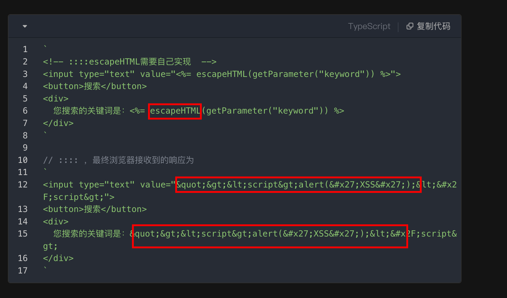
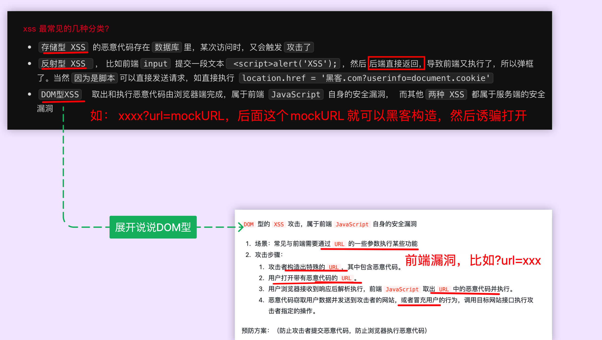

# XSS

`#前端安全`

## 目录
<!-- toc -->
 ## 1. 必要条件 

XSS 攻击有 `两大要素`
1. `攻击者` 提交 `恶意代码`
2. `浏览器` 执行 `恶意代码`

## 2. 示例

## 3. 如何解决？

## 4. 如何防范

- 验证码
- 输入内容长度控制
- 使用 `escapeHTML` （需要自己实现）
-  set HTTP-only Cookie 
	- 当一个 Cookie 被设置为 HttpOnly 时，它仅可通过 HTTP(S) 协议访问。
		- JavaScript 的 `document.cookie` API 将无法读取或修改这些 Cookie
	- `Set-Cookie: session=abcdef123456; HttpOnly; Secure`
		- 这里，`HttpOnly` 确保 Cookie 只能通过 HTTP(S) 访问，`Secure` 确保 Cookie 只通过加密的 HTTPS 连接传输。
- **内容安全策略（CSP）**
	- 实施严格的内容安全策略。
	- 限制可以加载和执行的资源。
	- 比如 `Content-Security-Policy: default-src 'self'; script-src 'self' https://trusted.cdn.com;`

## 5. 分类

